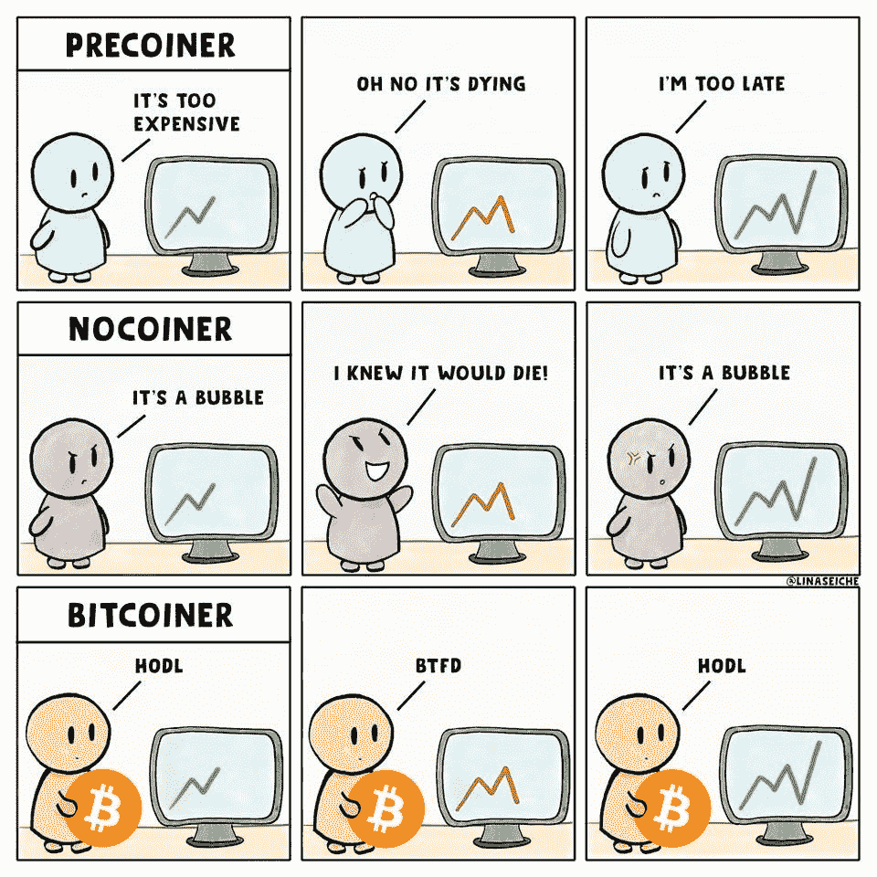
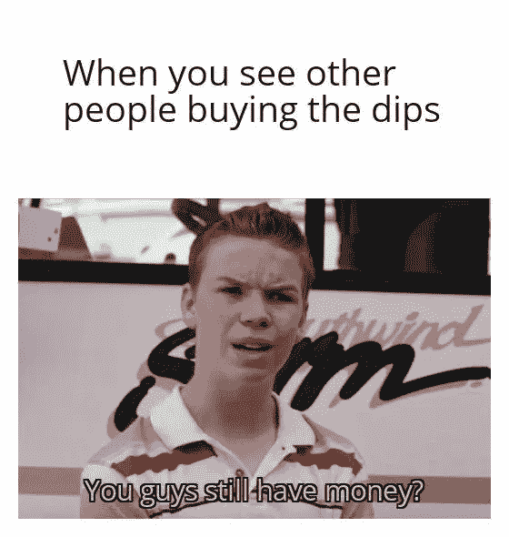
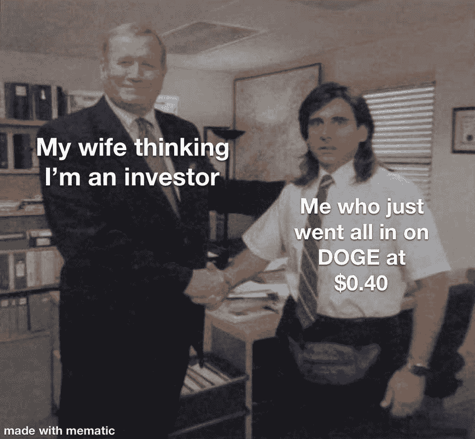

# Nexon 向比特币投资 1 亿美元|英国银行宣布成立 CBDC 工作组

> 原文：<https://medium.com/coinmonks/nexon-invests-100m-in-bitcoin-bank-of-england-announced-cbdc-taskforce-ff9070e73447?source=collection_archive---------3----------------------->

## 美国众议院通过法案，授权证券交易委员会和 CFTC 成立工作组，重点关注数字资产

*   总部位于东京的视频游戏制造商 Nexon 成为最新一家将部分现金投入比特币的上市科技公司。
*   英国银行和英国财政部宣布联合创建中央银行数字货币(CBDC)工作组，以协调对潜在的英国 CBDC 的探索。
*   得克萨斯州联邦法官裁定[第四修正案不适用于比特币](/coinmonks/texas-federal-judge-rules-fourth-amendment-does-not-apply-to-bitcoin-transaction-records-97d4e6126f)交易记录

> 寻找风险最小的稳定回报？让我建议你[现货期货套利机器人](https://blog.coincodecap.com/pionex-arbitrage-bot)，它比赌博或加密储蓄账户要好。年回报率为 25–40%。

## [Pionex](http://blog.coincodecap.com/go/pionex)

试试专业的加密交易所 Pionex，它有免费的加密交易机器人来自动完成你的交易。阅读我们的 [Pionex 评论](/coinmonks/pionex-review-exchange-with-crypto-trading-bot-1e459d0191ea)并查看我们的 [**加密交易机器人**](/coinmonks/crypto-trading-bot-c2ffce8acb2a) 列表。

> [Bitgaps](https://blog.coincodecap.com/go/bitsgap) lacuched **期货交易机器人**。

## 最新消息📰

*   上市游戏制造商 Nexon 拨款 1 亿美元购买比特币
*   [SEC 打败仗](https://cointelegraph.com/news/sec-loses-a-battle-to-win-the-war-ripple-dissociates-from-pumping-xrp)赢得战争？涟漪从泵浦 XRP 分离
*   Visa 首席执行官表示，支付巨头正在以一种非常大的方式进入加密领域
*   土耳其比特币交易所关门后，四人被捕
*   MetaMask [每月活跃用户超过](https://consensys.net/blog/metamask/metamask-surpasses-5-million-monthly-active-users/)500 万
*   客户称，Coinseed 神秘地将用户账户切换到了 Dogecoin
*   随着加密热的持续，以太坊交易所交易基金将于今天在加拿大开始交易
*   客户现在只需花 1 美元就可以在 Venmo 应用程序中直接购买、持有和出售加密货币
*   已经设定为[启动流动性挖掘计划](https://cointelegraph.com/news/lending-giant-aave-set-to-launch-liquidity-mining-program)
*   [伊朗中央银行允许货币兑换商](https://www.coindesk.com/iran-central-bank-money-changers-imports-mined-crypto)，银行使用开采的密码支付进口
*   电话巨头德国电信投资 Celo 的加密网络
*   大通银行在联邦法院辩称，购买加密货币是类似现金的交易
*   DeFi Protocol EasyFi 报告黑客，[资金损失超过 8000 万美元](/easify-network/easyfi-security-incident-pre-post-mortem-33f2942016e9)
*   [美国众议院通过法案](https://news.bitcoin.com/us-house-passes-bill-sec-cftc-working-group-digital-assets/)授权 SEC 和 CFTC 成立专注于数字资产的工作组
*   [严重过度杠杆化](https://www.theblockcrypto.com/daily/94993/crypto-retail-traders-leverage-systemic-risk)’:crypto 的零售交易员会造成系统性风险吗？

> *报税季即将到来，使用最好的* [***加密报税软件***](/coinmonks/best-crypto-tax-tool-for-my-money-72d4b430816b) *来申报你的加密报税吧。*

> BlockFi 首次推出加密奖励信用卡。在日常购物中获得 1.5%的比特币奖励。[立即加入等候名单](http://blog.coincodecap.com/go/blockfi)。

## 好的读物📑

*   [安全月](https://rekt.news/shitcoins/)是一枚狗屎硬币
*   通过股票市场获得区块链[曝光](/coinmonks/gaining-blockchain-exposure-through-the-stock-market-9c02521c9c00)
*   什么是[以太坊柏林硬叉](/etheros/what-is-ethereum-berlin-hard-fork-562421ca7341)？
*   详细研究了 [$AAVE 平台](/coinmonks/a-detailed-study-of-the-aave-platform-and-token-1310908b8a08)和 Token
*   算法稳定积分的直观解释
*   通往以太坊的[路](https://barnabe.substack.com/p/eth2)
*   [以太坊天然气价格](https://www.blocknative.com/blog/estimate-gas-prices?hss_channel=coinmonks):Mempool 如何作为结算的竞争市场
*   [我们的网络](https://ournetwork.substack.com/p/our-network-deep-dive-2):治理可提取价值
*   图表趣味| [比特币基地 IPO](/coinmonks/chart-fun-coinbase-ipo-82ce0ab29d2d)
*   历史上的一个瞬间:评价索拉纳
*   关于[赌注池](https://research.paradigm.xyz/staking)和赌注衍生品
*   金钱的[前途如何？](/coinmonks/what-is-the-future-of-money-1df0df79ea66)
*   [灰度(GBTC)效果](/coinmonks/grayscale-gbtc-effect-update-992ef48616e2)更新
*   比特币每日回报[波动](https://btconometrics-84377.medium.com/bitcoin-daily-return-volatility-6a44aa29139c)
*   揭开一个[四岁大的 Bug](https://samczsun.com/uncovering-a-four-year-old-bug/)
*   了解[自动做市商](https://research.paradigm.xyz/amm-price-impact)
*   [淡季](/coinmonks/altseason-is-near-609e6e768234)近了
*   Dao 是下一件大事
*   [满牛](/coinmonks/full-of-bull-why-this-bitcoin-halving-bull-cycle-can-continue-ea50673774a7)，为什么这个比特币减半的牛市周期还能继续
*   [比特币和黄金](/coinmonks/bitcoin-and-gold-similar-behavior-following-the-abandonment-of-standard-policy-eb27c69d5bad):放弃“标准”政策后的类似行为
*   [莫内罗](/themoneromoon/the-monero-moon-issue-14-f94429230cf8)月亮
*   系绳[在](https://blog.kaiko.com/tether-loses-peg-during-bitcoin-sell-off-a06c887021ab)比特币抛售期间失去挂钩
*   如何[计算 ROI](/@elena.tarasova/how-to-calculate-roi-fccf49fce7ef)
*   不要漫不经心地诋毁政府或比特币
*   一次[比特币大跳水的教训](https://gigachad.medium.com/lessons-from-a-major-bitcoin-dip-e848be296d5a)
*   《泰晤士报》03/1/2009 财政大臣处于第二次银行救助的边缘

> *买一个* [***硬件钱包***](/coinmonks/the-best-cryptocurrency-hardware-wallets-of-2020-e28b1c124069)*[*保护你的加密货币*](/coinmonks/how-to-prevent-cryptocurrency-hacking-and-theft-from-your-wallet-65c8ff767766) *。**

**

*[Source](https://www.reddit.com/r/Bitcoin/comments/kmof53/the_8_laws_of_bitcoin_updated/)*

> *Eth2 核心团队在线[研讨会](https://hackmd.io/@hww/workshop_feb_2021)，2021 年 2 月*

## *开发商*

*   *[eth 2 的新特性](https://hackmd.io/@benjaminion/eth2_news/https%3A%2F%2Fhackmd.io%2F%40benjaminion%2Fwnie2_210424)*
*   *自由职业者的智能合同:如何运作*
*   *编写、编译、[部署可靠性](/coinmonks/writing-compiling-deploying-solidity-2021-b9b915e8dd5f) 2021*
*   *设置一个[本地 eth1-eth2](https://github.com/protolambda/mergenet-tutorial) 合并测试网！*
*   *[自定义错误](https://blog.soliditylang.org/2021/04/21/custom-errors/)在实度上*
*   *您的指南[中级 SQL，同时学习以太坊](https://towardsdatascience.com/your-guide-to-intermediate-sql-while-learning-ethereum-at-the-same-time-7b25119ef1e2)*
*   *[使用 ArchiveNode.io 和 IPFS 调试事务](https://chasewright.com/ethereum-and-ipfs/)*
*   *[NFT 明特教程](https://docs.alchemy.com/alchemy/tutorials/nft-minter):如何打造全栈 DApp*
*   *最终[以太坊主网部署](https://soliditydeveloper.com/deployments)指南*

> *想成为一名以太网和 Web3 开发者吗？[从这里开始](http://blog.coincodecap.com/go/learn)。*

## *多方面的*

*   *[Stablecoins](https://duneanalytics.com/hagaetc/stablecoins)*
*   *[平均美元成本](https://blog.coincodecap.com/dca)*
*   *[标量](https://thegraph.com/blog/scalar):每个查询的一个微交易*
*   *[以太网的安全帽](https://github.com/tryethernal/hardhat-ethernal)插件*
*   *以太坊:有现金流的[价值商店](https://ethereumcashflow.com/)*

## *🎙播客和视频*

*   *[二层解决方案处理完毕](https://unchainedpodcast.com/this-layer-2-solution-processed-more-nft-trades-in-24-hours-than-ethereum-did-in-1-week/)更多 NFT 交易*
*   *汇集在一起*
*   *[证交会与 DeFi](http://podcast.banklesshq.com/60-the-sec-and-defi-hester-peirce) |赫斯特·皮尔斯*

**

## *加密交易和折扣🔖*

*   *注册参加[**by bit**](/coinmonks/bybit-exchange-review-dbd570019b71)exchange，赢取高达 625 美元的奖金。*
*   *在 [**Bityard**](https://blog.coincodecap.com/go/bityard) 获得 258 美元的交易费折扣*

## *产品评论和其他加密软件📙*

*   *[最佳加密交易所](https://blog.coincodecap.com/crypto-exchange)*
*   *[最佳密码借贷平台](/coinmonks/top-5-crypto-lending-platforms-in-2020-that-you-need-to-know-a1b675cec3fa)*
*   *[Gate.io 交换评论](https://blog.coincodecap.com/gate-io-review)*
*   *[币安评论](https://blog.coincodecap.com/binance-review)*
*   *最佳应用[在印度购买比特币](/coinmonks/buy-bitcoin-in-india-feb50ddfef94)*
*   *[区块链替代品](https://blog.coincodecap.com/blockfi-alternatives)*
*   *[火币保证金交易](/coinmonks/huobi-margin-trading-b3b06cdc1519)*
*   *[CoinJar 澳大利亚评论](https://blog.coincodecap.com/coinjar-australia-review?v=1)*
*   *最佳[密码借贷](/coinmonks/top-5-crypto-lending-platforms-in-2020-that-you-need-to-know-a1b675cec3fa)平台*

*想让我们展示你的产品吗？请在 [Twitter @coinmonks](https://twitter.com/coinmonks) 上联系我们*

**

## *乔布斯👷*

*   *Tokemak 寻求[可靠性](https://opolist.opolis.co/opps/8/)和[前端](https://opolist.opolis.co/opps/9/)开发。有吸引力的公司*
*   *初级开发人员:尼瑟明正在寻找[初级可靠性、数据分析师、nodeJs 开发人员](https://twitter.com/nethermindeth/status/1371830788329779210)*
*   *现金正在寻找一个技术内容作家，邮件:你好*
*   *附近正在寻找一名 [EVM 互通工程师](https://boards.greenhouse.io/near/jobs/4844647002)*
*   *灵知在招人！[以太坊核心开发者](http://bit.ly/3cZMzeS)、[前端工程师](http://bit.ly/3vM126R)、 [Rust 工程师](http://bit.ly/3f1Jkq7)*
*   *Chainsafe 正在寻找一个[类型脚本开发](https://chainsafe.io/careers/openpositions/ethereum-typescript-developer)工作在 Lodestar eth2 客户端*
*   *Nomic Labs (Hardhat/Buidler)正在招聘一名高级开发人员和一名工程经理*
*   *[Powerloom 协议](https://powerloom.io/)正在班加罗尔寻找[分布式系统工程师](https://angel.co/company/powerloom/jobs)*
*   *Switchain 正在寻找一名[的业务发展副总裁](https://cryptocurrencyjobs.co/sales/switchain-vp-of-business-development/)。远程，全职*
*   *小道消息是找一个[区块链的安全工程师](https://jobs.lever.co/trailofbits/4f459855-3299-462f-9e73-299a840d5baf)*

## *在 Coinmonks 上发布*

*如果你喜欢在 crypto/区块链空间上写教育文章，并且想在 Coinmonks 出版物上发表。只需在**邮件我或者 DM 我**[***推特***](https://twitter.com/coinmonks)***