# 🥇接下来的 5 种加密货币和它们的丰厚回报！[十大系列]

> 原文：<https://medium.com/coinmonks/next-5-crypto-currencies-and-their-smashing-returns-top-10-series-161e65ee43b0?source=collection_archive---------9----------------------->

## 什么！不止比特币&以太坊？？了解 Ripple (XRP)、DogeCoin (DOGE)、Polkadot (DOT)、USD Coin (USDC)、Solana (SOL)

如果你喜欢这篇文章——**注册**我的[免费每周简讯](https://cryptoage.substack.com/)，**分享给你的朋友**，然后**给我反馈**。你可以在社交媒体 [Twitter 上找到我— @sauravbhats](https://twitter.com/sauravbhats) 或[中链接的](https://www.linkedin.com/in/sauravbhats/)。

# 密码市场怎么了？

自从我写了关于五大加密货币的最后一篇文章(21 天前)，加密货币的市值已经从 1.6 万亿美元跃升至 2.1 万亿美元。 这是 21 天内 30%的惊人回报(不考虑一些已经翻了一倍或两倍的硬币)。与此同时，🥺🥶股市的高增长股票组合下跌了 15%

*俗话说* ***【愿你生活在有趣的时代】***

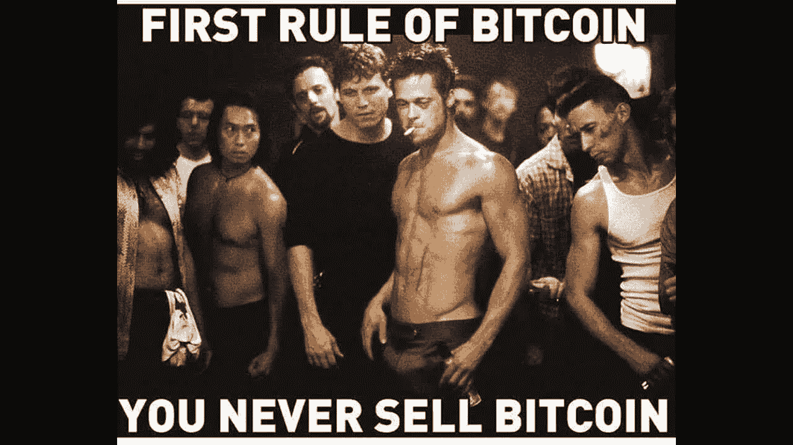

在这篇文章中，我着眼于“未来 5 种加密货币”。如果你没有读过我之前的文章[🥇五大加密货币及其惊人的回报！现在是了解他们更多信息的好时机。如果您不熟悉这个空间或我的子堆栈，您可以阅读一些入门文章:](https://cryptoage.substack.com/p/top-5-crypto-currencies-and-their)

*   [💸加密货币的 5 个要素。现在就开始！！](https://cryptoage.substack.com/p/5-essentials-for-cryptocurrencies)
*   [💡区块链有什么好大惊小怪的？简化系列..](https://cryptoage.substack.com/p/whats-the-fuss-about-blockchain-simplified)

好的，我们有超过 11，000 个代币，除了比特币和以太坊，你知道的不多。让我们来看看数字 6 到 10，包括波纹(XRP)，DogeCoin (DOGE)，Polkadot (DOT)，USD Coin (USDC)，Solana(索尔)

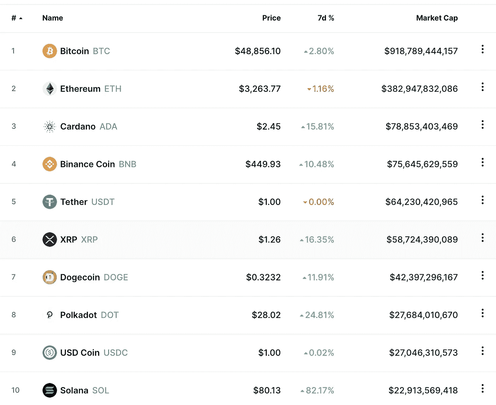

这并不是要深入这些项目，而是让你开始了解它们是什么的初级读本。 ***如果你因为在这里读到的东西而决定舍弃自己的血汗钱，我会建议你先“自己做研究”。***

# 6.瑞波(XRP)——市场上限 590 亿美元

Ripple 是一种区块链技术，它既是一种**加密货币**，也是金融交易的一种**数字支付网络**。它于 2012 年首次发布。它是一个全球性的支付网络，客户包括主要的银行和金融服务机构。令牌 XRP 用于帮助不同货币之间的快速转换。这个项目的有趣之处在于，它允许以任何形式的法令或密码无缝转移资金。与外汇市场允许货币对 USDSGD(美元兑新加坡元)、EURCAD(欧元兑加拿大元)之间的无缝转移类似，ripple 网络及其金融提供商的参与使得简单地转移 BTCSGD、ETHCAD 变得容易

Ripple 没有使用基于工作的证据挖掘，而是使用一种共识机制，基于一组银行拥有的服务器(授权参与者)来确认交易。与比特币相比，涟漪交易耗能更少，确认更快，成本更低。

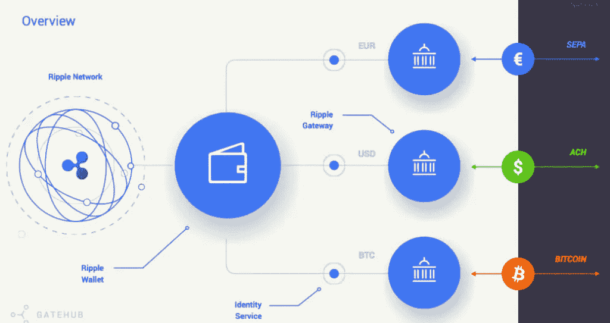

不幸的是，Ripple 一直受到法律挑战的困扰——这是象征性经济和公司结构的混合体。SEC 对 Ripple 及其现任和前任首席执行官提起诉讼，声称出售 XRP 构成了提供未注册证券——本质上是非法 IPO。

随着案件的拖延，还看不到明确的解决方案，Ripple 的法律困境已经成为笼罩数字货币的模糊监管的代表，反映了大萧条时期制定的法律与今天快速增长的金融科技和加密生态系统之间的不匹配。尽管对于美国证交会是否有充分理由起诉 Ripple 存在意见分歧，但几乎所有人都同意，根本问题是加密货币的监管方式不明确，这种监管方式既不会破坏行业，也不会不公平地针对那些可能不知道自己与监管机构发生冲突的公司和投资者

如果你对 Ripple 更详细的历史和它的象征经济学[的一些挑战感兴趣，可以看看 Reddit](https://www.reddit.com/r/CryptoCurrency/comments/lqzih4/for_the_newbies_a_summary_and_analysis_of_xrp_and/) 上这篇很棒的文章。

# 7.DOGE(DOGE)——市值 420 亿美元

我知道！我知道！对总督有很多看法——好的、坏的和丑陋的。然而，有一点是肯定的，当一个公司的市值达到 420 亿美元时，它确实值得理解。

那么什么是 Doge 呢？这是一种点对点的开源加密货币，由杰克逊·帕尔默和比利·马库斯于 2013 年创立。它始于一个笑话，基于一个以柴犬(日本犬种)为特色的流行文化。总督区块链具有价值，其底层技术源自莱特币(另一种加密货币)

Dogecoin 有一个忠实的支持者社区，他们交易它，并将其作为 Twitter & Reddit 上社交媒体内容的小费货币。

最近，随着埃隆·马斯克在推特上发布关于此事的消息，以及他可能在 T2 周六夜现场秀上露面的消息，这件事成为了人们关注的焦点。在典型的“购买谣言，出售新闻”中，许多人成功地进行了交易，并充实了自己的金库。

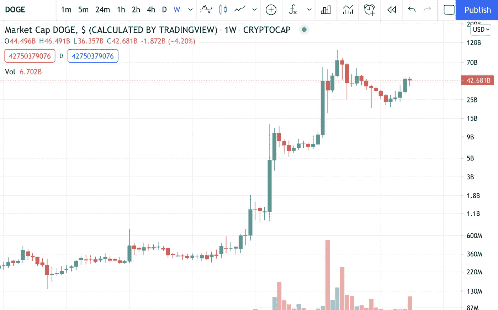

[埃隆·马斯克的 SpaceX 公司将于 2022 年向月球发射真正的 Dogecoin 任务](https://www.forbes.com/sites/jonathanocallaghan/2021/05/10/elon-musks-spacex-is-launching-an-actual-dogecoin-mission-to-the-moon-in-2022/?sh=39ae88737914)

在最近的新闻中, [Dogecoin 基金会带着埃隆·马斯克的顾问和以太坊的 Vitalik Buterin 回来了](https://news.bitcoin.com/dogecoin-foundation-elon-musks-adviser-ethereums-vitalik-buterin/)

> **很难说 DogeCoin 未来会如何发展，但一个有趣的角度是——“它是一个非常忠诚的客户群，正在寻找一种产品来解决他们的问题”。随着像 Vatalik 这样的思想领袖参与到项目中，他们可以真正制作出可以开发的产品——未来会有更多的用例。**

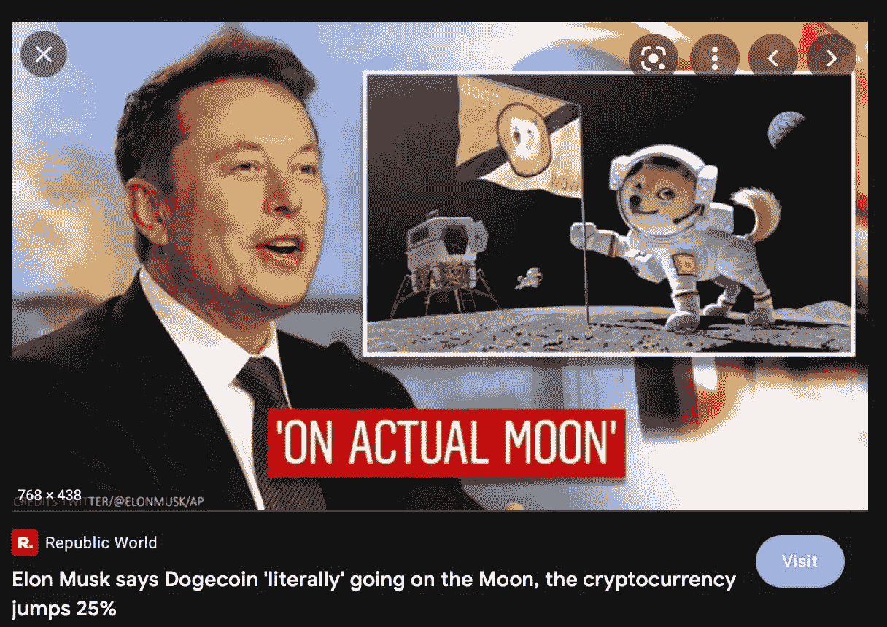

# 8.波尔卡多特(DOT)——资本上限 280 亿美元

在密码世界里，有许多区块链——比特币、以太坊、卡多纳、索拉纳等等。他们不会真的互相交谈，也不会互相交换信息。为他们的交互提供一些公共接口不是很有意义吗？**互操作性的概念**

**回车—波尔卡多特😎**。这就像是区块链的一座桥

*Polkadot 是一种分片的类似网桥的协议，主要用于保持通信、价值转移和共享区块链的安全性。它通过将区块链统一到一个网络中，允许它们以并行的方式相互操作。统一融合了不同区块链的长处，减少了他们的短处。*

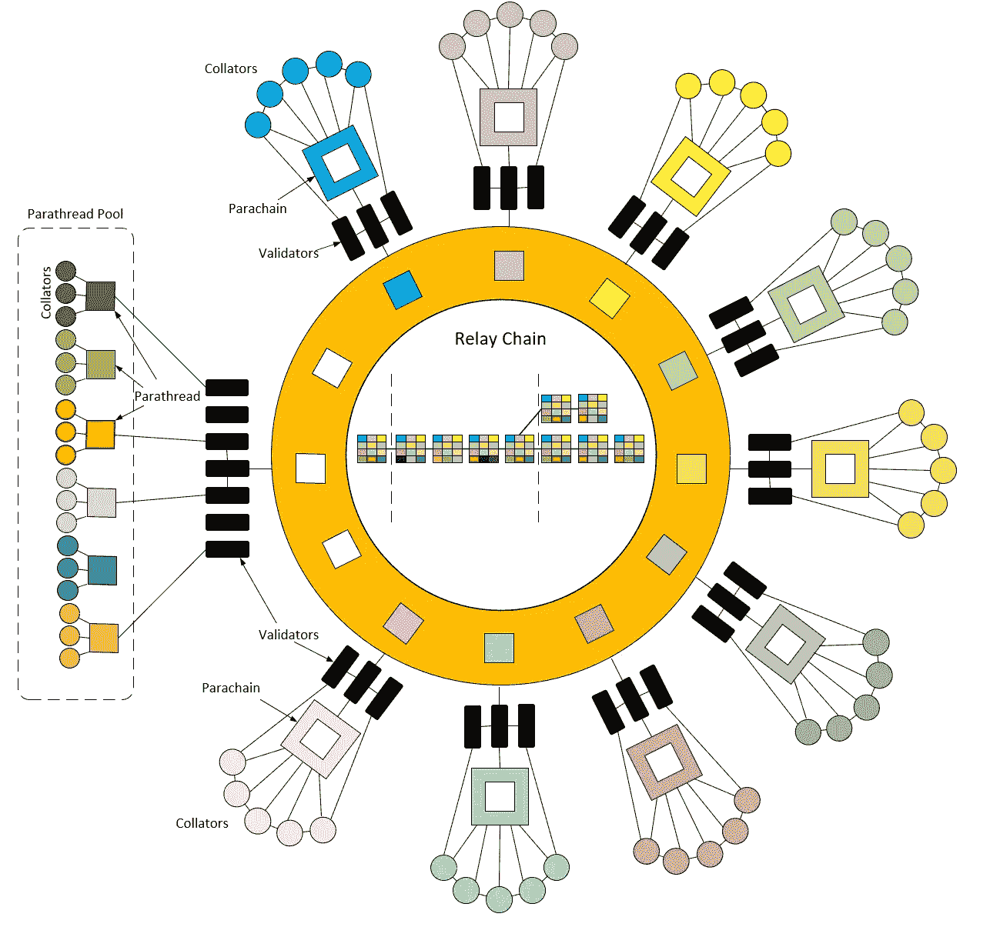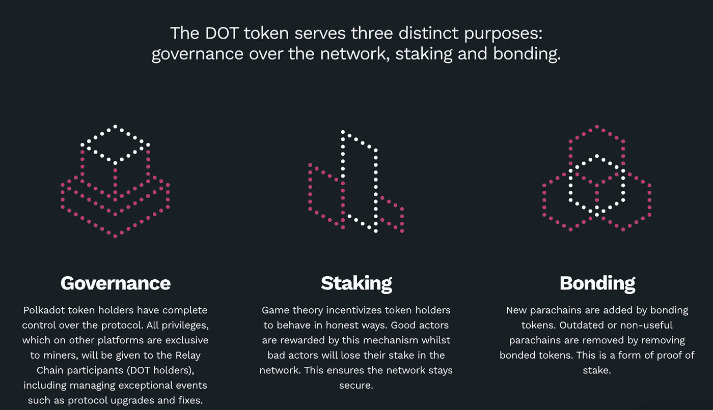

如果你想了解更多的细节——整理程序、桥梁、赌注奖励等等,[这是一篇深入研究的好文章](/multi-io/defi-explained-polkadot-c71c21b2221b)。

# 9.美元硬币(USDC) —市场上限 270 亿美元

让我们先了解两个术语:

*   法定货币是一种政府支持的货币，我们在日常生活中使用。每个国家通常发行自己的法定货币，并授权其作为法定货币。
*   **稳定硬币**是指定法定货币的加密等价物，其目的是模仿法定货币的价格&它所挂钩的外部参考。它们不会像传统加密货币那样受到价格波动的影响。如果是一样的，那么你为什么需要一个稳定的硬币？嗯，这很容易，因为它给了你加密货币的所有好处——转账快、成本低、细分化等等。

美元硬币(USDC)是一种数字稳定的硬币，与美元挂钩，在以太坊、恒星、阿尔格兰德和索拉纳区块链以及 Hedera Hashgraph 系统上运行。美元硬币由一个名为 Centre 的财团管理，该财团由 Circle 创建，成员包括加密货币交易所比特币基地和比特币矿业公司比特大陆(Circle 的投资者)。

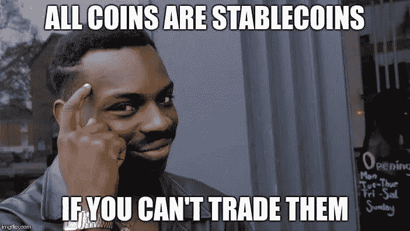

Circle 声称，每个 USDC 都由储备的一美元或其他“批准的投资”支持，尽管这些没有详细说明。

USDC 由受监管的金融机构发行，由完全保留的资产支持，可按 1:1 的比例兑换美元，并由 Centre 管理，Centre 是一个会员制财团，为稳定的货币制定技术、政策和金融标准。

请记住，稳定的硬币是简单的加密代币，旨在允许投资者持有美元等固定货币，而无需转换为法定货币。这些稳定的硬币像其他加密货币一样升值。

# 10.索拉纳(SOL)——市值 230 亿美元

Solana 是一个网络规模的区块链，提供快速、安全、分散的应用和市场。它是目前最快的区块链网络，支持 50，000+ TPS(每秒事务数)和 400 毫秒的块时间。*该系统在标准千兆网络上能够支持 710，000 TPS 的上限，在 40gb 网络上能够支持 2840 万 TPS——简单地说，有更多的增长空间，速度可以比现在更快*

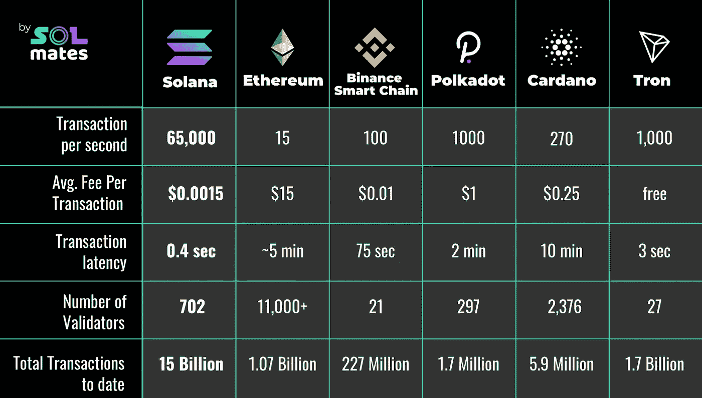

不像比特币使用 PoW(工作证明)——大量的处理和电力来显示你做了工作并写下一个块，索拉纳使用历史证明方法(由索拉纳发明)。有了历史证明，您可以创建历史记录来证明某个事件发生在某个特定的时刻。

如果你想了解更多关于[索拉纳](https://genesisblockhk.com/what-is-solana/)的技术信息，可以看看这篇文章。

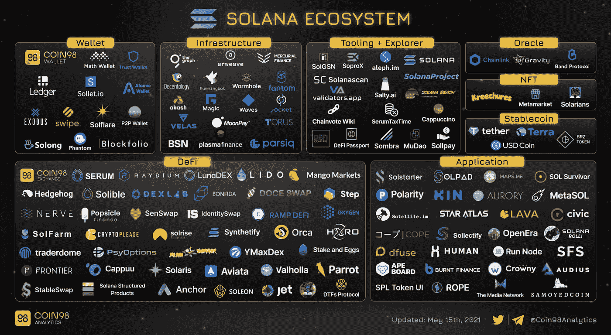

**所以这是一项伟大的技术，有许多项目和许多开发人员在研究它。这些对这个令牌的价格回报有帮助吗？又一个反问😂**😂。答案当然是“有”。我不得不拿出我的计算器来做数学。

> 在 12 个月内，它的回报率为 2445 倍——市值从 900 万美元增至 220 亿美元。12 个月前在索拉纳投资 1000 美元，今天将价值 240 万美元。😱😱

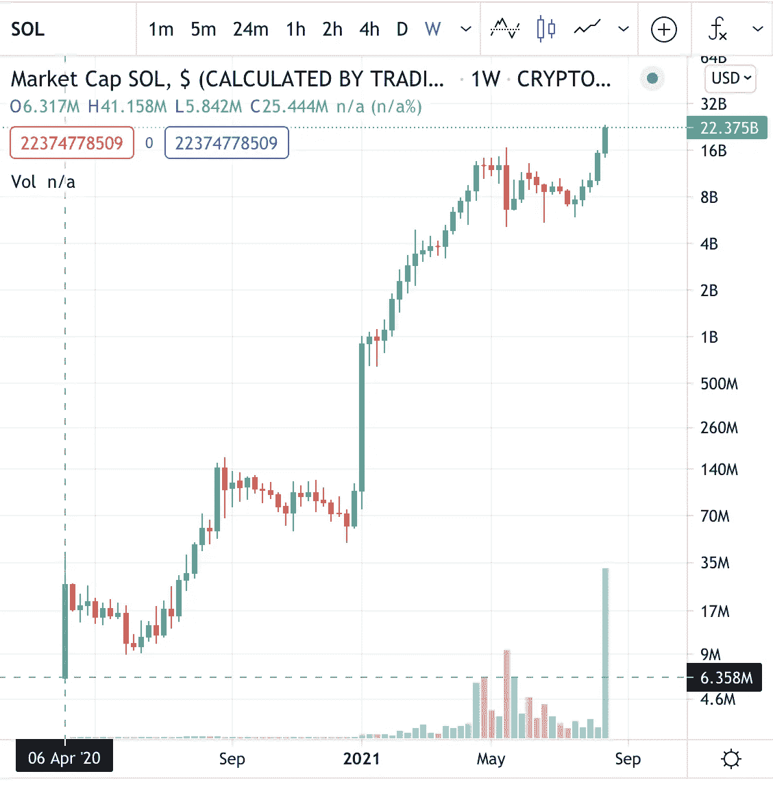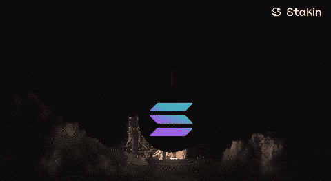

# 我以前的一些帖子，如果你还没有看过的话

*   [💸加密货币的 5 个要素。现在就开始！！](https://cryptoage.substack.com/p/5-essentials-for-cryptocurrencies)
*   [🏆区块链将扰乱奥运会的 10 种方式——巴黎 2024 和洛杉矶 2028](https://cryptoage.substack.com/p/-10-ways-blockchain-will-disrupt)
*   [🚀央行数字货币的新时代](https://cryptoage.substack.com/p/a-new-era-of-central-bank-digital)
*   [比特币价格——骗局还是真实？](https://cryptoage.substack.com/p/bitcoin-price-scam-or-real)
*   [我学到的 10 条投资经验](https://cryptoage.substack.com/p/10-investing-lessons-i-learned-part)

如果你喜欢这篇文章，请**注册**我的免费每周简讯，**与你的朋友分享**，并**给我反馈**。你可以在社交媒体 [Twitter 上找到我— @sauravbhats](https://twitter.com/sauravbhats) 或中链接的[。](https://www.linkedin.com/in/sauravbhats/)

> 加入 coin monks 电报频道，了解加密交易和投资

**🚨大免责声明** : ***这不是投资建议。我不是投资顾问。此信息旨在用于教育目的。在你决定投资你的血汗钱之前，请做好你自己的研究。如果你不确定，寻求专业财务顾问的帮助，他能理解你的财务需求和承诺，给你建议你应该做什么。***

## 另外，阅读

*   什么是融资融券交易
*   [BigONE 交易所评论](/coinmonks/bigone-exchange-review-64705d85a1d4) | [电网交易机器人](https://blog.coincodecap.com/grid-trading)
*   [3 商业评论](/coinmonks/3commas-review-an-excellent-crypto-trading-bot-2020-1313a58bec92) | [Pionex 评论](/coinmonks/pionex-review-exchange-with-crypto-trading-bot-1e459d0191ea) | [Coinrule 评论](/coinmonks/coinrule-review-2021-a-beginner-friendly-crypto-trading-bot-daf0504848ba)
*   [莱杰 vs n rave](/coinmonks/ledger-vs-ngrave-zero-7e40f0c1d694)|[莱杰 nano s vs x](/coinmonks/ledger-nano-s-vs-x-battery-hardware-price-storage-59a6663fe3b0) | [币安评论](/coinmonks/binance-review-ee10d3bf3b6e)
*   [Bybit Exchange 审查](/coinmonks/bybit-exchange-review-dbd570019b71) | [Bityard 审查](https://blog.coincodecap.com/bityard-reivew) | [CoinSpot 审查](https://blog.coincodecap.com/coinspot-review)
*   [3 commas vs crypto hopper](/coinmonks/3commas-vs-pionex-vs-cryptohopper-best-crypto-bot-6a98d2baa203)|[赚取加密利息](/coinmonks/earn-crypto-interest-b10b810fdda3)
*   最好的比特币[硬件钱包](https://blog.coincodecap.com/best-hardware-wallet-bitcoin) | [BitBox02 回顾](/coinmonks/bitbox02-review-your-swiss-bitcoin-hardware-wallet-c36c88fff29)
*   [BlockFi vs 摄氏度](/coinmonks/blockfi-vs-celsius-vs-hodlnaut-8a1cc8c26630) | [Hodlnaut 审核](/coinmonks/hodlnaut-review-best-way-to-hodl-is-to-earn-interest-on-your-bitcoin-6658a8c19edf) | [KuCoin 审核](https://blog.coincodecap.com/kucoin-review)
*   [加密套利](/coinmonks/crypto-arbitrage-guide-how-to-make-money-as-a-beginner-62bfe5c868f6)指南| [如何做空比特币](/coinmonks/how-to-short-bitcoin-568a2d0b4ae5)
*   [币安交易机器人](/coinmonks/binance-trading-bots-d0d57bb62c4c) | [OKEx 审查](/coinmonks/okex-review-6b369304110f) | [Atani 审查](https://blog.coincodecap.com/atani-review)
*   [最佳加密交易信号电报](/coinmonks/best-crypto-signals-telegram-5785cdbc4b2b) | [MoonXBT 评论](/coinmonks/moonxbt-review-6e4ab26d037)
*   [Godex.io 审核](/coinmonks/godex-io-review-7366086519fb) | [邀请审核](/coinmonks/invity-review-70f3030c0502) | [BitForex 审核](https://blog.coincodecap.com/bitforex-review)
*   [火币交易机器人](https://blog.coincodecap.com/huobi-trading-bot) | [如何购买 ADA](https://blog.coincodecap.com/buy-ada-cardano) | [Geco？一次审查](https://blog.coincodecap.com/geco-one-review)
*   [币安 vs 比特邮票](https://blog.coincodecap.com/binance-vs-bitstamp) | [比特熊猫 vs 比特币基地 vs Coinsbit](https://blog.coincodecap.com/bitpanda-coinbase-coinsbit)
*   [如何购买 Ripple (XRP)](https://blog.coincodecap.com/buy-ripple-india) | [非洲最好的加密交易所](https://blog.coincodecap.com/crypto-exchange-africa)
*   [非洲最佳加密交易所](https://blog.coincodecap.com/crypto-exchange-africa) | [胡交易所评论](https://blog.coincodecap.com/hoo-exchange-review)
*   [eToro vs robin hood](https://blog.coincodecap.com/etoro-robinhood)|[MoonXBT vs by bit vs Bityard](https://blog.coincodecap.com/bybit-bityard-moonxbt)
*   [有哪些交易信号？](https://blog.coincodecap.com/trading-signal) | [比特斯坦普 vs 比特币基地](https://blog.coincodecap.com/bitstamp-coinbase)
*   [ProfitFarmers 回顾](https://blog.coincodecap.com/profitfarmers-review) | [如何使用 Cornix Trading Bot](https://blog.coincodecap.com/cornix-trading-bot)
*   [如何在势不可挡的域名上购买域名？](https://blog.coincodecap.com/buy-domain-on-unstoppable-domains)
*   [印度的秘密税](https://blog.coincodecap.com/crypto-tax-india) | [altFINS 审查](https://blog.coincodecap.com/altfins-review) | [Prokey 审查](/coinmonks/prokey-review-26611173c13c)
*   [Blockfi vs 比特币基地](https://blog.coincodecap.com/blockfi-vs-coinbase) | [BitKan 点评](https://blog.coincodecap.com/bitkan-review) | [Bexplus 点评](https://blog.coincodecap.com/bexplus-review)