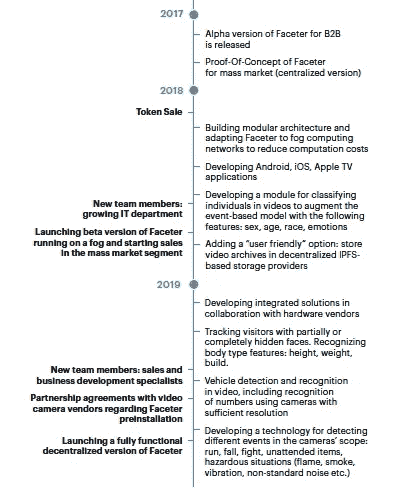

# 使用区块链的下一代监控系统？

> 原文：<https://medium.com/coinmonks/next-generation-surveillance-system-using-blockchain-be520137b3f1?source=collection_archive---------1----------------------->

**Click to Find blockchain Jobs**

`[Find blockchain jobs using Coinmonks jobs portal](https://coinmonks.com)`

`[***Get published on Coinmonks***](https://medium.com/coinmonks/contribute/home)`

今天我们采访了 [***【保罗】***](https://www.linkedin.com/in/paulscott55/) ***来自***[***Faceter***](https://tokensale.faceter.io/en/?ref=coinmonks)***团队*** 上我们的[造反派【松松松垮垮的社区](https://goo.gl/3Ex81z)，Faceter 正在为大家构建下一代监控系统。以下是那次采访的聊天记录。

> 我:那么跟我们说说 faceter 是什么？你们为什么要建它？
> 
> Paul: Faceter 正在寻求解决一个看起来相对简单的问题——缺乏智能的视频监控。我们的软件堆栈使摄像机及其软件在跟踪摄像机范围内发生的事件方面变得更加智能。
> 
> 虽然这一领域有一些智能软件应用，但它们仅限于大企业和政府。我们的目标是通过去中心化，让消费者能够负担得起这项技术。我们认为我们是第一个提出这一建议的人，在人们的居住地或小型企业提供额外的安全能力将解决一些关键的安全问题。
> 
> **Vinit(社区成员):在跟踪事件方面，它是如何变得更加智能的？**
> 
> Paul: 典型的相机软件会记录和回放。Faceter 是一个支持智能视频监控的系统，为摄像机提供“眼睛”——人脸识别、物体检测和实时视频内容分析。在下一个阶段，所有这些能力将被组合成一个单一的特征:能够“理解”情况并做出相应的反应。
> 
> 我:你能告诉我们目前视频监控市场的状况吗？有哪些主要参与者？他们服务于什么样的业务用例？
> 
> **Paul:** 在过去五年中，监控市场容量(硬件、软件和服务)显示出 15.4%的年增长率，根据 Markets & Markets 的数据，预计到 2022 年将达到**750 亿美元。**
> 
> 高犯罪率、恐怖袭击数量的增加以及人们对安全的担忧是刺激全球视频监控市场发展的主要因素。
> 
> 2014 年，IHS 公司完成了一项为期十年的研究，该研究显示，全球约有 2.45 亿台专业闭路电视摄像机在使用。此外，还对所使用的摄像机类型进行了分析。结果显示， **20%的安装设备由网络摄像机**代表，只有 2%的使用设备是传输高清图像的新型数字闭路电视摄像机。使用的所有其他设备都是模拟摄像机。
> 
> 与老一代视频监控系统相比，基于 IP 的视频监控技术为行业带来了革命性的变化，提供了更高的灵活性和可扩展性。IP 摄像机允许用户使用创新技术进行视频流分析。据埃森哲、IHS Markit、PwC(数据驱动城市概念)等领先国际公司的专家称，近年来，对能够以实时模式分析视频流的智能视频监控系统的需求显著增长，并将继续增长。
> 
> 机器视觉领域的最新发展使视频监控系统达到了一个新的水平。由神经网络和人工智能元素驱动的技术允许其用户实时识别视频流中的人脸。
> 
> 我:监控系统是否侵犯了公共安全或隐私？在历史上，监视最常用于侵犯公众隐私？
> 
> **Paul:** 公共安全是我们目前的第一要务
> 目前全球有超过 2.5 亿个监控摄像头，据估计，如果你生活在大都市地区，**你每天会被超过 40 次的摄像头监视。**伦敦的统计数据是每天 70 次。所以你的图像已经存储在某个地方了。
> 
> 我们的技术是纯推式技术。当事件发生时，比如你的孩子放学回家，你会收到推送通知。您不能激活拉式通知。
> 
> **在任何情况下，你都不能执行反向图像搜索来跟踪一个漂亮的女孩。**我们甚至不会将您的姓名与图像一起存储。如果你想想人们给脸书多少信息，Faceter 是完全非侵入性的技术。
> 
> 我:你如何保护你的技术不被商家滥用？
> 
> **Paul:** 企业在其当前的监控系统中已经具备了这种技术的一些要素，因此当地法规(如欧盟的 GDPR)将规定数据的使用，就像当今世界一样。
> 
> **安东尼(社区成员):你有什么计划来提高 faceter 的使用率？**
> 
> **保罗:**事实上，我们正在建立一个分散的基础设施，利用雾计算和区块链的分散能力来执行使用神经网络的复杂数据处理，我们能够大幅降低消费者的价格。我们的走向市场战略将基于高端技术的可负担性，这是以前消费者无法企及的。
> 
> **我:这是什么意思“由矿工雾网提供动力的с计算机视觉技术”？而什么是雾计算？**
> 
> **保罗:**雾计算是指将云计算延伸到企业网络的边缘。也称为边缘计算或雾计算，雾计算促进了终端设备和云计算数据中心之间的计算、存储和网络服务的操作。
> 
> 因此，它是每个设备固有的存储能力，可以通过互联网访问，比如云计算。对这种容量的估计是巨大的，远远超过了目前云的可用容量。
> 
> 我:你的目标客户群是什么？为什么呢？会是企业还是中小企业还是普通消费者？
> 
> **Paul:** 全系列 B2B & B2G 目前，我们的 SaaS 产品
> 区块链配置允许我们瞄准 B2C 市场——消费者，因为它将创造可负担性。
> 
> 我:会有选择退出系统吗？好像我不想让你的摄像机跟着我一样？可以配置吗？
> 
> 保罗:不尽然。我们的技术工作的方式是我们不保存图像本身。我们创建你的面部神经图(每个人都是独一无二的，难以置信，就像指纹一样)，然后我们存储对应于该图像的数字字符串(或哈希)。因此，我们永远不知道这个人的脸长什么样，但是，如果发生事故，我们可以恢复它，然后跟踪这个人。
> 于是想到了行凶抢劫。你在市中心被抢劫，周围有监控摄像头。警方无法立即找到该名男子，但他的面部哈希存储。当 Faceter 功能的摄像头再次发现那个人时，它会发出警报，警察/保安公司可以追踪到他们。
> 
> 我:你现在有顾客吗？还是在和你的早期采用者谈？他们是什么样的企业？他们兴奋吗？而你的性价比有多高？
> 
> Paul: 我们已经在开发上花费了大量的时间。
> 我们发布了该产品的第一个测试版本，并与多家公司启动了几个试点项目，以测试 Faceter 技术，包括一家工业企业、一个赌场网络、一个披萨店网络(更多信息([https://famous brands . co . za/brands/quick-service/de bonairs-pizza/](https://famousbrands.co.za/brands/quick-service/debonairs-pizza/))。
> 
> Faceter 与 EPI-USE 建立了合作伙伴关系，EPI-USE 是世界上最大的 SAP 国家薪资软件独立供应商，面向 SAP 未提供标准薪资解决方案的地区。Faceter 已经与其 SAP 应用程序集成，并将从 2018 年第二季度开始向其客户提供 Faceter 产品。我们还与安讯士通信公司合作开发全球分销产品。
> 
> 我:你能详细告诉我们你的路线图吗..你现在在哪里，要去哪里？
> 
> 保罗:下面是我们的路线图。(他是在偷懒:D)。

我们感谢 Paul 抽出时间，现在他也是我们的社区成员了。

***查看我们的最新访谈***[**Kryll——一个人人的自动加密交易平台。**](https://hackernoon.com/kryll-an-automatic-crypto-trading-platform-for-everyone-ab2f8c9c436e)

> 我们有一个活跃的社区，如果你想知道我们是如何建立的，请点击这里查看。
> 
> 订阅我们的时事通讯，我们在这里分享采访，交易想法，市场见解[在这里](https://www.getrevue.co/profile/CoinMonks)。
> 
> [直接在您的收件箱中获得最佳软件交易](https://coincodecap.com/?utm_source=coinmonks)

***如果你是投资者、交易者、开发者或加密爱好者，或者对 heck crypto 如何工作有很多疑问，请加入我们的*** [***slack 社区***](https://goo.gl/3Ex81z) 。我们的 crypto 论坛 CoinMonks 也查看我们的网站，该网站根据他们的开发进度对 Crypto 进行排名[**CoinCodeCap**](http://www.coincodecap.com)**。**

# ❤️喜欢，分享，留下你的评论

如果你喜欢这篇文章，不要忘记喜欢，与你的朋友和同事分享，并在下面留下你对这篇文章的评论。跟随我是因为…

