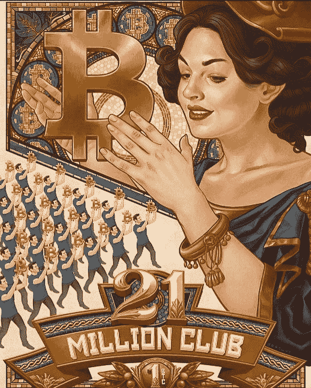
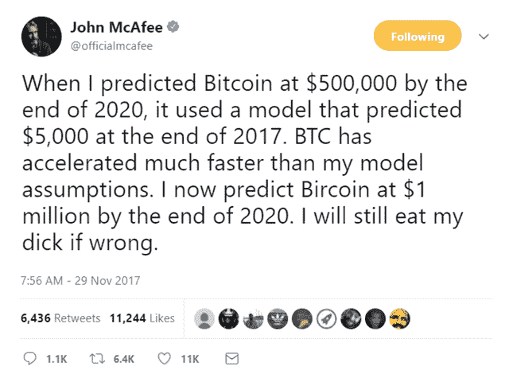
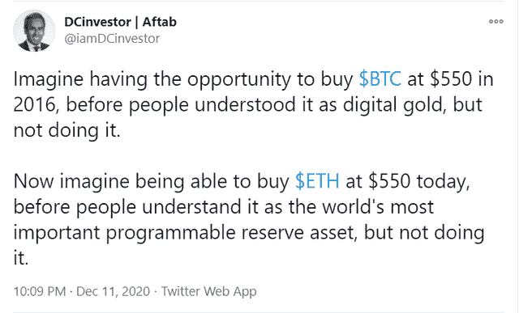

# Nexus Mutual 首席执行官被黑|摩根大通使用区块链完成当天交易| MassMutual 购买 1 亿美元比特币

> 原文：<https://medium.com/coinmonks/nexus-mutual-ceo-hacked-j-p-morgan-completed-intraday-transaction-using-blockchain-63fc1ff40a59?source=collection_archive---------3----------------------->

[Source](https://www.reddit.com/r/Bitcoin/comments/kciv7y/21_million_bitcoin_club/)

## 美国财政部被黑客攻破| Pornhun 现在只接受加密| ING 银行开放加密保管

*   分散金融(DeFi)保险公司 Nexus Mutual 的首席执行官在一次有针对性的攻击中损失了相当于 800 多万美元的资金。
*   马萨诸塞州相互人寿保险公司(Massachusetts Mutual Life Insurance co .)为其普通投资账户购买了 1 亿美元的比特币，这是主流接受新兴数字货币的最新迹象。
*   摩根大通宣布，它在区块链完成了一项实时的当天回购交易。摩根大通的经纪交易商和银行实体使用内部开发的区块链应用程序成功完成了交易，该应用程序

## [四元制](https://quadency.com/?r=ea20aa360c45d1f5ad47a19a)

试试 [Quadency](https://quadency.com/?r=ea20aa360c45d1f5ad47a19a) ，一个交易终端和加密交易机器人，为交易者建立自动化他们的加密交易。阅读我们的[季度回顾](/coinmonks/quadency-review-a-crypto-trading-automation-platform-3068eaa374e1)。

> *查看我们的* [*最佳加密交易机器人*](/coinmonks/whats-the-best-crypto-trading-bot-in-2020-top-8-bitcoin-trading-bot-c16adeb13317) *列表。*

## 最新消息📰

*   DeFi 保险公司 Nexus Mutual 的首席执行官黑掉了 800 万美元的 NXM 代币
*   Massmutual [以 1 亿美元的购买额加入比特币俱乐部](https://www.wsj.com/articles/massmutual-joins-the-bitcoin-club-with-100-million-purchase-11607626800)
*   MicroStrategy [完成](https://www.microstrategy.com/en/company/company-videos/microstrategy-completes-650-million-offering-of-convertible-senior-notes)2025 年到期的 6.5 亿美元 0.750%可转换优先票据发行
*   美国财政部被外国政府支持的黑客攻破
*   Bitwise 10 [加密指数基金](https://www.prnewswire.com/news-releases/bitwise-10-crypto-index-fund-becomes-first-publicly-traded-crypto-index-fund-in-the-us-ticker-bitw-301188878.html)成为美国首个公开交易的加密指数基金；股票代码“BITW”
*   Pornhub:现在[只接受](https://decrypt.co/51478/pornhub-now-accepting-crypto-only)加密
*   FinCEN [如何成为敏感个人数据的蜜罐](https://www.coindesk.com/fincen-files-honeypot)
*   一项诉讼[融资投资](https://www.theblockcrypto.com/post/87491/litigation-financing-investment-token-avalanche)令牌已在雪崩的区块链启动
*   2021 年的梅萨里[加密论文](https://www.crowdcast.io/e/messari-crypto-theses-2021/register)
*   ING 银行[在新加坡金融科技大会上公开了加密保管](https://www.coindesk.com/ing-bank-opens-up-about-crypto-custody-solution-at-singapore-fintech-event)解决方案
*   日本城市要[试行](https://www.coindesk.com/japan-city-kaga-blockchain-voting-id)区块链投票制
*   摩根大通[使用区块链执行](https://www.businesswire.com/news/home/20201210005155/en/J.P.-Morgan-Executes-Intraday-Repo-Transaction-Using-Blockchain)日内回购交易
*   MetaMask [希望机构](https://cointelegraph.com/news/metamask-wants-institutions-to-wade-into-defi-with-new-enterprise-version)凭借新的企业版涉入 DeFi
*   灰度[购买 2.66 亿美元的比特币](https://decrypt.co/51007/grayscale-buys-266-million-of-bitcoin-and-58-million-of-eth)和 5800 万美元的 ETH

> *报税季即将来临，使用最好的* [***加密报税软件***](/coinmonks/best-crypto-tax-tool-for-my-money-72d4b430816b) *来申报你的加密报税吧。*

[Where is McAfee](https://www.reddit.com/r/CryptoCurrency/comments/j3ypf0/who_remembers_this_lol/)

> BlockFi 首次推出加密奖励信用卡。在日常购物中获得 1.5%的比特币奖励。现在加入等候名单。

## 好的读物📑

*   电力资本[开发商报告](/electric-capital/electric-capital-developer-report-2020-9417165c6444) (2020)
*   走向[长期](https://jamesfickel.ghost.io/towards-long-term-incentives-on-ethereum/)以太坊上的激励
*   以太坊正在[走向成熟](/coinmonks/ethereum-is-maturing-7681be5b3785)
*   比特币[天文学](https://unchained-capital.com/blog/bitcoin-astronomy-part-ii/):第二部分
*   货币生产的道德规范
*   monero 正在进行的网络攻击的简短[故障](https://sethsimmons.me/posts/moneros-ongoing-network-attack/)
*   完美是好的敌人
*   稳定性、[弹性和反身性](https://insights.deribit.com/market-research/stability-elasticity-and-reflexivity-a-deep-dive-into-algorithmic-stablecoins/):对算法稳定性的深入探究
*   分散型指数基金的[牛市案例](https://bankless.substack.com/p/the-bull-case-for-decentralized-index)
*   关于分散式 Eth2 [赌注](https://www.lakshmansankar.com/#/staking-pools)池
*   [蝴蝶效应](https://cointelegraph.com/news/the-butterfly-effect-why-defi-will-force-btc-to-break-its-21m-supply-ceiling):为什么 DeFi 会迫使 BTC 突破 2100 万的供应上限
*   [证券法](/seedclub/securities-law-social-community-tokens-3bb0ffaae62):社会&社区代币
*   [ETH 不是钱](https://messari.io/article/eth-is-not-money)
*   [我们的网络](https://ournetwork.substack.com/p/our-network-issue-50):以太坊、比特币、宇宙和法令的报道

> *买一个* [***硬件钱包***](/coinmonks/the-best-cryptocurrency-hardware-wallets-of-2020-e28b1c124069)*[*保护你的加密货币*](/coinmonks/how-to-prevent-cryptocurrency-hacking-and-theft-from-your-wallet-65c8ff767766) *。**

**

*[Source](https://www.reddit.com/r/Bitcoin/comments/k9nn8z/fantastic_mural_in_wan_chai_hong_kong/)*

> *参加这个[比特币小测验](https://quiz.directory/quiz/VRp0O9MC)，看看你对它了解多少。*

## *开发商*

*   *[PancakeSwap](https://bitquery.io/blog/pancake-swap-dex-apis) —在币安智能链上查询索引*
*   *最新[eth 2 中的新功能](https://hackmd.io/@benjaminion/eth2_news/https%3A%2F%2Fhackmd.io%2F%40benjaminion%2Fwnie2_201212)*
*   *使用 ethdo 创建以太坊 2 [取款](/coinmonks/creating-ethereum-2-withdrawal-keys-using-ethdo-6e41b14ddd7b)密钥*
*   *探索 eth2 的[前 1000 个时代](https://ethereum.github.io/rig/eth2data/notebooks/mainnet_explore.html)*
*   *Eth2.0 堆栈— [故障转移&冗余的危险](https://www.adiasg.me/2020/12/11/eth2-staking-failover-redundancy.html)*
*   *MacOS 上的 Eth2:技术上有挑战的初学者指南*
*   *稳固性[依赖性](https://blog.web3labs.com/solidity-dependency-management-comes-to-web3j)管理来到 Web3j*
*   *混音项目:[任务](/remix-ide/remix-project-the-last-6-months-4a7ad00ff536)禁闭中*
*   *带 ds-test 的符号执行*
*   *被认为有害的无限制 ERC20 [允许量](https://kalis.me/unlimited-erc20-allowances/)*
*   *游戏开发者在 Matic &以太坊上创建 NFT 的 Unity 插件*

> *想成为一名以太网和 **Web3 开发者**？[从这里开始](http://blog.coincodecap.com/go/learn)。*

## *多方面的*

*   *Scribble —一个用于基于属性测试的可靠性运行时验证工具。*
*   *2020 年开发者调查*
*   *所有以太坊[奖金](https://immunefi.com/explore/)*
*   *[勇敢的今天](https://brave.com/announcing-brave-today/) —集成到浏览器中的隐私保护新闻阅读器*
*   *[eth 2 验证器的移动应用](https://twitter.com/etherchain_org/status/1336949569498853377)*
*   *有条件的[令牌总管](https://blog.gnosis.pm/conditional-tokens-explorer-factory-a6c950ea8319)工厂&*
*   *令牌[终端](https://gov.indexcoop.com/t/token-terminal-smart-beta-index/497)智能测试版索引*
*   *向往。财务[月报](https://github.com/iearn-finance/yearn-pm/blob/master/financials/reports/2020Q3-yearn-quarterly-report.pdf)*
*   *管理您的 [DEX 流动性](https://twitter.com/federiconitidi/status/1337023349415882754)*
*   *以太坊[赌注](https://stakingether.com/)提供商和池*

## *播客和视频💽*

*   *以太坊 [onchain](https://www.youtube.com/watch?v=6KoVH8NX74k&feature=youtu.be) 分析*
*   *[Matic](https://epicenter.tv/episodes/369) —以太坊的可扩展第二层 Dapp 平台*

## *黑客马拉松、活动和峰会*

*   *[Inout 7.0](https://portis.medium.com/inout-7-0-virtual-hackathon-challenge-122591bb55e8) 虚拟黑客马拉松挑战赛*

## *加密交易和折扣🔖*

*   *注册参加[**by bit**](/coinmonks/bybit-exchange-review-dbd570019b71)exchange，赢取高达 625 美元的奖金。*
*   *试用 [**Coinrule**](https://webapp.coinrule.io/coupon/coinmonks-7-25-3-e2bf6c60e795407381edf98d1a174ac2?fp_ref=coincodecap) ，使用[此链接](https://webapp.coinrule.io/coupon/coinmonks-7-25-3-e2bf6c60e795407381edf98d1a174ac2?fp_ref=coincodecap)可获得 7 天免费试用和 3 个月 25%优惠。*

## *产品评论和其他加密软件📙*

*   *2020 年最佳加密交易机器人*
*   *[莱杰 vs 特雷佐](/coinmonks/ledger-nano-s-vs-x-battery-hardware-price-storage-59a6663fe3b0)*
*   *[区块链审查](/coinmonks/blockfi-review-53096053c097)*
*   *[Altrady 审查](https://blog.coincodecap.com/altrady-reivew)*
*   *[PrimeXBT 审查](/coinmonks/primexbt-review-88e0815be858) —杠杆交易、费用和交易*
*   *[FTX 密码交易所评论](/coinmonks/ftx-crypto-exchange-review-53664ac1198f)*
*   *[Deribit 审查](/coinmonks/deribit-review-options-fees-apis-and-testnet-2ca16c4bbdb2) —选项、费用、API 和 Testnet*
*   *你的密码可以获得 12%的利息*
*   *[eToro 评论](/coinmonks/etoro-review-78807ddeb33c) —在美国购买比特币*

*想让我们展示你的产品吗？在 [Twitter @coinmonks](https://twitter.com/coinmonks) 上联系我们*

## *照片说明了一切📷*

**

*[Source](https://www.reddit.com/r/CryptoCurrency/comments/kbmh55/imagine_having_the_opportunity_to_buy_btc_at_550/)*

## *乔布斯👷*

*   *史密斯+皇冠[招聘](https://smith-crown.breezy.hr/p/80e1344e6290)区块链顾问*
*   *营销[实习生](https://cryptocurrencyjobs.co/marketing/gemini-marketing-intern/)，双子座*
*   *业务[开发者](https://cryptocurrencyjobs.co/sales/aave-business-developer/)，Aave*
*   *Linum 实验室正在招聘一名 CTO 和一名全栈开发者*
*   *圈子在招人！**请查看我们的**:[https://www.circle.com/en/careers](https://www.circle.com/en/careers)*
*   *作为销售主管[扩大 Chainlink Labs 的影响力](https://jobs.lever.co/chainlink/6bb12110-439a-4033-9b7c-d5e0baaf33ed?lever-origin=applied&lever-source%5B%5D=Week%20in%20Ethereum)*
*   *生态系统[开发者](https://cryptocurrencyjobs.co/marketing/3box-ecosystem-developer/)*
*   *合作伙伴整合[经理](https://cryptocurrencyjobs.co/engineering/chainlink-partner-integrations-manager/)*
*   *[阿兹特克的招聘](/aztec-protocol/were-hiring-5cd7cf5b0667)！加入 ZK 的尖端与私人 L2 从 PLONK 的创造者*
*   *0x 寻找各种类型的[开发人员](https://0x.org/about/jobs)和一名[抹茶营销经理](https://boards.greenhouse.io/0x/jobs/4923909002)*
*   *Chainlink Labs 在所有部门都有 40 多个职位空缺*
*   *Nexus Mutual: [在欧洲时区经历了稳健发展](https://angel.co/company/nexus-mutual-1/jobs/967538-smart-contract-engineer)*
*   *比特之路正在招聘[区块链安全开发](https://jobs.lever.co/trailofbits/4f459855-3299-462f-9e73-299a840d5baf) & [密码学分析师](https://jobs.lever.co/trailofbits/56af8506-3205-4c7b-b28d-ba8292bd1a47)*

## *在 Coinmonks 上发布*

*如果你喜欢在 crypto/区块链空间上写教育文章，并且想在 Coinmonks 出版物上发表。只需在***【gaurav@coincodecap.com】****或者 DM 我**[***推特***](https://twitter.com/coinmonks)**