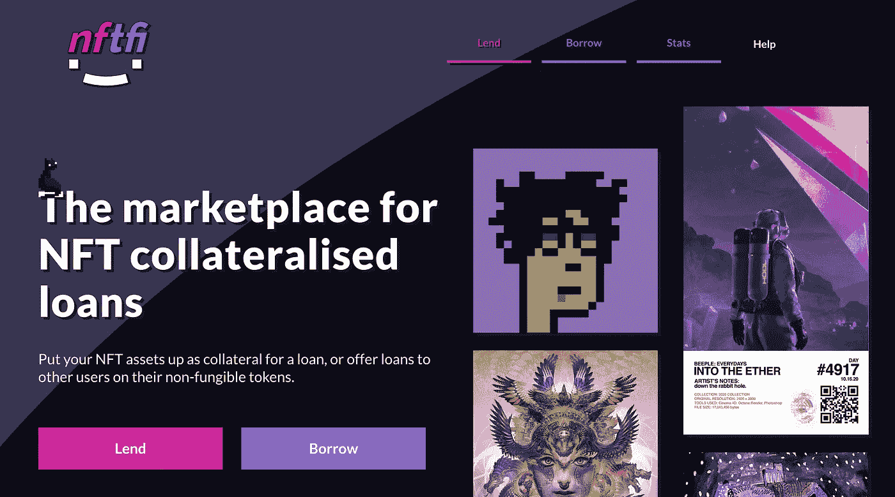

# NFT 作为加密贷款的抵押品

> 原文：<https://medium.com/coinmonks/nft-as-a-collateral-on-crypto-loans-7a79050e4f5c?source=collection_archive---------3----------------------->

## 在过去的几个月中，NFT 是一个热门话题，随着时间的推移，它们也在金融和货币借贷领域开发出非常有趣的用例。

在 DeFi 的世界里，有许多借贷平台，通过它们可以获得稳定的货币贷款，用于其他协议。阿夫，制造者…