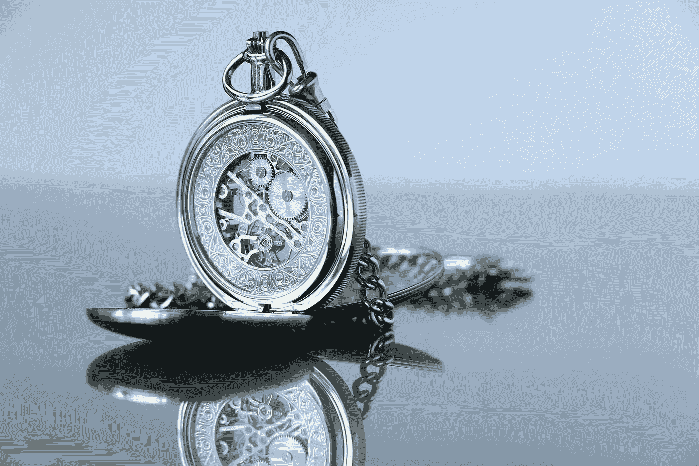

# 总部位于 NFT 的豪华手表证书:分散的应用程序演示

> 原文：<https://medium.com/coinmonks/nft-based-luxury-watch-certificate-decentralized-app-demo-c37582861a74?source=collection_archive---------0----------------------->

## **一款分散式应用程序，用于制作、查看和传输 NFT 的奢华腕表真品证书**

这是我系列文章的第二部分，展示了[不可替代代币(NFTs)](https://en.wikipedia.org/wiki/Non-fungible_token) 如何取代纸质的手表等奢侈品的真品证书。

*Photo by* [*Pierre Bamin*](https://unsplash.com/@bamin?utm_source=unsplash&utm_medium=referral&utm_content=creditCopyText) *on* [*Unsplash*](https://unsplash.com/s/photos/watch-movement?utm_source=unsplash&utm_medium=referral&utm_content=creditCopyText)