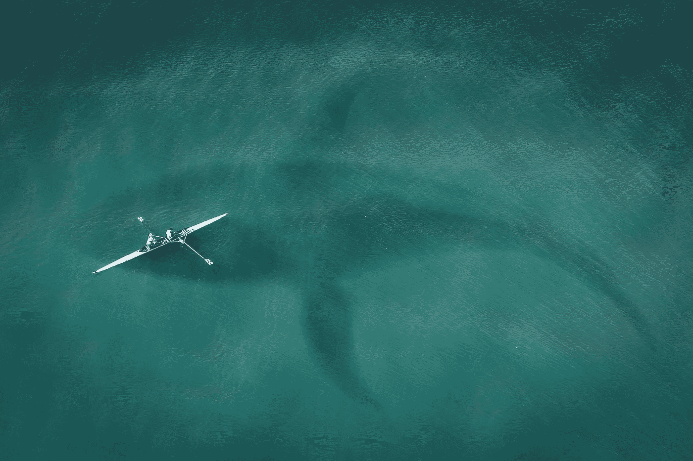

# NFT——在黑暗的深海中发展高产农业

> 原文：<https://medium.com/coinmonks/nft-boosted-yield-farming-in-the-deep-dark-depths-of-the-ocean-b1764d5b7a68?source=collection_archive---------1----------------------->

Take a deep dive with me and explore this intriguing yield farm and decentralized exchange site with many ways to spin DeFi for earning returns on your money.

我想我可能对免费的钱上瘾了。有好有坏。你会明白我的意思。

如果你读过我的任何一篇文章，你就会知道我喜欢在 crypto 上寻找疯狂的回报来最大化我的利润潜力。在我的其他文章中，我已经向你展示了以千为单位的 APR。什么？