# BOXVERSE:走进 NFTs 之旅

> 原文：<https://medium.com/coinmonks/nft-box-inside-the-journey-of-nfts-dcb67d751e18?source=collection_archive---------5----------------------->

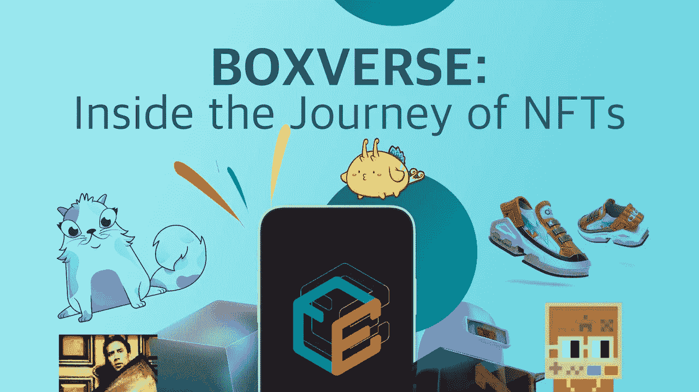

2021 年冒险的最后一次召唤！BOXTradEx 决定通过在 mobileApps 上整合名为 BOXVERSE 的 NFT 市场来涉足 NFT 地区。非功能性技术是颠覆性的技术范式，我们相信它能给人类生活带来巨大的创新和发展。此外，BOXTradEx 真正成为一站式加密平台，通过 BOXVERSE 提供与加密相关的交易服务。

# 什么是 NFT？

不可替代令牌或 NFT 是一种数字资产，它被证明是独一无二的，并得到区块链技术的支持。NFT 和比特币都起源于区块链，但它们也有一些不同之处。如下图所示:

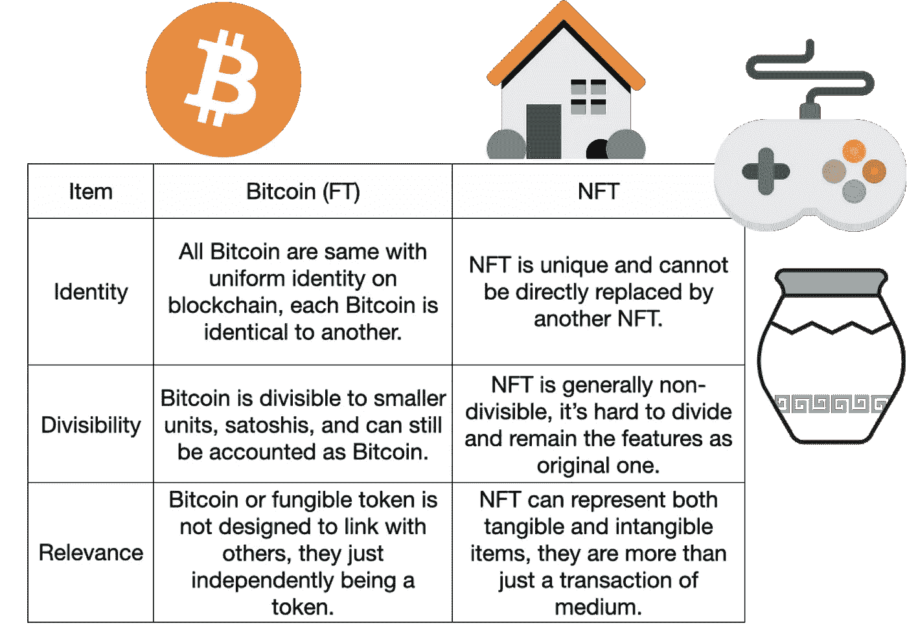

与可替代代币相比，如比特币或其他加密货币，它们是不可分割的。你可以发送少量的一个比特币，以 satoshis 衡量，但你不能发送 NFT 的一部分，因为 NFT 的一部分本身一文不值，而且不可兑换。

除了唯一属性之外，NFT 通常与特定资产相关联。它们可以用来证明数字物品的所有权，如实物资产、艺术品甚至游戏设备。

NFT 的话题在 2021 年风靡了整个世界，就在相关概念——GameFi 和元宇宙的前面。NFT 为密码世界带来了很多优势，人们可以通过这个技术荒原自由地创造和创新超级场景，甚至扩大了采用密码的机会。想要一个 NFT 或者讨论一下吗？加入 [**BOXTradEx 电报**](https://linktr.ee/BoxTradEx) **！！**

# 为什么 NFT 正在塑造一个全新的世界？

在 2021 年，没有任何技术发展可以掩盖 NFT 工业的魅力。区块链技术为几代人创造了一个不可信、可验证和开放的环境，以创造和实现任何想法。让我们回顾一下 NFT 今年的非凡记录…

> 【2021 年 3 月，数码艺术家 [*皮普尔*](https://www.beeple-crap.com/) *以*[*【6900 万美元*](https://onlineonly.christies.com/s/first-open-beeple/beeple-b-1981-1/112924) *的价格卖出了他的一幅 NFT 拼贴画，这使他成为拍卖会上第三位最昂贵的在世艺术家，仅次于大卫·霍克尼和杰弗·昆斯。*
> 
> *2021 年第三季度，不可替代代币交易量达到***106.7 亿美元，环比增长 700%。**

*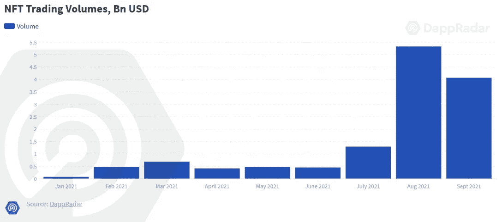*

**Source: DappRadar**

> *Axie Infinity 在加密领域取得了前所未有的增长，在 2021 年 5 月推出“Origin Alpha”和区块链“Ronin”后仅 3 个月，其销售额就超过了 10 亿美元，日用户数超过了 100 万。此外，Axie Infinity 成为著名的区块链游戏，其收入和用户数据在全球范围内都名列前茅。*

*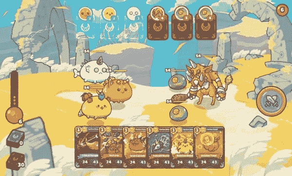*

**Source:* [*Abmedia.io*](http://abmedia.io/)*

> ****菲热持续不断。*** *“区块链游戏成为行业的主导类别，占行业使用量的 49%，超过 140 万个唯一活跃钱包(UAW)每天与游戏 dapps 互动。”—* [*BGA 区块链游戏报告 2021*](https://dappradar.com/blog/bga-blockchain-game-report-2021)*
> 
> **全球领先公司抢滩 NFT 产业。Visa 购买了 CryptoPunk #7610，这是 Visa 历史商业文物收藏中的第一件 NFT。此外，耐克收购了 NFT 时装公司 RTFKT studios，迈出了进军元宇宙的第一步。而且这种情况很多……**

*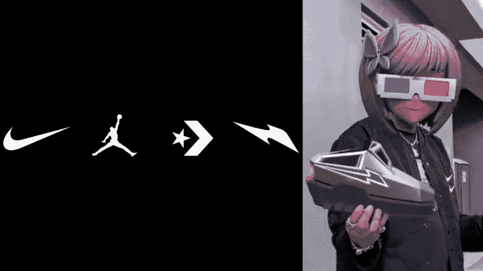*

**Source: Nike + RTFKT**

*随着人才和资本进入这一空间，NFT 的景象迅速演变，正如我们的观察，高速增长的魔力不仅仅是由激励措施或表面文章引起的，还源于对所有权、隐私和决策权的追求，人类意识的觉醒，因此产品-市场的契合。*

# *NFT 的先锋和可能性*

*绕过低效率和中介与新技术，NFT 使巨大的潜力，以授权不同的行业，实体，甚至个人，以建立他们的想法和想象力。我们见证了这一对我们生活至关重要的枢纽……随着 NFT 成为主流，人们将需要一个方便用户的空间来购买 NFT、存储 NFT 或用代币轻松兑换。*

*[***所以，NFT BOXVERSE 即将到来……在我们的 BOXVERSE 中找到宝藏！***](https://www.boxtradex.com/)*

*在拥有第一 NFT 之前，你应该了解许多伟大的 NFT 项目，我们以几个先驱为例，对 NFT 用例的主要类型进行了排序。*

*   *NFT 和收藏品*

***1。** [**隐猫**](https://www.cryptokitties.co/)*

*CryptoKitties 是最早的 NFT 收藏品项目之一，它创造了最容易获得和图像驱动的方式来体验区块链技术，然后出现 CryptoPunks 和其他图像导向的项目，这些项目变成了 NFT 的概念，图片证明(PFP)。*

*数字艺术第一次变得稀缺。通过使用区块链，创造可证明的艺术或任何数字资产的稀缺性是可行的，区块链固有的透明度和可验证性解决了行业问题。此外，多样化的应用和场景开始成为可能。*

*CryptoKitties 为艺术家和创作者引领了一个新时代，所有的传统价值都可以很容易地转化为可信赖的对象，这促使人们以新的方法设计他们的作品，并提供更好的解决方案。*

*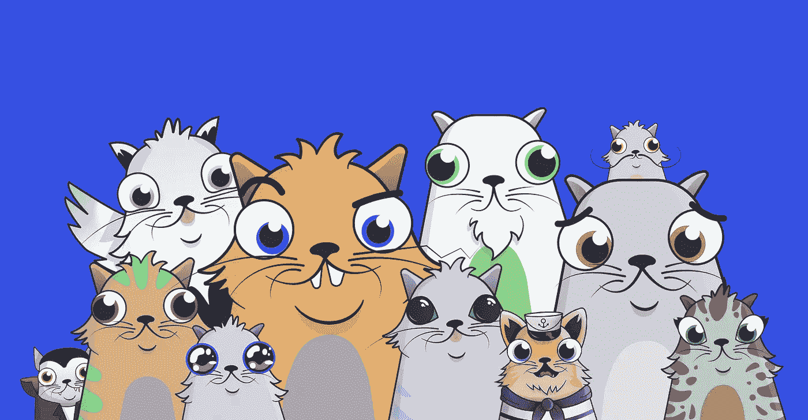*

**Source: CryptoKitties, ConsenSys**

***2。** [**合并。**](https://niftygateway.com/collections/pakmerge)*

*“合并弥撒。质量越大，就越能融合。”— *合并*，由知名数字创作者 Pak 创作的 NFT 概念滴。Pak 的*合并*将艺术品市场推向了新的高度，在 NFT 平台上售出了超过 25 万个“大批量单位”——这是一个漂亮的门户，总价值为 9180 万美元。*

*为什么*合并*？特别之处在于，帕克利用区块链和记号经济学的独特特征创造了一件巨大的概念艺术品。通过结合稀缺性、产量和燃烧机制，买方将拥有不同的、有限的 NFT，这完全取决于你购买了多少质量单位。“得到的越多，惊喜就越多”，即*合并*真正能创新出一个令人惊叹的 NFT 项目，也预示着 NFT 多用途和独特商业模式的潜力。*

**

**Source: Nifty Gateway**

*   *NFT 和迪菲公司*

***1。**[**Aavegotchi**](https://aavegotchi.com/)*

*与 NFT 一起建立的第一个功能是 DeFi，分散金融，创新者是 Aavegotchi。Aavegotchi 是一家由 DeFi 协议 [Aave](https://aave.com/) 资助的实验性创业公司。(Aave 是一个开源的分散式金融协议，你可以在 [BOXTradEx](https://linktr.ee/BoxTradEx) 上与机器人进行交易)*

*Aavegotchi 领导 NFT 与多种应用的集成，首先涉及 DeFi 系统。如跑马圈地和产量耕作，之后，游戏、道治和虚拟空间也部署在生态系统内。用户可以购买和升级他们的 Aavegotchis 来赚取$GHST 代币。然而，Aavegotchis 是动态的 NFT，元数据会随着时间的推移而变化，元数据可能会影响结果，所以这是一个有趣的游戏机制。*

*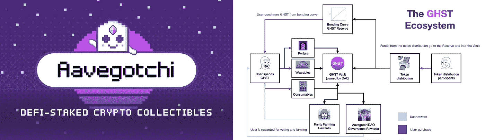*

**Source: Aavegotchi**

***2。**[**Uniswap V3**](https://uniswap.org/)*

*Uniswap V3 是最强大的 DEX、分散式交换协议，它引入了流动性 NFTs 来解决资本效率低下的问题。在早期的 DEX 机制——自动做市商(AMM)中，流动性提供者提供的资金将平均分配到各个价格水平，遵循 x * y = k 价格曲线。这意味着大部分流动性被浪费了，而不是对流动性的回报。*

*在 Uniswap V3 的情况下，流动性提供者可以选择锚定他们希望将其资产分配到的价格范围，并在价格处于选定的价格范围内时从费用中获利。除此之外，所有位置都表示为 NFT，而不是以前版本中的可替换标记。唯一的流动性 NFT 将显示所有者选择的池和参数。*

*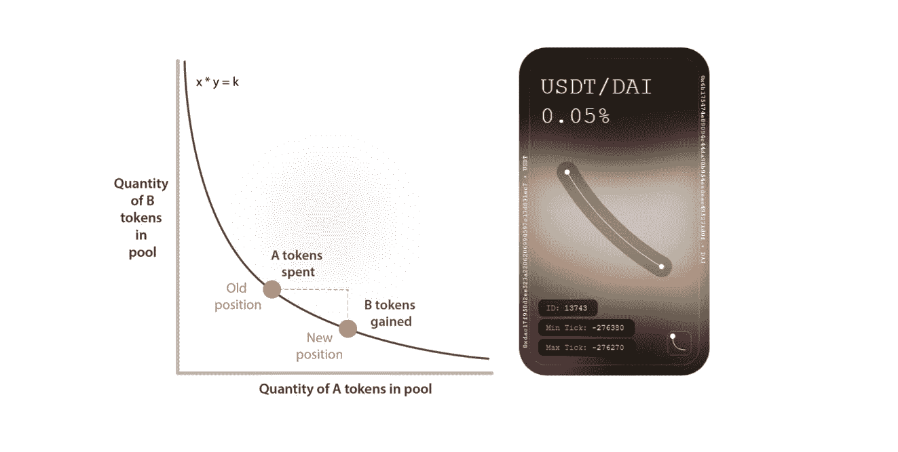*

**Source: Uniswap, MVP WORKSHOP**

*   *NFT 和身份*

***1。** [**【百无聊赖猿游艇俱乐部】**](https://boredapeyachtclub.com/#/)*

*Bored Ape Yacht Club 是一系列 NFT 虚拟角色，有 10，000 个虚拟角色，每个虚拟角色都有一组随机生成的属性和一个围绕它们构建不同应用程序的蓬勃发展的社区。这个 BAYC NFTs 导致了对 crypto-world 惊人的个人资料图片炒作，目前，BAYC 的底价是 53.9 ETH(215，350 美元)，它在苏富比的拍卖中获得了 2400 万美元。*

*衍生产品和社区氛围加强了 BAYC 在 NFT 市场的地位，BYAC 已经成为一个加密皇室俱乐部的标志。*

*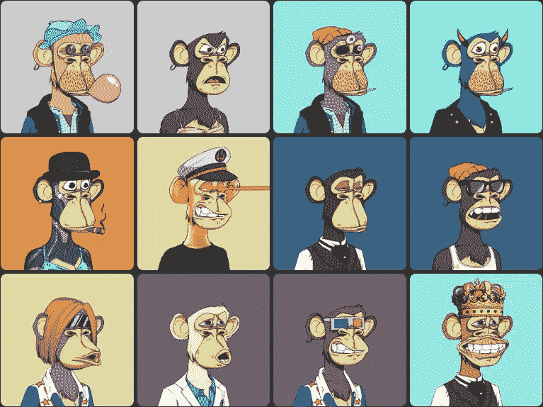*

**Source: Bored Ape Yacht Club**

***2。** [**【以太坊名称服务(ENS)**](https://ens.domains/)*

*如你所知，区块链和加密货币是高度技术性的，需要了解许多技术术语和规则，尤其是对于第一次使用的用户。这就是 ENS 和 BOXTradEx 出现的原因。*

*ENS 是以太坊应用的一个去中心化的命名服务，比如钱包、网站或其他用例。例如，用户想发送密码给朋友，他需要找到正确的地址格式，并以正确的方式复制和粘贴它。此外，如果用户对不同的区块链有不同的地址，那么就会造成混乱和管理困难。*

*简而言之，ENS 是建立在以太坊区块链上的名称和查找服务，它允许加密用户将其机器可读的地址转换为人类可读的地址。可以把它看作是公共以太坊地址的昵称生成器，旨在使 crypto 更容易访问。比如把“0xDC2EWQR344342338A2ADA83795”变成“BOXTradEx.eth”。*

*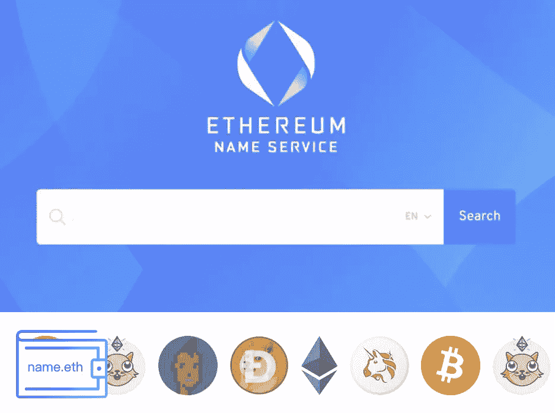*

**Source: ENS**

*   *NFT 与游戏*

***1。** [**轴协无穷大**](https://axieinfinity.com/)*

*GameFi 是 NFT 最受欢迎的应用之一，也就是所谓的游戏金融。我们已经引入了 NFT 项目，如 CryptoKitties 和 Aavegotchi，但该领域的冠军是——Axie Infinity。它不仅引发了区块链应用的流行，吸引了超过 40 亿美元，而且它还达到了 250 万基于外链活动的每日用户。游戏系统是由双令牌经济，愉快的界面和字符，用户可以收集可爱的怪物称为 Axies，把他们对彼此的战斗，并培育他们创造新的 axis。“游戏赚”的机制使得像菲律宾这样的国家的玩家从育种和交易中谋生。*

*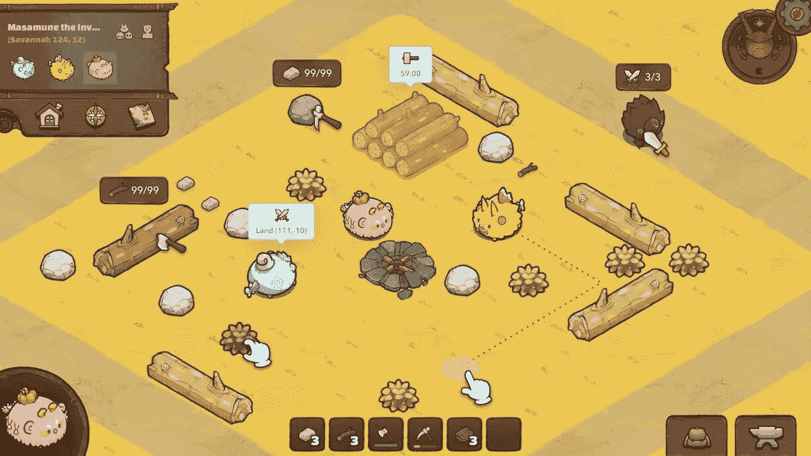*

**Source: Axie Infinity**

***2。** [**春晚运动会**](https://app.gala.games/)*

*NFT +游戏的另一个预期应用是区块链游戏平台。Gala Games 的使命是为区块链游戏建立一个分散的生态系统。数据显示，token-GALA 在币安上线后，价格暴涨 400%，从 0.021 美元涨到 0.84 美元。Gala Games 和区块链 Games 的用户群一直在稳步增长，迄今为止，它每月有 130 万活跃用户，并售出 2.6 万部 NFT，最贵的一部售价 300 万美元。*

*有一些著名的游戏平台，如 Steem 和 Epic Game，这给了我们一个信号，即游戏集成商或平台可能是扩展令牌组学和 NFTs 潜力的一种方式。BOXTradEx 展望了 Gala Games 未来的成就，并对区块链博彩业持积极乐观的态度。顺便说一下， [BOXTradEx](http://www.boxtradex.com/register-app/) 提供人工或机器人交易的 GALA 交易。总结来说，“去中心化的盛大游戏生态系统渴望敞开大门，让玩家重新获得他们应得的控制权。”—来自 Gala Games 的网站。*

*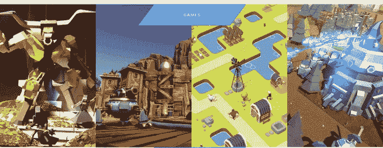*

**Source: Gala Games**

*   *与道*

***1。** [**请道**](https://pleasr.org/)*

*我们已经知道 NFT 是不可分的，可以被验证，并把所有权归还给用户，尽管有人仍然试图突破不可分性的限制。*

*PleasrDAO 是一个分散的自治组织(DAO ),其主要目标是集体购买需要大量投资的 NFT，这意味着人们可以投资部分蓝筹 NFT，并通过加入 PleasrDAO 来分享所有权或权利。*

*这是一个新的尝试，试图将非功能性翻译细分成更小的数量，这真正为人们参与打开了一个新的渠道，其他人也遵循这一精神为非功能性翻译创造道，如 HeadDAO。尽管如此，法律灰色地带仍是这类问题之一。PleasrDAO 最具标志性的一次购买发生在 2021 年 4 月，当时有 40 人通过 PleasrDAO 组织起来，以 550 万美元的价格从爱德华·斯诺登手中购买了一幅 NFT。*

*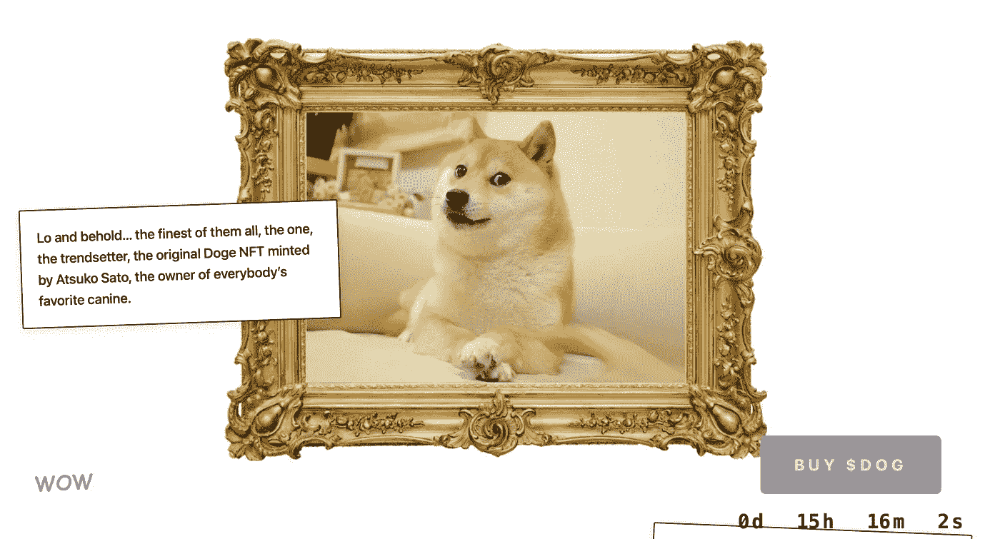*

**Source: PleasrDAO, fractionalized NFTs of Meme DOGE NFT.**

***2。** [**宪法道**](https://www.constitutiondao.com/)*

*经过请道，我们都知道利用道的治理结构可以扩大的版图。无论是细分的 NFTs 还是发力众筹。宪法岛是一个传奇的道项目，通过分散的方式筹集资金，一群人只是试图购买美国宪法的原版之一。*

*尽管他们因在苏富比拍卖会上失去出价而未能实现目标，但最终，单一用途刀的实验和成功在一周内筹集了 4700 万美元，使宪法刀获得了社会的关注。*

**

**Source: CoinDesk, 2021 Alexi Rosenfeld**

*NFT 与太空*

***1。** [**Opensea**](https://opensea.io/)*

*NFT 是一个非传统的象征，可以服务于多种功能，但回到核心，NFT 需要一个地方，一个存储，交易和展示的空间。因此，NFTs 的市场需要伴随着繁荣的产业。Opensea，NFT 市场，允许用户购买，销售，铸造或开始拍卖 NFT。Opensea 的特点是用户友好的界面、多样化的网络功能和全面的搜索引擎。*

*NFT 市场的预期估值高达 250 亿美元，NFT 90%的交易量发生在 Opensea 上。许多著名的 NFT 项目都是利用 Opensea 来实现他们的路线图。因此，Opensea 正在接受新的投资要约，这可能会使其估值增加约 6 倍，达到 100 亿美元。*

*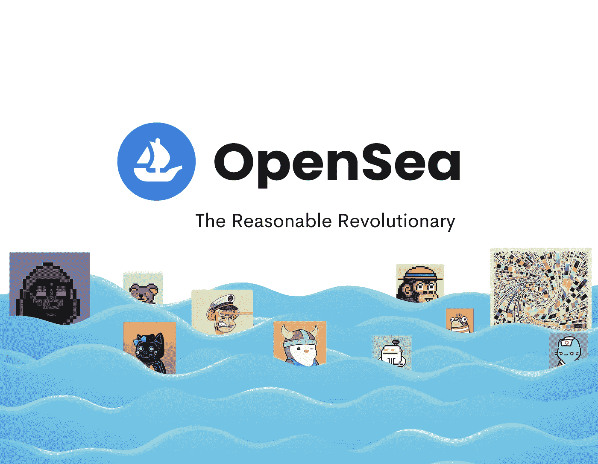*

**Source: Opensea**

***2。** [**分散**](https://decentraland.org/)*

*“在用户拥有的第一个虚拟世界中创造、探索和交易”——分散的土地。如果我们只是拿着一个 NFT，那么它就像一个文件或数据被废弃在角落里，没有其他任何东西，然而，我们可以通过将它部署在正确的协议或位置来释放 NFT 的力量。这就是为什么元宇宙的概念脱颖而出，一个共享的沉浸式数字世界可以促进不同类型的应用程序与 NFTs 的融合。*

*分散土地是领先的元宇宙项目之一，这是一个分散的虚拟现实(VR)平台，用户可以创建和货币化他们的内容和应用程序。分散土地中的所有数字材料都被 NFT 令牌化，如土地、头像和其他，用户可以享受这个虚拟世界来创建 NFTs，用 MANA 令牌购买数字商品和服务。元宇宙将所有权、体验、应用场景的可能性最大化。*

*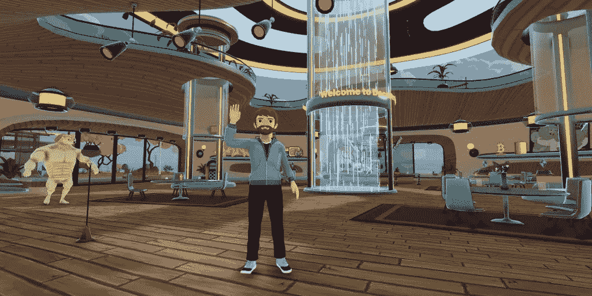*

**Source: Decentraland**

# *BOXVERSE — BOXTradEx NFT 市场*

***我们很高兴发布 BOXTradEx NFT 市场的一些剧透。BOXTradEx 用户很快就可以在我们的 mobileAPPs 上进行造币、购买、出售和拍卖。** 🥳*

*为什么命名为“BOXVERSE”？最初的想法是，我们想成为我们自己，是关于品牌和创造与 BOXTradEx 相关的独特形象。另一个原因是，我们的目标是建立一个面向用户的，高度可扩展的，并与密码交易服务集成。那么,“盒子”是一个可以存放你的非功能性食物的空间，也代表着你可以随身携带到世界各地的强大灵活性。*

*回到正题，我们来检查一下 BOXVERSE 的一些 UI，好吗？*

*   ***box verse 首页***

*BOXVERSE 是我们在底部导航栏中添加的第五个功能，用户可以通过选择类别或过滤特定元素来探索 NFTs。*

**

*   ***NFT 系列和细节……***

*创建您的第一个收藏，并开始建立您的 NFT 项目！！！BOXTradEx 支持蜡区块链在第一位，然后索拉纳，EVM 兼容区块链。[待调](https://linktr.ee/BoxTradEx)！！！*

*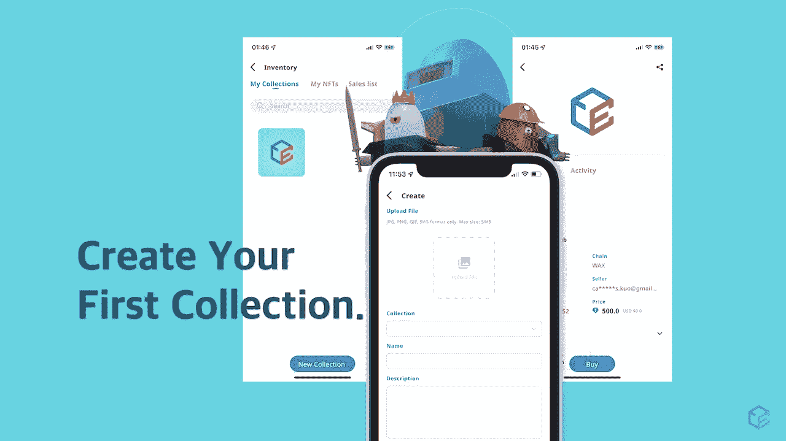*

*   ***NFT 拍卖会还有更多要揭晓……***

*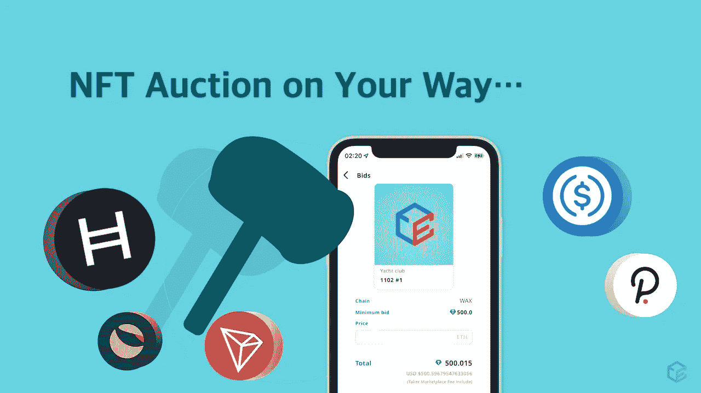*

# *拳击手——密码创新者的象征*

*BOXER，源自 BOXTradEx 创新者计划的 NFT，是 BOXTradEx 的第一个 NFT/虚拟身份，限量 500 版。在早期阶段，我们向活跃用户和合作伙伴赠送 BOXER。如果你渴望拥有一个…请确保准时关注我们的新闻！*

*关于鲍克瑟 What 还有什么？它不仅仅是一个头像或一件可证明是稀有的艺术品，而是拥有特殊的所有权和持有权。我们在品牌元素的基础上设计了 BOXER NFT，并融入了与业主账户相关的个性化元素。通过持有拳师 NFT，您将拥有参与活动、新功能的早期权利，并成为 launchpad 的白名单。总而言之，拳手 NFT 的潜力是无限的，努力为迎接 BOXVERSE 的繁荣赢得一个。*

*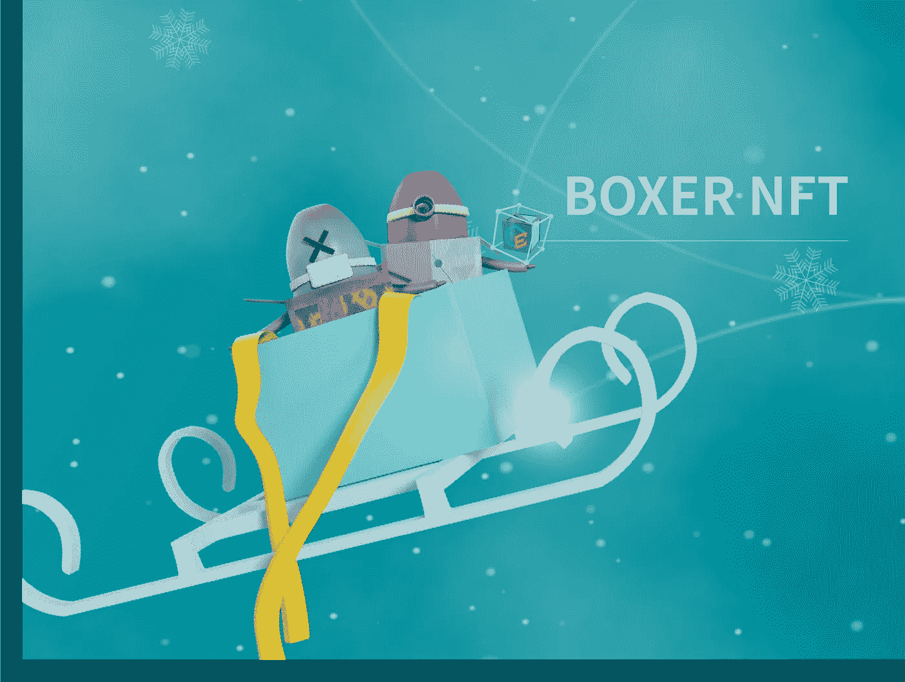*

# *一站式加密平台，连接真实世界和加密仙境。*

*BOXTradEx 是一个结合了战略交易工具(bots)的加密货币交易所。我们的目标是首先在安全和合法合规的基础上建立一个具有前瞻性概念的加密平台。BOXTradEx 的主要应用程序是具有多种投资策略的加密交易机器人。*

*   *免费获得 20 USDT 交易红利，以更好的方式享受投资
    👉[iOS](https://apps.apple.com/tw/app/boxtradex/id1566819984)T19[Android](https://play.google.com/store/apps/details?id=com.plusblocks.boxtradex)*
*   *一起交易并加入 BOXTradEx 社区
    👉[英文](https://t.me/boxtradex) [印度尼西亚](https://t.me/boxtradex_id) [越南](https://t.me/boxtradex_vn)*
*   *想要一个平台来利用你的技能吗？联系人
    👉[https://t.me/kenjisrealm](https://t.me/kenjisrealm)*

> *加入 Coinmonks [电报频道](https://t.me/coincodecap)和 [Youtube 频道](https://www.youtube.com/c/coinmonks/videos)了解加密交易和投资*

## *也阅读*

* [## 杠杆代币[多头代币]终极指南

### 杠杆化令牌是具有杠杆化风险敞口的 ERC20 令牌，不考虑保证金、要求、管理…

medium.com](/coinmonks/leveraged-token-3f5257808b22)  [## 最佳加密交易所| 2021 年十大加密货币交易所

### 编辑描述

blog.coincodecap.com](https://blog.coincodecap.com/crypto-exchange)  [## 2021 年最佳加密交换平台| CoinCodeCap

### 编辑描述

blog.coincodecap.com](https://blog.coincodecap.com/best-swap-platforms)  [## 10 大最佳网上赌场[2021] |赢取免费 BTC | CoinCodeCap

### 编辑描述

blog.coincodecap.com](https://blog.coincodecap.com/best-online-casinos)  [## 2021 年最佳加密借贷平台| 6 大比特币借贷平台

### 获得比特币和其他加密货币的最佳贷款利率

medium.com](/coinmonks/top-5-crypto-lending-platforms-in-2020-that-you-need-to-know-a1b675cec3fa)  [## 2021 年 6 大最佳硬件钱包|顶级加密硬件钱包[更新]

### 最好的加密货币硬件钱包是绝对必要的。我们将在 NGRAVE、Ledger Nano X 和…

medium.com](/coinmonks/the-best-cryptocurrency-hardware-wallets-of-2020-e28b1c124069)  [## 2021 年最佳免费加密交易机器人

### 2021 年币安、比特币基地、库币和其他密码交易所的最佳密码交易机器人。四进制，位间隙…

medium.com](/coinmonks/crypto-trading-bot-c2ffce8acb2a)*