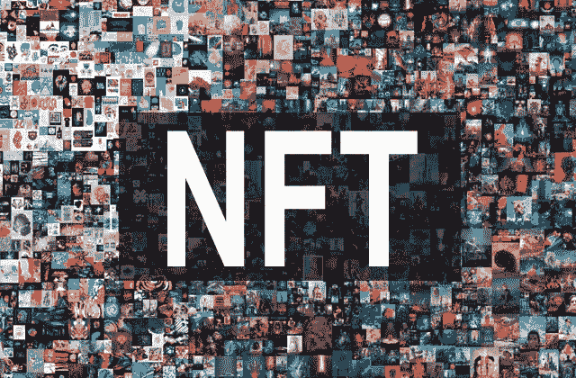

# NFT 设计、标准和扩展

> 原文：<https://medium.com/coinmonks/nft-design-standards-extensions-fdf7c26e793f?source=collection_archive---------6----------------------->

## NFT 是目前最热门的话题之一，但是他们的设计是如何工作的呢？令牌标准和扩展是什么？

[https://bitcoinpl.org/bloomberg-spadajace-ceny-nft-mowia-o-koncu-euforii/](https://bitcoinpl.org/bloomberg-spadajace-ceny-nft-mowia-o-koncu-euforii/)

许多人现在非常简单地谈论 NFT 和数字财产。NFT 在游戏、音乐、艺术等方面。毫无疑问，不可替换的令牌是最容易解释的话题之一…