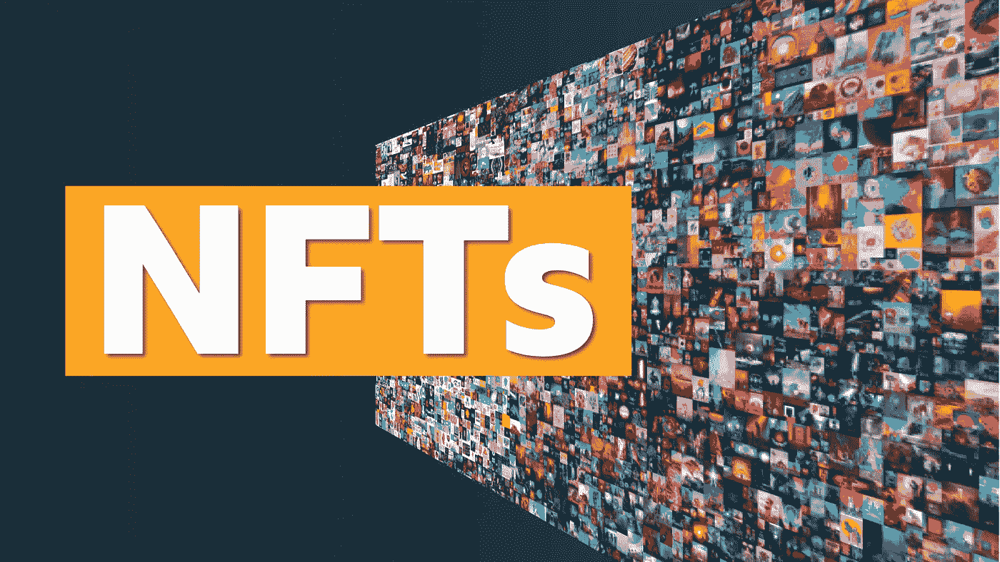

# 初学者 NFT

> 原文：<https://medium.com/coinmonks/nft-for-beginners-979082b64853?source=collection_archive---------8----------------------->

如果你在社交媒体上听说过 NFT 这个术语，但不知道它是什么，那么你来对地方了，我们将快速介绍并深入挖掘这个领域及其效用。人们在这个领域花费了数百万并且赚了数百万，所以你可能会问自己这到底是什么？

缩写 NFT 代表不可替换令牌，简单来说，就是你拥有的存储在区块链上的数字资产。区块链是一种以分散方式存储信息的数据库。这项资产是不可替代的，这意味着它是独一无二的，不可替代的。一个反例是一张 20 美元的钞票，如果我们都有一张，交换它，它仍然是一样的，在一天结束时，我们都有 20 美元，具有相同的价值。

NFT 可以是任何数字化的东西，比如图画、音乐、图片，甚至推特。但真正的附加值在于我们如何利用技术销售艺术品，而技术可以用来销售任何东西。它基本上是一张照片、一件艺术品或一份文件所有权的记录，由区块链技术支持，可以买卖。任何文档都可以是 NFT，如发票和采购订单。

NFT 的售价高达数千甚至数百万美元，尤其是 CryptoPunks 系列中的那些，这是一万个独特的可收集角色。目前可获得的最低价格为 242，000 美元，其中一些售价为 7 和 10 百万美元。但是谁会为一张基本上是数字交易卡的东西支付数百万美元呢？这就是 NFT 如此独特和混乱的原因。有些人把它们当成艺术品收藏的未来，有些人把它们当成神奇宝贝卡片，普通人可以拿到，但也是巨富们的游乐场。在昂贵的收藏中拥有 NFT 的一个额外好处是它提供的独特性。你现在是一个非常有选择性的俱乐部的一员，其成员有着相同的心态并相互支持。当你拥有收藏的 NFT 时，一些项目会提供实用工具，比如访问独家活动、在线课程和资助机会。

NFT 将接管活动行业，无论是现场直播还是在线，甚至在元宇宙。如果未来几年活动和音乐会采用基于 NFT 的门票，不要感到惊讶。我们从纸质门票发展到二维码，为什么现在没有 NFT 呢？互联网本身在早期就太复杂了，那些对非功能性互联网说同样话的人在历史方面很糟糕。

谢谢你的耐心和阅读这篇文章。
请分享您的反馈和任何建议。
更多文章将很快推出！

> 加入 Coinmonks [电报频道](https://t.me/coincodecap)和 [Youtube 频道](https://www.youtube.com/c/coinmonks/videos)了解加密交易和投资

# 另外，阅读

*   [密码本交易平台](/coinmonks/top-10-crypto-copy-trading-platforms-for-beginners-d0c37c7d698c) | [Coinmama 审核](/coinmonks/coinmama-review-ace5641bde6e)
*   [印度加密交易所](/coinmonks/bitcoin-exchange-in-india-7f1fe79715c9) | [比特币储蓄账户](/coinmonks/bitcoin-savings-account-e65b13f92451)
*   [OKEx vs KuCoin](https://coincodecap.com/okex-kucoin) | [摄氏替代品](https://coincodecap.com/celsius-alternatives) | [如何购买 VeChain](https://coincodecap.com/buy-vechain)
*   [币安期货交易](https://coincodecap.com/binance-futures-trading)|[3 comas vs Mudrex vs eToro](https://coincodecap.com/mudrex-3commas-etoro)
*   [如何购买 Monero](https://coincodecap.com/buy-monero) | [IDEX 评论](https://coincodecap.com/idex-review) | [BitKan 交易机器人](https://coincodecap.com/bitkan-trading-bot)