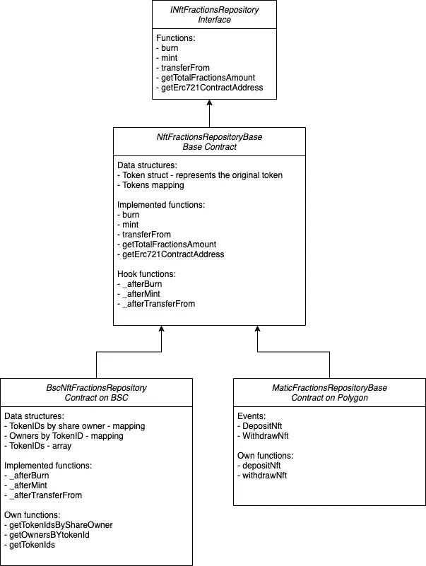

# NFT 馏分库合同

> 原文：<https://medium.com/coinmonks/nft-fractions-repository-contracts-3ecab96f3d1?source=collection_archive---------2----------------------->

NFT 分数库基于 ERC1155 标准，这是除 ERC721 之外的第二个非功能性测试标准。ERC1155 合约是可替换和不可替换令牌的组合。在 ERC721 中，每个令牌都是唯一的，有自己的参数、元数据、历史记录等。除此之外，在 ERC1155 中，每个令牌还与一个金额相关联。这个数量可以被视为原始令牌、股份、相同项目的副本，或者您可以想到的任何其他有意义的抽象。ERC1155 由金恩开发，用于表示游戏项目。这些物品可以是剑(许多是同一类型的)、戒指(在某些情况下是 7 个)，或者任何其他可以是唯一的(数量是 1，也就是不可替代的)或者与任何大于 1 的数量相关联的东西(可替代的)。这些不同的项目可以放入一份 ERC1155 合同中。对于 ERC721，可以通过为每个项目部署单独的合同来实现相同的效果:一个合同用于剑，一个合同用于戒指，等等。这样做的坏处是显而易见的。更多内容可阅读原[提案](https://github.com/ethereum/EIPs/issues/1155)。

在我们的例子中，ERC1155 是铸造原始独特 NFT 碎片的直接选择。NFT 分数库中的每个代币代表最初在另一个合同中铸造的唯一的 NFT。与每个 ERC1155 令牌相关联的金额是该 NFT 的铸造分数。

为简单起见，NFT 存款功能仅在 Polygon 上可用，在 BSC 上不可用。因此，该应用程序在某种程度上是不对称的，因为 NFT 分数源自多边形，并且在转移后也可以在 BSC 上进行交易。从用户体验的角度来看，当用户将其 NFT 存入 NFT 分数 Dex 时，会发生以下情况:
-------------------------------------------- NFT 被转移到原始合同中铸造 NFT 的 Dex 的地址。这是一个锁定机制，防止用户卖掉他的 NFT，除非他从 Dex 中取出它。为了简单起见，Dex 不使用任何保险库系统，它只是简单地转移原始合同中的 NFT。
-新的 ERC1155 代币以给定金额铸造，代表股份/分数。
-ERC 1155 标准实现了一个批准系统，以支持令牌传输，就像 ERC721 一样。因此，在存款之前，用户被要求批准 Dex 合同以转移他的 NFT。
-只有那些所有份额属于同一用户的 NFT 才可以从 Dex 中撤销。换句话说，用户必须先获得 NFT 的全部所有权(所有股份)，然后才能将其收回。

让我们仔细看看 NFT 分数库合同:

该接口定义了从其他智能合约调用的顶级函数，例如:从桥合约:
- Burn 和 mint 与桥合约直接相关。当某人将他的代币从一个链转移到另一个链时，桥契约调用原始链上的 burn 函数和另一个链上的 mint 函数。关于这座桥的更多细节将在后面的文章中介绍。
- TransferFrom 与 ERC1155 中的 safeTransferFrom 相同，但有一点限制，契约不暂停，还引入了一个钩子函数(_afterTransferFrom)。
-gettotalfractionamount 和 getErc721ContractAddress 只是阅读器函数

基础契约(NftFractionsRepositoryBase)实现了接口的功能，并且引入了可以由子契约实现的钩子函数。这些钩子函数提供了钩住一些逻辑(事件发射或更新内部数据结构)的可能性，如前一篇文章结尾所详述。

特定于链的合约反映了使用图表读取数据和直接从智能合约读取数据之间的差异。在多边形契约的情况下，这些钩子包含事件发射，在 BSC 契约的情况下，这些钩子函数更新内部数据结构。

先说多边形契约(MaticFractionsRepositoryBase)。它实现了 depositNft 和 withrawNft 函数，因为这些函数只在多边形上可用。此外，它还发出相应的 depositNft 和 withdrawNft 事件，这些事件由图形进行索引。

相比之下，BSC 契约(BscNftFractionsRepository)处理三种不同的内部数据结构:
-共享者的令牌 ID
-令牌 ID 的所有者
-所有令牌 ID
它们都有相应的 getter 函数:
-getTokenIdsByShareOwner
-getOwnersBYtokenId
-getTokenIds
它们为 UI 的数据显示用例服务:
-给定用户的 NFT 列表
-所有者列表

在下一节中，我们将详细介绍 DEX 合同。

如果你想阅读本系列的其他文章，你可以在[主文章](/@szmizorsz/nft-fractions-decentralised-exchange-introduction-3e696f27c065)中找到链接。

或者如果你想看我的其他项目和贡献:

[https://www.szabolcsszentes.com/](https://www.szabolcsszentes.com/)

> 加入 Coinmonks [电报频道](https://t.me/coincodecap)和 [Youtube 频道](https://www.youtube.com/c/coinmonks/videos)了解加密交易和投资

## 也阅读

 [## 获取信号、交易机器人和套利

### 在本文中，我们将回顾 Bitsgap，这是一个满足您所有交易需求的一站式加密交易平台。它…

blog.coincodecap.com](https://blog.coincodecap.com/bitsgap-review)  [## 5 个最佳社交交易平台[2021] | CoinCodeCap

### 困惑于社交交易和副本交易哪个平台最好？本文将带您了解各种…

blog.coincodecap.com](https://blog.coincodecap.com/best-social-trading-platforms)  [## BlockFi 评论 2021:利弊和利率| CoinCodeCap

### 今天，我们提出了一个全面的 BlockFi 评论，这是一个成立于 2017 年的加密贷款平台，拥有其…

blog.coincodecap.com](https://blog.coincodecap.com/blockfi-review)  [## 如何在印度购买比特币？2021 年购买比特币的 7 款最佳应用[手机版]

### 如何使用移动应用程序购买比特币印度

medium.com](/coinmonks/buy-bitcoin-in-india-feb50ddfef94)  [## 加密税务软件——五大最佳比特币税务计算器[2021]

### 不管你是刚接触加密还是已经在这个领域呆了一段时间，你都需要交税。

medium.com](/coinmonks/best-crypto-tax-tool-for-my-money-72d4b430816b)  [## 存储比特币的最佳加密硬件钱包[2021] | CoinCodeCap

### 保管您的数字资产很容易，但找到正确的存储方式却是一项繁琐的任务。在线钱包有一个风险…

blog.coincodecap.com](https://blog.coincodecap.com/best-hardware-wallet-bitcoin)  [## Pionex 评论 2021 |免费加密交易机器人和交换

### Pionex 是为交易自动化提供工具的后起之秀。Pionex 上提供了 9 个加密交易机器人…

medium.com](/coinmonks/pionex-review-exchange-with-crypto-trading-bot-1e459d0191ea)