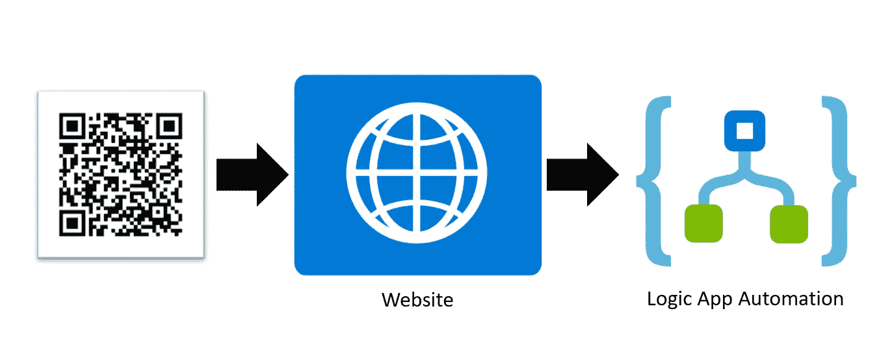
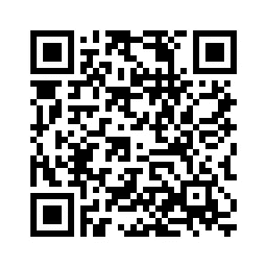
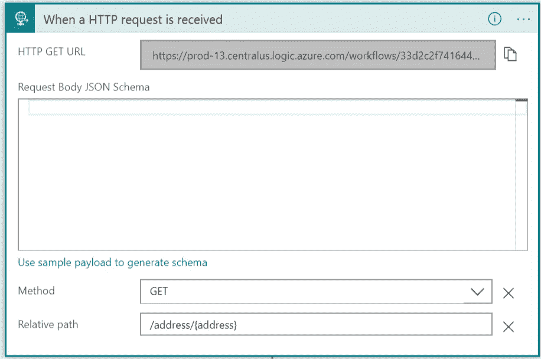
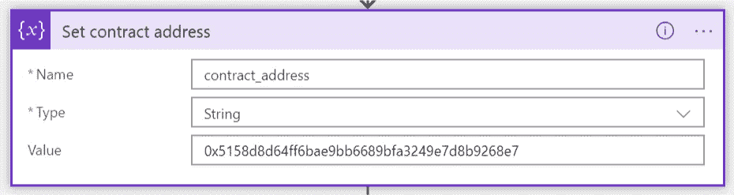
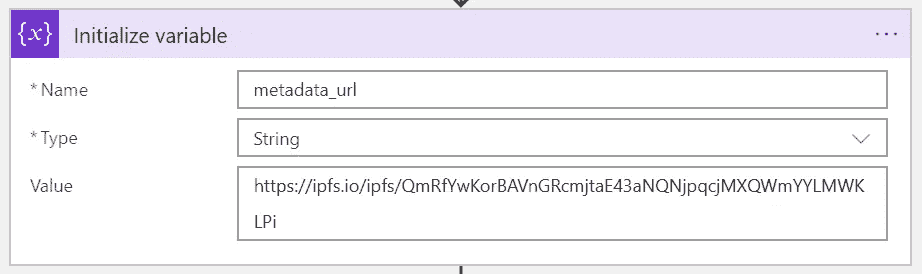
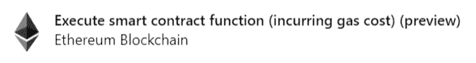
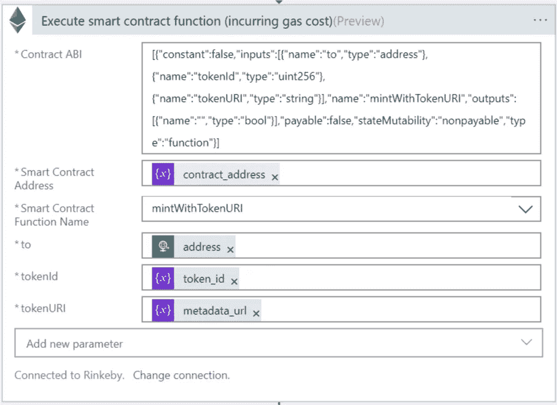
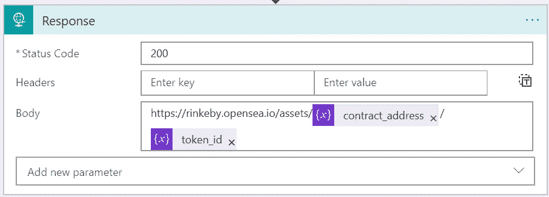

# NFT QR 分配器

> 原文：<https://medium.com/coinmonks/nft-qr-dispenser-b91c88da7ee?source=collection_archive---------0----------------------->


# 俏皮话

我们都看到了 CryptoKitty 热潮以及随后以太坊生态系统中 NFT 收藏品的爆炸。NFT 或不可替代令牌是一组代表有限且唯一令牌集合的契约。与 ERC20 标准不同，ERC721 将每个代币视为不可分割的唯一资产，在 ERC 20 标准中，每个代币都是可替换的，并且仅由账户余额表示。每个令牌都由自己的所有者、令牌 ID 和元数据 URL 来表示。下面是我用一些简单的元数据创建的一个令牌示例:

[](https://rinkeby.opensea.io/assets/0x75a4f7185fa246551100a7566dafb1500a2acbb1/899535414) [## 全息加密贴纸| OpenSea

### 赫萝是加密贴纸#899535414:不可替换贴纸...

rinkeby.opensea.io](https://rinkeby.opensea.io/assets/0x75a4f7185fa246551100a7566dafb1500a2acbb1/899535414) 

[元数据](https://ipfs.io/ipfs/QmRwz1WZJnTEirLRfeAjLz5WxMBfLxEhoM1sToh7GA7WMx)定义图像、贴纸类型(临时纹身)和粘性(65%)。

> 交易新手？试试[密码交易机器人](/coinmonks/crypto-trading-bot-c2ffce8acb2a)或者[复制交易](/coinmonks/top-10-crypto-copy-trading-platforms-for-beginners-d0c37c7d698c)

# NFT 发电机

我想建立一个简单的用户体验，允许不熟悉加密货币的人收集 NFT。由于获得加密货币是一个很高的准入门槛，我必须想出一个不需要用户支付汽油费的方法。我决定建立一个通过二维码触发的自动化工作。



二维码将用户导航到网站。该网站检测到 web3 提供商，并通过用户的以太坊地址向 Logic 应用程序 webhook 发出后端请求。Logic 应用程序通过使用其资助的以太坊帐户生成新的 NFT，并将 URL 返回到新创建的 NFT。然后，该网站将用户重定向到 OpenSea 上查看 NFT。

亲自尝试一下:

1.  下载 Opera (android)或 imToken 移动应用程序
2.  在应用程序中打开以下二维码



Demo of the user experience

您可以想象 QR NFT 发生器的新颖用例:

*   NFT 寻宝游戏，每个二维码有限扫描
*   在会议、演示或集会上分发的数字赠品
*   为你博客的读者收集的忠诚收藏品

这篇文章的其余部分将带你了解如何创建自己的二维码 NFT 生成器。

# 部署您的 NFT

ERC721 合约充当不可替换令牌的集合。实际的 NFT 可以在契约部署后创建。这份合同非常简单，因为我们让 OpenZeppelin 库来承担重任。

```
pragma solidity ^0.5.0;
```

```
import 'openzeppelin-solidity/contracts/token/ERC721/ERC721MetadataMintable.sol';
```

```
import 'openzeppelin-solidity/contracts/ownership/Ownable.sol';
```

```
/**
```

```
* @title Sticker Collectible
```

```
* Sticker NFT - a contract for non-fungible stickers.
```

```
*/
```

```
contract StickerCollectible is ERC721Metadata("CryptoStickers", "CS"), Ownable, ERC721MetadataMintable {}
```

[](https://github.com/codyborn/NFTGenerator/blob/master/StickerCollectible.sol) [## Cody born/NFT 发电机

### 通过二维码生成新的 NFT。在 GitHub 上创建一个帐户，为 codyborn/NFTGenerator 的开发做出贡献。

github.com](https://github.com/codyborn/NFTGenerator/blob/master/StickerCollectible.sol) 

为了部署它，我发现 [truffle-flattener](https://github.com/nomiclabs/truffle-flattener) 有助于将它展平为一个文件，以便在 Etherscan 上轻松查看。

```
truffle-flattener ./contracts/StickerCollectible.sol > StickerCollectibleFlattened.sol
```

使用您选择的契约部署者来部署契约。我只是把它放在混音里，用了我的 MetaMask 钱包。

# 在 OpenSea 上注册合同

[](https://opensea.io/get-listed) [## OpenSea:在以太坊上购买加密收藏品、加密 Kitties、分散土地等

### 稀有数码产品和加密收藏品的点对点市场。购买、销售、拍卖和发现…

opensea.io](https://opensea.io/get-listed) 

OpenSea 提供了一个很好的浏览器来查看你的 NFTs。注册合同地址后，您可以通过导航至以下位置来查看合同:

[https://rinkeby.opensea.io/assets/](https://rinkeby.opensea.io/assets/cryptostickers)姓名>

例子:【https://rinkeby.opensea.io/assets/crypto-stickers 

使用部署合约的同一个以太坊帐户，你可以更新你的物品的元数据。

# 创建您的逻辑应用程序

Logic Apps 是 Azure 中的一个平台，它提供了一种非常简单的方式来构建自动化(想想 IFTTT)。Logic Apps 拥有 200 多个不同连接器的市场，从消费者(Twitter、Twilio、Instagram)到企业(SAP、GitHub、Excel)以及介于两者之间的一切。最近，我们发布了一些[以太坊连接器，使区块链自动化更加容易](https://docs.microsoft.com/en-us/connectors/blockchainethereum/)。在本教程中，当被 HTTP 请求触发时，我们将使用这些以太坊连接器中的一个来调用智能契约。

1.  创建新的逻辑应用程序资源
2.  选择“空白逻辑应用程序”
3.  创建 Http 请求触发器

*   方法:获取
*   相对路径:/address/{address}
*   这允许我们使用 path 参数来收集用户的以太坊地址，以便将 NFT 发送到该地址。



接下来，为了方便起见，我们将初始化一些变量(连接器“初始化变量”)

4.为您的合同地址添加一个变量



*   名称:合同地址
*   类型:字符串
*   数值:<the address="" of="" your="" deployed="" contract=""></the>

5.设置元数据 _url



创建的每个 NFT 都指向描述其特征(图像、描述、属性)的元数据 JSON 文件。每个 NFT 可以有不同的元数据 URL。现在让我们将它设置为一个静态值。稍后，我们可以看到如何随机生成这些。

*   名称:元数据 _url
*   类型:字符串
*   值:[https://ipfs . io/ipfs/qmrfywkorbavngrcmjtae 43 anqnjpqcjmxqwmyylmklpi](https://ipfs.io/ipfs/QmRfYwKorBAVnGRcmjtaE43aNQNjpqcjMXQWmYYLMWKLPi)

6.生成令牌 id

*   名称:令牌标识
*   类型:字符串
*   值为 and 表达式: *rand(0，2147483647)*

7.创建以太坊交易



*   搜索**以太坊** 添加连接器**执行智能合约功能(发生燃气费用)**
*   建立连接(就像您的数据库连接字符串一样)。提供一个 RPC 端点(对于公共网络，我推荐 [Infura](https://infura.io) )。添加您用于部署合同的同一个帐户的私钥——这将授予我们 *mint* 功能。
*   将以下代码片段设置为合同 ABI。注意，我们只是为我们感兴趣调用的函数添加了 ABI。

```
[
  {
    "constant": false,
    "inputs": [
      {
        "name": "to",
        "type": "address"
      },
      {
        "name": "tokenId",
        "type": "uint256"
      },
      {
        "name": "tokenURI",
        "type": "string"
      }
    ],
    "name": "mintWithTokenURI",
    "outputs": [
      {
        "name": "",
        "type": "bool"
      }
    ],
    "payable": false,
    "stateMutability": "nonpayable",
    "type": "function"
  }
]
```

*   用我们设置的变量填充其余的参数



8.设置响应



*   在这里，我将在响应正文中返回 OpenSea 上新创建的 NFT 的链接

9.测试一下！从请求连接器导航到 URL，并将路径中的{address}替换为您的以太坊地址。

如果卡住了，可以[参考这个逻辑 App 代码](https://github.com/codyborn/NFTGenerator/blob/master/LogicApp)进行对比。

# Web 代理

我们最终想要一个二维码来触发这个逻辑应用程序，然后将用户导航到 OpenSea 上的 NFT 进行查看。为此，我们将设置一个简单的网站作为代理。下面是 HTML/JS 的一个片段，它将获取 web3 以太坊地址，并向 Logic App 端点构造一个请求。如果响应成功，它会将页面重定向到 OpenSea 上的资产。

[](https://github.com/codyborn/NFTGenerator/blob/master/webProxy.html) [## Cody born/NFT 发电机

### 通过二维码生成新的 NFT。在 GitHub 上创建一个帐户，为 codyborn/NFTGenerator 的开发做出贡献。

github.com](https://github.com/codyborn/NFTGenerator/blob/master/webProxy.html) 

# 生成 QR

然后我们简单地[生成一个指向我们网站的二维码](https://www.qr-code-generator.com/)。QR 需要通过一个注入 Web3 提供商的应用程序进行扫描。支持以太坊和 QR 扫描的几个手机应用是[状态](https://status.im/get)、 [imToken](https://token.im/download) 和 [Opera](https://www.opera.com/mobile/operabrowser) 。

*注意:状态要求您在 QR 网址前加上“*[*https://get.status.im/browse/*](https://get.status.im/browse/)*”*

# 奖金

您可以编写一个简单的脚本来随机生成 NFT 元数据，以便每个 NFT 都是唯一的。我发现使用 nodejs 生成元数据并将元数据上传到 IPFS 是最简单的。然后，我获取每个 IPFS url，并将其存储在 Azure 存储队列中。我没有从静态变量中提取元数据 url，而是在调用 *mintWithTokenURI* 函数时，将一条消息出队并用于元数据 url。

[](https://github.com/codyborn/NFTGenerator/blob/master/metadataGenerator.js) [## Cody born/NFT 发电机

### 通过二维码生成新的 NFT。在 GitHub 上创建一个帐户，为 codyborn/NFTGenerator 的开发做出贡献。

github.com](https://github.com/codyborn/NFTGenerator/blob/master/metadataGenerator.js) 

你有没有建立自己的 NFT 二维码？分享到下面的评论里吧！

> 加入 Coinmonks [电报频道](https://t.me/coincodecap)和 [Youtube 频道](https://www.youtube.com/c/coinmonks/videos)获取每日[加密新闻](http://coincodecap.com/)

## 另外，阅读

*   [复制交易](/coinmonks/top-10-crypto-copy-trading-platforms-for-beginners-d0c37c7d698c) | [加密税务软件](/coinmonks/crypto-tax-software-ed4b4810e338)
*   [网格交易](https://coincodecap.com/grid-trading) | [加密硬件钱包](/coinmonks/the-best-cryptocurrency-hardware-wallets-of-2020-e28b1c124069)
*   [密码电报信号](http://Top 4 Telegram Channels for Crypto Traders) | [密码交易机器人](/coinmonks/crypto-trading-bot-c2ffce8acb2a)
*   [最佳加密交易所](/coinmonks/crypto-exchange-dd2f9d6f3769) | [印度最佳加密交易所](/coinmonks/bitcoin-exchange-in-india-7f1fe79715c9)
*   开发人员的最佳加密 API
*   最佳[密码借贷平台](/coinmonks/top-5-crypto-lending-platforms-in-2020-that-you-need-to-know-a1b675cec3fa)
*   杠杆代币的终极指南