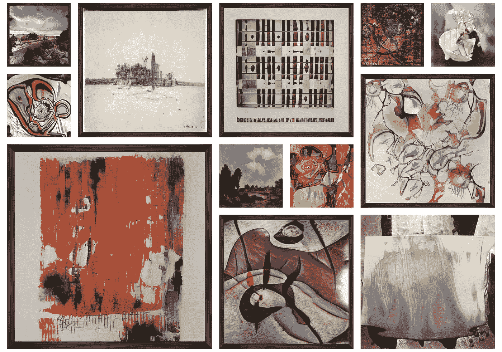

# NFT 聚焦:幻影画廊和人工智能艺术家

> 原文：<https://medium.com/coinmonks/nft-spotlight-mirage-gallery-and-the-ai-artists-9a1bfe09f6af?source=collection_archive---------12----------------------->

## 奥古斯特·罗斯戴尔和他的人工智能艺术家亚历杭德罗和泰勒的早期 NFT 艺术和秘密土著收藏

Some of the artworks from [Mirage Gallery’s](https://www.miragegallery.ai/) different collections (none of them are my own — source: [OpenSea](https://opensea.io/))

听播客是我最喜欢的了解有趣的艺术家、创作者和项目的方式之一。当新一集出来时，我总是听的播客之一是凯文主持的证明…