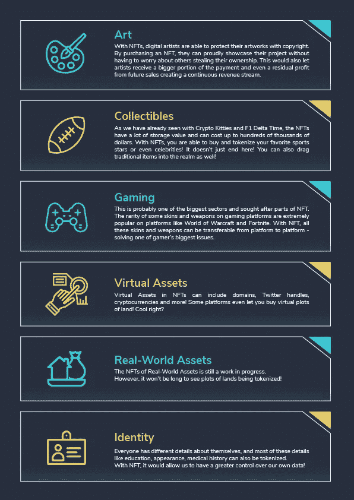
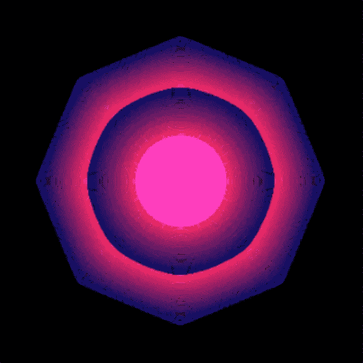
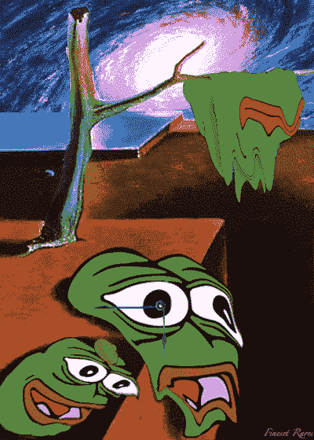
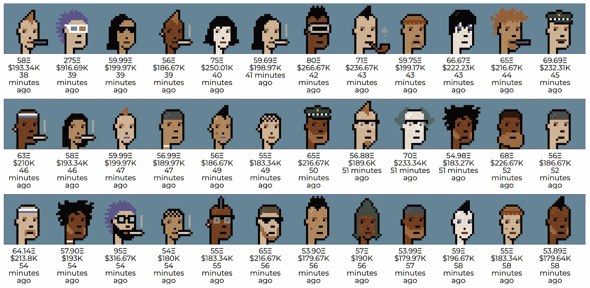
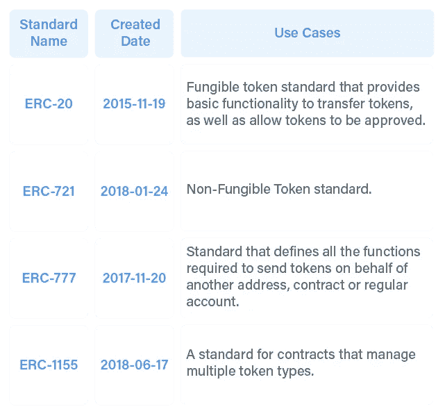
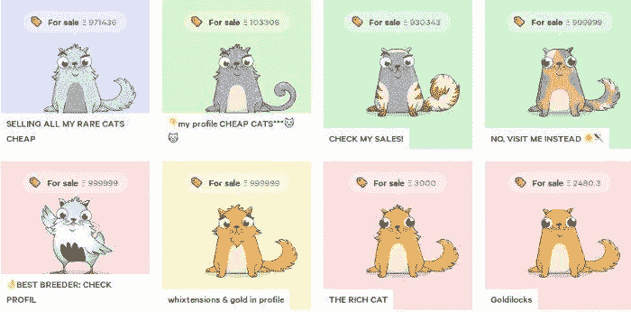
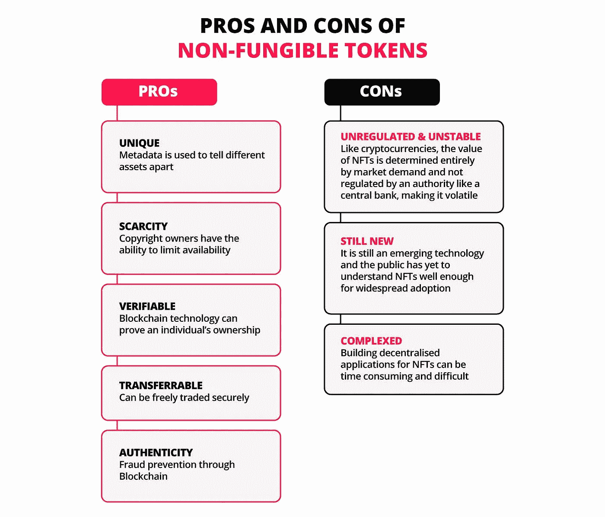

# NFT:买还是不买？

> 原文：<https://medium.com/coinmonks/nft-to-buy-or-not-to-buy-a99f5476e9ef?source=collection_archive---------6----------------------->

Image : Coindesk

正当印度(巴拉特)准备庆祝 Dhanteras(被认为是购买黄金的吉日；**琐事**:印度人去年一天就购买了 40 吨黄金，价值高达 30 亿美元)当世界其他地方对非金融交易狂热时，我的一个朋友对这种新投资工具的好奇说服我对这一投资机会的利弊进行了简明扼要的分析。

在我们开始挖掘投资非金融资产的利弊之前，让我们试着去理解什么是非金融资产，它们的起源，它们的特征，受欢迎的 NFT 市场等等。

# **什么是 NFT？**

NFT 是生活在区块链网络上的数字艺术作品，可以有几种形式。一些最受欢迎的数字艺术作品包括迷因、视频剪辑、图片、音乐，甚至推特。

是的，你没看错——在 Twitter 上发布的推文可以转化为非功能性交易并出售。NFT 的一个重要方面是它们是不可替代的。可替代性仅仅意味着商品有一个以上的单元，所有的单元都是相同的，可以互换，每个部分都无法与其他部分区分开来。

# **NFTs 的历史**

NFTs 的想法源于一种被称为[“彩色硬币”](https://en.bitcoin.it/wiki/Colored_Coins)，最初于 2012 年至 2013 年在比特币区块链上发行。彩色硬币是区块链上代表现实世界资产的代币，可用于证明任何资产的所有权，从贵金属到汽车到房地产等。彩色硬币还可以用来代表多种资产，并有多种使用情况，包括:

Image : Genesis Block

然而，NFTs 的历史和第一个创造 NFTs 的人凯文·麦考伊(Kevin McCoy)是从 2014 年 5 月 3 日开始的。早在密码艺术品市场爆炸之前，他就铸造了不可替代的代币“量子”。

Quantum 是一个八边形的像素化图像，充满了圆形、弧形或其他共享同一中心的形状，较大的形状包围较小的形状，并在荧光色调中催眠般地脉动。截至今天，这件独一无二的“量子”艺术品(2014-2021)以 700 万美元的价格出售。

Image : Economic Times

# 2014 年:交易对手

2014 年，Robert Dermody、Adam Krellenstein 和 Evan Wagner 成立了 [Counterparty](https://counterparty.io/) ，这是一个点对点金融平台，基于比特币区块链构建了分布式开源互联网协议。交易对手允许资产创造，并有一个分散的交换，从而为用户提供了一种创建自己的可交易货币的方式。它有许多想法和机会，包括没有假货问题的模因交易。

# 2015:交易对手的起源咒语

2015 年 4 月，交易对手与创世纪的[咒语的团队创作者合作。《创世纪》游戏创作者的符咒不仅是通过交易对手向区块链发行游戏内资产的先驱，也是首批推出 ICO 的先驱之一。创作者通过引入他们自己的游戏内货币](https://spellsofgenesis.com/)[比特晶体](https://bitcrystals.github.io/#:~:text=About%20BitCrystals,for%20iOS%20and%20Android%20devices.)来帮助资助对手的发展。

# 2016:交易对手的交易卡

2016 年 8 月，新趋势开始出现。交易对手与流行的交易卡牌游戏的[合作，并在交易对手平台上推出了他们的卡牌。根据销量，在口袋妖怪，游戏王和魔法之后，意志力是北美排名第四的纸牌游戏。他们之前没有区块链或加密货币的经验，他们进入这个生态系统，标志着将这些资产放在区块链上的价值。](http://www.fowtcg.com/)

# 2016:交易对手上的罕见人物

2016 年，模因进入了区块链。2016 年 10 月，memes 开始进入交易对手平台。人们开始给一个叫做“稀有人物”的特殊迷因添加资产罕见的 Pepes 是一个以有趣的青蛙角色为特色的迷因，多年来获得了大量粉丝。最初是一个名叫佩佩青蛙的漫画人物，现在已经稳步成为互联网上最受欢迎的迷因之一。到 2017 年初，随着以太坊越来越受重视，稀有的 Pepes 也开始在那里交易。

# 2017:密码朋克

随着稀有动物贸易的兴起，[幼虫实验室](https://www.larvalabs.com/)的创建者约翰·沃特金森和马特·霍尔在以太坊区块链创造了独特的角色。没有两个字符是相同的，它们将被限制在 10，000 个以内。这个项目名为 [Cryptopunks](https://www.larvalabs.com/cryptopunks) ，参考了 20 世纪 90 年代比特币的一项实验，可以被描述为 ERC721 和 ERC20 的混合体。

Image : The Block

ERC20 是最常见的以太坊令牌标准，它有允许令牌相互交互的规则，但不是创建唯一令牌的最佳选择。进入 ERC721，它的目的是成为以太坊区块链上的 NFT 标准。ERC721 有助于跟踪单个智能合约中单个令牌的所有权和移动。

Image : Crypto.com

[CryptoKitties](https://www.cryptokitties.co/) NFTs 使用 ERC721 落地运行。这是一款基于区块链的虚拟游戏，玩家可以通过以太坊收养、繁殖和交易虚拟猫。他们迅速走红，登上了包括[【美国消费者新闻与商业频道】](https://www.cnbc.com/2017/12/06/meet-cryptokitties-the-new-digital-beanie-babies-selling-for-100k.html)和[【福克斯新闻频道】](https://www.foxnews.com/tech/cryptokitties-a-game-about-digital-cats-is-bringing-cryptocurrencies-to-the-mainstream)在内的各大电视台的专题报道。CryptoKitties 是由一家总部位于温哥华的名为 [Axiom Zen](https://www.axiomzen.com/) 的公司创建的，并迅速传播开来，由于用户数量的增加，获得了顶级投资者的资助。Axiom Zen 后来将 *CryptoKitties* 分拆成 [Dapper Labs](https://www.dapperlabs.com/) 。

Image : Investopedia

# 2018–2021:NFT 爆炸

在 2018 年至 2021 年间，非功能性技术慢慢进入公众意识，然后在 2021 年初成为主流应用。

与现有的资产转移方式相比，NFT 市场效率更高，流动性更强。网上出现了许多平台，每个平台都为创作者和收藏者提供了差异化优势。中断的主要领域集中在限制集中收费上，传统的艺术品经纪人和拍卖行通常收取高达 40%的费用。

# **NFT 的特色**

*   **Unique—**每个 NFT 都有一个独特的属性，通常记录在令牌信息中。非功能性思维有不同的个性，没有两个非功能性思维是相同的。另一方面，原始的 image.jpg 文件与其副本 a.jpg 文件完全相同。
*   **数字化稀缺资源—** 区块链网络是 NFT 的大本营。因此，所有权证书可以在不同的网络上使用，从而可以证明数字项目的所有者。
*   **不可分割—** 你不能将大部分的 NFT 兑换成更小面额的，也不能购买或转让其中的一部分。
*   **所有权——**被转让资产的所有权由这些代币担保。
*   **防欺诈—**它们很容易转移，不会受到欺诈的影响。

# **NFT 市场**

1.  OpenSea : [OpenSea](https://opensea.io/) 是最初的点对点 NFT 市场，也是最大的。在撰写本文时，它的总交易量超过 65 亿美元(根据分析平台 [DappRadar](https://dappradar.com/nft/marketplaces) )，提供从游戏内物品和收藏品到艺术品、音乐、gif 等一切的 NFT。
2.  Axie Marketplace : NFT 驱动的视频游戏 [Axie Infinity](https://decrypt.co/resources/what-is-axie-infinity-the-play-to-earn-nft-game-taking-crypto-by-storm) 是 NFT 第二大市场的主机，Dappradar 上的总交易额超过 21 亿美元。它专门交易 Axie:可爱的、类似神奇宝贝的数字宠物，玩家可以在 [Axie 市场](https://marketplace.axieinfinity.com/)上购买和交易。关于 Axie Infinity 的更多信息，请见下一篇文章。
3.  **crypto 朋克/幼虫实验室**:以太坊网络上最早的 NFT 的例子之一，[crypto 朋克](https://decrypt.co/resources/what-are-cryptopunks-ethereum-nft-avatars)是一系列 10，000 个随机生成的角色，具有像素艺术美感和独特属性。虽然它们原本可以免费获得，但如今你拥有一台的唯一方式是购买一台。
4.  **NBA TopShot Marketplace** :第一批获得更广泛公众关注的 NFT 系列之一， [NBA Top Shot](https://decrypt.co/resources/what-is-nba-top-shot-a-beginners-guide-2021) 是一套以 [NBA 视频集锦片段](https://decrypt.co/60808/so-you-bought-an-nba-top-shot-nft-what-do-you-actually-own)为特色的数字交易卡。一旦你购买了一个包，剪辑被存储在你的安全，加密的区块链验证的钱包里，在那里你可以观看它们或者在 NBA 顶级投篮市场上转售它们。
5.  **Rarible** :以太坊上领先的 NFT 市场之一， [Rarible](https://rarible.com/) 是一个社区拥有的平台，展示各种各样的数字艺术和收藏品。根据 Dappradar 的数据，它目前的交易量在历史上排名第五，交易额达 2.1 亿美元。

# **优点&缺点:**

Image : DBS Bank

# **结论**

NFT 很有趣。他们为你提供了一种在区块链上拥有非加密货币的东西的方法。但作为一种投资，它们应该被视为高度投机的、风险极高的资产。

区块链有真正的价值，以及它在未来能为人类做些什么，但向消费者出售相对不稳定的数字资产“所有权”的能力并不是长期价值所在。

如果你想参加区块链，并把这些代币视为你这样做的机会，无论如何，去吧。但是要负责任地去做。

带着你乐于参与的心态去购买低成本的非专利技术，而不是带着你将变得富有的心态，因为地板随时可能从市场上掉下来。

演职员表:Ethereum.org、Decrypt.co、第一部分、Moneycrashers.com、Thedalesreport.com

> 加入 Coinmonks [电报频道](https://t.me/coincodecap)和 [Youtube 频道](https://www.youtube.com/c/coinmonks/videos)了解加密交易和投资

## 另外，阅读

*   [新加坡十大最佳加密交易所](https://blog.coincodecap.com/crypto-exchange-in-singapore) | [购买 AXS](https://blog.coincodecap.com/buy-axs-token)
*   [投资印度的最佳加密软件](https://blog.coincodecap.com/best-crypto-to-invest-in-india-in-2021)|[WazirX P2P](https://blog.coincodecap.com/wazirx-p2p)|[Hi Dollar Review](https://blog.coincodecap.com/hi-dollar-review)
*   [加拿大最佳加密交易机器人](https://blog.coincodecap.com/5-best-crypto-trading-bots-in-canada) | [库币评论](https://blog.coincodecap.com/kucoin-review)
*   [火币的加密交易信号](https://blog.coincodecap.com/huobi-crypto-trading-signals) | [HitBTC 审查](/coinmonks/hitbtc-review-c5143c5d53c2)
*   [如何在 FTX 交易所交易期货](https://blog.coincodecap.com/ftx-futures-trading) | [OKEx vs 币安](https://blog.coincodecap.com/okex-vs-binance)
*   [OKEx vs KuCoin](https://blog.coincodecap.com/okex-kucoin) | [摄氏替代度](https://blog.coincodecap.com/celsius-alternatives) | [如何购买 VeChain](https://blog.coincodecap.com/buy-vechain)
*   [币安期货交易](https://blog.coincodecap.com/binance-futures-trading)|[3 commas vs Mudrex vs eToro](https://blog.coincodecap.com/mudrex-3commas-etoro)
*   [如何购买 Monero](https://blog.coincodecap.com/buy-monero) | [IDEX 评论](https://blog.coincodecap.com/idex-review) | [BitKan 交易机器人](https://blog.coincodecap.com/bitkan-trading-bot)
*   [尤霍德勒 vs 科恩洛 vs 霍德诺特](/coinmonks/youhodler-vs-coinloan-vs-hodlnaut-b1050acde55a) | [Cryptohopper vs 哈斯博特](https://blog.coincodecap.com/cryptohopper-vs-haasbot)
*   [顶级付费加密货币和区块链课程](https://blog.coincodecap.com/blockchain-courses) | [币安评论](/coinmonks/binance-review-ee10d3bf3b6e)
*   [MXC 交易所评论](/coinmonks/mxc-exchange-review-3af0ec1cba8c) | [Pionex vs 币安](https://blog.coincodecap.com/pionex-vs-binance) | [Pionex 套利机器人](https://blog.coincodecap.com/pionex-arbitrage-bot)
*   [如何在印度购买比特币？](/coinmonks/buy-bitcoin-in-india-feb50ddfef94) | [WazirX 评论](/coinmonks/wazirx-review-5c811b074f5b) | [BitMEX 评论](https://blog.coincodecap.com/bitmex-review)
*   [印度的加密交易所](/coinmonks/bitcoin-exchange-in-india-7f1fe79715c9) | [比特币储蓄账户](/coinmonks/bitcoin-savings-account-e65b13f92451)
*   [币安费用](/coinmonks/binance-fees-8588ec17965) | [僵尸加密审查](/coinmonks/botcrypto-review-2021-build-your-own-trading-bot-coincodecap-6b8332d736c7) | [热点审查](/coinmonks/hotbit-review-cd5bec41dafb)