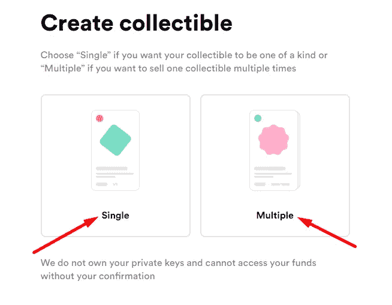

# NFT 交易:如何购买、出售和创造不可替代的代币

> 原文：<https://medium.com/coinmonks/nft-trading-how-to-buy-sell-and-create-non-fungible-tokens-84fdfe5e1ab9?source=collection_archive---------4----------------------->

NFT

NFT 最近(2021 年 2 月)在加密领域掀起了波澜。

例子有 [CryptoPunk #6965](https://tokenpost.com/CryptoPunk-No-6965-Sold-For-800-ETH-6712) ，一个几乎免费得到的 NFT 以 800 ETH *(即超过 150 万美元)*， [CrossRoad #1/1](https://twitter.com/niftygateway/status/1364745727889530883) 以 660 万美元售出，以及许多其他的…

这种受欢迎程度可以归因于它越来越多地被个人和组织采用。

我猜你已经在想如何得到这些代币或者创造一个代币。这是这篇文章的主要原因。

我会牵着你的手，带你一步一步地去做，甚至更多。

让我们开始吧。

# 发布大纲

以下小标题将引导本主题的进程:

*   [什么是 NFT，为什么它们很重要？](#9e49)
*   [如何购买 NFT 的步骤](#3007)
*   [如何出售我的不可替换代币？](#a00e)
*   [购买 NFT 时应采取的预防措施](#40c1)
*   [常见问题解答](#7f51)
*   [结论](#bc58)

为了便于导航，我在其中包含了每个副标题细节的链接。所以你只需要点击它，细节就会显示出来。

让我们在下一个小标题见面，开始我们的讨论。

# 什么是 NFT，为什么它们很重要？

不可替换令牌(NFT)是代表唯一的不可互换项目的数字资产。

你可以把它们比作超市发行的忠诚卡。

*例如，您不能使用 Globus 超市的积分卡在 Spar Super Stores 购物。*

NFT 对 cryptonites 变得很重要，因为它改变了游戏和收藏品行业。

利用区块链技术，游戏玩家现在可以拥有游戏物品和其他资产，艺术家现在可以向世界各地的买家出售他们的作品。

NFT 的一些例子包括 Cryptokitties、分散地、沙箱、CryptoPunks、Watafan 等。

我不会深入探讨 NFTs，因为在这篇[帖子](https://www.nigeriabitcoincommunity.com/non-fungible-tokens/)中，这个话题已经得到了公正的对待。

现在让我们继续来看看如何购买 NFTs。

# 如何购买不可替代代币(NFT)的步骤

要购买 NFTs，您需要一个 ERC-20 令牌支持的钱包和一些资金。

可以购买 NFT 的平台包括 OpenSea、金恩、Brave 和 Rarible。

购买 NFT 的步骤如下:

# 第一步

前往 NFT 市场，如 [Rarible](https://rarible.com/) ，点击“连接”连接您的钱包。

为此，我将与[元蒙版](https://www.nigeriabitcoincommunity.com/metamask-review/)合作。所以，我会点击它来连接。

# 第二步

连接钱包后，探索您想要购买的特定 NFT 的平台。

例如，如果我想通过 MF 购买“命运”，我会直接点击它。然后点击“立即购买”按钮。

*这是如果你想立即购买 NFT。如果您没有立即购买，您可以点击“出价”来设置您想要购买的价格，然后点击“出价”。*

# 第三步

弹出一个结帐页面。交叉检查交易的详细信息，然后单击“继续付款”。

# 第四步

您将看到一个弹出窗口，要求您从您的钱包中确认交易。如果你有足够的资金支付，就去确认交易吧。

一旦您的付款被确认，NFT 将被发送到您的以太坊地址。

***注:***

*   ***我会劝你不要在高峰期买 NFT。这样，你就不会像上面的*** 那样支付很高的油费。
*   ***我上面解释的购买 NFT 的过程适用于你想买的任何类型的 NFT***

这里你有如何购买 NFT。很简单，对吧？

但是我有办法创建自己的 NFT 吗？

是的，当然！

让我们进入下一个小标题，看看你如何做到这一点。

# 如何创建自己的 NFT

如果你是那些想要创造自己的 NFT 的人之一，我会一步一步地告诉你如何去做。

首先，你可以查看任何铸造平台，如 Rarible，OpenSea 等。

大多数平台不需要权限就可以使用，而其他一些平台(如 Async Art，SuperRare)需要权限。

现在让我们看看在 Rarible 上创建 NFTs 的步骤。

# 第一步

转到[rarible.com](https://rarible.com/)，点击“创建”。

# 第二步

它打开了这个盒子。选择您的 NFT 规格—单个或多个。

假设我选择创建一个单独的 NFT。

# 第三步

上传您的 NFT 图像，并选择您想要的功能。完成后，点击“创建项目”。

# 第四步

此时，您必须连接您的钱包。因此，请从列表中选择您的钱包进行连接。

连接钱包后，按照屏幕指示完成 NFT 的设置。

注意:再次提醒，当油价仍然很高的时候，千万不要铸造你的 NFT。你可以等汽油费降下来，或者提高 NFT 的价格来弥补汽油费。

这几个步骤就是你如何创建自己的 NFT。

现在你已经创造了一个 NFT。你肯定在考虑如何卖掉它。

我将在下一个副标题中告诉你如何做到这一点。

# 我如何出售我的不可替换令牌(NFT)？

像 OpenSea 和 Rarible 这样的 NFT 平台允许你把来自整个 NFT 空间的 NFT 放到它的平台上销售。

要出售你的 NFT，你首先要把你的以太坊钱包连接到你选择的平台上。

之后，点击你要出售的 NFT，会出现“出售”提示。然后点击它，签署交易完成。

*瞧！你的 NFT 卖了。*

接下来，我将指出您在购买 NFT 时需要注意的事项。

让我们马上开始吧。

# 购买不可替代代币(NFT)时要采取的预防措施

在购买 NFT 的过程中，我会提供一些你在购买时需要记住的技巧。

内容如下:

# 1.卷

注意数量:*多久买一次？*

如果它总是有需求，这是一个好现象。这样，人们会一直保留，直到它最终变得稀缺。

然后，NFT 的价值会增加。

# 2.活跃社区

它的社区有很多人吗？有新人加入这个项目吗？

大型社区是成长的标志。

# 3.资金充足的项目

这个项目有足够的资金支持吗？

即使是一个好项目，如果没有足够的资金，这个项目也会夭折。

# 4.谈判

在 NFT 交易中，你可以和卖家谈判买入价格。

这与 cryptos 不同，在 cryptos 中你只能按标价购买。

永远和卖家协商，永远不要按标价购买；这将为你节省一些硬币。

# 5.恐慌性买入/卖出

避免这个！

是的，我知道……这一直是“说得比做得好”的部分。

尽管如此，始终跟踪销售历史，了解交易者何时最有可能停止买卖。

# 6.黄金交易法则

这是投资任何事物的指导原则。

不要花费超过你能承受的损失。

冒险是好事，但这种风险不应该让你陷入困境。

# 7.不要被炒作所迷惑

许多 NFTs 预售都有一个炒作阶段，一旦预售结束，紧接着就是几个月的沉寂。

一个好的项目预售有成百上千的投资者，大量的资金投入，以及一个活跃的开发团队，他们优先考虑市场活动。

# 8.监控交易渠道

热门项目通常在社交媒体上有一个 ***【交易频道】*** 。

这是用户交流和谈论不同事情的地方，如促销或如何赚取免费硬币、购买/出售等。

每天阅读这个频道会让你对机会所在有更多的了解。

# 9.谨防骗局

在项目社区中，骗子比比皆是。

你可能会得到一个有着不可抗拒优惠的 DM。

***不要跳上去！***

请务必联系社区，以确认发件人的真实性。

不要成为骗子的牺牲品。

# 10.自己做研究(DYOR)

我必须说 NFT 确实是高风险投资。

我这么说是因为如果 NFT 的流动性枯竭，NFT 将会和你绑在一起；没人会愿意买。

花时间去了解市场。此外，也要和项目社区的人交谈。

这些是在处理非功能性思维时需要牢记的事情。

接下来，让我们看看一些常见问题。

# 关于 NFTs 交易的常见问题

**哪里可以存放我的 NFT？**

NFT 可以存储在兼容的数字资产钱包中。就像硬币一样，它们可以从一个地址转移到另一个地址，而且大多数时候，转移费用是以 ETH 支付的。
这是因为大多数 NFT 不能用作气体。
NFT 钱包的例子有:
[–my ether Wallet](https://www.nigeriabitcoincommunity.com/myetherwallet-guide-add-custom-token/) –[信托钱包](https://trustwallet.com/collectibles-wallet/)
–[总账钱包](https://www.nigeriabitcoincommunity.com/ledger-wallets/)等

**我可以进行内部交易吗？**

当我说内部交易时，我指的是在比如说 Rarible 平台上创建一个 NFT，然后在 OpenSea 平台上卖掉它。
是的……可以这么做。事实上，Rarible 和 OpenSea 有这样的合作。因此，无论你在 OpenSea 上创造了什么收藏品，你都可以在那里出售，或者转移到 Rarible 上出售。

# 结论

今天的话题到此结束。

通过它，我向你展示了如何购买、铸造和销售你的 NFT。

我也进一步回答了一些关于这个话题的常见问题。

那么，让我们听听你的意见。

你以前买过 NFT 吗？怎么样了？

你更喜欢用哪一款钱包来收纳物品？

如果你还没有，让我告诉你你喜欢的类型(游戏、艺术等)。

或者直接告诉我你对 NFTs 的看法。也欢迎你的提问。

正如我已经发布了这些信息，请尽你的一份力量，分享给其他人阅读。

分享按钮就在下面。

看过这些了吗？

*   [DeFi 解释道:分散财务是如何运作的？](https://www.nigeriabitcoincommunity.com/defi-review/)
*   [戴 Stablecoin 分析:马可道如何保持其稳定性？](https://www.nigeriabitcoincommunity.com/dai-review/)
*   [CBN 加密禁令:如何在尼日利亚进行加密交易](https://www.nigeriabitcoincommunity.com/cbn-crypto-ban/)

> 加入 Coinmonks [电报频道](https://t.me/coincodecap)和 [Youtube 频道](https://www.youtube.com/c/coinmonks/videos)了解加密交易和投资

# 另外，阅读

*   [Capital.com 评论](https://coincodecap.com/capital-com-review) | [香港的加密借贷平台](https://coincodecap.com/crypto-lending-hong-kong)
*   [如何在 Uniswap 上交换加密？](https://coincodecap.com/swap-crypto-on-uniswap) | [A-Ads 审查](https://coincodecap.com/a-ads-review)
*   [WazirX vs CoinDCX vs bit bns](/coinmonks/wazirx-vs-coindcx-vs-bitbns-149f4f19a2f1)|[block fi vs coin loan vs Nexo](/coinmonks/blockfi-vs-coinloan-vs-nexo-cb624635230d)
*   [本地比特币评论](/coinmonks/localbitcoins-review-6cc001c6ed56) | [加密货币储蓄账户](https://coincodecap.com/cryptocurrency-savings-accounts)
*   什么是融资融券交易
*   [支持卡审核](https://coincodecap.com/uphold-card-review) | [信任钱包 vs 元掩码](https://coincodecap.com/trust-wallet-vs-metamask)
*   [Exness 评测](https://coincodecap.com/exness-review)|[moon xbt Vs bit get Vs Bingbon](https://coincodecap.com/bingbon-vs-bitget-vs-moonxbt)