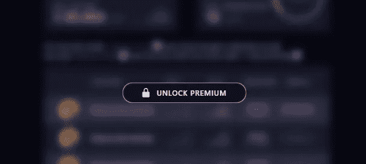
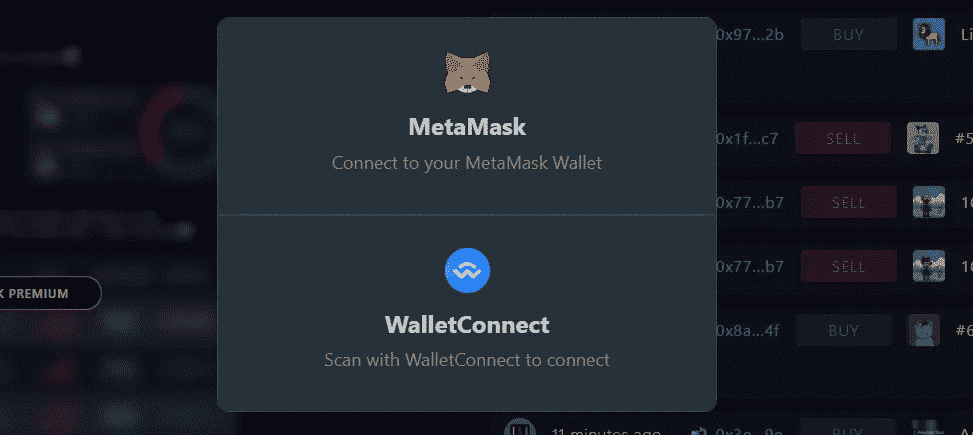

# NFT 用例:付费墙后的优质内容

> 原文：<https://medium.com/coinmonks/nft-use-case-premium-only-content-behind-a-paywall-d1b87e608a38?source=collection_archive---------7----------------------->

或者很多人认为，非功能性测试的世界是奇异而令人困惑的。这一次，人们往往不理解什么是可能的用例，只看到令人厌恶的高价 jpg。在这篇文章中，我想展示我们如何使用我们的 NFT 代币在 nftscoring.com[的付费墙后面实现仅付费内容。](http://nftscoring.com)

> 我最近写了一篇关于我们如何创建 NFT 合同的故事，你可以在这里[阅读。](/@mar.votru/how-we-wrote-an-nft-contract-in-one-week-fd822159d4cf)

# 它是如何工作的

传统上，当创建一个付费墙，我们需要用户创建一个帐户。然后，用户将需要提供一种支付方法，一旦支付了额外的内容将显示给他。对于 NFT，我们可以采取不同的方法。访问优质内容的授权可以委托给特定令牌的所有权。登录是通过以太坊钱包完成的。如果用户使用保存我们 NFT 的地址登录，我们将向他展示优质内容。否则，我们将向他展示一个重新制作的选项。

Content locked behind a paywall

## 优势

与传统方法相比，NFT 方法有几个优点。这一次，有了 NFT，用户不需要创建帐户，他可以对我们保持匿名。因为他的标识符将被用作他的以太坊地址。因此，我们不必处理用户认证。此外，当我们将授权委托给 NFT 时，我们也不需要存储授权地址。我们根本不需要在数据库中存储任何东西！

从用户的角度来看，NFT 技术也提供了优势。如果他决定不再使用该服务，他可以很容易地在二级市场上出售他的令牌。

# 履行

考虑到以太坊生态系统是多么的新，已经有相当多的解决方案可以用于 web3 集成。我们的前端是用 React 编写的，所以我们很乐意使用广泛采用的[web 3 mode](https://github.com/Web3Modal/web3modal)库。这个库使得将用户的以太坊钱包与网站连接起来变得超级容易。顾名思义，它向用户显示一个模态叠加图，提示用户选择他喜欢的连接钱包的方法。

一旦用户连接了他的钱包，我们使用 [web3.js](https://web3js.readthedocs.io/en/v1.5.2/) 库来验证钱包中是否有任何 [Nft 评分](http://nftscoring.com)令牌。这是通过与契约交互完成的——调用方法的*balance。使用 web3.js 库，这就像编写两行代码一样简单:*

如果连接的钱包的余额为正，则高级内容被解锁。

# 外卖食品

我希望我成功地展示了 NFT 的一些实际用途。不是在某个遥远的未来，也不是在某个平行的元宇宙，而是现在就在万维网上。还有更多。

我会发表更多文章，从程序员的角度介绍 web3 世界。如果你感兴趣，别忘了关注！🚀

> 加入 Coinmonks [电报频道](https://t.me/coincodecap)和 [Youtube 频道](https://www.youtube.com/c/coinmonks/videos)了解加密交易和投资

## 也阅读

 [## 获取信号、交易机器人和套利

### 在本文中，我们将回顾 Bitsgap，这是一个满足您所有交易需求的一站式加密交易平台。它…

blog.coincodecap.com](https://blog.coincodecap.com/bitsgap-review) 

【https://blog.coincodecap.com/best-social-trading-platforms 

 [## BlockFi 评论 2021:利弊和利率| CoinCodeCap

### 今天，我们提出了一个全面的 BlockFi 评论，这是一个成立于 2017 年的加密贷款平台，拥有其…

blog.coincodecap.com](https://blog.coincodecap.com/blockfi-review)  [## 如何在印度购买比特币？2021 年购买比特币的 7 款最佳应用[手机版]

### 如何使用移动应用程序购买比特币印度

medium.com](/coinmonks/buy-bitcoin-in-india-feb50ddfef94)  [## 加密税务软件——五大最佳比特币税务计算器[2021]

### 不管你是刚接触加密还是已经在这个领域呆了一段时间，你都需要交税。

medium.com](/coinmonks/best-crypto-tax-tool-for-my-money-72d4b430816b)  [## 存储比特币的最佳加密硬件钱包[2021] | CoinCodeCap

### 保管您的数字资产很容易，但找到正确的存储方式却是一项繁琐的任务。在线钱包有一个风险…

blog.coincodecap.com](https://blog.coincodecap.com/best-hardware-wallet-bitcoin)  [## Pionex 评论 2021 |免费加密交易机器人和交换

### Pionex 是为交易自动化提供工具的后起之秀。Pionex 上提供了 9 个加密交易机器人…

medium.com](/coinmonks/pionex-review-exchange-with-crypto-trading-bot-1e459d0191ea)