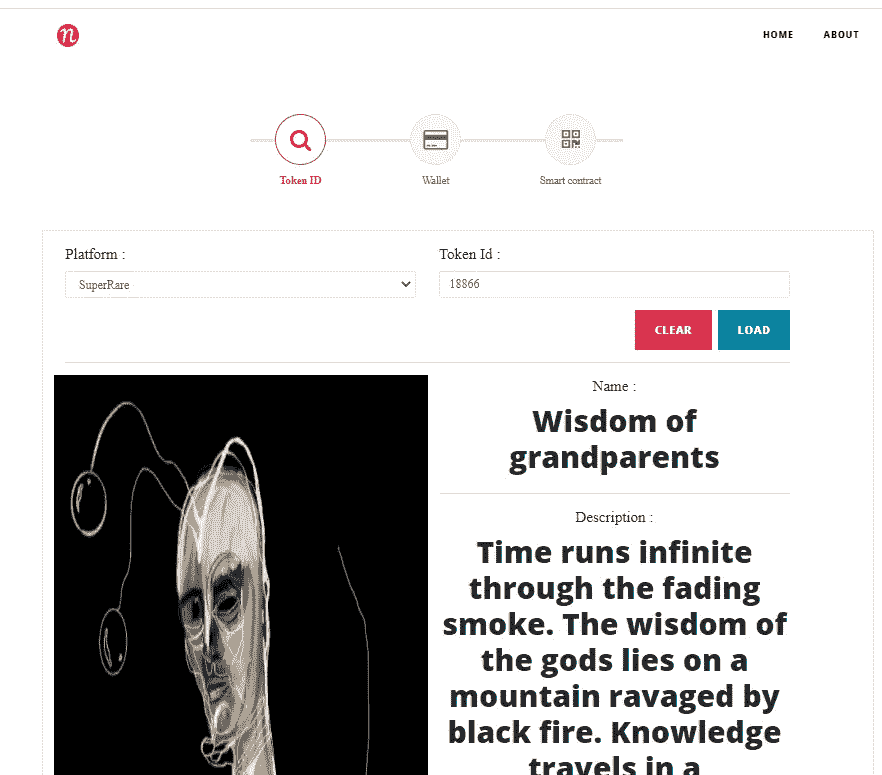

# NFT 浏览器是一个简单和功能丰富的 NFT 工具(更新)

> 原文：<https://medium.com/coinmonks/nft-viewer-is-a-simple-and-feature-packed-nft-tools-9095d2daf747?source=collection_archive---------5----------------------->

## 找到你的秘密艺术

[NFTViewer](https://www.nftviewer.xyz/) 提供多种查找 NFT 的方式——令牌 ID、钱包、连接钱包和智能合约。用户不必去平台查看密码艺术。

网址:【https://www.nftviewer.xyz/ T3

[2021/10 更新—新功能]:

1.  平台添加 Refinable721、NIDOT、Pancake Bunnies、LOOTPUNK、GPUNKS、YOOSHINFT、LOBS、BLOOTVC 和 SVS 项目
2.  添加建议功能！欢迎提交任何请求，我们将对其进行审核
3.  添加连接功能。通过连接到您的钱包，您可以查看自己的 NFT
4.  添加空投功能。它将列出所有 NFT 项目。

[更新—新功能]:

1.  添加平台—您请求添加平台。我们将查看这一点，并将其添加到平台列表中。
2.  艺术家——艺术家可以在我们的平台上注册并分享艺术家的作品链接。

# 令牌 ID

它已经支持一些 crytp 艺术平台，包括 Makersplace、crytp 朋克、SuperRare、KnownOrigin 和 Rarible。

您只需输入令牌 ID 即可找到 NFT。

## 稀有的

如何从 Rarible 中找到 token ID？

令牌 ID 在稀有 URL 中

[https://rari ble . com/token/0x d 07 DC 4262 BCD BF 85190 c 01 c 996 B4 c 06 a 461d 2430:**453415**:0x 59 B7 fa 6761798125699040367 CD 74d 494 a 77 eedd？tab =投标](https://rarible.com/token/0xd07dc4262bcdbf85190c01c996b4c06a461d2430:453415:0x59b7fa6761798125699040367cd74d494a77eedd?tab=bids)

## 密码朋克

## 超级罕见

## KnownOrigin

KnownOrigin 很特别。令牌 ID 必须加 1。

例如，这个二十年的令牌 Id 是 275901。

# 钱包

输入您的钱包地址，然后点击加载按钮

# 智能合同

您可以从 [*以太网扫描*](https://etherscan.io/token/0x837779ed98209c38b9bf77804a4f0105b9eb2e02?a=0x99b57c09f37a3657e2215afd59f7b4de98bce3ff#readContract) 中找到智能合约地址和令牌 ID

# 在路线图上

*   支持 BSC
*   支持流程
*   展示受欢迎的艺术家/NFT

# Gitcoin

查看 Gitcoin grant 的详细信息！—[https://gitcoin.co/grants/2497/nft-viewer](https://gitcoin.co/grants/2497/nft-viewer)

