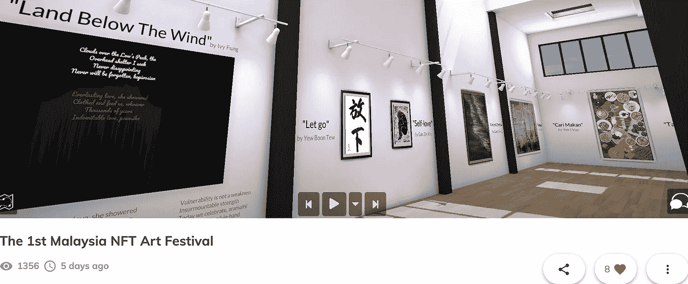

# NFT WTF(第二部分):觉醒

> 原文：<https://medium.com/coinmonks/nft-wtf-part-2-the-awakening-e6334069598c?source=collection_archive---------5----------------------->

## 马来西亚第一届 NFT 虚拟艺术节

Visit the gallery: [https://tinyurl.com/MalaysiaVirtualArt](https://tinyurl.com/MalaysiaVirtualArt)

5 月 22 日似乎是个吉祥的日子。今天是比特币披萨日，也是在这一天，我被介绍给一个团队，他们计划开展一个企业社会责任项目，向马来西亚艺术家介绍不可替代代币(NFT)，同时为新冠肺炎赈灾筹集资金。

> “觉醒发生在内心”—匿名。

我是正确的游戏方式。有什么比在你的家乡发起一场你相信的运动更好的呢，对吗？多年来，我一直在和一些艺术家朋友谈论使用区块链来提升他们的游戏。它还没有被广泛接受。最近，我正计划开设短期课程，以接触更广泛的受众，这个项目找到了我。宇宙一定听到了我的呼喊。

我们开始计划，并在俱乐部房间和 Zoom 电话中推销我们的想法，并让艺术家加入我们。我们只有一个月的时间来完成这件事。因此，第 3 和第 4 周是关于确认艺术家的参与，建立虚拟画廊，安排虚拟派对的启动，邀请演讲嘉宾，并为这次活动做好心理准备，以及它可能带来的未来。

这个项目是关于什么的？这是第一个马来西亚 NFT 艺术节，以马来西亚虚拟艺术的名义组织，这是一个独立的艺术和技术运动。虽然马来西亚有一些活跃的 NFT 社区，主要由数字艺术家领导，但这个项目的重点是邀请仍然在传统媒体上的马来西亚艺术家，首先拥抱新技术，然后是 NFTs 的概念。

在 Edotco 和 Axiata 青年才俊计划的赞助下，该项目成功推出了一系列活动，包括在任何给定时间都有超过 50 名观众在线的 3 小时虚拟派对，以 13 名艺术家为特色的虚拟展览，针对所有参与艺术家的关于 NFTs 的培训课程，并扩展到任何感兴趣的团体，以及为艺术家打开通往 NFT 平台的大门。*(本文发表时，整个事件还没有结束。)*

这个项目的主题是“连接”。互联网将远近的许多人联系在一起，尤其是在这个艰难的时刻，聚集在同一个空间是不明智的。然而，与人类的联系，与共同兴趣的联系，与我们内在自我的联系，并不是单靠互联网就能实现的。艺术是缩小差距的小魔法。这个项目想要提醒观众的是*社交的重要性*。

我们人类没有能力一直独处。我们总是渴望与另一个人、另一个生物或一个物体建立联系。联系一旦建立，就永远不会消失。尽管他们可能已经离开我们或离开人世，但这种联系感依然存在。NFT 不就是这样吗？联系！你是 NFT 艺术的创造者，这种联系将永远存在，写在历史中，即使你不再拥有那幅 NFT。

未来，该来的时候到了。我们在这里播下一颗种子，一颗相信 NFTs 将改变他们艺术之旅某些方面的更大艺术社区的种子。

> "预测未来的最好方法是创造未来."——亚伯拉罕·林肯。

Satoshi Namakoto 预测了他/她/他们想要的未来，创造了比特币。我预测 NFTs 的应用是现在仍然在水下的冰山，因此，我加入了这个运动。

NFT 艺术是使用 NFTs 的许多方式之一。令人兴奋的发展就在那里，并且将会被介绍给世界，大多数时候，比我们预期的要快。

今天，我不会开始谈论非功能性艺术在 NFT 艺术范围之外是如何使用的，那是改天的话题。本文献给首届 NFT 虚拟艺术节。如果你相信我们的运动，请访问[虚拟画廊](https://tinyurl.com/MalaysiaVirtualArt)向我们展示你的支持。如果你不相信，还是去虚拟画廊看看吧！

特别感谢 Ivan Ling 博士向我介绍了这个项目，并在后台做了一个幽灵；黄衍蒙一直在坚守阵地；林宽是这个项目的法律顾问。

> 加入 [Coinmonks 电报频道](https://t.me/coincodecap)，了解加密交易和投资

## 另外，阅读

*   [尤霍德勒 vs 科恩洛 vs 霍德诺特](/coinmonks/youhodler-vs-coinloan-vs-hodlnaut-b1050acde55a) | [Cryptohopper vs 哈斯博特](https://blog.coincodecap.com/cryptohopper-vs-haasbot)
*   [币安 vs 北海巨妖](https://blog.coincodecap.com/binance-vs-kraken) | [美元成本平均交易机器人](https://blog.coincodecap.com/pionex-dca-bot)
*   [如何在印度购买比特币？](/coinmonks/buy-bitcoin-in-india-feb50ddfef94) | [WazirX 评论](/coinmonks/wazirx-review-5c811b074f5b) | [BitMEX 评论](https://blog.coincodecap.com/bitmex-review)
*   [加密复制交易平台](/coinmonks/top-10-crypto-copy-trading-platforms-for-beginners-d0c37c7d698c) | [五大 BlockFi 替代品](https://blog.coincodecap.com/blockfi-alternatives)
*   【Crypto.com 评论】|[|](/coinmonks/crypto-com-review-f143dca1f74c)|[信用交易](/coinmonks/huobi-margin-trading-b3b06cdc1519)
*   [顶级付费加密货币和区块链课程](https://blog.coincodecap.com/blockchain-courses) | [币安评论](/coinmonks/binance-review-ee10d3bf3b6e)
*   [在美国如何使用 BitMEX？](https://blog.coincodecap.com/use-bitmex-in-usa) | [BitMEX 回顾](https://blog.coincodecap.com/bitmex-review) | [币安 vs Bittrex](https://blog.coincodecap.com/binance-vs-bittrex)
*   [最佳免费加密信号](https://blog.coincodecap.com/free-crypto-signals) | [YoBit 评论](/coinmonks/yobit-review-175464162c62) | [Bitbns 评论](/coinmonks/bitbns-review-38256a07e161) | [OKEx 评论](/coinmonks/okex-review-6b369304110f)
*   [比特币基地赌注](https://blog.coincodecap.com/coinbase-staking) | [热点评论](/coinmonks/hotbit-review-cd5bec41dafb) | [库币评论](https://blog.coincodecap.com/kucoin-review) | [期货交易机器人](/coinmonks/futures-trading-bots-5a282ccee3f5)
*   [最佳加密交易信号电报](/coinmonks/best-crypto-signals-telegram-5785cdbc4b2b) | [MoonXBT 评论](/coinmonks/moonxbt-review-6e4ab26d037)