# NFTs 101 —为什么 NFTs 是一代创新

> 原文：<https://medium.com/coinmonks/nfts-101-why-nfts-are-a-generational-innovation-4626ae803e3b?source=collection_archive---------0----------------------->

在过去的三周里，我在 NFTs 上花了超过 60 万美元(更新:现在超过 100 万美元，因为在写这篇文章的过程中，我说服自己花了[40 万美元在一个密码朋克](https://www.larvalabs.com/cryptopunks/details/9242)上)。我完全计划花更多的钱，我和我的妻子都辞掉了工作，全力以赴为 NFT 生态系统开发工具和资源。

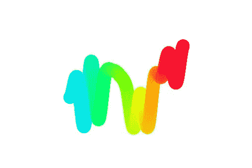

This. I bought [this for $33,000](https://opensea.io/assets/0x059edd72cd353df5106d2b9cc5ab83a52287ac3a/5612). A few days later, it’s [now worth over $48,000](https://opensea.io/collection/art-blocks?collectionSlug=art-blocks&search[sortAscending]=true&search[sortBy]=PRICE&search[stringTraits][0][name]=Chromie%20Squiggle&search[stringTraits][0][values][0]=All%20Chromie%20Squiggles&search[toggles][0]=BUY_NOW). I am insane, the world is insane, and over the course of the next 110 minutes, I will make you insane, too.

为什么？在过去一个月和变化的过程中，我越来越相信 NFT 是我们这一代人的基础技术革命之一——一旦我自己开始购买 NFT，这种抽象的信念就变成了本能的确定性。

我不会过于频繁地炒作或全力以赴。我上一次认真地在 Medium 上写帖子是在 2017 年，有一篇名为[加密货币 101](/@intenex/cryptocurrency-101-7197684775fd) 的文章从根本上深入解释了加密货币是什么，为什么你应该进入它，以及我个人如何通过投资比特币和以太坊的 1 万美元赚了 40 万美元。这篇文章出人意料地在《脸书邮报》上疯传，成为媒体上阅读量最大的文章。

> **今天生成一个 NFT 集合，使用** [**这个简单的工具**](https://coincodecap.com/go/the-nft-generator) **。**

我从加密货币投资中获得的收入现在超过了 700 万美元，我现在比以往任何时候都更确定，在未来 5 到 10 年内，它们将继续增长，至少增长 10 到 20 倍左右(当然，在此期间会有大约 100 万个关于多年熊市的警告和许多其他陷阱。在你彻底阅读完 [Crypto 101](/@intenex/cryptocurrency-101-7197684775fd) 和/或以其他方式进行研究并完全理解你即将涉足的领域之前，不要投资。

我现在确信，非金融交易的回报甚至可以远远高于加密货币，而且这些回报远远不是毫无根据的，也不是植根于纯粹的大傻瓜理论炒作和泡沫时尚，事实上对于少数精选投资来说是非常合理的。

我将在下面以长篇阐述的形式解释我的推理，因为我发现，就像 Crypto 101 一样，这是一项如此新的技术，范式正在转变，并且容易立即产生怀疑和欺骗感官的下意识反应，仅仅在 5 分钟的总结中解释事实完全不足以向尚未相信的人真正描绘出一幅前景广阔的全景图。

也就是说，我知道不是每个人都像我一样是一个失业的堕落者，有世界上所有的时间来研究 NFTs，所以**我划分了这篇文章的主要部分，这样你就可以跳过你不感兴趣的部分**，或者停止阅读任何部分，一旦你明白了重点，就继续前进，并且不想再听我花 7 个多小时对已经死去的马进行激烈的抨击。

**第一部分**讲述了我自己对艺术和所有其他无形商品的感受，以此来让你相信我真的是世界上最不可能在非物质文化遗产上被出卖的人。

**第 2 部分**涵盖了非功能性测试背后的技术和概念基础，以及为什么它们有价值，并解决了人们对非功能性测试的主要批评。

第三部分将讨论 NFT 如何让一切变得更好，并比以往任何时候都更好地激励创作者和收藏者。

**第 4 部分**是关于如何开始与 NFT 互动的实用教程，从购买加密货币、设置钱包开始，以及关于考虑购买哪些 NFT 以及在哪里购买和为什么购买的非金融建议。这一节还介绍了如何开始创建和销售 NFT 的另一面。

好吧，我们开始吧。这太棒了。

> ***加入*** [***币僧电报***](http://t.me/coincodecap) ***，了解更多关于密码的知识。***

# 第 1 部分:艺术从根本上是没有价值的，阿米利特？

NFT 艺术市场(不包括个人资料图片项目)现在有点平静，所以我一直在以接近犯罪的价格抢购真正令人震惊的艺术家的作品，我完全打算这样做，直到世界最终意识到 NFT 艺术，我被市场定价淘汰。

如果你是一个通情达理的人，在过去一年多的时间里没有坚定地陷入非金融交易，你可能会认为非金融交易充其量是一种泡沫时尚，在最坏的情况下是一个真正巨大的彻头彻尾的骗局。几周前，我会同意你的观点。

[I bought this for $2,000](https://opensea.io/assets/0x1cb1a5e65610aeff2551a50f76a87a7d3fb649c6/815), and now it’s [worth at least $46,000 a few weeks later](https://opensea.io/collection/cryptoadz-by-gremplin?search[sortAscending]=true&search[sortBy]=PRICE&search[toggles][0]=BUY_NOW). Like, I could buy a Tesla for the price of this pixelated toad, but I won’t, because I value this toad more than I value a Tesla, and so should you, for reasons that may or may not remain unclear to both of us

事实上，我几乎是最后一个可能成为 NFT 艺术收藏家的人——直到几周前，我甚至完全不理解艺术的概念。

在我的一生中，我一直是一个坚定的科学、理性、技术和逻辑型的人——我的生活完全缺乏对艺术和人文的任何欣赏， 所有这些看起来本质上都是无用的努力，丝毫没有推动人类的进步，不像有形的科学发现和技术发明给了我们冰箱来保存我们的食物，微波炉来加热食物，神奇的以太互联网光束穿过天空，每秒传输数百万字节的数据，这样我就可以写这篇文章，并将其上传到互联网上，供世界上无数的人在几毫秒内免费访问和阅读。

我认为，这是真正的价值创造的地方，也是真正价值的唯一堡垒。如果某样东西没有以某种切实有意义的方式改善我们的生活质量，那只是人类的集体炒作，由人类最愚蠢的事情所驱动——我们为一件艺术作品估价数百万，只是因为其他人都为它估价数百万，而另一件艺术作品在被“发现”并被誉为耶稣的第二次降临之前被忽视了几十年，突然之间，一位艺术家似乎可以在一夜之间从一个无名之辈变成自切片面包以来最伟大的人物。

事实上，梵高在有生之年最多只卖出了几幅画，活着的时候被诋毁为疯子和失败者，死后却成为有史以来最广为人知、最受称赞和商业上最成功的画家之一，这在我看来是疯狂的，这清楚地证明了艺术的主观估价没有真正的韵律或理由，本质上只是夸大其词的胡说八道。微波炉、冰箱、集成电路和晶体管——这些东西的价值不言而喻，不容否认。另一方面，艺术完全是人类主观随意多变的实践。

甚至不要让我开始谈论“现代”和“抽象”艺术——至少旧大师们必须有显而易见的技巧来制作他们错综复杂但本质上仍然毫无价值的杰作。现在，金属气球狗和巨大的圆点南瓜才是真正赚钱的地方。技术能力的饱和以及艺术市场无力支持每一位技术精湛的艺术家，显然导致了这个行业的崩溃，与现实脱节，价值与技术价值完全分离。现在，这个市场纯粹被文化投机和狂热所驱动，完全没有内在价值的基础。

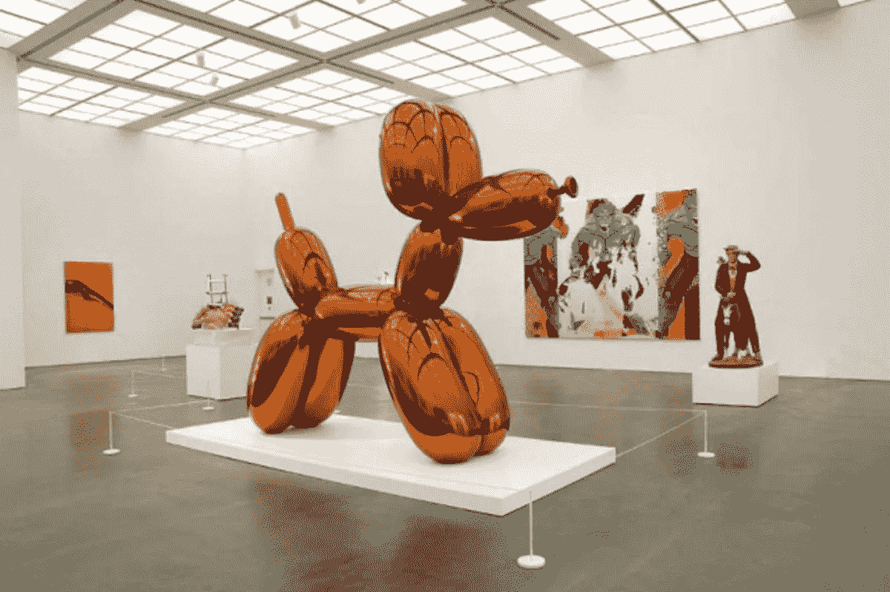

I thought for a while and I actually don’t have a caption for this. It is [worth $58.4 million](https://qz.com/146939/one-of-jeff-koons-balloon-dogs-just-fetched-a-record-price-but-who-owns-the-rest-of-the-litter/), though.

当然，这尤其适用于非功能性测试，或者我是这样认为的。哇——现在我们要付钱给那些几十年来制作半吊子日常艺术的数字艺术家，而他们却一直挣着几分钱，却挣着几亿美元？看到一个人在几个月内从舍入误差为零到百万分之一，显然是某种集体狂热的症状，在根本价值上不可能有合理的基础。

因此，带着这些不屑一顾的想法，当去年底和今年年初 NFT 艺术品市场开始出现问题时，我立刻忽略了这个市场。谢天谢地，我并不完全反对 NFTs，事实上，我从 2017 年就开始收集了，当时我在区块链经营一家公司，致力于更好地奖励内容创作者。

## 好吧，艺术是愚蠢的，但游戏中的数字资产有点意义

我从小玩各种各样的游戏，数字的和物理的，就像一个真正的堕落者，在这里，至少，我可以看到模拟物理世界的数字的真正价值。以万智牌或口袋妖怪交易卡对炉石为例。

在前一种情况下，使用实体牌，牌具有有形的价值，这种价值通过其固有的稀缺性来体现。某些卡片对赢得游戏非常有价值，因此在二级市场上有溢价，用户可以在彼此之间自由交易卡片，为卡片创造有效的经济。所有这一切对我来说都是有意义的，因为我玩过这些游戏，亲身体会到拥有游戏中最好的牌是多么令人向往，以及击败你的敌人并听到他们的弱者在你面前被驱赶时的哀叹是多么值得。

因此，我可以理解，在像炉石这样的数字交易卡牌游戏中，用户会为卡牌支付数亿美元，但绝对得不到任何有形价值的回报，这是多么不公平。由于游戏炉石拥有其专有和集中数据库中的所有资产，他们可以严格禁止任何用户购买的任何东西的任何交易，以便他们可以为自己实现利润最大化，并迫使所有人通过他们购买。

当你最终不可避免地厌倦了这个游戏并离开它的时候——你所付的钱基本上都被浪费了。有了实物交易纸牌游戏，一旦你放弃了你的爱好，你至少可以卖掉你所有的纸牌，在中性的情况下，甚至可以达到收支平衡，在最好的情况下，如果你一直都是一个精明的收藏家，你甚至可以获得丰厚的利润。

因此，当区块链的一款纸牌交易游戏《被解放的神》(Gods Unchained)出现时，我立刻就被吸引住了。有史以来第一次，NFTs 实现了可证明的数字稀缺性，没有人可以违反(稍后将详细介绍)，并且固有地将所有所有权和转让权交给了 NFTs 的所有者。一旦用户购买了数字卡，游戏背后的公司再也没有任何权利或权力来决定他们可以或不可以用他们的数字卡做什么——提供了一个完美的数字模拟现实，这个现实已经在实体交易卡中上演了数百年。

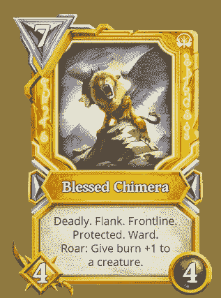

[One of the earlier NFTs I ever got](https://opensea.io/assets/0x0e3a2a1f2146d86a604adc220b4967a898d7fe07/9730278), for free in a Twitter promotion for Gods Unchained years back. [Some have sold for ~3.5 ETH, now worth $10,000+](https://opensea.io/assets/0x0e3a2a1f2146d86a604adc220b4967a898d7fe07/10345770). This card is exceptionally rare, with only 689 ever created, ironically precisely because it was only given away for free on Twitter to anyone who wanted one, which was just about no one at the time.

对我来说，这使得游戏中的数字资产的 NFT，如果没有别的，不言而喻是一场深刻的革命，并且在客观上明显比没有可证明稀缺的不可信的完全由用户拥有的 NFT 的游戏更好。

但是艺术呢？这仍然是一个不同的故事。游戏中的数字物品至少在游戏本身中有内在价值。另一方面，数字艺术受到常年右击争论的困扰。

## NFT 是没有价值的，因为你可以右键点击保存它们

当任何人都可以右键点击并保存某样东西，然后无成本地无限复制它时，这种东西还能有什么价值呢？谁在乎艺术家可能在他们的作品中倾注了多少心血、汗水和泪水，谁在乎它可能有多深刻，或者在技术上有多复杂和开创性——所有的数字艺术本质上都没有货币价值，因为没有办法将其封存起来，并通过其无限可复制的选择基底的固有性质迫使其稀缺，这与物理基底的自然稀缺形成鲜明对比。

这似乎不公平，但这就是生活的现实。数字艺术家在选择一个注定会过着饥饿和物质匮乏生活的职业之前，应该认识到这个现实。可耻的是，你们这些傻瓜。

也许我们可以承认，从表面上看，数字艺术家没有理由比“物理”艺术家更不像艺术家，数字艺术作品可以比物理艺术具有同样程度的技巧，如果不是更多的话。

Okay, fine, here’s a [‘real’ piece of art](https://foundation.app/@VINTAGEMOZART/a-tale-of-two-cities-62853) I bought for $2,400\. Certainly has **some* value and took *some* skill, right? An internet enabled serendipitous collaboration, incidentally, between an* [*incredible Zimbabwean artist*](https://foundation.app/@VINTAGEMOZART) *who would have been entirely gatekept from traditional art markets, and an* [*amazing Portuguese artist*](https://www.diogolando.com/) *halfway across the world.*

数字艺术还可以超越物理艺术的静态可能性，创造和发现全新的艺术形式，例如生成艺术，这是借助计算机算法甚至人工智能神经网络和其他在现实世界中完全不可能的技术创新制作的艺术。

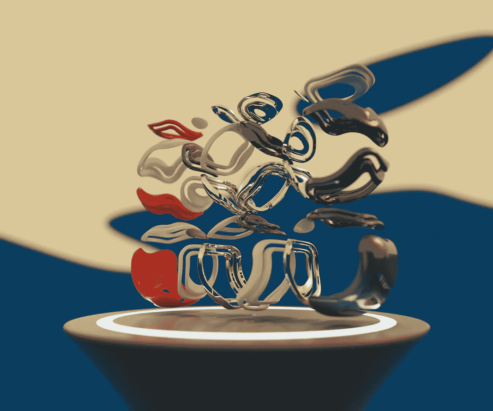

This, for instance, is a [generative piece of art I bought](https://opensea.io/assets/0xa7d8d9ef8d8ce8992df33d8b8cf4aebabd5bd270/173000848) made, along with [999 other incredibly different yet equally striking pieces](https://artblocks.io/project/173), by a single [piece of code just ~6KB in size](https://piterpasma.nl/skulptuur/). The artwork ‘lives’ in real time, by rendering in your browser from scratch every time you load it, evolving from a grainy outline to an incredibly photorealistic finish over the course of minutes or hours, depending on how powerful your computer is. This is not possible in the real world.

尽管数字技术使所有这些令人难以置信的新艺术形式成为可能，并且数字艺术家可能具有内在的艺术技巧，并且可能渗透到他们的作品中，可能与物理艺术家的作品相媲美，但迄今为止，所有这些作品的市场价值约为 0 美元，这是因为每个作品都可以被任何人通过简单的右键单击和保存而无限完美地免费复制。

几十年来，这种纯粹的资金匮乏扼杀了数字艺术的创新，然而一些数字艺术家仍然完全接受让他们的身体挨饿，并推动这一新兴的艺术创新前沿，日复一日地持续多年，完全没有回报的希望，直到……现在，当他们都变得非常富有时？

## 是啊，伟大的催人泪下的故事兄弟，但这仍然是一个骗局

好吧——也许这是一个失败者故事的一个令人感觉良好的温暖人心的结局，但这仍然是一个骗局，对吗？即使这个骗局正在打破由西方社会主导的传统艺术世界的大门，并允许来自世界各地的艺术家——非洲、亚洲、南美和其他地方——最终一下子让他们的艺术与西方同行的艺术在纯粹的价值上享有同等的价值， 即使这个骗局最终将财富分配给了才华横溢的数字艺术家，他们辛苦工作了几十年，只为在他们选择的创作领域创造纯粹的爱和快乐，但这仍然是一个骗局，只是从像我这样被卷入炒作、时尚和泡沫的傻瓜那里偷钱，对吗？

最终，这些艺术家可能最终能够摆脱贫困，他们中的一些人甚至可能最终变得非常富有，但正是愚蠢的过度膨胀的隐富者和无知的零售大众盲目地跟随泡沫的大屠杀，最终将在所有这些不可避免地像荷兰郁金香一样跌至零时付出代价，不是吗？

也许吧。也可能不是。我们肯定是在泡沫中，我会第一个告诉你这一点。大量的非功能性交易最终会被过度宣传，甚至归零——事实上，可能是其中的大部分。但这是否意味着非功能性技术不是一代人一次的变革性技术创新，不会长期存在，也不会从根本上改变未来数字经济的方方面面？绝对不行。

NFT 是真正的交易，就像互联网过去和现在都是真正的交易，尽管网络泡沫被过分夸大，许多人当时宣称互联网只是一个完整的时尚，会随着时间的推移而消失。时间已经证明，除此之外的任何事情最终都会发生，最终在今天，互联网远远不是一个短暂的趋势，互联网几乎渗透到我们日常生活的方方面面，我们大多数人都离不开它。

## 起初，人们对几乎所有的事情都持怀疑态度

所有新生的技术最初都会遭到极端的怀疑，不管它们现在对我们来说是多么明显的革命性。有一篇写于 1995 年的著名文章,讲述了互联网不会改变世界，不会取代报纸、书店和个人教育，以及“远程办公”是一个多么荒谬的概念，还有一百万件其他的事情最终都变成了现实，但在 1995 年，互联网才出现了几年(就像现在的 NFT 一样),对于除了最痴心妄想和/或最有先见之明的前沿先锋们来说，看起来几乎是不可能的，而且非常牵强。

然而，这远不是世界唯一怀疑的事情。我们也非常怀疑飞机、汽车、电脑、计算器、自行车以及几乎所有其他发明的东西。我最喜欢的时事通讯之一叫做[悲观主义者档案](https://pessimistsarchive.substack.com/)，它记录了最初遇到的每一项重大技术进步时令人惊叹的怀疑态度。

这里有一篇来自 [1987 年的精彩文章，讲述了转瞬即逝的计算机“时尚”](https://pessimistsarchive.substack.com/p/students-flee-field-as-computer-fad)，随着学生们对计算机未来前景的幻灭，这种时尚逐渐消退。现在想想真是疯狂——微软和苹果都成立于 70 年代中期，现在是世界上最大的两家公司。很难相信，即使在那时，人们仍然对计算的未来持怀疑态度，但显然他们是这样。

这里有一篇 1984 年的更疯狂的文章，诋毁计算器，声称计算尺同样有效和快捷，还有一个不可否认的优点，那就是你的计算尺永远不会耗尽电池电量。我希望我能找到报纸上谴责 17 世纪计算尺的文章，我敢肯定数学家们对年轻人用来逃避真正学习没有捷径的数学计算的“正确”方法的黑客们摇头晃脑。

这是苹果早期最受欢迎的 lambastations 汇编。显然，GUI 的出现和计算器一样令人惋惜——甚至有一项研究表明，当学生在命令行上使用 GUI 时，他们会变得更笨。真的，我不得不引用这句话，请原谅我:

> 特拉华大学英语系写作项目的副主任 Halio 说，在她的写作项目中，选择使用 Macintosh 电脑的新生比选择 IBM 个人电脑的学生写出的作文差得多。
> 
> 她的观察是基于她自己 1987 年的教学经验和 1988 年末学生在作曲课程的 25 个部分所做的工作的比较。结果显示，麦金塔用户平均写的句子和段落更短，拼写和标点错误明显更多，写作水平达到八年级水平，而不是 IBM 用户的大学水平。
> 
> 此外，麦金塔电脑的学生选择写的主题比 IBM 的主题更“轻松”——快餐、约会、电视 IBM 的主题包括少女怀孕和核战争。
> 
> 哈利欧说，这暗示着麦金塔面向图片的界面多少有些问题。同样的图标、鼠标、字体和图形使机器易于使用，却很可能关闭大脑的创造性写作能力。

所以——图形用户界面显然相当于 20 世纪 80 年代的今天的真人秀。回到命令行，每个人，以免你失去创造性思维的能力。可能已经太晚了。坦率地说，这可能解释了整个疯狂的非功能性思维时尚——我们的批判性思维能力已经被图形用户界面的出现不可挽回地损害了，以至于我们再也无法抗拒你花几十万美元购买愚蠢的猫迷因的诱人诱惑。

在莱特兄弟飞行的两个月前，纽约时报嘲笑了实现飞行的尝试，估计人类需要 100 万到 1000 万年才能真正成功。《纽约时报》——一百万年。

当汽车被发明的时候，一个“大脑专家”，不管那是什么意思，预测[的司机很快就会发疯](https://groundtruthautonomy.com/get-a-horse-what-early-reactions-to-bicycles-automobiles-and-airplanes-can-teach-us-about-self-driving-cars/)，并声称许多人确实已经疯了，因为你的大脑会因为开得太快而被压扁。(老实说，我真的可以看到自己在那个时候相信这些事情。很明显，让你的大脑经受前所未有的 80 英里的时速对你没有好处，对吗？一个毫无价值的迄今为止完全免费的[猫迷因现在突然价值 90 万美元](https://foundation.app/@NyanCat/~/219)，这显然是不合理的，对吗？)

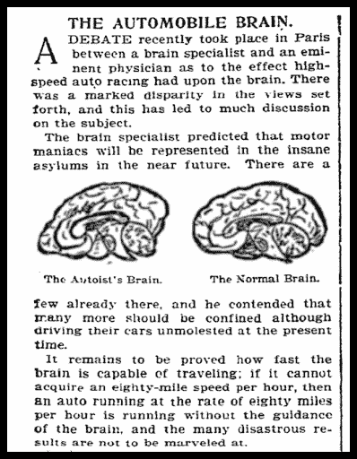

甚至自行车被认为是邪恶的发明，声称你的脊椎会变得永久弯曲，你的脸会变得压扁，你会变得疯狂，只是为了好的措施。

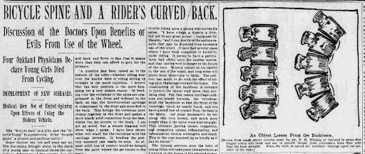

所有这些都是为了说——当面对大大小小的新技术进步时，我们应该质疑任何我们可能会感到冒泡的发自内心的怀疑情绪。如果在自行车、汽车、飞机、计算器、计算机、图形用户界面和互联网这些东西最初被发明出来的时候，会有如此多的怀疑和反弹——现在任何一个五岁的孩子都可以告诉你，这些东西显然是深刻的技术进步，具有难以描述的经济和社会影响——坦率地说，令人震惊的是，对非金融交易和加密货币没有更多的反弹。以历史标准来看，我们做得相当不错。

对当今世界对这些新颖技术创新的怀疑持保留态度。加密货币和 NFT 都植根于令人难以置信的技术突破(这是这些概念现在才扎根的原因，没有区块链的事先创新，NFT 根本不可能创造出来，而后者本身需要数十年的学术研究和事先工作才能最终创造出来)，但它们在概念上远比汽车和飞机等先前有形的发明更抽象。我们有两座山要翻越——一座面对所有新发明的山，另一座面对抽象而不明显的事物的山。

所以我们在这里已经有了我们应该做的工作。让我们开始吧。

# 第二部分:NFT 基本面——为什么 NFTS 有价值

好了，让我们来看看为什么非功能性测试有价值并且是未来的发展方向。首先，让我们讨论一下 NFT 到底是什么，以及支撑它们的一些技术(在第 3 部分会有更多的介绍)。

NFT 是不可替代令牌的首字母缩写，本质上是指独一无二的资产，而不是与许多其他资产相同的资产。

例如，可替换令牌的一个例子就像美元或比特币——每一美元都与其他每一美元相同，可以互换使用，所有美元都代表相同的价值。比特币也是如此——将会有 2100 万枚比特币被创造出来，每一枚比特币的价值都完全相同，并且完全可以与其他比特币互换。

另一方面，不可替代的一个例子是，一件艺术品，比如蒙娜丽莎，或者你的狗。世界上有很多画，但只有一幅蒙娜丽莎，你不能随便把蒙娜丽莎换成别的什么画，然后称之为同一件事。你的狗也是一样——外面有很多狗，但是如果有一天有人决定把你的狗和一只随机的狗交换，你可能会很沮丧。

本质上，NFT 只是这种不可替代性，或独特性的内在概念的数字表示，我们在物理世界中已经非常熟悉了。房子不可替代，人不可替代，你妈做的饭不可替代，无论好坏，等等。

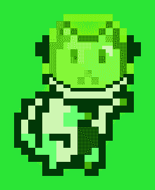

This MoonCat is non-fungible. [His name is Alfredo](https://opensea.io/assets/0xc3f733ca98e0dad0386979eb96fb1722a1a05e69/7801), there is no other MoonCat that looks exactly like him, and if you replace him with another MoonCat, I will be mildly upset, because I paid $3000 for him, and your replacement MoonCat is probably cheaper and doesn’t have a space helmet. Also, his ilk is [going to Sothebys](https://twitter.com/mooncat2878/status/1437458774713946118).

## 区块链使 NFT 能够存在

迄今为止，在数字领域，不可替代性有点难以实现，因为任何数字资产都只是由比特、0 和 1 的字符串以特定的方式混合在一起，世界上任何人都可以轻而易举地完美复制一万亿次。你怎么可能在数字世界中创造出不变的独特性呢？

进入区块链。区块链是支撑比特币和以太坊等加密货币的技术，可以被认为本质上是一个全球公共账本，可以永久记录任何类型的数据，供其他任何人永久查看和验证。

起初，区块链的设想只是记录双方的金融交易，例如，我给我的朋友爱丽丝发送了 10 个比特币。然而，很快，人们意识到，你也可以在区块链记录任何类型的任意数据，这可以作为任何事情的不可撤销的证据，比如双方之间有约束力的合同。

如果有人想记录，自古以来，他们与几个小时前在维加斯遇到的某个随机的人结婚了，那么他们最好的方法是用他们的私钥在区块链上签署一项交易来证明这一事实——只要世界上的任何节点(计算机)继续维护区块链的副本，这一证明就会一直存在，并且无可争议地证明他们确实都证明了这一证明。

这比通过纸质结婚证或去当地的县办公室或其他方式更容易做到，也更容易被世界上任何人核实。顺便提一下，这就是为什么公共法律文件几乎肯定有一天会在区块链存档，而不是在纸面上或任意孤立和分散的政府数据库中。

但是回到 NFTs。好了，现在我们知道，我们可以在区块链上存储任何类型的证明，也可以记录简单的金融交易。这给了我们什么？简而言之，以全球公开、永久且任何人都可以轻易验证的方式存储证书的能力，该证书证明给定的数字资产是*正版*商品——某样东西的原始真实副本，以及某样东西的【T4 独有】真实副本，由该资产原始创建者的私钥签名。

因此，不管真实物品的多少相同复制品被创建，只有单个资产或 NFT，由来自原始创建者的数字签名证明，可以被适当地指定为资产的真正“原始”副本。

充分解释和推销关于技术革命的人，这是支撑关于 NFTs 一切的区块链，并解释为什么 NFTs 直到现在才成为可能，这超出了本文的范围，需要另外 75 分钟左右来解释，所以如果你有兴趣听到更多关于这方面的信息，请去看 [Cryptocurrency 101](/@intenex/cryptocurrency-101-7197684775fd) 。或者，如果你有更好的事情要做，就相信我的话，不像我(在我看来，大多数人不喜欢 NFTs 的真正原因是因为大多数人都是值得尊敬的勤奋工作的人，他们有真正的工作，没有足够的时间花在探索愚蠢的新的极其复杂的时尚上)。

## 原件与复制品的价值

好吧——在这一点上，你可能会抗议这都是胡说八道，仅仅因为某个数字艺术品的艺术家可能会说某个特定的 NFT 是原始艺术品，而其他的都不是，这是毫无意义的，因为所有的副本在字面上都是相同的，因此可以以原始作品的任何方式平等地欣赏/利用。

好吧，当然——这可能都是真的，但如果我们对自己诚实，这并不是为什么任何一件艺术品或物理世界中的任何其他东西真正具有它的价值。

在最相似的层面上，今天的许多艺术家——让我们把摄影作为最简单的比较媒介——已经经常任意发布他们作品的[限量版](https://www.fineartphotographyprints.com/limited-edition-prints)，以诱导人为的稀缺，从而推高他们作品的价值，即使没有技术限制使这成为必要。

很明显，这种技术是可行的，因为许多本来可以轻易无限复制的照片却以数百万美元的[限量版照片出售。](https://en.wikipedia.org/wiki/List_of_most_expensive_photographs)

好吧，你们中的一些人可能甚至不认为摄影是真正的艺术作品，而是手绘艺术的纯粹主义者。我经常听到这样的说法，一幅真正的实物绘画需要真正的技巧来创作，并且永远无法与原作完全相同地再现，因此原作永远不会完全模仿，从而保持其价值。

著名的拍卖行经常出售而博物馆经常购买完全伪造的作品，而博物馆拥有的所有画作中可能有 20%不是真迹，这一事实给这一论点增加了一点难度。这些拍卖行和博物馆不遗余力地验证作品的真实性，并雇用非常专业的专业人员，利用非常精细的设备试图区分真品和复制品——他们经常做不到这一点，复制品经常在几十年甚至一生中完全不被注意。

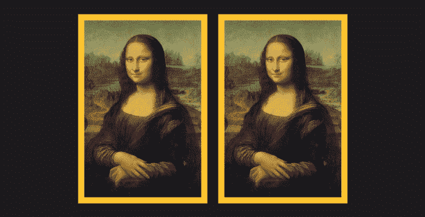

Be honest. Can you actually tell the difference between the real and the fake Mona Lisa here? Does staring at one versus the other make an emotional difference to you? Why is one worth [more than the global median annual income of 80,000 people](https://worldpopulationreview.com/country-rankings/median-income-by-country) and the other isn’t?

如果一件复制品与真品如此相像，以至于专家们都无法在极其仔细的检查后将其区分开来，如果艺术品的价值来自其内在的物理属性，而不是更抽象的东西，那么为什么复制品的价值会低于真品呢？事实上，为什么博物馆甚至不惜花费数亿美元来获得无价画作的原件，而不是仅仅以零头的价格委托制作所有作品的难以区分的复制品？即使是专家也无法将它们区分开来——一个普通的博物馆参观者绝对不可能做到。

去一个博物馆，里面全是著名艺术品的已知复制品，对你来说，它们看起来与真品完全一样，你会感到兴奋吗？我的猜测是，出于某种原因，这可能对你来说不太有吸引力，这可能就是为什么没有完全充满众所周知的复制品的著名博物馆。然而，在一个充满“真实”艺术的“真实”博物馆中，你实际上已经花了时间盯着一个你认为是真实的复制品，而博物馆和其他人都认为是真实的复制品，直到每个人都意识到它实际上是假的，每个人似乎都像欣赏原件一样欣赏它。

那么，我们欣赏真品胜过复制品的原因是什么呢？最终，我们成长过程中对实物的本质认识和理解是，一件稀有的、被社会高度珍视的物品的原件具有某种无与伦比的价值，这种价值超越了任何复制品，这完全是因为它是真正的原始艺术品。

人类喜欢真正的真实性和稀缺性的概念，并且知道你拥有的蒙娜丽莎是真正由达芬奇亲自创作和签名的(好吧，达芬奇实际上从未在蒙娜丽莎上签名，因为他患有多动症，一生中几乎没有完成过任何事情，这不是重点)，这就是价值 8.5 亿美元的 T2 和价值数万美元的复制品之间的区别。

我们天生就在情感层面上理解这一点，因为只要我们活着，这就是这个世界一直在运转的方式，我们也是在这种对世界的理解中长大的，但 NFT 是一个完全不同的故事。不仅 NFT 有价值的想法是如此新颖，仅仅几年前这个术语甚至还不存在，而且数字世界的整个概念仍然是一个新生的概念。

希望我们能记住这一事实，并记住人类起初对每一件新事物都持怀疑态度，并等待几十年再去评判非功能性测试，直到有些代人一生都伴随着非功能性测试成长——然后看看这些代人对非功能性测试的内在价值有什么感受。

## 好吧，不错，但艺术还是不值钱，对吧？

好的——在这个时间点上，希望我们在某种程度上达成共识，即一种允许对数字资产(如数字艺术)的真实性、原创性和唯一性进行可信和永久认证的技术，允许数字资产至少在与同类实物资产相同的前提下保留价值。

也就是说，希望我们都多少同意，蒙娜丽莎的真迹比几乎无法辨别的复制品更有价值，这仅仅是因为前者是由一些可信的认证机构，如专业的艺术鉴定家或拍卖行或博物馆认证为真迹，而这一事实本身就赋予了蒙娜丽莎最大的价值。

然而，这并没有回答为什么《蒙娜丽莎》的原作价值高达 8.5 亿美元，而一幅当代艺术家的作品，无论是同等程度的技术技巧还是哲学价值，几乎肯定会无限贬值。

也许你们中的一些人读到这里已经理解了为什么《蒙娜丽莎》价值 8 . 5 亿美元，并且同意它应该在这个大概的范围内值钱，但是我肯定直到几周前才进入这个阵营，所以我想花点时间在这里和我以前的自己谈谈。剧透警告——最后，我试图证明为什么几幅病态肤色、难以辨认的朋克像素化图像至少价值数百万美元。

So I think we can all agree this isn’t exactly the Mona Lisa, which is probably why it only sold for a [reasonable $11.7 million](https://www.techtimes.com/articles/264857/20210901/top-10-most-expensive-cryptopunks-nfts-sold%E2%80%94-11-million-as-the-highest.htm) instead of $850 million. Contrary to popular belief, the quality of your art *does* matter.

好的——所以人们可能会给出《蒙娜丽莎》如此昂贵的一个原因是，它可以说是有史以来最好的画家所画的最好的画。有史以来最伟大的画作价值不菲，这似乎不无道理。那是我可以买的东西。

这里有一个小问题——到底是什么*让《蒙娜丽莎》成为有史以来最好的画作？毫无疑问，列奥纳多·达·芬奇是一位不可思议的艺术家，《蒙娜丽莎》也是以高超的技巧完成的，但是有无数类似质量的作品，包括许多列奥纳多自己的作品，都没有获得那么高的溢价。*

人们可能会给出另一个理由，从表面上看，这似乎是同一个论点，但实际上其细微差别略有不同——蒙娜丽莎是世界上最昂贵的画，因为它是世界上最*著名的*画。

为什么它是最著名的画？有人可能会认为这是最著名的画作*，因为*它是客观上最好的画作，这与之前的假设是相同的，但这里也有一个小小的问题——从 16 世纪早期到 1911 年的四百年间，这幅画几乎完全不为艺术界以外的任何人所知。奇怪的是，世界上客观上最好的画在 400 年后才被认可。

1911 年到底发生了什么，引发了一系列事件，让今天世界上几乎每个人都知道了蒙娜丽莎？嗯——蒙娜丽莎在卢浮宫被盗，一夜之间，这一丑闻轰动了全球，并将蒙娜丽莎永远推到了聚光灯下。[来自维基百科](https://en.wikipedia.org/wiki/Mona_Lisa#Fame):

> 《蒙娜丽莎》一直被认为是“另一个达芬奇，直到上世纪初，这幅画从卢浮宫被盗并随后被归还的丑闻让人们关注了好几年。”
> 
> 1911 年《蒙娜丽莎》的失窃和随后的归还被全世界报道，导致这幅画的公众认知度大幅提高。在 20 世纪，它是大规模复制、销售、讽刺和投机的对象，并声称在“300 幅画和 2000 个广告”中被复制。

今天，这就是蒙娜丽莎能够吸引的那种关注:

> 2014 年，930 万人参观了卢浮宫。前导演亨利·洛瑞特估计“80%的人只想看蒙娜丽莎。”
> 
> 在纽约，估计有 170 万人排队“为了看一眼《蒙娜丽莎》大约 20 秒钟。”

然而，导致《蒙娜丽莎》成为有史以来最著名的画作的原因并不仅仅是盗窃。这次盗窃只是一个催化剂——一个最初将《蒙娜丽莎》置于全球聚光灯下的事件。从那以后，《蒙娜丽莎》基本上进入了一个自我延续的名声连锁反应，盗窃案赋予这幅作品的最初名声激发了《蒙娜丽莎》基本上成为 20 世纪的迷因，无休止的模仿和复制，每一次都使它更加出名，更多的模仿，等等。

[来自《大英百科全书》，如果你不喜欢维基百科的话](https://www.britannica.com/story/why-is-the-mona-lisa-so-famous):

> 《蒙娜丽莎》在被盗后当然更加出名，但是第一次世界大战很快吸引了世界的注意力。一些学者认为，马塞尔·杜尚在 1919 年对一张明信片复制品的顽皮污损将人们的注意力带回了《蒙娜丽莎》，并开创了一种趋势，使这幅画成为世界上最受认可的作品之一。
> 
> 他在这位女士的脸上画了胡子，并在底部添加了首字母缩写 L.H.O.O.Q(意为法语中的一个粗俗短语)，以此来反对对艺术的崇拜。这种不敬的行为引起了一个小丑闻，其他狡猾的艺术家意识到这样的恶作剧会引起他们的注意。几十年后，其他艺术家，尤其是安迪·沃霍尔，纷纷效仿。
> 
> 随着艺术家们扭曲、毁容和玩弄蒙娜丽莎的复制品，漫画家和广告人进一步夸大了她。几十年来，随着技术的进步，这幅画被无休止地复制，有时被处理，有时不被处理，所以画中人的脸成为世界上最著名的脸之一，甚至对那些对艺术没什么兴趣的人来说也是如此。

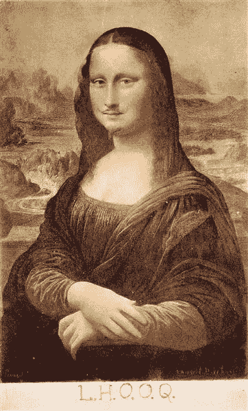

You think the 1910s didn’t have memes? You think memes aren’t the reason the Mona Lisa is worth $850 million? You think that’s air you’re breathing, Neo?

## 迷因的实际力量

从某种意义上来说，人们开始模仿《蒙娜丽莎》仅仅是因为它很有名，而每一次模仿都让《蒙娜丽莎》*更加出名，这就成了一个永无止境的循环，直到《蒙娜丽莎》成为有史以来最著名的画作。见鬼，我们今天还在纪念蒙娜丽莎。*

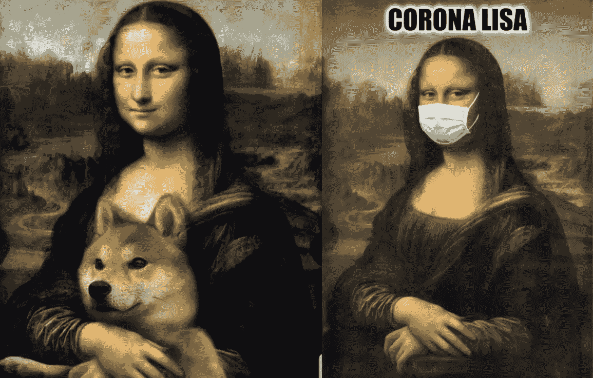

I chuckled.

那么，现在我们知道《蒙娜丽莎》并不是世界上最著名的画，仅仅因为它明显的艺术价值，而是因为许多随意的偶然事件和模因，我们对它的欣赏是不是少了一点？我知道我会——这就是为什么所有的艺术都是扯淡，都是基于炒作，与客观的有形价值没有什么关系。

现在，我的想法完全不同了。不管*为什么*如此出名，它*如此出名的事实本身就具有非同寻常的实际价值。你甚至可以用金钱来量化这种价值——如果一家[公司制作一个模仿蒙娜丽莎](http://sincapshop.com/mona-lisa-as-an-advertising-face/)的广告来销售其产品，与一个模仿一幅同样出色但公众完全不知道的艺术作品的广告相比，前者显然会表现得更好，并为公司赢得更多收入。*

最终，在某种意义上，《蒙娜丽莎》背后的迷因品牌或共享神话的力量赋予了它价值，这是有道理的。不管出于什么原因，拥有一件占据了世界上几乎每个人心灵空间的独特艺术品有多强大？

可以说，《蒙娜丽莎》的品牌价值赋予了原版《蒙娜丽莎》无价的价值，作为终极的身份象征——如果你说你是《蒙娜丽莎》的主人，世界上的每个人都会明白这是多么不朽的声明，而如果你说你是[抱银鼠的女子](https://en.wikipedia.org/wiki/Lady_with_an_Ermine)的主人(也有价值， 但主要是因为这幅画也是达芬奇画的，达芬奇品牌现在有着巨大的价值，因为《蒙娜丽莎》，每个人都知道达芬奇。

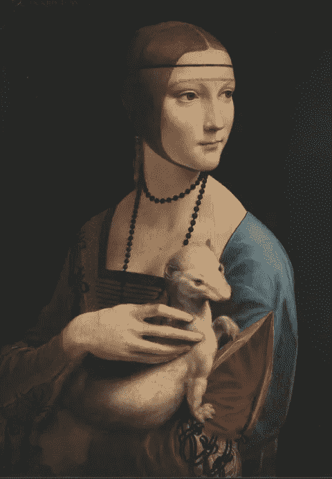

I wouldn’t say I’m the world’s *best* fine art critic, but that’s an evil looking ermine. Probably mostly the reason this piece isn’t worth remotely as much as the Mona Lisa.

见鬼，如果你屈尊如此之低，以至于为了金钱出卖无价的艺术品，老实说，你甚至可以把《蒙娜丽莎》变成直接的现金流资产——如果我们相信卢浮宫前馆长所说的“卢浮宫 80%的人只想看《蒙娜丽莎》”，并结合每年约 1000 万人参观卢浮宫和卢浮宫门票价格约 20 美元的事实，你可以通过拥有《蒙娜丽莎》每年获利约 1.6 亿美元。

任何一个房地产投资者都会告诉你，大约 15%的[资本回报率](https://en.wikipedia.org/wiki/Capitalization_rate)(假设运营你的蒙娜丽莎卖淫企业需要花费大约 3000 万美元的运营费用，因此 1.3 亿美元的收入/8.5 亿美元的资产购买价格== 15%的资本回报率)是相当不错的，如果你不把钱投在这样一个明显不会亏损的愚蠢投资上，那你就是疯了。

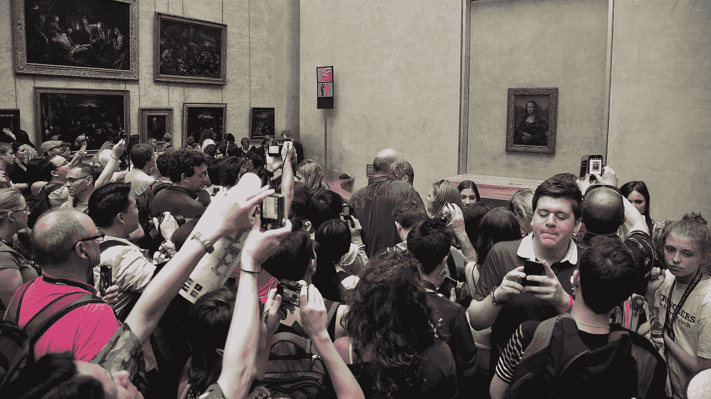

I love that there’s someone just rubbing her hand on a random other painting in the background and no one cares because no one ever made a meme about that painting, so clearly it’s worthless. But back to the point — if you can draw millions of tourists around the world to your art piece, that is worth real money, whether or not you decide to capitalize directly on that fact. Indirectly capitalizing on that fact by utilization of the art piece as a status symbol is also a very valid justification for its price.

从表面上看，有人会花 8.5 亿美元购买一个因为一个甚至没有授予你任何版权或许可或版税等权利的迷因而出名的东西，这很疯狂，但当我们深入研究一下，这似乎更有意义，不是吗？

请记住，蒙娜丽莎是一个品牌，作为一种新闻轰动和模仿的模因，它已经在公众思想空间中免费存在了一个多世纪，发展了它的价值。它并不总是被视为必然的结局，但现在它却成为了“[世界上最著名、参观最多、被写得最多、被唱得最多、被模仿得最多的艺术作品](https://www.independent.co.uk/news/world/europe/moving-mona-lisa-530771.html)”。

早在早期，大约在它第一次爆炸后的四年，在 1915 年左右，即使是专业的有成就的艺术评论家也可能会(读:肯定会)嘲笑有人大胆地宣称《蒙娜丽莎》有一天会价值近 10 亿美元(当然，经通胀调整，所以当时实际上更像是 30 美元)。

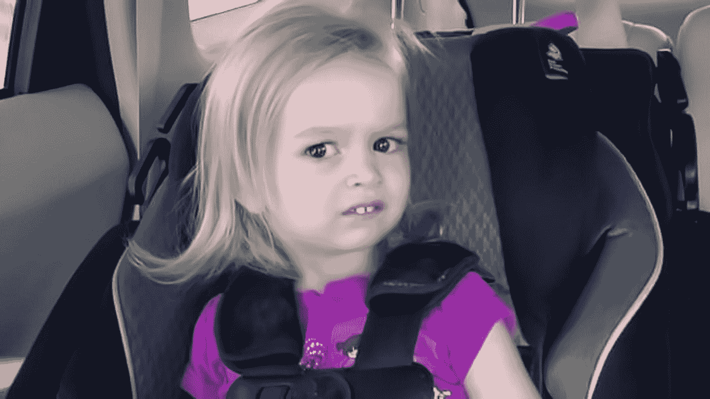

At just [$75,000 in the current NFT bear market](https://foundation.app/@SideEyeingChloe/~/59244), this is starting to feel like a steal, no? How many of you have seen this meme and how much mindshare does it occupy? Possibly more than even the Mona Lisa for the certain more degenerate generations among us, no?

也许这就是我们对今天获得五六位数的新生互联网迷因的感受。就在几十年前，人们甚至没有在互联网上出售——我们怎么可能期望人们看到拥有互联网模因的价值呢？meme 这个词本身仍然被认为是一个新词，还不完全适合在有礼貌的公司中使用，尽管它实际上是在相当学术的背景下由理查德·道金斯 1976 年的里程碑式的著作《自私的基因》创造的。

具有讽刺意味或者可能非常恰当的是，[道金斯对模因的学术定义实际上是模因化自身](https://www.wired.co.uk/article/richard-dawkins-memes)并“进化”成了众所周知的互联网模因现象，即概念和内容不是试图准确地复制自己，而是像真实的基因一样在复制过程中自然地进化和改变，互联网模因在传播中故意改变自己——然而与此同时，由于数字资产的完美复制能力， 迷因的原始形式总是被完全忠实地保存下来，不像前数字文化迷因那样，也许耶稣真正想教给他的追随者的根本不是他的追随者现在认为他想教给他们的。 有趣的是。

无论如何，所有模因的核心概念和力量都是相同的——[模因是文化传播的自我复制单位](https://en.wikipedia.org/wiki/Meme#Dawkins)，类似于生物传播的自我复制单位基因。当完全抓住其核心时，这是一个令人难以置信的强大概念——模因的力量直接来自于它在世界文化思维空间中的传播、饱和和渗透程度。

模因意义深远，根本不是什么新概念。[在《自私的基因》中，道金斯认为语言本身就是一种模因](http://staff.washington.edu/lynnhank/Memes.pdf)(新词是如何发明和传播的？有人想出一个词，其他人跟上，很快每个人都使用它，它就成了佳能，就像 meme 这个词。宗教是迷因，时尚是迷因，习俗、传统和仪式是迷因，哲学是迷因，政治派别是迷因，饮食和民族食物偏好是迷因，美术是迷因，等等。是的——就像我们所知道的那样，几乎所有共同构建人类社会结构的东西都是通过作为迷因的传播而产生的，出于一种或多种任意的原因。见鬼，你的名字可能是作为一个迷因传播的。不管喜欢与否，接受与否，迷因几乎是世界上最强大的东西。

一个迷因，就像一个基因一样，可以在多种优点的基础上，仅仅依靠纯粹的偶然事件，将自己延续到文化思维空间饱和的程度——例如，一个更聪明或有用的概念可能会发现自己更容易传播，就像一个更“适合”的基因可能会发现自己更有可能通过几代人存活下来，但一个迷因也可能只是抓住了一个幸运的机会，在正确的时间出现在正确的地方， 或者必须等待 400 年，像从卢浮宫被盗一样的催化剂才能从休眠中醒来并开始传播——但无论它传播的原因是什么，当它传播时，它的价值仅在传播中是合理的。

坦率地说，病毒可能是一个合理的类比，符合当今的内脏意义。几乎可以肯定有一个平行宇宙，其中新冠肺炎从未跳跃到人类(或从未从实验室或诸如此类的地方跳出来)，在那个世界里，它在世界上几乎没有任何意义，尽管以完全相同的形式存在，休眠在蝙蝠或实验室中，或无论这些天流行的阴谋论是什么， 拥有与新冠肺炎一样的优点，并成为一个世界性的现象——有点像一个才华横溢的饥饿艺术家，他永远没有机会让自己的作品见光，尽管在不同的环境和不同的宇宙中，他们可能会像达芬奇一样出名(请原谅一个未被发现的才华横溢的艺术家和潜在的致命病毒之间的粗俗比较)。

然而，不管出于什么原因，也不管发生了什么不幸的武断情况，新冠肺炎确实成了一个世界性的现象，新冠肺炎的自私基因在很大程度上自我复制，在经济和其他方面产生了不可否认的世界性后果。

迷因几乎是一样的东西，不管出于什么原因，一些迷因自我复制，成为世界的文化基石，任何特定人群都可以理解和利用，以有效地相互交流，识别或表明地位或价值，当这种情况发生时，这些迷因就有了真正的价值。

This sold for [half a million dollars](https://foundation.app/@DisasterGirl/~/25046), and given how much cultural penetration this meme has, I hope you’re making your way around to seeing how that *might* be a bit of a steal some day far in the future, when the internet and the early memes on the internet as well as the earliest memes to be NFTs on the Ethereum blockchain are viewed as cultural artifacts, in a future in which the Ethereum blockchain may be as culturally ingrained in our collective human heritage as much as the internet and computers and the rest of our hallowed technological lineage are now, and owning this is like owning, I don’t know, some sacred primitive cave painting from the earliest days of known human civilization, which I’m sure to our future AI heirs apparent will be approximately indistinguishable distinctions. I’m like 90% positive some eccentric AI octillionaire in the future will definitely pay at least a trillion dollars for this, in inflation adjusted non-existent dollars, of course. I mean, how cool is it to own a quaint early human cultural artifact from a time when humans were just beginning to wrap their minds around abstract concepts like money and NFTs?

多亏了互联网，迷因现在可以以前所未有的速度传播——就像多亏了航空旅行，新冠肺炎现在可以以前所未有的速度传播病毒。世界比以往任何时候都更加相互联系，无论是在物理上还是在数字上，因此，互联网模因可以在几天内(或字面上)成为全球性的突出和饱和，而不是像过去那样需要几个月、几年或几十年。这让我们感到几乎无法理解，一个只有几年历史的互联网模因可能价值六位数甚至七位数——然而没有人质疑新冠肺炎造成的破坏，尽管它在短短几个月内传播了同样前所未有的野火，但这确实是真实的(除非你不相信新冠肺炎，在这种情况下，我会说你已经从内心深处理解了互联网模因在任何形式的信息的文化传播中的真正力量，以及这种真正的力量，无论是好是坏)。

Twitter is the greatest memeifier, for better or for worse. With a single click of a button, a retweet replicates a meme — in this case a tweet, carefully regulated by Twitter to be distilled down into a 140/280 character maximally transmissible individual unit of information — and spurs it on in its quest for global mindshare domination. Tweets are literally self replicating cultural transmission units, and the ones that spread widely are profoundly impactful.

## 如果你愿意，就叫它品牌吧

好吧——我认识到，对某些人来说，迷因这个术语绝对是一个太多的内在障碍，无论如何唠叨哄骗都无法克服。在这种情况下，让我们把这些东西看作一个品牌——蒙娜丽莎是一个品牌，达芬奇是一个品牌，卢浮宫是一个品牌，所有这些品牌相互影响，相互支持，它们都从这样做中获得了真正的价值。

路易威登是一个品牌，耐克是一个品牌，飞人乔丹是一个品牌。坦白地说，在进入 NFTs 之前，我也从未理解过这一点，并且一直认为这是一种滑稽的欺骗(现在仍然这样认为，因为这些品牌不迎合我所在的硅谷文化——我们的品牌是特斯拉和麻省理工学院的文凭和太空门票——随着时间的推移，更是如此)，任何人都会买一个蔻驰或路易威登的包，它的售价只有售价的 1%，在质量和价值上与没有品牌标签的相同的普通包没有什么区别。

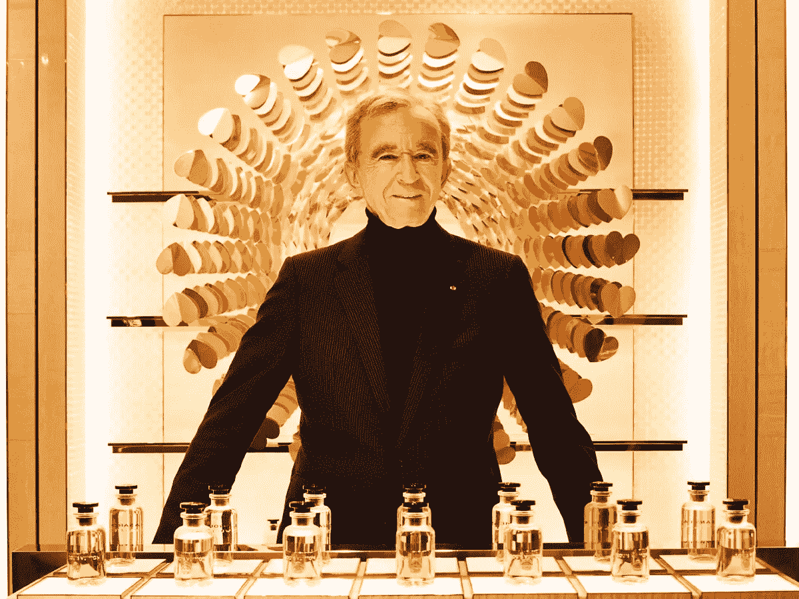

It says a tiny bit about the power of brands that the only centibillionaire in the world (and top contender for richest person in the world, period) who isn’t a technology entrepreneur or Warren Buffett is the [owner of a luxury brands conglomerate](https://www.forbes.com/real-time-billionaires/#524f4b913d78). The only thing that can compete with technology, apparently, is a brand. What about…a brand powered by novel technology? :O Here’s a Novel Fucking Technology — NFTs

现在我明白了——这个品牌有真正的价值，因为它占据了全球数十亿人的真正思维空间，在正确的圈子里，拥有一件路易威登产品，就能立即以一种可证明的、无法伪造的方式进行沟通(剧透警告:这实际上是一个 NFTs 的广告，因为路易威登包可以而且事实上是很容易伪造的， 但是，作为无可争议的真理的来源，非功能性传播不那么容易伪造，世界上任何人都可以根据需要立即对其进行简单的验证，不像实物商品那样，这种地位可以非常明显地为你打开大门，建立联系，并通常有益地改变你的生活方式，这种方式不仅仅是证明该品牌会员的价格是合理的。

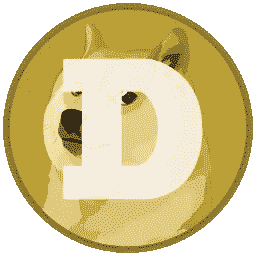

Dogecoin too is a brand, to the tune of $25 billion+ dollars. Caveat emptor — brands can be fragile, and while brands can propel themselves to unfathomable and also justifiable heights, they can also collapse spectacularly, so might I suggest possibly investing in more established brands like Bitcoin and Ethereum first before dipping your toes into a brand that as of yet predominantly caters to an audience that’s into crypto for possibly all the wrong and entirely uninformed reasons. That said, weeks ago, I would have called Dogecoin and Gamestop and AMC obviously dumb and doomed to fail investments based on faddy memes, and now I’m not so sure. If everyone rallies around going to see movies at AMC again just because everyone decided to buy into the stock because of a stupid WallStreetsBet meme, hasn’t that meme actually become a self-fulfilling prophecy in justifying its own value? Memes can change cultures — and if the culture of seeing movies in theaters was dying out and gets respawned by a random arbitrary internet meme, what really is the difference? The culture and the revenue for AMC is back, and the market cap is once more justified. Same with Dogecoin — it’s a terrible joke currency with incredibly shaky technical foundations, which ultimately are unlikely to be overcome by pure meme adoption, but still — the power of memes can’t be ruled out, and if everyone decides they want to use Dogecoin over every other cryptocurrency just because of the much stronger meme power of it, which kind of is happening right now for a lot of the mainstream public, it totally is possible that Dogecoin attracts incredible developer talent, fixes all its technical problems, and become the de facto cryptocurrency of the future. I’m much less willing to bet against memes now, however absurd and capricious their origin stories may be. The fact that they are is fact enough. (N.B. Never trust an article that has captions on its pictures longer than some other articles)

所有的亚文化都有品牌，当你拥有它们时，这些品牌就打开了成员的大门。这些品牌具有不可思议的价值，而且往往有近乎无懈可击的护城河保护这种价值，因为它们难以复制，而且往往不可能有意复制。互联网上大多数最著名的迷因都完全是偶然的，比如[侧目看着无动于衷的克洛伊实际上只是一个视频](https://en.wikipedia.org/wiki/Side_Eyeing_Chloe#Meme_history)中的跟班，该视频本应展示她姐姐在被赋予迪士尼乐园惊喜之旅时的兴奋。许多亚文化把真实性看得高于一切，当它们感觉到任何有意品牌形成的气味时，就像被血吸引的鲨鱼。

不管公平与否，这些品牌通常也是赢家通吃的市场，例如在艺术界，只有 0.2%的艺术家出售过超过 1000 万美元的作品，但每年 630 亿美元的艺术市场销售额中有 32%来自这 0.2%的艺术家的 1000 万美元以上的作品。

作为身份的象征，亚文化中最好的品牌变成了[凡勃伦商品](https://en.wikipedia.org/wiki/Veblen_good)和[位置商品](https://en.wikipedia.org/wiki/Positional_good)(至少，如果金钱不是与亚文化的价值观完全对立的话——顺便说一句，对亚文化来说肯定不是)，商品的价格本身成为一种内在的动机，以获得商品作为能够负担得起该商品的身份标志。 这成为一个自我延续的上升周期，推动商品的价格进一步上升，直到达到一个均衡，这个均衡仅由商品的稀缺性和愿意并能够支付给定价格的购买者的数量决定。

这本身就是每年价格最高的艺术品的价格持续上涨并打破纪录的一个原因——因为随着世界整体经济继续以非零馅饼的形式扩张，以及不平等性因无数因素而上升，世界上最富有的人继续变得更富有，因此， 进入艺术界最精英阶层的门票价格持续上涨，以保持成员配额的平衡，从而不会削弱这种地位。

## 天啊，你已经开始谈论密码朋克和非功能性测试了吗？

最后，我们得出了为什么 crypto 朋克 NFTs 价值数百万美元，并且有一天可能价值更多的理由。

只是提醒你这些东西看起来像什么:

This is one of the less cool CryptoPunks, [worth only $1 million](https://www.larvalabs.com/cryptopunks/details/2484) at time of sale this April. You’re only semi in the cool group if all you can afford is this guy.

简单回顾一下历史，目前有 10，000 名 CryptoPunks，他们的总市值超过 40 亿美元。

因此，简而言之——一万个这些可爱得令人怀疑的小朋克相当于五幅*蒙娜丽莎——世界上有史以来最有价值、最著名和最受欢迎的画作。这怎么可能合理呢？*

好吧，为了一点历史——[密码朋克被广泛认为是以太坊](https://techcrunch.com/2021/04/08/the-cult-of-cryptopunks/#:~:text=CryptoPunks%20lore%20is%20largely%20steeped%20in%20the%20assertion%20that%20they%20are%20the%20oldest%20NFT%20project%20on%20the%20Ethereum%20blockchain.%20It%E2%80%99s%20a%20line%20that%20was%20floated%20by%20almost%20all%20of%20the%20punk%20owners%20I%20spoke%20with%20as%20the%20main%20reason%20they%20had%20dumped%20hundreds%20of%20thousands%20of%20dollars%20into%20the%20platform.)区块链上创造的第一个 NFT(声明——这在技术上不是真的，并且[几个项目可以说早于以太坊上的密码朋克](https://docs.google.com/spreadsheets/d/1b6ElmWMzTPxtOEm3aPCox6-NnSLo1H2AB-Gt0bqRY5k/edit#gid=0)，例如[以太](https://etheria.world/)、[像素地图](https://pixelmap.io/)和[古董卡](https://curio.cards/)，一直追溯到 2017 年 6 月，这可能也是以太坊时代的史前时期(我甚至不是真的在开玩笑

它们也是有史以来第一个 PFP(个人资料图片)NFT 艺术项目，指的是可以在社交媒体上用作个人资料图片的 NFT 收藏。这两个事实(当然还有许多其他因素)为 CryptoPunks 在经典模因复制、Veblen 和 positional good fashion 中的起飞创造了完美的风暴。但是让我们倒回去一点，从头开始，也许我们会看到隐朋克的故事并不像蒙娜丽莎的故事，尽管像所有互联网和加密的事情一样，时间尺度已经从大约 400 年压缩到大约 4 年。没什么大不了的。

当加密朋克在 2017 年 6 月 23 日首次向公众推出时，几乎没有人关注它，尽管事实上朋克是免费提供的(加上运输和处理，呃，[以太币气体交易费](https://www.investopedia.com/terms/g/gas-ethereum.asp))。[在发布后的第一周](https://techcrunch.com/2021/04/08/the-cult-of-cryptopunks/)，只有 20-30 个朋克被认领。只有当 Mashable 以一篇令人难以置信的先见之明和开放的文章报道了这个项目，标题不再夸张，“这个基于以太坊的项目可以改变我们对数字艺术的看法”,事情才开始起飞，几个小时内，10，000 个朋克中的每一个都被认领了。

委婉地说，销售随后停滞不前(尽管仍然有一个富有弹性、活跃但规模较小的爱好者群体，同时对 CryptoPunks 非常热情——也许可以考虑这些类似于艺术知识界的罕见人士，他们是在《蒙娜丽莎》问世 400 年后因任意原因爆炸之前唯一看到其价值的人，尽管我敢肯定你现在仍然觉得这有点牵强——稍后会有更多细节)，在接下来的大约四年里，事情在 2021 年初开始真正起飞之前。

You think Bitcoin is volatile? (hot take — I actually think CryptoPunks are the bitcoin of NFTs)

事情为什么起飞了？部分原因是 NFTs 的整个市场在今年和去年开始起飞([随着世界各地的收藏品价格飙升](https://www.bloomberg.com/news/articles/2021-09-03/collectible-prices-skyrocket-to-the-dismay-of-hobbyists)，很可能是由于疫情迫使人们转向更加不拘一格的居家爱好)，有一些项目，如 NBA Top Shots(由 Dapper Labs 创建，它也是 [CryptoKitties](https://www.cryptokitties.co/) 的背后)， 2017 年最成功和最广为人知的 NFT 项目)于 2020 年 10 月推出，截至 5 月底收入超过7 亿美元，数字艺术家如 Beeple 以数百万美元的价格出售其艺术作品，最终在 3 月的佳士得以 6900 万美元的高价售出。

随着人们对 NFT 空间的兴趣越来越大，拥有最引人注目的故事的项目和艺术家(伴随着大量的随机性和运气，所有成功的事情都是如此，甚至包括蒙娜丽莎)很快找到了通往巅峰的道路，比如 NBA 的顶级照片建立在庞大的品牌和 NBA 的粉丝基础上，或者 Beeple 建立了几十年来作为先锋数字艺术家的声誉，或者 CryptoPunks 建立了以太坊上 OG NFT 项目的声誉。

随着这些项目开始起飞，最肯定的是泡沫确实形成了，因为每一次破纪录销售的消息都推动了下一次破纪录销售的兴起，一夜暴富的承诺吸引了越来越多的投机者来到前线。NFT 项目激增，几乎每一个似乎都保证成功，不管有没有任何基础。不出所料，事情来得快去得也快。5 月 3 日，NFT 市场的销售额达到了 1 . 02 亿美元的高峰，但是仅仅几周之后，销售额就下降到了几百万美元。

然而，值得注意的是， [CryptoPunks 并没有像该领域的其他项目那样受到这种交易量下降的影响](https://www.nft-stats.com/collection/cryptopunks)，尽管平均销售价格确实在夏季短暂下跌，但自那以来，价格一直在向右上方显著稳定地强劲上涨。7 月初，朋克的平均售价约为 4 万美元，而就在三个月后的今天，也就是 10 月初，平均售价上涨了 10 倍多，达到约 45 万美元。

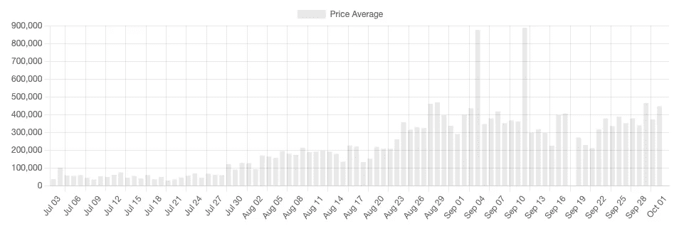

What’s the difference between an asset that rises solely because of bubble economics and a Veblen good, exactly? The bubble asset eventually pops and as it does, we learn that there was nothing inside after all but thin air, and it goes to zero, and the Veblen good…doesn’t?

为什么 CryptoPunks 即使在 2021 年春天所谓的第一次 NFT 泡沫破裂时仍然如此有弹性，为什么随着时间的推移，他们会如此快速地稳步增值？要回答这个问题，我们可能需要求助于一些最早真正相信密码朋克的人。

## CryptoPunks 真实信徒案例研究

价值数十亿美元的合作设计工具 [Figma](https://figma.com/) 的联合创始人兼首席执行官迪伦·菲尔德(Dylan Field)因在 2021 年 3 月 11 日以[750 万美元](https://www.larvalabs.com/cryptopunks/details/7804)的价格出售一种非常罕见的密码朋克(所有的密码朋克都是独一无二的，有些密码朋克具有比其他人更罕见的特征，因此价格更高)而成为头条新闻。

这个家伙，委婉地说是本世纪最低调的人，不是你可能想象的普通无知的 YOLO 非金融交易散户投资者，最公开的证据是，他几乎一生都在通往惊人成功的单程票上。作为泰尔的研究员，我非常荣幸地认识了他大约十年，因此我清楚地记得每个人从一开始就看到迪伦有多大的潜力。以下是他 19 岁在 Flipboard 实习时的一些快速摘录:

> Flipboard 首席执行官迈克·麦库埃仍然无法相信当他雇用一名布朗大学的学生在 T2 实习时，人们是多么兴奋。
> 
> 在庆祝移动新闻阅读应用两周年的烧烤会上，麦库埃讲述了传奇风险投资公司凯鹏华盈(Kleiner Perkins Caufield)首席合伙人**约翰·杜尔登如何就麦库埃正在招聘的实习生迪伦菲尔德(Dylan Field)给他打电话的故事。**
> 
> “你需要迪伦的帮助吗？”据麦库埃回忆，杜尔问他。
> 
> “我想我明白了，”麦库埃回答道。
> 
> 当时，菲尔德 19 岁。他三月份刚满 20 岁。
> 
> 但是多尔并不是唯一对这个领域感兴趣的人。在 Flipboard 雇佣了他之后，柳文欢·雅各布，Pixar 的前首席技术官，现在经营着一家名为 ToyTalk 的初创公司，在停车场的另一边发现了麦库埃，喊道:“我听说你得到了迪伦！”
> 
> 这是菲尔德如此出名的一个重要原因。他从小就是数学天才，高中时在 O'Reilly Media 实习，O ' Reilly Media 是一家技术书籍出版商，也制作像 Foo Camp 和 Strata 这样的极客活动。因此，他通过帮助这些活动结识了硅谷的技术精英。他后来成为了数据分析方面的专家，现在在 O'Reilly 活动上发表自己的看法。

所以，是的——这个家伙在 19 岁时，硅谷最大的风险投资公司之一的亿万富翁首席投资者和皮克斯的前首席技术官对他感兴趣并亲自帮助他，他在 29 岁时就掌管着一家价值 100 亿美元的初创公司。他也可能是世界上最好的狼人/黑手党/卡坦岛定居者玩家，以至于所有的 Thiel 家伙最终都决定正确的策略是无论在任何游戏中都先杀了 Dylan，因为这是客观游戏理论上在所有情况下的最佳选择。简而言之，这个家伙是有先见之明的天才化身(他也是有史以来最脚踏实地、谦逊、善良、体贴和给予的人，这是每个人都如此热爱/钦佩/尊重他的另一个原因)。

当这个人不忙着创纪录地成为地球上最成功的人时，他在业余时间做什么呢？在所有人之前购买密码朋克。这是他的故事，讲述了他是如何进入密码朋克的，以及为什么他仍然对密码朋克感到难以置信的兴奋，还有——听听这个——为什么他认为一些[密码朋克实际上是最接近数字版蒙娜丽莎](https://www.protocol.com/figma-ceo-cryptopunk-nft)(重点是我的):

> 回到 2017 年的迪伦。你最初是怎么进入密码朋克的？
> 
> 嗯，我真的很喜欢以太坊。我喜欢以太坊的原因是因为我曾和胡安·贝尼特(Juan Benet)住在一所房子里，他是 IPFS 和 Filecoin 的创造者。我是一个小伙子。在那个社区里，在胡安和泰尔奖学金的帮助下，每个人都迷上了加密。我实际上是一个对加密不感兴趣的人。我说，“你们都太荒谬了，太疯狂了！”
> 
> 2017 年，正是 ICO 热潮开始发生的时候。我在看，你知道，ERC20 代币，是可以替换的。我一直在关注集中化的组织，比如 Aragon 项目，我对此很感兴趣。我开始关注密码朋克，我认为这是天才之举。它发射的时候我什么都没做。然后我远远地看着这个社区的形成，当我看到越来越多的人和我一样对此产生共鸣时，我开始变得非常兴奋。所以，作为一个观察者，我在假期前没怎么用它，因为我正忙着运行 Figma。然后就在假期前，我买了我的第一个密码朋克，现在是我的头像。头发乱糟糟的那个，我觉得有点像我。
> 
> ***但是等等，你跳过了一个我认为真的很有趣的步骤，那就是从这个模糊意识到“这是一个有趣的空间”的时刻，到放下真金白银，买进去。这就是你说的翻转吗？***
> 
> 是啊。**在我放下真钱之类的东西之前，我去看了看合同代码。对我来说，那真是一个有趣的时刻。因为如果你看 CryptoPunks 智能合约，首先，代码非常优雅。很简单，写的很漂亮。**
> 
> 从本质上说，对于 CryptoPunks，你得到的是数组中的一个条目。有一个从 0 到 9999 的数组，代表 10000 个朋克，这个数组索引一个二维图像。基本上 01 在左上方，9999 在右下方。图像不存储在以太坊上。它只是一个存在于世界某处的影像。然后你就在一个数组索引上出价真金白银。
> 
> 一开始我想，这是艺术吗？那真的是拥有什么吗？我不知道！但后来我开始发现其他人也这么认为。所以我对这个问题很感兴趣，什么是数字所有权？你有知识产权吗？不。但是，我真的很想要这个东西。我真的对这个项目产生了共鸣。我非常关心这个项目。
> 
> 所以我买了我的第一个。我当时想，好吧，100 块。我一直在想这件事。我就这么做了。
> 
> 最糟糕的情况是，这是你尝试过的好东西，而且只花了 100 美元。
> 
> 没错。我发现，我想得越多，我越关心它，我就越有兴趣参与这个项目。我开始关注不和谐，关注正在形成的社区。我不是唯一一个。还有很多其他人也很了不起——他们今天还在。像这些人一样的人没有去任何地方。他们对此也很着迷。每个人都在给它们分类，他们在计算哪些是最稀有的，哪些是最有审美价值的。不同的人对不同的属性有不同的倾向。所以我开始弄清楚哪些是我最喜欢的，然后我在 2017 年到 2018 年的冬天买了一些。
> 
> **我认为数字社区成长的重要方式是随着时间的推移逐渐成长。它们不会一下子长出来。我在 CryptoPunks 中也看到了这一特征，这让我更加感兴趣。**
> 
> 所以有一个是我最着迷的，我真的很渴望，我真的被吸引住了，我觉得它完全是庄严的。在一万个密码朋克中，只有九个外星人，而这九个外星人中，让我真正产生共鸣的是 7804，那是一张外星人抽烟斗的照片。
> 
> 它完全吸引了我。我无法停止去想它。所以我看到拥有它的人卖掉了其他一些。我想，如果我出价足够高，他们会卖的。所以我出价 12 ETH，当时是 15000 美元。经过三天左右的等待，并试图看看我是否会涨得更高一点，它确实卖得不错。
> 
> 我真的以为，**“这是数字版的蒙娜丽莎。”** **隐朋克是第一个项目。在所有的密码朋克中，对我来说，这显然是最好的密码朋克。当人们想要密码朋克时，每个人都会想要它。**
> 
> 我认为，有些符号会深深印在你的脑海中。我想这就是一个例子:我现在可以看得一清二楚。我认为大多数人都能做到。这个图像非常粘。我想还有其他一些小混混也是这样做的。但这是其中之一。因为这个原因，也因为它的稀有性，还有它的磁性，我认为它有潜力成为数字版的蒙娜丽莎。
> 
> **卖了 7804 之后，我比以前更相信 CryptoPunks 是艺术，超级迷人。我想原因是在与它分开后，我确实感到情绪激动。我感到悲伤。这不仅仅是悲伤，就像“哦，伙计，这是数字版的蒙娜丽莎，我可以在某个时候赚更多的钱。”**
> 
> 这是我身份的一部分。那是一个面具。什么是口罩？它们是你可以投射身份的物体。对于 7804，聪明的外星人，我觉得穿上它有点不一样。而且一卖就觉得再也穿不上了。所以我不得不脱下来。现在戴着它的人，我会说，“哇，你完全是个聪明的外星人，这太完美了。”但是我确实对此非常激动。我非常喜欢它。卖掉它感觉像是分手。我真的梦到过。
> 
> 它不仅仅是一件收藏品。我小时候从没梦想过口袋妖怪卡，你知道吗？就是不一样。
> 
> ***那是 7804 独有的吗？这个特定的多少钱？这又回到了一个问题，什么是艺术？***
> 
> 我认为“什么是艺术？”对于密码朋克来说，这个问题非常有趣，因为有各种不同的方法来破解它。
> 
> 首先是朋克是如何产生的算法:他们有一种算法，可以无限地混合所有这些不同的特征，他们从出现的不同图像中随机抽取 1 万个样本。他们可能有几百万。这是朋克世界的随机集合。所以也许这就是艺术。
> 
> 还有个别小混混，比如 7804。就个别的艺术作品而言，这似乎也是艺术。但我逐渐明白，社区本身就是艺术作品。 **市场，正在进行的讨论，正在形成的社区。它真的非常关心这个项目，并且热爱它的存在。这是艺术作品本身，这些互动都发生在朋克生态系统周围。**
> 
> 另一方面，拥有艺术意味着什么？如果你看看日内瓦自由港，它基本上是一个仓库，存放着价值近 1000 亿美元的艺术品。**如果你在自由港有一些东西，也就是艺术品，你拥有拥有艺术品的权利，你拥有一系列智能合约，也许它们是一回事。我认为在现有的艺术世界中，这种结构也有相似之处。**

好吧，是的，我基本上复制了整个采访，因为几乎所有的都是见解的金矿。你可能会注意到社区的主题和某种神话(迷因？)现在围绕着这些隐朋克形成——有些人对隐朋克非常着迷，甚至在没有销售活动的时候，甚至在他们小小的隐朋克亚文化之外没有人关心这些像素化的艺术作品的时候，也相信他们。

还有深刻的情感依恋，这是我认为艺术与非艺术资产的根本区别——如果你对一件艺术品有情感依恋，通常人们不会像可替代的金钱那样拥有非艺术资产，它会变得比艺术品所能要求的严格的资产价值更具粘性，这对价值保留和增长来说是一件非常强大的事情——稍后会详细介绍。

人们对像素化的 JPEG 图像产生如此强烈的情感依赖，这似乎有些疯狂，但是 1。这就是为什么我想花时间真正给你们留下深刻印象，迪伦不是一些疯狂的半疯的疯子，而是真正的人，你永远，永远不会想打赌。这就是为什么在情感层面上很难真正理解，为什么任何一件艺术品，或者你个人可以拥有的任何资产，包括 NFT，在你自己有类似的经历之前，对其所有者来说都是如此引人注目或意义深远——也是为什么我个人在成为收藏家之后，也深深陷入了 NFT 兔子洞。

除非你亲自走完这段旅程，否则很难真正理解它的吸引力——但是一旦你走完了这段旅程，你真的明白了，你就再也不会回头了。这是一条单行道，这篇文章的全部意义，实际上，就是试图说服你尝试进入你的第一个 NFT。一旦你做到了这一点，你真的不需要所有这些逻辑左脑一个半小时的令人信服的废话——你会在一个发自内心的情感层面上理解 NFTs 的价值主张，这比任何一篇文章都更能打动你。

对任何事物的情感依恋的形成不一定要以视觉保真度或任何其他有形的东西为前提——例如，我知道我已经变得难以置信地对书中完全不存在的想象中的人物产生情感依恋，这些人物在理论上只作为抽象概念存在。一个孩子(还有，嗯，我的妻子，仍然在今天，带着 TJ Maxx 的 13 美元的填充青蛙，现在我也是，带着一个填充版本的[堂吉诃德日本超市吉祥物](https://fastly.4sqi.net/img/general/600x600/663977_qrWw5r3qctC6rdOQVMBvF6WENTLZTXDXnFOnh3eYnFg.jpg)——不要问太多问题，这对你没有好处)可以与一个简单的填充动物建立深厚的情感联系，这对外部观察者来说是不可理解的，但对手边的孩子来说是真实的，和其他任何东西一样有价值——通过与填充动物无与伦比的独特经历和联系的时刻形成。

The story you build and the history that has been built around a piece is arguably more of the art of that piece than the strict media itself. The media is merely a symbol that represents the whole body of mythology behind it — think of the cross of Christ, the star spangled banner, LGBT rainbows, the peace sign (which, fun fact, [apparently depicts a person with arms splayed in despair](https://www.britannica.com/story/where-did-the-peace-sign-come-from), and, incidentally, is an excellent example of a meme that far extended beyond its initial intended purpose of nuclear disarmament to have profound universal meaning today) and yes, the pixelated CryptoPunk. The cross signals membership, a nation flag signals membership, a rainbow flag signals membership, and a CryptoPunk signals membership, and all of these things can have profound emotional attachment for their in-group that are difficult to empathize with for the out-group. Only one of these things, however, is inherently scarce. How much might the real cross of Christ go for, I wonder, if it were still to exist in a limited edition of 1, regardless of its artistic merits or lack thereof? To a Buddhist, it might be worthless, but how about to the richest devout Christian in the world, or to the Vatican? So many of our historical fine art pieces already are literally just paintings and sculptures of religious figures — what would the genuine article go for? Would the sculpture of David have had as much significance at that point in time (now it holds significance because of its own story and history independent of and cumulative with its original inspiration) had it been a mere sculpture of a random other male man, no matter how commensurate in artistic skill and execution?

一个隐朋克和许多其他的非艺术流派，对于一个没有沉浸在社区中，与手头的艺术作品没有个人联系的人来说，变得比表面上看起来要多得多。但这并不是为加密朋克提供价值的唯一理由，甚至也不是最大的原因——毕竟，填充动物不会卖几百万美元，因为尽管你非常喜欢某样东西，只会以高价出售，但另一边需要有一个愿意支付该价格的买家——因此，为了获得更多的洞察力，让我们听听故事的另一边:那个从迪伦那里以 750 万美元购买加密朋克的人。

买家是化名的，名叫佩鲁贾([以偷走《蒙娜丽莎》并使其出名的小偷命名，非常贴切](https://en.wikipedia.org/wiki/Vincenzo_Peruggia)——这一事件是化名的佩鲁贾促成了以如此惊人的价格购买这个密码朋克，在某种程度上，这是密码朋克真正引起人们注意的原因)。在他买了 CryptoPunk 7804 之后，他在 Twitter 上写了这些，Twitter 是文化基因的伟大传播者:

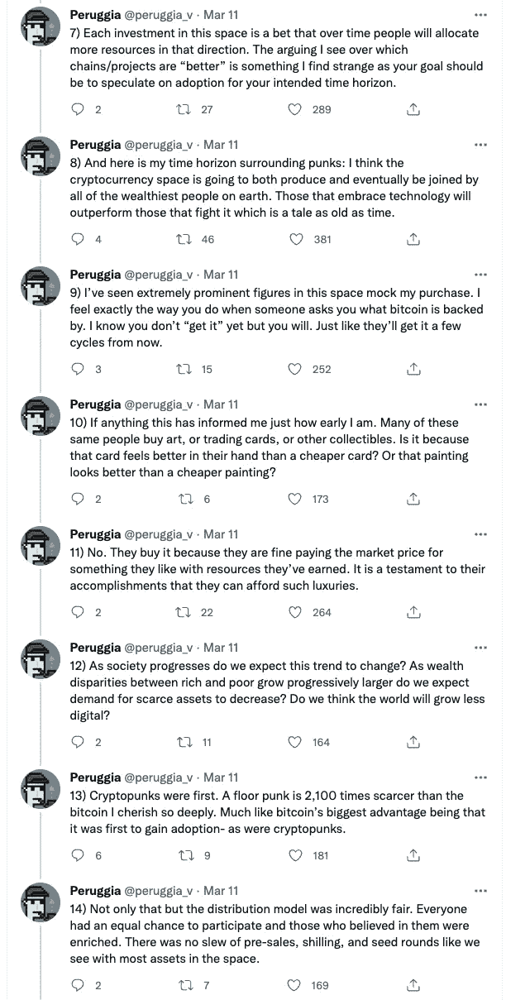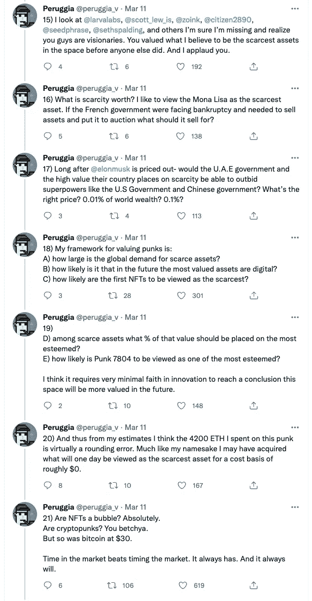

这是谜题的另一部分，来完成我们的故事，为什么不管我们现在是否处于当地时间尺度的泡泡中， 可能会继续令人惊讶地保持价值，并且很可能在足够长的时间范围内进一步飙升，作为理想的凡勃伦商品的典型例子——这种商品在供应上完全有限和稀缺，只会随着越来越多的人加入亚文化而继续升值，因为它成为主流文化， 越来越多的超级富豪决定加入这个最原始、最精英的 NFT 和加密货币俱乐部，随着围绕加密朋克的神话和迷因继续增长，每一个新的知名成员都以前所未有的创纪录高价加入其行列，加密朋克在世界各地无处不在地被迷因和模仿，就像蒙娜丽莎一样。

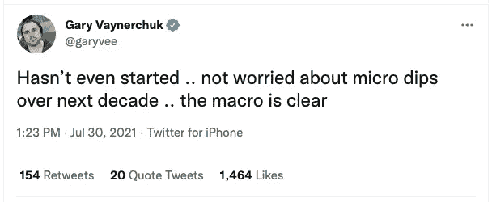

Appropriate timescales are important, and yet sometimes it’s precisely those who shill long term investment in tried and true stocks and bonds who are most quick to proclaim the NFT fad bubble has permanently popped after just a few months of downturn. With any new technology or cultural phenomenon, humans should have learned by now, given our illustrious and unbroken history of misguided skepticism, to wait just a little bit longer before putting out words we don’t want to eat decades down the road. Especially now, when chances are your words will be NFT’d and irreverently memorialized forevermore. As much as the internet is forever, Dan Boneh, professor of cryptography at Stanford and real OG blockchainer, [believes the blockchain is actually forever](https://youtu.be/sKxxc_cfwR0?t=343). Do you really want to be the NFT case study in the year 3000 for our AI overlords’ Pessimists Archive?

我们已经看到这种情况发生了，随着 Visa——是的，字面上稳重的跨国信用卡处理公司——在 2021 年 8 月 18 日以 15 万美元的价格购买了 CryptoPunk 7610，CryptoPunk 的价值又一次大幅上升，引发了对 crypto punk 的新一轮兴趣。佳士得甚至在 2017 年 5 月 11 日进行了一场[9 crypto punk 的拍卖，带来了 1700 万美元](https://techcrunch.com/2021/05/11/cryptopunks-nft-bundle-goes-for-17-million-in-christies-auction/)。一大批名人和其他品牌个人也已经是隐朋克精英的成员，从 [Jay-Z 到 Snoop Dogg 到 Serena Williams 到杰森·德鲁罗到史蒂夫·青木到加里·维纳查克到罗根·保罗到 Dylan Field](https://www.benzinga.com/money/cryptopunks-watchlist-celebrities-and-influencers-who-own-punks/) (即使在出售 7804 后仍拥有许多隐朋克)到如此多的人——一个隐朋克向另一个品牌名人的每一次创纪录销售都进一步增加了隐朋克迷因和品牌的影响力，并进一步巩固了其作为可以要求 Veblen 定价的位置商品的地位。

每一个购买隐朋克的收藏家也会在延续其持续成功方面投入大量资金，当地球上成千上万最富有和最有影响力的人都在共同努力，在他们共同的投资和社区中彰显价值和地位时，会发生什么？我不知道，但我知道我不想打赌。见鬼，Jay-Z 在 Twitter 上的个人资料图片实际上是他的 CryptoPunk ，还有 [Serena Williams 的](https://twitter.com/serenawilliams)(略有修改)，还有 [Snoop Dogg 的](https://twitter.com/SnoopDogg)(有趣的事实——我刚刚得知 Snoop Dogg 的 Twitter 粉丝比 Serena Williams 和 Jay-Z 加起来还多。谁知道呢？).

你能想到哪个品牌有这么多世界上最著名和最有影响力的人都在背后支持它，如此明目张胆地公开宣传它，以至于用它取代他们的个人资料照片？你能想到什么品牌不需要*支付*这些极其成功和著名的影响者数不清的金钱来做这件事，而是*由*这些影响者支付广告的特权和荣誉？你真的想和那个品牌打赌吗，或者你想在失去会员资格之前加入它？

简而言之，现在购买一个密码朋克当然是一个投机性的赌注，但它远不是一个完全没有根据的，根本上是空的投机性赌注。

远非如此，这是在相当多的事情上下注，这些事情有非常强的信号对他们有利—

可以打赌，以太坊和其他加密货币将继续增长，占领市场和心智份额，并有一天可能像今天的互联网和计算机一样主宰和渗透世界，而且—

可以打赌，当这种情况发生时，以太坊上的[第一批文物(即第一批 NFTs)将会有数不清的需求，因为它们不仅具有极其稀缺的历史价值和相应强大的地位象征，而且——](https://newsletter.banklesshq.com/p/punkd-market-monday?token=eyJ1c2VyX2lkIjoyMTk4NzUsInBvc3RfaWQiOjM5NTEwMjc1LCJfIjoieUtaN1YiLCJpYXQiOjE2MzMxNTA2MzYsImV4cCI6MTYzMzE1NDIzNiwiaXNzIjoicHViLTE2MDE1Iiwic3ViIjoicG9zdC1yZWFjdGlvbiJ9.E7rH3mxnRD_bTvfsTLAlXBgdqrTaUZfWJtMio88Qz1U)

这是一个赌注，CryptoPunks 背后的社区，它始于一个坚定的亚文化群，这些亚文化群是真正的、坚定的信徒，他们愿意保持投资并建立他们的艺术作品(社区本身及其背后的历史，总是任何艺术作品价值不可分割的一部分，正如迪伦所建议的那样，可以说是艺术作品)， 现在已经扩展到包括一些世界上最有影响力的个人甚至公司，即使在正在进行的 NFT 革命的最初期阶段，将继续增长和发展，并鼓动加密朋克进一步渗透到全球思想空间，并且—

这是一个赌注，密码朋克的迷因力量将继续自我延续，也有助于这种思想份额的饱和和随之而来的影响，并且—

这是一个赌注，总有一天，NFT 和数字资产会超越物理资产，因为我们意识到，元宇宙远没有那么局限，提供了更多的探索、交流、发现的机会，比物理宇宙多得多，而且—

这是一个赌注，类似地，当这种情况发生时，原始的 NFT 将具有最深刻的价值，并且—

我敢打赌，当世界上所有的富人都热衷于 crypto 和 CryptoPunks 时，它们已经牢固地确立为当代艺术，并在博物馆里展出， 事实上，世界上已经有近 [3000 名亿万富翁](https://en.wikipedia.org/wiki/The_World%27s_Billionaires#2021)和超过 [50，000 名亿万富翁和超过 200，000 名资产超过 3000 万美元的超高净值个人](https://en.wikipedia.org/wiki/Ultra_high-net-worth_individual)(这些数字只会继续增长，因为随着科学和技术继续扩大人类的生产力、资源和价值生产，全世界的总体财富每年都会继续增长) 可能意味着将会有相当多的有钱人愿意为非常非常有限的 10，000 个原始 CryptoPunk NFTs 中的相当一部分支付相当合理的价格。

> 富人似乎想要获得的是经济学家所说的位置商品；向世界证明他们真的很富有的东西。
> 
> 即使你只是中等富裕，100 万英镑几乎买不到任何东西能像当代艺术品牌作品那样产生如此高的地位和认知度——在这个价格上，可能是一幅中等大小的赫斯特作品。炫耀兰博基尼可能会被视为粗俗。法国南部的乡村别墅更好，但最好有小葡萄园，有海景。很多人都买得起小游艇。但是艺术让你与众不同。起居室的墙上挂着一幅清晰可辨的达明安·赫斯特点画:“哇，那不是赫斯特吗？”— [价值 1200 万美元的鲨鱼标本:当代艺术的奇妙经济学](https://smile.amazon.com/gp/product/B0077QZ208/)

是啊，这是一个赌注。但据我所知，这是一个非常他妈的好赌注，我个人在撰写本文的过程中说服自己卖掉我 8 年来精心积累的大量比特币，在此之前从未出售或使用过任何一个比特币，尽可能多地购买加密朋克。

然后，我可能会继续对我的密码朋克产生情感依恋，永远不会卖掉它们，并无意中遵循沃伦·巴菲特的建议，永远持有一段时间，并希望加入这个星球上最有先见之明的一些人组成的精彩社区(并非所有人都只是因为有钱才能加入这个社区， 请注意，今天最大的密码朋克持有者仍然是那些在其他人对这一现象感兴趣之前提前免费或今天舍入误差为零的人，他们出于纯粹的热情、爱， 和信念)，他们将有希望意外地帮助我找到下一个大事情，就像他们找到了通往这个大事情的道路一样——这些亚文化成员令牌的价值是深远的，因为它们真正超越了单纯的资产价值——当然，我们相信从长远来看，资产价值将继续上升——并且可以说，最大的价值是在无形社区中找到的，这些无形社区提供给那些属于亚文化的人，他们永远发现自己在所有人之前探索无限机会的前沿。

正如迪伦提到的，他能够找到通往加密朋克的道路，是因为在其他人对以太坊深信不疑之前很久，他就被以太坊的忠实信徒包围了——我相信加密朋克的忠实信徒同样是你想要在其他人之前找到通往世界上下一个伟大事物的道路的正确的人。在我看来，这是无价的，这就是为什么万事达卡错过了一个真正的黄金机会，允许 Visa 抢购第一个信用卡处理密码朋克。品牌还是模因？增加品牌价值的模因？不管怎样，都是无价的。

你相信密码朋克了吗？如果没有，恐怕我已经超过了我的显然不存在的编辑分配给我的 5000 字的配额，以试图向你推销 CryptoPunks，为了你我的理智，我现在必须继续实际阐述 NFT 给整个资产世界带来的无数技术上的革命性好处。*(我刚刚记起为什么我大约每 4 年才写一篇这样的文章——我花了大约这么长时间才从几天无所事事的时间里摆脱出来，除了无休止地谈论一个话题，直到我所能看到的都是神秘的朋克，渗透到我现实的每一个像素)*

Okay, I couldn’t decide whether or not to put this in the last section about brands or this one, but this one had fewer pictures already and now you already know about CryptoPunks, so here goes. You know what’s another brand? Harvard. This one is for all the Asians out there, after I got a message from my buddy who read this and was like okay I can kind of get it now but my parents will never get it because they think it’s crazy people would ever pay for Nike shoes when you can buy generic shoes off the same factory line for a fraction of the price…and yet no Asian parent would blink twice thinking about casually dropping a quarter of a million dollars on a Harvard diploma when you can get the exact same education from the exact same textbooks for a fraction of a price at a community college. Hell, I still put Harvard in my bylines because it’s a way for me to signal I Am Very Smart And You Should Trust What I Say even though I went there for like, two semesters a decade ago. Brands are incredibly powerful status symbols and we all buy into them, whether or not we believe we do or not. Having membership in the right brand can get you into the right places and earn respect from the right people in incredibly powerful ways. In some circles, Louis Vuitton is the right brand you want, and in some circles, Harvard is the right brand you want, and in some circles…CryptoPunks are the right brand you want. All these brands have value because they’re scarce and elite — getting into Harvard wouldn’t remotely have as much value as it does if everyone could get in and it wasn’t highly gated in some way, but still — there are over 120,600 living Harvard College graduates, and over 315,000 total alumni of Harvard, and still everyone would love to pay $250,000 for a shot at a Harvard diploma (and the same amount for competing Ivy League schools and other schools of the same caliber — hundreds of thousands of brand membership tokens really, that all go for hundreds of thousands of dollars effortlessly every year). There are only 10,000 CryptoPunks — for literally every single rich person on the face of the planet to vie over.

提醒我在 NFTs 上向你推销，而不仅仅是短期的密码朋克。购买密码朋克只是一个开始。我们应该很快就会发现，支持加密朋克牛市论点的许多相同的核心价值主张也可以扩展到许多其他非功能性金融工具，包括现在和未来。

# 第 3 部分:为什么 NFT 让一切变得更好

好吧——希望如果你已经走到这一步，你至少适度地接受这样一种可能性，即一些非功能性思维是有价值的，NFT 的基本价值主张和前提不仅仅是人类社会毫无根据的集体短暂错觉，或者至少如果是的话，很少有东西像集体社会错觉*一样有价值(例如金钱的概念，或者宗教【如果不是你自己的， 至少你可以承认，所有其他的*T4 宗教都是集体的社会错觉，但似乎仍然对世界或者政治有着真正深远的影响。

现在，终于，我们可以进入使 NFTs 成为一项深刻的革命性技术创新的技术层面了。到目前为止，我们已经掩盖了 NFT 的许多技术优势，只是试图将 NFT 近似表示为具有价值的物理稀缺资产的数字模拟。最终，这是最难也是最重要的概念障碍，但也只是 NFTs 提供的新可能性和优势的真正海洋的最小边缘，这些新可能性和优势优于以前的机制，用于分配所有权和价值，指定稀缺性和财产权以及版税，记录完美和永久的出处，实现无摩擦分配，等等。

所以让我们回到基础，更深入地探究一下今天 NFT 是如何精确制造的。正如本文第 2 部分的开头所提到的(现在可能已经淡出了您的脑海深处)，从最广泛的意义上来说，NFT 是存储在一个名为“区块链”的全球分散分类账上的一组数据，它记录了关于谁拥有特定数字资产的一些基本信息，还可能记录了有关该特定数字资产的许多详细信息。

更具体地说，有许多不同的竞争区块链都在努力支持 NFT，但迄今为止最突出、最早(不包括一些从未真正起飞的比特币区块链上的[早期开始)和完善的 NFT 生态系统存在于区块链以太坊，并使用所谓的](https://counterparty.io/)[ERC-721 标准](https://ethereum.org/en/developers/docs/standards/tokens/erc-721/)来定义 NFT，使它们能够在 NFT 生态系统中的相同平台和市场上轻松地互操作。

## NFTs 具体是如何工作的？

首先，让我们解释一下为什么非金融交易主要存在于以太坊，而不是比特币，以及*非金融交易是如何制作的。*

以太坊是目前市值仅次于比特币的第二大加密货币，在许多方面都是比特币的重大发展。你可能知道，比特币是第一种出现在区块链的加密货币。它开创了利用全球分散式分类账(区块链)的革命，目的是以完全透明的方式不可撤销地记录无数假名当事人之间的金融交易。这使得任何人都可以与世界上的任何人进行无信任的交易，而不必依赖于信任第三方中介，如银行。

然而，以太坊是第一个意识到你可以利用区块链的力量和潜力做更多事情的主要区块链。你不仅可以用来存储金融交易，还可以在区块链上存储任何类型的任意数据——包括计算机代码，也就是所谓的智能合同。然后，从某种意义上说，区块链可以变成一种全球分散的计算机，从某种全球分时的意义上来说，世界上几乎任何人都可以使用(剧透一下:这就是为什么以太坊现在的汽油费如此之高，因为有太多的人试图使用同一台可怜的全球分散的计算机——但这很快将是以太坊 2.0 和第 2 层解决方案解决的问题)。

为什么世界上的每个人都想分时使用同一台电脑？听起来像是回到了过去黑暗得多的计算时代，那时每个人都只有一个插在主机上的终端，并为这个有问题的特权支付了大量的金钱，不是吗？关键的见解是共享同一台计算机允许该计算机充当一种全球[状态机](https://en.wikipedia.org/wiki/Finite-state_machine)，其中该计算机(又名以太坊区块链)的状态可以充当关于在该计算机上完成的所有计算和交易以及该计算机上当前存在的所有数据的全局真实来源。

从最简单的意义上说，通过比特币区块链和金融交易，比特币区块链“状态机”记录了世界上每个人拥有的所有比特币的当前状态。当 Alice 决定向 Bob 发送 1 个比特币时，基于从 Alice 接收的输入交易，状态机从其先前的状态(Alice 有 10 个比特币，Bob 有 5 个比特币)改变或转换到其新状态(Alice 现在有 9 个比特币，Bob 有 6 个比特币)。

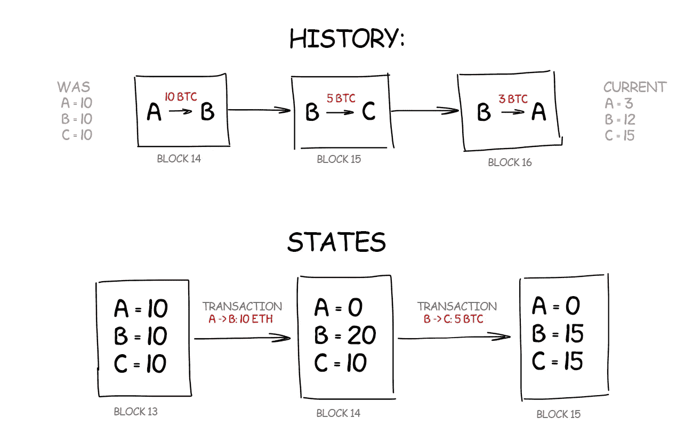

I found this image on a scam site and now I have no idea who to [credit for this](https://i.vas3k.ru/7bq.png), but hey, it gets the point across

事实上，世界上的每个人都可以与这个全球国家机器进行金融交易，这个国家机器作为关于每个人当前的金融余额和过去任何人与任何人进行的所有交易的无可争议的永久真相来源，这是非常有利的，并且支撑了当前世界进行的区块链革命背后的几乎所有事情。

然而，以太坊将这一点提升到了一个全新的水平。当你在区块链上存储代码或智能契约，并允许任何人随意与之交互以修改状态时，你可以为任何一种状态提供一个全球状态机。例如，您现在可以记录世界上所有 NFT 的状态，或所有托管交易，或各种执行状态的所有法律文件，或任何其他东西。简而言之，这就是为什么如果你不打算把所有的钱都投入 NFTs，你至少应该把所有的钱都投入以太坊。委婉地说，智能合约将改变一切，这样我就不会失去对你的所有信任(请继续关注 DeFi 101 和 DAOs 101，只是开玩笑，我再也不会写作了)。

那么，对于 NFTs 来说，这到底是如何工作的呢？简而言之，NFT 是由智能合约定义和创建的(按 NFT 的说法是“铸造的”)，智能合约只是驻留在以太坊区块链上的一段代码，它指定了许多功能，可用于创建代表某些不可替代资产的“令牌”并与之交互，因此，不可替代令牌或 NFT。

这就是以太坊的状态机魔力发挥作用的地方。想象一下，你写了一段代码，允许某人铸造 1000 个不同的 NFT 中的一个，这些 NFT 代表区块链上的猫的独特图像(人们喜欢区块链上的猫，就像人们喜欢互联网上的猫一样，在现实生活中，基本上在任何地方。猫是终极迷因，可以在生物和数字上大量自我复制。

这段代码的工作原理是，它可能有一个名为“mint”的函数，世界上的任何人都可以调用它。调用时，这个铸造函数将检查一些全局计数器变量，首先确保在区块链上铸造的猫少于 1000 只。

在已经铸造了 1000 只猫的情况下，铸造函数将向调用它的用户返回一个错误，从而防止任何人铸造超过 1000 只猫——这是区块链使 NFT 具有可证明的永久稀缺性的一部分，这种稀缺性永远无法规避。然后，mint 函数将继续创建一个新的 NFT 来表示一个新的唯一的猫，并将这个新的 NFT 令牌传送到调用 mint 函数的以太坊用户的地址。

以太坊区块链，然后，作为一个国家机器，保持永久跟踪所有这些变化和活动随着时间的推移。假设 Alice 在当前状态下拥有 888 ETH，并调用 RandomCat NFT 智能合约的 mint 函数，并将 69 ETH 作为创建 RandomCat #420 的付款传递给它。

以太坊区块链状态机将在此交易后记录新的状态，其中 Alice 现在将只有 819 ETH，但她的钱包地址中将拥有一个代表 RandomCat #420 的 NFT 令牌，并且 RandomCat NFT 智能合约地址现在将更丰富 69 ETH(智能合约就像其他任何东西一样只是钱包地址，也可以保存钱！).

现在假设爱丽丝决定以 100 ETH 的价格把她的随机猫 NFT 卖给鲍勃。作为该事务的结果，以太坊区块链状态机现在再次转换到新的状态，并且现在记录了这样的事实，即 Alice 具有 919 ETH 并且没有 RandomCat NFTs，并且 Bob 现在具有少 100 个 ETH 但是多了一个 RandomCat #420 NFT。

这就是拥有一个全球共享状态的力量——现在，世界上的每个人都可以与其他任何人进行交易，做任何事情，包括创建、出售和转让 NFT，世界的状态和每个人的以太坊余额以及他们拥有的所有 NFT 的余额，以及所有 NFT 的来源和历史都将被公开记录，世界上的任何人都可以随时查看。

## 不再有假冒的路易威登

因此，这样做的一个巨大好处是，对于任何人来说，核实一幅 NFT 作品的真正出处和现在的所有权都是微不足道的。地狱， [Twitter 实际上正在实施 NFT 验证](https://decrypt.co/82216/twitter-shares-sneak-peek-ethereum-nft-verification)，正如我们所说，这将使 Twitter 用户能够通过简单地连接他们的以太坊钱包地址来证明他们确实拥有他们设置为个人资料图片的任何 NFT(例如，CryptoPunks)，这样 Twitter 就可以快速检查给定以太坊钱包地址中所有 NFT 的余额。

还记得上一节提到的所有奢侈品牌都具有品牌本身的价值吗？我们在那一节谈到了为什么一个路易威登包比一个没有路易威登标志的完全相同的包要贵出无数倍？

当然，这为奢侈品的真实世界中的赝品引入了巨大的经济刺激——赝品如此之好，除非你是专家，否则几乎不可能区分好的赝品和真品。

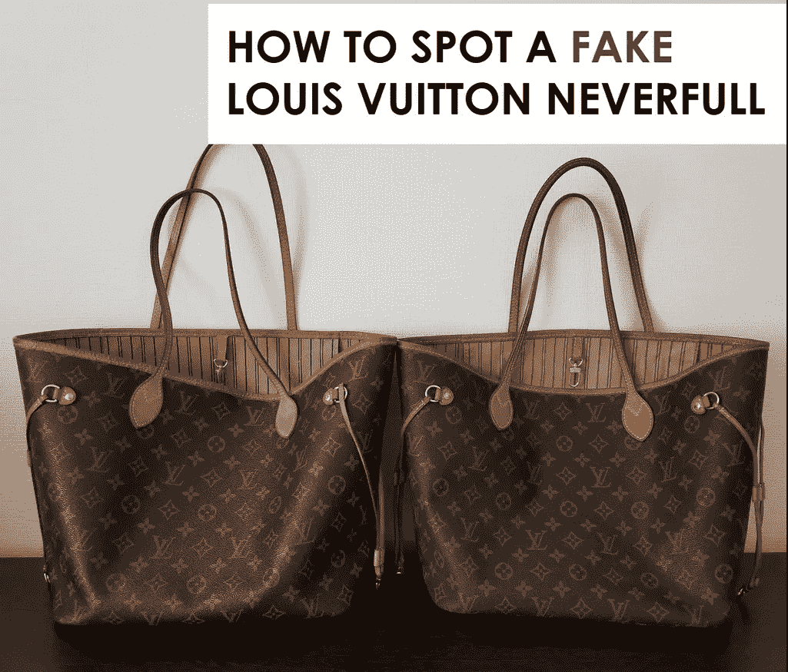

Quick five seconds tell me which one is fake and which one is real, shit where’s the smart contract address

对于 NFTs，这是一个很容易解决的问题。只要你有可靠的事实来源指向创建 NFT 的原始智能合同(通常是一个项目的官方网站或带有蓝色勾号的经过验证的 [Opensea](https://opensea.io/) 收藏，等等)，你就可以很容易地验证给定用户是否拥有真正的 NFT(或任何 NFT，而不是只是右击保存的 JPEG)。更好的是，实际上，像 Twitter 这样的平台将在未来为你处理所有这些跑腿工作，这样你甚至不用自己做任何检查——你就知道了。那真他妈的强大，不是吗？

**买者自负，NFT 世界现在仍然是一个蛮荒的西部，诈骗和假货比比皆是，他们利用各种手段来掠夺那些不太熟悉区块链如何工作的用户，以便适当地使用它来验证真实性——随着空间的成熟，这无疑会得到解决，但截至目前，用户必须成熟，真正理解 NFT 如何工作和区块链如何工作，以便既不会购买假的 NFT，也不会被黑客攻击而失去他们所有的真的 NFT。我和我的妻子目前正在为这个领域的新人准备一个骗局/欺诈/网络钓鱼避免教程/认证，但是如果你选择在我们有时间把所有这些资源都准备好之前大胆地自己前进…小心行事，永远不要相信这个领域里任何人告诉你的任何事情，除了我*

*更新:*

## 标准真他妈的牛逼

好了，现在我们希望至少对 NFT 实际上是如何制作的以及区块链上的 NFT 在记录保存和真实性验证方面有多棒有了一些概念，让我们回到我们谈论的在以太坊区块链制作 NFT 的 ERC-721 标准。

[ERC-721 标准](https://docs.openzeppelin.com/contracts/3.x/erc721)规定了一组[基本功能](https://docs.openzeppelin.com/contracts/3.x/api/token/erc721#ERC721)，每个符合该标准的 NFT 都必须具备这些功能，并保证所有这些功能以完全相同的方式运行。

分享关于如何定义 NFT 的标准定义是开创性的，就像分享关于充电电缆或灯泡尺寸的相同标准是开创性的一样。现在的世界是不是好了很多，大多数东西都使用 USB-C 充电端口，你只需要一个充电器就可以给你所有的设备充电了？

因为目前以太坊区块链上的几乎所有 NFT 都是以相同的方式定义的，以符合 ERC-721 标准，这意味着任何人都可以创建一个以太坊 NFT 的市场，然后能够连接到以太坊用户的钱包，自动扫描用户拥有的所有 NFT 的钱包，并允许它们被显示以供销售或转让，而不必手动编码定制实现以允许每个单独的独特 NFT 的销售和转让。

## 大幅降低效率，增加公平获取

在某种程度上，你可以认为这就好像存在一个全球通用的艺术品自动售货机，任何人都可以在自己舒适的家中立即购买。有了这台机器，每一件艺术品都可以通过相同的一系列按钮点击来购买，每一件新的艺术品都可以无缝地添加到每一件其他艺术品旁边，完全不需要任何人的手工劳动。那会很方便，对吧？

这难道不是对目前实物艺术品市场潜在的低效率的一个小小的改进吗？当今世界上不存在一个统一的艺术品存储库和市场，即使有，也会带来一些严重的垄断问题(NFT 世界的分散式区块链替代方案不存在这些问题— [web3 准确地打破了平台锁定，这实际上允许 web2 互联网公司垄断行业](https://ethereum.org/en/developers/docs/web2-vs-web3/)),在公司拥有的数据库中有专有的孤岛数据。

相反，如今的实体艺术市场令人绝望地支离破碎，这极大地限制了艺术家和收藏家之间公平、民主的接触，将富有的收藏家锁定在一组非常有限的精心策划的艺术品中，这些艺术品更少是通过在线文化传播的民主力量策划的，更多的是通过一个非常精细的网络[经销商、代理商、画廊、拍卖行和销售人员](https://cryptohayes.medium.com/jpeg-the-jeweler-f626c40384cf)。

在当今世界成为精品艺术并拍出令人难以置信的价格的艺术品，往往只经过少数聚集在西方世界的[精英](https://en.wikipedia.org/wiki/Larry_Gagosian) [拥簇者](https://en.wikipedia.org/wiki/Charles_Saatchi)之手。这使得来自世界各地的绝大多数全球艺术家几乎不可能真正打入高端当代艺术市场。

相反，即使是最基本的 NFT 平台今天也在蓬勃发展，访问变得对每个人来说都更加容易，允许来自任何地方的所有人才都有公平的机会冲击文化时代精神并使其变得强大。举个例子——我购买的大部分 1/1 限量版 NFT 艺术品来自世界各地的艺术家，他们迄今为止完全被传统艺术市场拒之门外。如果不是因为 NFTs 和互联网，我永远也不会有幸接触到这些艺术家。

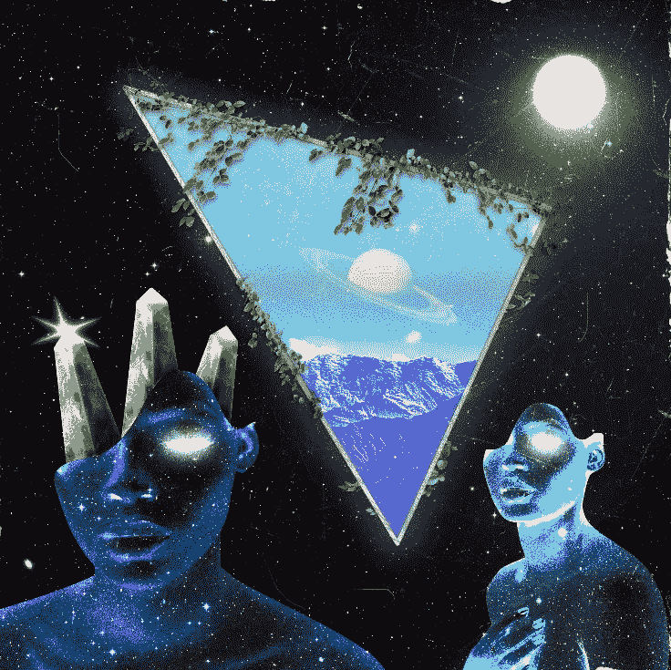

Here’s a piece I bought from the incredible [Ghanian artist Afroscope](https://foundation.app/@afroscope)

通常，传统艺术市场在某种程度上也剥削艺术家，拿走大部分利润，而留给艺术家自己的却很少。受人尊敬的收藏家会定期抢购艺术家的作品，这些艺术家几乎没有直接影响力，也没有能力以低廉的价格直接出售给公众，但几年后他们会以 100 倍或更高的价格出售这些作品:

> 更引人注目的是两人最初支付的价格(有些是在拍卖前几年支付的)和他们在拍卖会上获得的价格之间的差异:赛·托姆布雷的一幅画，最初以 750 美元购买，到了 4 万美元；贾斯珀·约翰斯 1965 年以 1 万美元左右的价格购买的双白地图以 24 万美元的价格售出。
> 
> 罗伯特·劳申伯格以 900 美元的价格将他 1958 年的作品《解冻》卖给了斯卡尔，现在看到它带来了 8.5 万美元的收入，拍卖后他臭名昭著地与罗伯特·斯卡尔对峙，推搡收藏家，指责他剥削艺术家的劳动。评论家芭芭拉·罗斯(Barbara Rose)在随后一个月发表在《纽约杂志》(New York magazine)上的一篇题为“没有荣誉的利润”的尖锐文章中，将这次拍卖描述为“艺术界崩溃的时刻”

当一名收藏家在传统艺术市场的二次销售中出售一名艺术家的作品时，该艺术家(至少在美国这个最大的艺术品销售之乡，以及世界上其他许多地方)看到的销售额为零。如果他们以 900 美元的价格出售一件作品，然后它以 85000 美元的价格出售，然后又以数百万美元的价格出售，艺术家除了第一个 900 美元之外什么也看不到。

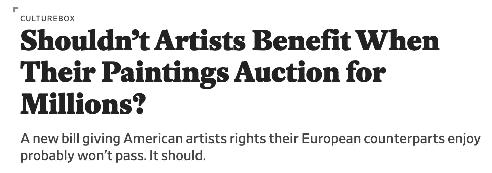

[Why do we need legal bills to support artists’ rights when we have irrevocable code?](https://slate.com/culture/2014/06/artists-royalties-and-droit-de-suite-the-american-royalties-too-act.html)

> 现在，国会有了这样的机会:最近提出的《美国版税法案》(A.R.T .)，该法案将在拍卖中转售艺术家的作品时，给予他们 5%的利润分成。该法案有其缺陷:它仅适用于拍卖，不适用于私人交易。但与拍卖行 12%至 25%的买家溢价相比，5%也是一个微不足道的公平份额——尽管即使是 5%看起来也太大了，无法从门缝里钻出来。该法案的早期版本《视觉艺术家权益法案》在 2011 年未能吸引到一个联合发起人，在过去的几年里，佳士得和苏富比已经花费了超过 100 万美元游说反对版税。在撰写本文时，govtrack.us 给出了 A.R.T .法案获得通过的 2%的可能性。

## 编入艺术品本身的永久二次销售版税

有了 NFTs，情况就不同了。这个社区已经形成了一个规范，即艺术家的作品在首次出售后的第二次出售中，每次都会获得版税——通常在 5-15%的范围内——这种版税可以直接编程*到 NFT 的智能合同中。*

目前，大多数 NFT 艺术品市场已经在其智能合同中实施了自己的版税代码，为创作者创造了非功能性艺术，并且有一个[以太坊改进提案](https://ethereum.org/en/eips/)尚未完成，为如何在创造非功能性艺术的智能合同中指定版税创建一个[通用标准](https://eips.ethereum.org/EIPS/eip-2981)。

几乎可以肯定的是，在没有任何法律法规的情况下，NFT 生态系统将几乎普遍执行和尊重由创作者编入 NFT 的版税，就像他们几乎已经普遍做到的那样。因此，艺术家现在拥有前所未有的能力，可以从他们未来的成功中获利，因为他们的名气越来越大，价格越来越高——即使这发生在他们去世之后，历史上许多最著名的艺术家都是如此，比如梵高。

这些版税将永久存在，在产生代表艺术品本身的 NFT 的代码中指定。艺术家可以将所有这些版税留给他们的遗产，即使他们一生只赚了几千美元，如果有一天他们的艺术爆发了，全世界开始为它支付数亿美元，艺术家的后代将不会一文不名，但事实上，他们将从每笔二次销售中获得数百万美元，比如 10%的永久版税。

艺术品的估价几乎比其他任何东西都更加多变，在时间尺度上的变化幅度都可以超越艺术家短暂的生命——这是有史以来第一次，艺术家可以放心，他们的工作将继续以不可改变的方式永远回报他们，这是由区块链上永远存在的代码保证的。

## 砍掉寻租的中间商，引入流动性

亚瑟·海斯(Arthur Hayes)写了一篇[的精彩总结](https://cryptohayes.medium.com/jpeg-the-jeweler-f626c40384cf)，阐述了为什么传统艺术市场效率低下、麻烦重重[的寻租者](https://en.wikipedia.org/wiki/Rent-seeking):

> 交易模拟艺术品非常昂贵，因为在从创作者到收藏者的整个过程中，各种代理人之间存在巨大的差价。这些费用是必要的，以支付创造一种环境的巨大成本，在这种环境中，富人愿意为本质上无用的东西花钱。
> 
> 画廊老板是收入丰厚的第一线。他们正试图发现下一个热点。画廊类似于交易所。他们培养了一批富有的赞助人，并与他们认为会引起收藏者共鸣的艺术家达成独家经销协议。对于这项服务，画廊在艺术品上采取两位数百分比加价的形式。从表面上看，这种差距似乎令人震惊——但画廊有真正的成本要支付。画廊必须支付租金，才能在纽约、伦敦、香港、上海、巴黎、东京等世界金融中心的黄金租赁区经营一个奢华的白墙空间。画廊必须举办展览，免费提供昂贵的酒和小吃，以吸引潜在的买家。最后，画廊还必须削减他们的销售人员。**销售人员拿 10%到 20%的佣金并不少见**。这是一级市场。
> 
> 一旦到了“合适”的收藏家手里，真正的乐趣就开始了。画廊和收藏家共同努力，创造出这位艺术家的作品值得拥有的印象。他们努力让作品在博物馆和全球展览中展出，以营造高品质的吸引力。因为显而易见的原因，快速翻动作品的收藏家会被人瞧不起。如果艺术品转手太快或太多次，就会显得太“商业化”。艺术不是一种可以买卖的大众商品，它是一种许多人都可以看到的无价之宝，但只为少数开明而富有的人所拥有。从本质上来说，这种预期是，一旦你在一级市场买了东西，你就会持有一段时间。快速的流动性几乎不可能获得，试图创造一个真正的市场就像一个价格阻尼器。
> 
> 当收藏家之间交易作品时，佳士得和苏富比等拍卖行会拿走一磅画布。**他们通常收取拍卖价格的 20%**，但他们有时会向卖家保证一个价格，这将市场风险引入了他们的商业模式。拍卖行雇佣专家来讲述一件艺术品的精彩故事，从而吸引其他收藏家来竞拍这件作品。他们还试图向市场保证某件艺术品不是赝品(这一点他们经常失败)。
> 
> 这个简短解释的目的是为了说明**传统艺术品很少易手，交易成本是天文数字，因为所有的嘴都需要养活才能保持市场运转。虽然艺术品市场每年交易数十亿美元，但更高的透明度和更低的费用将创造一个更有活力的市场。**

最后一句话至关重要——传统艺术市场中的中间商收取的这些过高的费用产生了巨大的[无谓损失](https://en.wikipedia.org/wiki/Deadweight_loss)，这极大地抑制了当今艺术市场的整体规模，尤其是交易量。当每一次艺术品易手时，你最终可能会损失 20%或更多的销售价格，艺术品易手的频率会大大降低，甚至会有更多的艺术品被购买，这样的溢价威胁着买家收回投资价格的可能性。

NFT 市场摆脱了这一切，在很大程度上是因为所有的艺术都是完全数字化的，可以很容易地在无限可扩展的虚拟画廊中展示，供世界各地的数百万人观看(例如，你可以在这里看到[我的画廊](https://oncyber.io/intenex)，尽管[的画廊](https://oncyber.io/6529ab)的[人](https://oncyber.io/vvault) [比我更](https://oncyber.io/morellovoid) [更有钱](https://oncyber.io/vvd)比我更[酷](https://oncyber.io/))。由于这是文化的一部分，新的暴发户非常乐意放弃他们的数百万财富，所以没有必要支付位于世界各地最富有的城市和最昂贵的房地产的极其昂贵的实体画廊的开销。没有开胃菜，没有服务员，没有拍卖人，没有销售人员，没有巨大的中间人佣金。

艺术家现在也可以在数字平台上直接向收藏家出售作品，如 [Opensea](https://opensea.io/) 、 [Foundation](https://foundation.app/) 、 [Rarible](https://rarible.com/) 、 [MakersPlace](https://makersplace.com/) 等等。不再需要代理人代表你，或者等待画廊选择展示你的作品，或者不能自己设定价格和条件，或者其他任何事情。当涉及到 NFTs 时，控制权和杠杆作用正牢牢地转移到创造者的手中，而不是中介的手中。

## 看好虚拟现实？这是对非正规金融机构的看好

NFTs 和数字艺术在未来的预期吸引力的很大一部分取决于整个[元宇宙](https://en.wikipedia.org/wiki/Metaverse)的概念，这是我需要写一篇元宇宙 101 文章来适当说服怀疑论者的另一件事。

我只想说，如果你*确实*相信虚拟现实之类的东西，并且确实相信我们未来虚拟世界的保真度和连贯性将会随着时间的推移而不断提高，那么我们未来将会在虚拟现实中花费越来越多的时间，就像我们中的一些人已经花了大部分时间呆在一个矩形的屏幕上，通常比我们的手还小，我们中的许多人将主要生活在虚拟现实中，而不是物理现实中。

当那一天到来的时候，随着完全不受物理约束的虚拟空间提供无限更大的可能性，数字 NFT 与物理有形商品相比可能有多少价值？数字资产不是在很多方面都比实物资产优越吗？它们可以无限扩展，不受地理限制地被数百万人观看，并且以实际上不可能在现实生活中复制或表达的方式构造，事实上甚至可以是完全动态的交互式沉浸式体验，利用代码以任何物理对象都不能的方式改变。

以下是来自[马克·扎克伯格的一些精选语录，讲述了他为何将脸书的未来押在元宇宙](https://www.theverge.com/22588022/mark-zuckerberg-facebook-ceo-metaverse-interview)上:

> 我们将有效地从人们认为我们主要是一家社交媒体公司转变为一家元宇宙公司。
> 
> 你可以把元宇宙想象成一个具体化的互联网，在这里你不仅仅是观看内容，而是置身其中。你会感觉和其他人在一起，就像你在其他地方一样，有不同的体验，比如跳舞或不同类型的健身，这些体验在 2D 的应用程序或网页上不一定能做到。
> 
> 我不认为这主要是关于更多地参与互联网。我认为这是关于更自然地订婚。
> 
> 我们基本上是通过这些发光的小矩形来调节我们的生活和交流。我认为人们不应该这样互动。

无论如何，说到无限规模和复制…

## 免费的无限复制是一个了不起的特性，而不是一个错误

正如我们在第 2 部分中提到的右键单击保存论点一样，数字资产可以被世界上任何人免费无限复制，这一事实通常被视为数字资产相对于物理资产的巨大劣势。但现在我们已经满怀希望地解决了这个表面问题，现实变得清晰:数字资产完美复制中的无限冗余，加上单一所有权的不可改变的概念，是对当前物理事务状态的巨大改进。

世界上一些最昂贵的艺术品要么毁于意外火灾或 T2 战争，要么被盗，甚至完全丢失。即使不是[丢失的](https://en.wikipedia.org/wiki/Lost_artworks)、[毁坏的](https://www.businessinsider.com/destroyed-art-2011-5)或[被盗的](https://en.wikipedia.org/wiki/List_of_stolen_paintings)的东西也常常会随着时间的推移而退化，就像[达明安·赫斯特制作的价值 1200 万美元的鲨鱼，然后不得不替换，因为第一个已经退化到必须剥下鲨鱼的皮并且只能展示鲨鱼皮的程度*(顺便提一下，赫斯特承认这首先引发了一个关于艺术的物理表现本质概念的有趣的哲学问题——引用，“这是一个很大的困境艺术家和保护者对什么是重要的有不同的看法:原始艺术品还是原始意图。我来自一个*](https://en.wikipedia.org/wiki/The_Physical_Impossibility_of_Death_in_the_Mind_of_Someone_Living#Decay_and_replacement) [*观念艺术*](https://en.wikipedia.org/wiki/Conceptual_art) *的背景，所以我觉得应该是意向。”[简而言之，如果你支持任何形式的概念艺术运动，你应该真的喜欢 NFT 和 crypto 朋克——物理艺术只是思想、历史、背景和其他一切的象征，这才是真正的艺术作品]。*

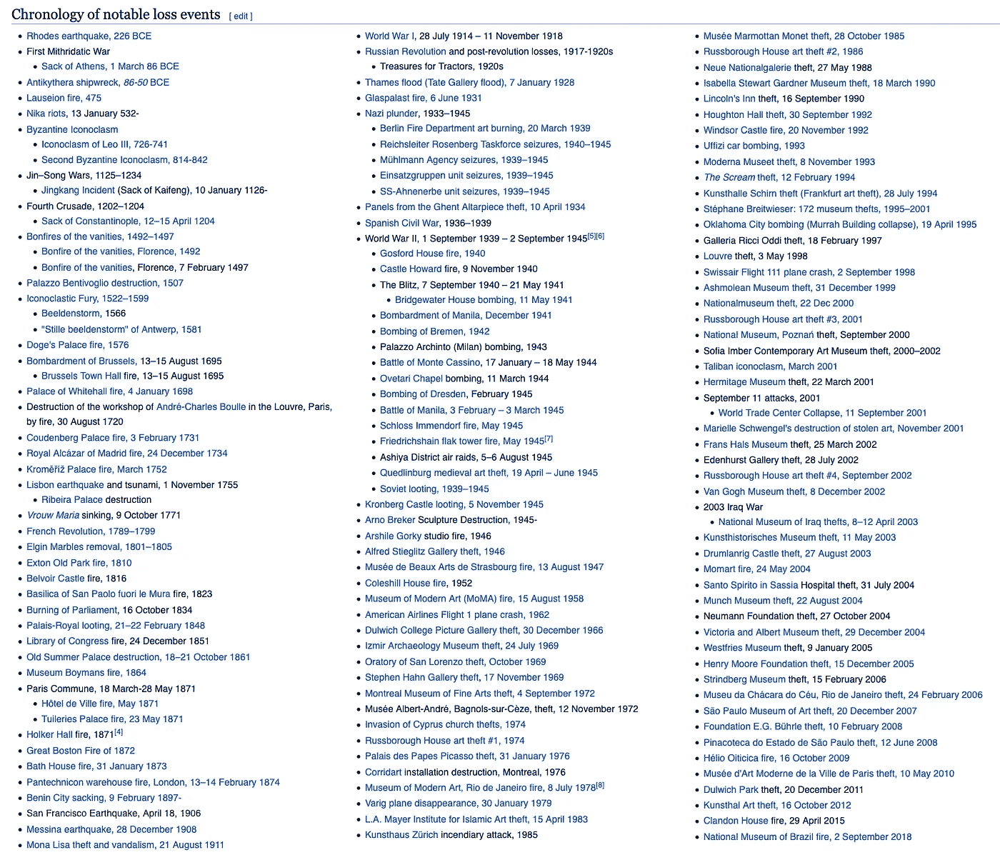

Look at all the ways you could lose your art piece over the years in real life! The only one of these that seems remotely plausible in the metaverse is the Doge’s Palace fire of 1576.

有一些警告*，这对于非功能性测试来说几乎是不可能的。NFTs 永远不会降级，当艺术品被直接存储在区块链上时，只要区块链永远不会停止存在，它们就永远不会停止存在，这可能是永远不会的(下一节将详细介绍)。事实上，这些数字资产可以以完美的保真度精确地复制一万亿次，这有助于这一事实，相比之下，在物理现实中，如果你在数百年至数千年的时间里不小心搞砸了一次，一件艺术品必须被保存，这就永远结束了。

好了，警告时间。因此，确保您的 NFT 所代表的艺术作品**确实存储在区块链* *上以获得最大程度的安全性是很重要的，但这通常并不太可行，因为直接在区块链上存储东西的成本非常高。下一个最好的做法是确保它存储在一个* [*分散的点对点文件共享网络*](https://ipfs.io/) *如 IPFS，它利用广泛分布的分散冗余来确保您的文件不会在像 AWS 这样的集中式服务可能倒闭或服务器崩溃时消失。这实际上是绝大多数 NFT 所利用的，但即使这样，如果你不* [*将你的数据*](https://docs.ipfs.io/concepts/persistence/) *固定在 IPFS，它也会被垃圾收集并消失。还有其他基于分散式区块链的解决方案，如*[*Arweave*](https://www.arweave.org/)*，旨在永久存储所有数据，因此情况正在好转，但截至目前，当涉及到长寿时，仍有一些警告需要注意。**

*这个等式的另一部分是，作为 NFT 的所有者，你也需要确保你不会丢失以太坊钱包的私钥。如果你丢失了你的私钥，NFT 将永远存在，但是你只是…将不能访问它。有点像如果你有一个真正的不可渗透的保险库，由一把无敌的锁保护着，你可以在里面存放你所有的艺术品，然后你就哇！丢了钥匙，所以是的，别这样。也不要把你的私人钥匙给任何人，因为那样他们很可能会偷走你的作品*

*不管怎样，继续吧:*

## *事实上，与实物相比，NFT 具有更大的持久性和长期价值保持能力——也不会退化！*

*人们常说互联网是永恒的，但这并不像人们通常认为的那样正确。互联网的长尾经常被遗忘，消失在时间的沙子中，更重要的是，随着网页和内容日复一日地动态变化和发展，旧版本的内容经常会永远消失，即使一些新版本仍然以某种形式存在。这使得致力于直接保存互联网内容的明确项目和基金会的形成成为必要，例如[互联网档案馆](https://archive.org/)，如果没有它，无限多的内容可能已经丢失，并且每天仍有许多内容丢失。*

*然而，区块链确实可能是永远的，甚至区块链过去的所有状态变化，作为区块链永远存在的必要条件，也在这里永远存在。*

*这是一个极端的说法——坦白地说，连我都有点吃惊，这就是为什么我对自己不是这个说法感到非常欣慰。相反，所有对大胆的指责都可以直接归咎于一个比我更受尊敬、更聪明、更有预言能力的学者，他也可以顺便承受比我好得多的古怪行为带来的声誉损害。*

*来认识一下[丹·博纳](https://en.wikipedia.org/wiki/Dan_Boneh)，区块链领域最受尊敬的学者之一，斯坦福大学区块链研究中心[的负责人](https://cbr.stanford.edu/)，自从网络泡沫出现之前，他就一直是那里的密码学和计算机科学教授。这是他在与 a16z 普通合伙人克里斯·狄克逊和阿里安娜·辛普森的一次谈话中所说的话*

> *非森林公园对于区块链来说是一个完美的应用——有趣的是，区块链如此适合非森林公园的原因是因为区块链的持久性。你今天放在区块链上的东西会永远留在那里。我认为比特币和以太坊区块链将永远伴随着人类。*
> 
> *在 3000 年，未来的时代，我们仍然会看到以太坊和比特币区块链。也许它们不会被这样称呼——也许我们会用 Eth 15 代替 Eth 2，但是你今天放在它们上面的数据在 3000 年仍然可用。*
> 
> *我认为理解这一点非常重要——当你今天买了一个 NFT，NFT 将永远属于你，直到你卖掉或送人。所以，如果你不卖掉它，把它留给自己，即使到了 3000 年，它仍然是你的，或者是你的后代。我认为，这种持久性在区块链如此适合非森林旅游的原因中起着关键作用。*

*坦率地说，如果今天的大多数实物艺术在 3000 年仍然存在，我会感到震惊，正如我非常肯定 1000 年的绝大多数艺术已经永远消失了一样。但实际上区块链上的所有东西可能都还在，所以如果你真的关心你的曾、曾、曾、曾、曾、曾、曾、曾的孙辈，他们肯定是矩阵塔里最酷、最富有的孩子，拥有最多的 OG 艺术品，你可能想在遗嘱里把 NFT 而不是实物艺术品传下去。*

## *创作者和粉丝之间一致的经济激励——粉丝现在都是投资者，数字创作者有史以来第一次可以直接从他们的作品中赚钱*

*我在第二部分谈到密码朋克时顺便提到了这一点，我注意到所有这些极具影响力的名人和其他品牌和品味创造者不仅没有像疯狗一样宣传密码朋克，将这些像素化的朋克贴满他们的个人资料照片来代替他们的真实面孔，而是实际上*支付了*几千万到几百万美元来获得作为呃反向支付推广者的特权？*

*让我们暂停片刻，让这个概念真正深入人心。直到今天，数字内容创作者/艺术家通常通过将他们的技能出卖给有固定工作的大公司或他们的粉丝并收取佣金来谋生，或者通过出售他们作品的廉价印刷品和商品，或者通过广告和品牌推广收入流，或者通过在像 Patreon 这样的网站上乞求赞助，希望粉丝主要出于他们内心的善良给他们钱，或者以上所有方式的某种组合。*

*这很有效…对一些人来说没问题，对另一些人来说一点也不，但对任何人来说都不理想。本质上，创作者想要做的是成为创作者，创造他们想要创造的*，并在理想情况下仅通过这样做就能致富，而不必乞求赞助或以他们的作品是实物而不是数字的一小部分出售他们的作品，或者不得不通过广告等方式“出售”他们的作品。**

*现在，有了 NFTs，这第一次成为可能。创作者可以将他们的数字内容/艺术作品直接出售给粉丝和收藏者，如果是一个物理上有限和稀缺的内容，价格可能会相同，并且从这个过程中获得的收入远远超过他们过去通过任何复杂的手段勉强维持生计的收入。*

*更重要的是，粉丝们实际上以破纪录的价格购买这些数字作品，不是出于他们内心的善良，而是因为他们实际上期望作品要么保持其现值，要么在未来升值。简而言之，粉丝们都成了创作者共同事业中的*投资者*，现在，他们拥有既得利益和一致的经济利益，比以往任何时候都更有动力和激励去说服他们选择的青睐的创作者，并确保这些创作者持续快速的增长和成功。*

**

*I bought this piece from [Digital Blasphemy](https://en.wikipedia.org/wiki/Digital_Blasphemy), arguably the most well known OG computer wallpaper digital artist in the world, for $10,000\. Well over a decade prior, I had torrented all of his artwork for free and used it without paying a cent. I now regularly retweet his ongoing NFT auctions and rabidly help promote his work for free, as it helps drive up the price of my work in turn (this was one of the earliest pieces he ever sold as an NFT, and some of his more [recent auctions have gone for over $34,000](https://foundation.app/@dBlasphemy/~/92680)). On top of that, purchasing one of these NFT pieces by this digital artist I’ve admired for so many years has given me unprecedented access as a fan to actually become friends with him, to the point that [he’s even actually gifted me NFT artwork he’s collected himself from other artists he admires](https://foundation.app/@shereefiala/~/93891). How cool is that?*

*多不可思议啊。内容创作者不再是唯一的营销者，他们作为创作者和推广者两班倒地工作——每一个购买他们的 NFTs 事实上的志愿者的粉丝也作为推广者签约，并且很快，希望这一小群真正投入的粉丝将自我复制成一个非常大的粉丝大军，创作者可以休息内容，只做他们喜欢的事情，而不是别的:创造。*

## *琐碎的 NFT 资产所有权的分割！*

*如果我成功地说服你，密码朋克实际上值得他们现在的估价，你可能会去看看最便宜的密码朋克的现行价格，然后像我一样，在意识到最便宜的密码朋克现在超过 40 万美元后，流下愤怒、沮丧、绝望和存在主义虚无主义危机的眼泪。*

*但是不要害怕，因为 NFT 已经解决了这个问题，而且对于今天大约 3.5 美分的[低价](https://coinmarketcap.com/currencies/punk-floor/markets/)，你也可以[购买你的一份 CryptoPunk](https://fractional.art/vaults/0xb35ed5c39f371f2cd4bc2edab1f8da314168186a) ，而不必购买全部。当然，花大约 3.5 美分购买 1 个楼层代币，你将拥有 1/9，615，385 个单独的密码朋克，所以在让自己成为一个完整的密码朋克之前，你还有一段路要走，但是嘿——从某个地方开始并努力向上总是好的。它甚至没有那么糟糕——底价实际上是以折扣价交易的，按比例来说，是相对于今天在野外的整个隐朋克的实际底价。*

*有 1，000，000，000 个代表 104 个加密朋克的所有权股份的楼层代币，在目前的价格下，所有这 104 个加密朋克的隐含估值约为 36，500，000 美元，即每个加密朋克约为 350，000 美元，比你可以购买的最便宜的单个加密朋克便宜 50，000 美元以上！一点也不差。*

*简而言之，很多人已经意识到，如今市场上一些最受欢迎的 NFT 收藏品，普通消费者很快就买不起了。然后，这些人通过创造流动性市场解决了这个问题，在流动性市场中，单个 NFT 作品或一篮子非金融资产可以被细分，买家可以购买给定 NFT 的一小部分，并随着时间的推移获得 NFT 的潜在增长，而不必一次性支付整个 NFT 的大笔资金。*

*分数(Fractional)和 [Niftex](https://www.niftex.org/) 只是让用户能够购买分数的非艺术作品的两个项目，这种体验已经比试图购买分数的实物艺术品更无缝、更容易获得，而且没有大量的中间人费用*

## *用你的 NFT 资产作为抵押的小额借款！*

*另一方面，也许你已经像我一样把一生的积蓄都投资到了非正规金融机构，现在正像我一样为付房租而苦苦挣扎。如果这是你，不要害怕。你现在可以使用像 [NFTfi](https://nftfi.com/) 这样的平台，把你在 NFT 的资产作为贷款的抵押，继续不无家可归，同时也继续不必出售你的 NFT 来支付这一特权。*

*如上所述，这样做的整个过程已经比物理艺术更加无缝和可及，并且随着时间的推移，随着空间的成熟，只会变得更加无缝。拥有这样一个流动性强、可组合的数字资产市场所带来的可能性确实是无穷无尽的。*

## *跨应用程序/整个元宇宙的可移植资产*

*让我们快速回到游戏，这样我们可以更好地说明 NFTs 的另一个巨大优势。这一优势牢牢占据了 Web3 与 Web2 的整个主题，在 web 2 中，数据/数字资产归个人所有，而不是由大公司所有，如社交媒体中的脸书、Youtube、Twitter、Instagram 等，以及游戏中的 Valve、Epic、索尼、任天堂、微软、动视暴雪、Riot、EA 等。*

*资产所有权的这种转变带来了什么？大约有一百万件事情，但是现在让我们只关注一件事情——您的资产在不同应用程序之间的可移植性。现在，如果你在 Epic Games 制作的游戏中拥有一个数字化身，这个数字化身存储在 Epic Games 的集中和孤立的个人公司数据库中，不能被其他开发商制作的各种其他游戏或其他应用程序自由访问和引用。*

*这似乎是一个有点奇怪的概念，因为事情一直是这样的，它可能看起来没有问题，但现实是它一直在抑制大量可能的应用程序，用户的资产可以在多个游戏之间无缝转移和利用，甚至更广泛地在整个元宇宙。*

*事实上，这是阻碍当今元宇宙整体增长的核心问题——如果没有全球可访问和分散的区块链上的 NFTs，您在元宇宙拥有的所有数字资产很可能会被各种公司孤立和集中拥有，这些公司以不一致的动机竞争孤立您的数据和资产，以保持平台锁定的效果，因此您不能带着您的数据溜到一个不那么垄断和霸道的竞争界面，以任何您喜欢的方式使用您的数据。*

*有了 NFTs，你真正拥有了你所有的数据，另一方面，你可以自由地允许任何你想使用的应用程序使用这些数据——这样，在未来，你就可以真正生活在 [Ready Player One](https://smile.amazon.com/Ready-Player-One-Ernest-Cline/dp/0307887448) 或 [Daemon](https://smile.amazon.com/DAEMON-Daemon-Daniel-Suarez/dp/0451228731) 风格的元宇宙中，在那里你的化身及其物品可以在游戏、世界和其他虚拟体验之间自由旅行，一切都无缝连接在一起。现在有点疯狂和牵强，所以如果它没有引起你的共鸣，不要太沉迷于这些东西——我只是把这些东西扔给你们当中真正的信徒。未来来了，真他妈牛逼。*

## *别担心，能耗不是真正的问题。开销更少，真的*

*最后，今年早些时候对 NFT 的一个普遍批评是，它们消耗大量能源，因此在伦理上是站不住脚的，是地球上巨大的环境排放。*

*要记住的一件事是，NFT 本身并不会真正导致任何区块链消耗更多的资源，并且目前用于保护给定区块链的哈希功率量主要只与区块链支持的加密货币的价格相关。即使以太坊上没有 NFT 的买卖，如果以太坊的价格上涨，现在的功耗也会增加，即使以太坊上发生的只是 NFT 的铸造和销售，如果以太坊的价格下降，功耗也会减少。*

*另一件要注意的事情是，能量“浪费”是一个相当有趣和主观的词。到 2025 年，互联网预计将消耗全球 20%的电力。那是‘浪费’吗？现在我们理解了 NFTs 背后的效用(如果你阅读了[加密货币 101](/@intenex/cryptocurrency-101-7197684775fd) ，希望你会相信区块链加密货币固有的所有效用)，也许这看起来不像是主观的“浪费”，而更像是收到的效用的合理成本？*

*可以说，电子邮件的环境成本远低于邮寄信件，同样，买卖 NFT 艺术品的环境成本远低于在世界各地运输实物艺术品，并以同样的方式将艺术家和收藏家空运到实体画廊参加展览和拍卖。*

*但这都是题外话，真的，因为[以太坊实际上*不会*对环境有害](https://blog.ethereum.org/2021/05/18/country-power-no-more/)向前发展，并且在以太坊股份证明上线后将使用“至少 99.95%的能源”，大约 2.5 兆瓦左右，这显然比大约 2500 个美国家庭的能源少。*

*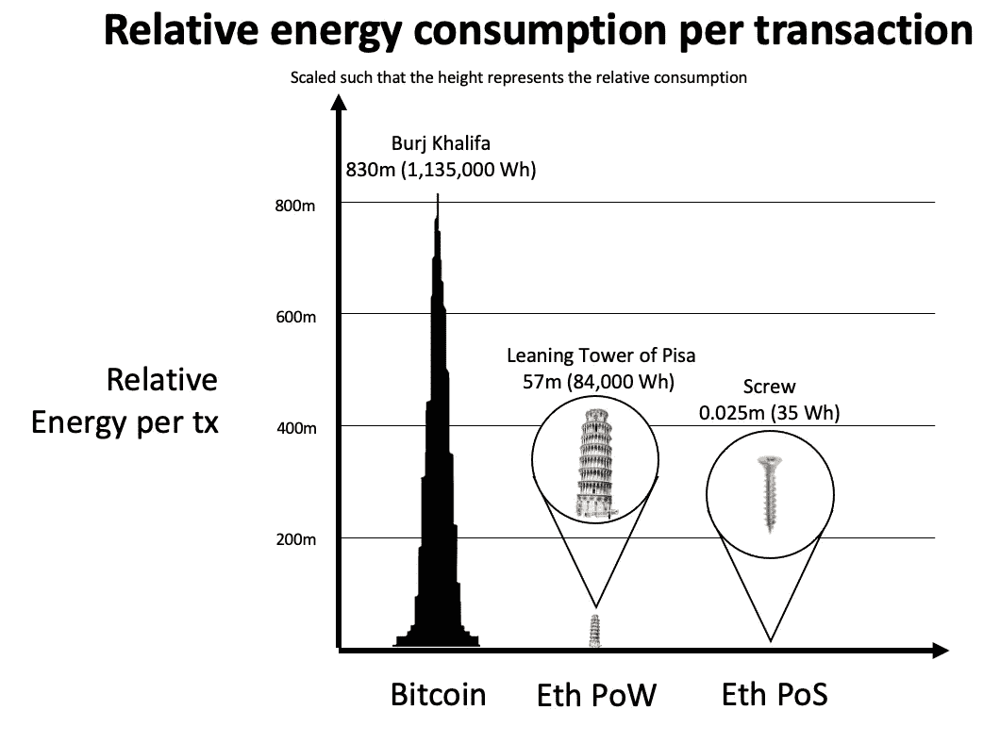*

*Go yell at bitcoin, not Ethereum, the home of NFTs. But don’t actually, because what you really should be yelling at is the internet, the thing that you’re reading this on, which is just a giant waste of energy, really*

*所以，是的，你也许应该对从事 NFT 艺术和物理艺术感觉更好，感觉你是在参与对生态破坏较小的艺术形式，因为你确实是。再也不用把每件艺术品运到瑞士，存放在一个巨大的没有灵魂的[日内瓦自由港仓库](https://www.nytimes.com/2016/05/29/arts/design/one-of-the-worlds-greatest-art-collections-hides-behind-this-fence.html?unlocked_article_code=AAAAAAAAAAAAAAAACEIPuonUktbcrYhkTVUZCibcR8Q86RGLnvnAxvs7gHK7KybQVTZPivsSGYyM4ALCf6dqe9Yow3GSXsMEO7grQPF50u5YOVcoSwikr4DBkpkFIiM57J6zX3hz0Z_LVr1-8SPvaiPxDtZD84CFnkDMNimsU7rCgTZnfFw79Y1jfF6v0XIPwrOWF-UkxtV036w-Vcp_QiMLZXWMu6XpDRx7OomWf1qLvFlNLuJeXDrVntKW46tRM1kBTAKbEw4spDo0-9heO9sIPK_gLhRGecD2hbsZCmUAP57-TtRqBNCSz-M2xOaL_R-cy8O2x-E1FbFXut7GsGW9MlUsSNCGLc7vHsptQXZ_obOfNafSDkQ&smid=url-share)里，这个仓库需要不断地维护，花费巨大，这样你就可以节省税收或其他费用。*

## *还有很多，但是我累了，你也累了和/或死了*

*好的——我已经意识到，在这一点上，我可以真正地永远继续下去，事实上许多人已经这样做了，但我必须在某个地方停下来，我觉得我至少已经充分地涵盖了 NFT 提供的无数新的可能性和优于现状的优势，希望能够充分地激起你的食欲，鼓励你自己更深入地挖掘这个空间。*

*如果你有兴趣更多地了解我在这里提到的所有东西，一个很好的起点是 [a16z](https://en.wikipedia.org/wiki/Andreessen_Horowitz) (硅谷顶级风险投资公司之一，由互联网和现在的[密码](https://a16z.com/crypto/)的杰出先驱[创建的)NFT 佳能](https://en.wikipedia.org/wiki/Marc_Andreessen)， 这是一个真正优秀的关于 NFT 的思想汇编，涵盖了从 NFT 的核心概念和好处到 NFT 的技术基础，从 NFT 的历史到如何开始进入这个领域，等等。*

*现在，让我们进入最后的第 4 部分，教您如何真正开始购买或创建 NFT，或者两者都开始。希望你还没有真的死。那会让我们中的一个活着度过难关。*

# *第 4 部分:如何实际买卖 NFT*

*如果你已经走了这么远，你应该得到一个免费的 NFT 来纪念你所经历的创伤，我会确保你得到一个。但是我太累了，现在无法设置它，所以如果你感兴趣，请[填写这张表格](https://forms.gle/rJVdWEywWT7dguHt5),我会确保在我开始设置它时给你一张。这些可能毫无价值——只是让你开始使用 NFTs 的一种有趣的方式。但是！它们将被编号，所以当有一天它成为 NFT 历史的一部分，并与 CryptoPunks 一起在博物馆展出时，你可以吹嘘你是多么早地读到这篇令人敬畏的文章。如果你有一个，我可能会也可能不会永远更喜欢你，作为激情和粉丝的[证明](https://tals.substack.com/p/proof-of-passion)，并让你提前了解[我做的任何事情](https://www.curiousaddys.com/)。同样，可能不会，但谁知道呢？:)(我在这里测试 NFT·福莫-约罗理论)*

*好了，让我们深入了解你真正期待的是什么——如何真正开始购买非功能性食物。首先，让我们从你应该在哪里获得非功能性测试开始。*

## *那么，我应该在哪个区块链购买 NFT 呢？*

*如前所述，NFT 目前在许多不同的区块链上扩散，从[以太坊](https://ethereum.org/en/)到[索拉纳](https://solana.com/)到[泰佐斯](https://tezos.com/)和[阿尔格兰德](https://www.algorand.com/futurefi/)等等，绝大多数的 NFT 活动都发生在以太坊上。也就是说，越来越多的 NFT 项目选择在索拉纳和其他区块链进行，因为以太坊目前的天然气费用很高。*

*我个人非常怀疑索拉纳是否真的会超过以太坊(然而，我实际上持有少量索拉纳作为对这种可能性的对冲，因为未来从来都不是完全确定的，我确实会犯错误……事实上，我通常在所有事情上都是错的，这一点我可能应该在欺骗你阅读整篇文章之前提到)。 任何人选择使用 Solana 或 Tezos 或其他任何以太坊的唯一理由是，使用这些其他区块链更便宜、更快，这在很大程度上是因为以太坊在使用中占据主导地位，网络拥塞导致费用飙升，高于竞争对手区块链。*

*这是一个非常简单的表面重复，具有强大的模因力量，使其能够非常有效地传播，因为任何人都可以在三秒钟内理解“更便宜、更快”的内在价值，直觉上听起来显然更好。然而，在“去中心化”的区块链世界里，一切都是有代价的，索拉纳为实现“更便宜、更快”而做出的技术权衡值得[仔细审视](https://decrypt.co/81004/solana-back-online-following-downtime-network-restart)。*

*此外，随着以太坊 2.0 的出现，其具有[利益证明](https://ethereum.org/en/developers/docs/consensus-mechanisms/pos/)和[分片](https://ethereum.org/en/eth2/shard-chains/)，以及已经在以太坊之上活跃的第 2 层解决方案，如[多边形](https://polygon.technology/)和[不可变 X](https://www.immutable.com/) ，以太坊上的费用已经可以忽略不计，甚至是免费的(例如，我将发送给你们所有人/允许你们造币的 NFT 将建立在费用可以忽略不计的以太坊第 2 层解决方案——[多边形](https://www.gemini.com/cryptopedia/polygon-crypto-matic-network-dapps-erc20-token)之上)。再加上以太坊拥有的开发者和用户比其他所有区块链加起来还要多，我个人认为以太坊的网络效应护城河是相当不容置疑的。*

*简而言之，除非另一个竞争的区块链能够在明年年初至年中的某个时候超越以太坊，届时以太坊 2.0 的切分证明将上线，第 2 层协议将成熟，并导致更便宜和更快的争论变得没有实际意义，因为以太坊也将更便宜和更快，我真的看不出任何竞争的区块链如何提供任何如此大的内在优势，以取代以太坊作为主导和最终唯一的智能合同区块链。*

*为了超越以太坊，一个与之竞争的区块链需要在开发者和用户的数量上击败它，并且在开发的容易性方面，建立足够的基础设施和开发者工具，使在那些竞争的区块链上的开发像现在在以太坊上开发一样容易和得到支持，以及在许多其他方面。由于深远的网络效应，我真的没有看到这种情况发生——但我可能总是错的，所以显然你要做自己的研究，不要只相信我的话(毕竟，脸书确实杀死了 Myspace，所以严格来说这不是不可能的)。*

*毕竟，我们之所以只使用一套互联网协议是有原因的，这样所有的网站都可以相互操作，人们不必安装几个应用程序就可以通过几种不同的互联网协议与同一种内容进行交互(例如，还记得 [ALOHAnet](https://en.wikipedia.org/wiki/ALOHAnet) ？是啊，我也是，有原因的，因为我们需要的只是互联网)。TL；博士，我把基层区块链竞赛看作是一场胜券在握的战斗。目前，没有竞争对手区块链承诺以太坊智能合约系统无法实现的任何额外功能，因为它已经完成了[图灵完成](https://en.wikipedia.org/wiki/Turing_completeness)，竞争对手区块链只试图在速度和成本上竞争，因为这些替代方案都在集中化方面进行了权衡，而且以太坊将解决这些问题，并已经通过 PoS、分片和 L2 解决方案解决这些问题，我真的看不出有人能在基础层区块链级别击败以太坊。*

*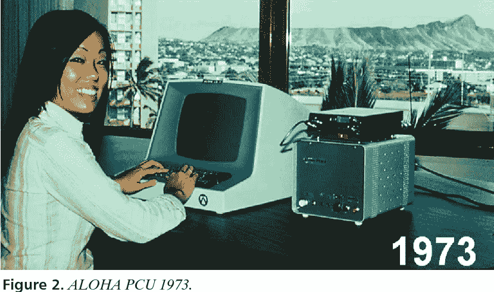*

*The Solana of 1973\. Jk don’t kill me*

*尽管如此，我将在本文的剩余部分重点讨论如何在以太坊区块链上与 NFT 交互。我保证这和我在以太坊区块链有 50 万美元的 NFT 无关，如果竞争对手区块链真的推翻以太坊，这些 NFT 可能会变得一文不值。我是一个令人难以置信的不偏不倚的党派，在这里只是引导你在客观上正确的方向。*

## *以太坊和元掩码入门*

*所以你想买你的第一个 NFT！非常好。你需要做的第一件事是购买一些以太币，这将是你主要用来买卖 NFT 的本地货币。*

*为此，你可以注册一些不同的加密货币交易所，如[比特币基地](https://www.coinbase.com/join/55ea2661d725e700660002ac)(使用我妈妈的推荐链接，你们都将获得 10 美元的免费比特币，哇！)，如果你碰巧在美国或欧洲部分地区，或者在[双子座](https://www.gemini.com/)，或者 [FTX](https://ftx.com/en) ，或者[Crypto.com](https://crypto.com/)，或者如果你真的不得不去的话，[币安](https://www.binance.com/en)，这是最合法、最值得信赖的交易所。*

*这部分并不是世界上最重要的事情，因为你通常不应该为了最大程度的安全而持有你的密码。在一个理想的世界里，你只是在那里购买，然后立即将资金转移到一个硬件钱包，所以你因为在选择了[错误的交易所](https://www.wired.com/2014/03/bitcoin-exchange/)到[购买密码而失去所有钱的风险是最小的。](https://www.theverge.com/2017/7/29/16060344/btce-bitcoin-exchange-takedown-mt-gox-theft-law-enforcement)*

*好了，现在你有了以太坊，我们准备好下一步了。下一步会有所不同，这取决于你想做事情的安全程度和正确程度。正如加密中的许多事情一样，有简单的方法，也有困难的方法，简单的方法往往会导致更快的开始和更大的即时利润，但同样更经常地以心碎和彻底的灾难结束。*

*最简单的方法就是去 [MetaMask.io](https://metamask.io/) ，下载 Chrome 扩展，并设置它，记住非常重要的一点，在你这么做的时候，把你的种子短语的硬拷贝保存在一个非常安全的地方，没有人会发现它，但你也永远不会丢失它(像一个保险箱或保险箱)。*

***这一点很重要**，因为如果任何人获得了你的种子短语或私钥(NFT 世界现在充斥着各种骗局，可以说是本世纪最保守的说法，实际上每个人最终都会向你索要种子短语——在任何情况下，永远不要给任何人。即使是你的母亲，因为可能有人冒充你的母亲)他们可以访问你所有的资金和所有的 NFT，而你将失去一切，但同时，如果你失去了种子短语或私钥(本质上是一样的——种子短语是用于导出你的私钥的助记符，这是访问与你的公钥相关的所有资金和 NFT 所需的真实内容——更多信息请参见 [Crypto 101](/@intenex/cryptocurrency-101-7197684775fd) )，你将永远失去对所有资金和 NFT 的访问权。*

*然后，你所要做的就是复制 MetaMask 中显示的公共地址，并将你刚刚从比特币基地或任何其他交易所购买的以太坊发送到该地址，然后，嘣，你可以立即购买 NFT。*

## *请不要这样做*

*这一切都很好，也很简单，但在目前的 NFT 生态系统中，这带来了难以想象的风险。当我告诉你每天至少会有 [10 个人试图用不和谐的 DMs，或随机的垃圾邮件空投到你的 OpenSea 钱包，或电子邮件，或短信，或其他一百万种不同的非常有创意和非常恶意的诈骗技术来诈骗你的时候，我一点也没有骗你。事实上，我的妻子](https://www.theverge.com/22683766/nft-scams-theft-social-engineering-opensea-community-recovery)[写了一整篇关于如何避免骗局的文章](/@maimai816/how-not-to-be-scammed-in-nfts-e8c8bb5dffc5)，这是令人难以置信的，应该是任何进入 NFTs 的人的必读之作。*

*通常，骗子会向您发送链接(TL；博士，绝对不要点击你不认识的人发给你的链接——即使你认为你认识他们，很可能实际上是有人冒充你认识的人，就像一个 Discord 用户更改他们的个人资料图片和姓名，看起来与你实际所在的 Discord 服务器或你实际与之交谈的真实的人相同)去钓鱼网站， 使用类似 Opensea dot fo 而不是 Opensea dot io(我得到的一个真正的网络钓鱼骗局)，或 world-of-women dot art 而不是 worldofwomen dot art(另一个最近吸引了很多人的骗局)，在这些看起来与真实网站相同的网站上，它会要求你连接 MetaMask 钱包，然后会提示你进行一些好得不像真的交易，你可能会在急于快速致富时批准这些交易，然后你会意识到你实际上已经失去了一切。*

*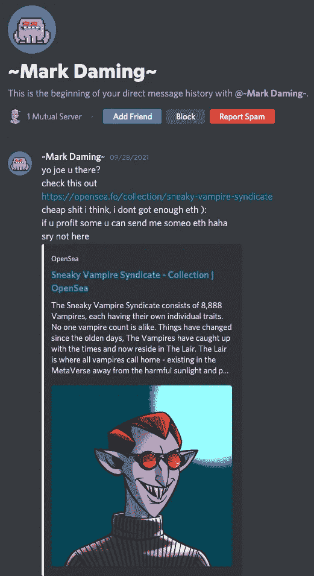*

*Sneaky Vampire Syndicate is a real project, OpenSea is a real site, this is 100% what the real site would look like in a preview, and yet this is 100% a scam designed to steal all your money. Do not ever, under any circumstances, ever click a link like this from a random Discord DM message.*

*或者他们会要求与你分享屏幕，伪装成支持，偷偷看一眼你的种子短语或私钥，然后嘣，你也失去了一切。*

*或者他们会感染你的电脑，然后偷走你所有的钱。安全界有一个共识，即任何与互联网相连的东西都应被视为受到威胁，这一点对任何涉及加密的东西都适用，一旦你受到威胁，你的所有资产被盗，通常就没有追索权，这与世界上大多数东西不同。在这方面，成为自己的银行是一把双刃剑——你不必相信任何人，但你也必须比以往任何时候都更相信自己。*

*与从不直接暴露于互联网的冷钱包相比，直接连接到互联网并暴露于互联网的钱包(如本机 Metamask 钱包)被视为[热钱包。热钱包应该被认为是天生脆弱和易受攻击的，并且您通常不应该在热钱包上存储任何有意义的时间，并且如果您必须使用它，则仅用于短暂的交易，例如立即快速购买一些东西，然后将其转移到冷钱包进行存储。](https://www.gemini.com/cryptopedia/crypto-wallets-hot-cold)*

*长话短说——如果你决定只依靠 MetaMask Chrome 扩展的原生钱包来存储你所有的非功能性文件，预计最终会在一次黑客攻击中丢失所有文件。你所需要做的就是搞砸一次，然后失去一切，即使是这个领域中最老练的投资者和最精通技术的人也曾被黑客攻击过。*

*举个例子，这里有一个字面智能合同*保险*公司的创始人，Nexus Mutual，在[讲述了他是如何被黑客入侵超过 800 万美元](/@hugh_karp/nxm-hack-update-72c5c017b48)，因为有人在他的电脑上安装了一个恶意版本的 MetaMask Chrome 扩展，该扩展替换了真实版本，但在各方面都与真实版本相同，从而设法欺骗他同意向黑客的地址发送大量加密数据，尽管*使用了硬件钱包。*知道即使*有了*比 Metamask 本机 hot wallet 安全得多的硬件 wallet，一家加密公司的字面创始人仍然遭到黑客攻击，你真的想在这个领域冒险反复无常吗？*

*好了，坦白地说，有几段很长的警告是不够的，让我们来谈谈准备成为一名更安全的 NFT 职业球员的艰难道路。长话短说，你需要的是一个硬件钱包，它本质上是一个冷钱包，可以很容易地使用，但实际上是一个热钱包，可以很容易地交易。硬件钱包是如何做到这一点的，它实际上是一个新的硬件设备，保存着你钱包的私钥，在任何情况下都不会暴露在互联网或你的计算机上(或者我们希望如此，尽管实际上这些东西很难验证)，而是只将[交易签名](https://techblog.dac.digital/ethereum-signatures-and-transactions-using-a-hardware-wallet-10a88f344caf)发送到你的计算机，以便实际执行交易。同样，你可以在[密码 101](/@intenex/cryptocurrency-101-7197684775fd) 的第 3 部分读到更多。*

*考虑到这一点，目前你对硬件钱包的两个主要选择要么是[账本](https://www.ledger.com/)(最受欢迎)要么是 [Trezor](https://trezor.io/) (最 OG 和我个人使用的一个，因为我喜欢酷/我太早了，因为当时没有带密码短语的隐藏钱包)，因为这是目前与 MetaMask 配合使用的两个主要硬件钱包。账本可能是最好的赌注。想了解更多关于硬件钱包的信息以及为什么它们如此棒，请再次阅读 [Crypto 101](/@intenex/cryptocurrency-101-7197684775fd) 的第 3 部分！如果我被迫在这里写任何不必要的东西，我会被诅咒的。*

*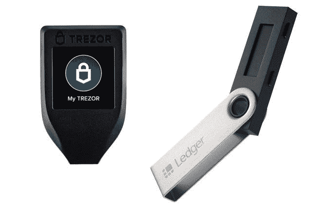*

*Which of these two plastic boxes would you like to entrust your life savings to?*

*一旦您获得了硬件钱包，您将按照与上述大致相同的步骤进行完全设置。你会希望安全地存储你的种子短语，就像元掩码钱包设置一样，并确保没有其他人可以访问它，而且你永远不会丢失它，等等。*

*最后，继续将你的[总账](https://www.ledger.com/academy/security/the-safest-way-to-use-metamask)或你的 [Trezor](https://metamask.zendesk.com/hc/en-us/articles/360020394612-How-to-connect-a-Trezor-or-Ledger-Hardware-Wallet) 连接到 MetaMask，然后继续使用 MetaMask，就像你可以直接使用本机热钱包一样。现在唯一的区别是，每次你做交易时，MetaMask 都会提示你在你的分类账或 Trezor 上确认该交易，这为每次交易增加了一个重要的额外安全层。确保你确实阅读了 MetaMask 要求你确认的每一笔交易，并确保你的分类账/Trezor 上显示的输入和输出与你预期的一样——不检查分类账或 Trezor 要求你确认的内容，这正是 [Nexus Mutual 创始人如何被黑客攻击并损失了 800 万美元](/@hugh_karp/nxm-hack-update-72c5c017b48),尽管使用了分类账，以及另一个在 OpenSea Discord support 骗局中[失去所有资产的人如何被骗。](https://www.theverge.com/22683766/nft-scams-theft-social-engineering-opensea-community-recovery)*

*太好了。现在你已经把你的战斗盔甲完全装备在你之前赤裸的钱包上了，让我们深入到如何实际创建和销售你自己的 NFT，然后如何实际购买 NFT，以及在哪里购买。*

## *铸造(创造)和销售你自己的 NFT*

*如果你想创建自己的 NFTs，你很幸运！这一过程比以往任何时候都更简单，并且已经设置了大量的应用程序来尽可能简单、轻松地引导您完成这一过程。*

*事实上，我和我的妻子以及我们的 NFT 项目/公司[好奇 Addys](https://curiousaddys.com/) 刚刚构建了第一个也是唯一一个免费的(为高级用户提供一些高级功能)无代码 NFT 艺术和智能合同生成器 [HeyMint Launchpad](https://join.heymint.xyz/) 。*

*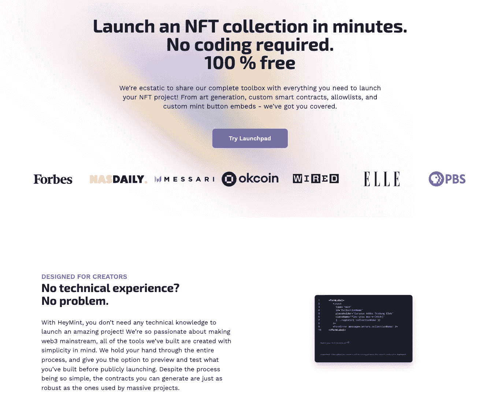*

*Come check us out!*

*如果您对创建一个由成百上千个 NFT 组成的编程生成的集合感兴趣，Launchpad 将让您从头到尾完全没有任何先验知识或技术技能，完全免费。*

*然后，为你的 NFT 项目收集用户，你可以使用我们完全免费的 allowlist 工具， [HeyMint](https://heymint.xyz/) ，这将让你收集一个对铸造你的 NFT 感兴趣的用户列表，并让你接触到超过 70，000 名收藏者:)。*

*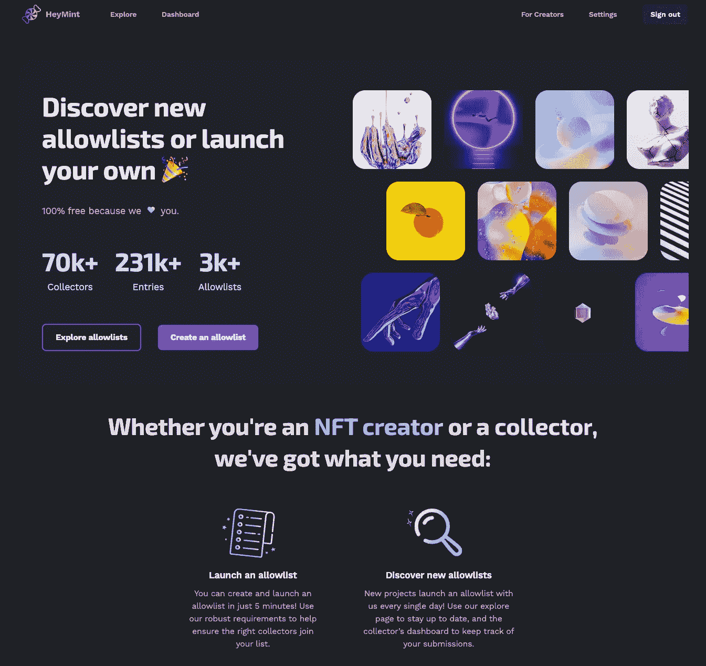*

*Come check us out more!*

*如果你只是想创建一个 1/1 的 NFT，你可以直接在 OpenSea 上创建 NFT，如果需要的话，可以完全免费地使用 Polygon，点击创建按钮。其他完全对所有网站开放也是如此，比如 [Rarible](https://rarible.com/) 和 [MakersPlace](https://makersplace.com/) 。*

*如果你想让你的作品卖个更高的价格，下一步就是一个名为[基金会](https://foundation.app/)的受邀平台。你需要被一个已经成功卖出至少一件作品的艺术家邀请到这个平台(每个艺术家在卖出他们在基金会的第一件艺术品后都会得到 3 次邀请)，所以这个平台更具策划性，也更难进入，但你在这里出售作品的价格通常比完全免费的 NFT 平台高一点。*

*请注意，你还需要支付相当多的汽油费来直接在以太坊区块链上铸造你的作品，所以这比在其他平台上开始要贵一些。为了最大限度地降低这些成本，我妻子写了一篇关于如何节省油费的[好文章](/@maimai816/advanced-metamask-gas-tutorial-how-to-set-your-own-gas-prices-236d59f563b7)，我做了一个[视频来演示同样的东西](https://www.youtube.com/watch?v=XOGd_W_GNwA)(只看前 5 分钟，其余的是可选的)。在我看来，如果你还不是一个疯狂富有的艺术家，只是为了好玩而做这些东西，这是必须要读/看的。我见过的几乎每个艺术家都比他们真正需要的多支付 2-3 倍来制作和列出他们的 NFT，这让我内心深处的廉价亚洲核心感到痛苦。*

*最后，如果你准备好加入大联盟，你会想申请 [SuperRare](https://superrare.com/) 、 [NiftyGateway](https://niftygateway.com/) 和/或 [KnownOrigin](https://knownorigin.io/) ，这是三个高度策划的平台，只接受他们通过申请过程精心选择的艺术家。这里是 [NiftyGateway 的申请页面](https://niftygateway.com/become-creator)，这里是 [SuperRare 的](https://docs.google.com/forms/d/e/1FAIpQLScTZhB9On31j-uoFzMD3hg0gGNf3hgjVyBz1xwCHsOBSydvPw/viewform)。不幸的是，KnownOrigin 目前对申请关闭。*

*作为一名新艺术家，打入非传统艺术市场并不容易，但与试图打入传统艺术市场相比，这要容易得多，也更有利可图，因为在 NFT 的艺术家生态系统中，竞争相对来说要少得多，而且你还可以直接接触到全球有钱的买家。如今，大多数 NFT 收藏家都把时间花在了 Twitter 上，所以开始打入这个社区的最好方式之一就是开始在 Twitter 上培养一批强大的 NFT 社区粉丝。说起来容易做起来难，但也绝对是许多人成功做到的事情，所以不要气馁，试一试吧！*

## *我应该买什么样的非功能性食品，为什么买，在哪里买*

*好了，现在来谈谈购买 NFT。目前，NFT 买家大致分为两类，在我看来，你可能更想属于其中一类，但最终我可能完全错了，因为两个阵营都有很多人变得非常富有。*

*I am not good enough to do this and frankly this reminds me of the time everyone got rich and then lost all their money in the ICO craze of 2017, but if you would like to try, by all means please do and tell me what to buy because as stressful as day trading crypto is, day trading NFTs is a whole nother level*

*第一类 NFT 买家是铁杆翻盘者，他们找到其他人都可能购买的最有前景和最受炒作的项目，然后利用机器人和脚本以及忍者反射在其他人之前打造这些项目，然后快速翻盘。*

*This man is a flipper. He’s rich as hell and has done great flipping, but also, uh, [67 Autoglyphs are worth at minimum $100 million right now,](https://opensea.io/collection/autoglyphs) and [1,250 Bored Apes would be worth at minimum $170 million right now](https://opensea.io/collection/boredapeyachtclub), so if he had just held and not done anything, he would have at least $270 million in NFT assets right now with um, a lot less work than he’s actually put into flipping*

*Flippers 还使用专业工具，如 [Nansen.ai](https://www.nansen.ai/) 和 [icy.tools](https://icy.tools/) 和 [RaritySniffer](https://raritysniffer.com/) 和 [rarity.tools](https://rarity.tools/) 和 [rarity.guide](https://rarity.guide/) 以及大约 100 万种其他工具，来仔细跟踪关于项目一起飞就起飞的数据和分析，并确定即使在最初创造之后在二级市场上购买的最佳 NFT，以便能够随着项目的地位继续上升而获得巨额利润。他们还主要使用 Twitter 和 Discord 来关注该领域的影响者，并在新的有前途的项目推出之前确定它们(正如 MEVCollector 在上面的 Twitter 帖子中所建议的那样， [Pixel Vault](https://twitter.com/pixelvault_) 和[元宇宙总部](https://twitter.com/Metaverse_HQ)是该领域中相当成熟的社区，还有[有利益关系的朋友](https://www.fwb.help/)和许多其他人)。NFTCal 也是一个非常有用的日历，记录了所有即将到来的重大 NFT 项目，因此你可以及时了解所有值得关注的项目，避免因为信息在你有限的时间里溜走而错过项目。*

*当然，长期投资者也使用这些工具来获得对项目的类似洞察力，这些项目背后有真正的长期社区增长，并确定这些项目中的最佳 NFT 以供现在买入，我个人支付了 700 美元购买终身 icy.tools 高级会员资格，并每月支付一笔巨额费用访问 Nansen.ai，以获得对任何我好奇的特定 NFT 项目的额外洞察力，然后决定加入。*

*第二类 NFT 买家是那些正在寻找当今最有前景的、可能具有长期价值的非上市公司，并希望买入这些公司，至少持有多年的人。符合这一标准的项目比符合翻转标准的项目要少得多，因为[大傻瓜理论](https://en.wikipedia.org/wiki/Greater_fool_theory)和现在市场上投机者的激增提供了很多机会，让你可以在潮水退去之前从周围蜂拥而至的其他投机者手中获利。*

*Here is an NFT collector talking about selling Cryptoadz too early. For context, Cryptoadz launched 26 days before he wrote this tweet.*

*什么样的项目可能经得起时间的考验？首先也是最重要的是，项目背后有非常强大、有弹性的社区，这些社区以有机的方式增长，并不仅仅是为了钱而存在——事情的精确悖论是，不是为了钱(或至少不仅仅是为了钱)而是因为其他原因而形成的社区恰恰是那些最终可能最值钱的社区，就像 CryptoPunks 一样，因为他们将比其他项目更好地经受住变幻莫测的加密和 NFT 市场不可避免的低迷。*

*当价格上涨时，每个人都只是为了钱而参与的项目将比其他项目增长得快得多，因为价格上涨本身是吸引投机者群体中所有鱼的主要原因。与此同时，一旦价格开始下跌，正如在某些时候不可避免的那样，所有的投机者都会冲向出口，以避免成为最后一个拿着所有袋子的傻瓜，因为除了价格之外，没有其他东西能让他们留下来，因此当价格消失时，所有的投机者都会以最快和最不有序的方式离开。*

*在一个项目中，每个人都不仅仅是为了钱，而是为了社区和社区正在建设的任何东西，即使市场跌到谷底，价格暴跌，成员也会拒绝出售，事实上，他们会继续在项目上发展和建设，这样，当潮流回来，价格和需求再次上升时， 这个项目将远远领先于所有其他项目，这些项目在上次退潮时被剥得只剩下骨头，没有一个社区。 当这种情况发生时，所有人都支持的最明显的项目将是即使在没有财务激励的情况下仍保持增长的项目——并且没有其他项目真正有机会赶上，因为它们在经济低迷时期放弃了生态系统。*

*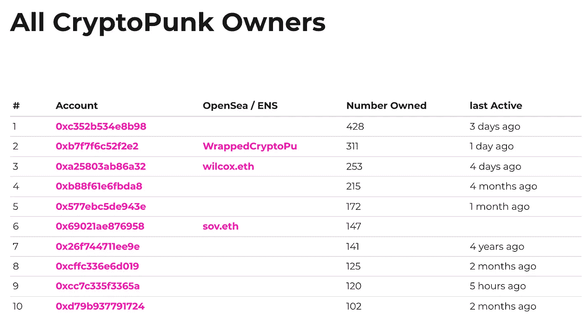*

*These…these are HODLers. They are all hodlers with $50 million+ in hodl’d cryptopunks. I’m not telling you who you should be like, but you should be like these people*

*所以，是的——在有如此多炒作的泡沫牛市中，确定经得起时间考验的项目是非常困难的，因为通常具有长期视野和投资社区的最佳项目可能看起来与团队只是为了快速赚钱和社区在这里的项目非常相似。你真的需要深入挖掘，花时间在每个社区找出差异，这不是你一眼就能做到的——这需要时间和投资。*

*简而言之，确定什么东西可能会留在这里的最好方法是看看你自己对它们的感觉——如果*你*找到一个你喜欢的社区和一个你想投资的项目，而不仅仅是快速致富的承诺，并且你有信心即使你的资产价格下跌 90%或更多(当你像我一样在 crypto 工作的时候， 你知道这一点也不夸张——我从 7 美元开始就一直持有以太坊，看到它在 2017 年升至 1400 美元以上，到 2019 年下跌超过 90%至 100 美元，现在回升至 3400 美元以上——没有理由 NFTs 会不一样)，你自己不会卖出，你看到其他人也有同样的感觉……嗯，那是一个非常好的迹象。*

*这就是 NFTs 的矛盾和真正力量所在。现在几乎每个人都是为了钱而来，就像几乎每个进入 crypto 的人最初都因为价格的飙升而感兴趣一样，但那只是[特洛伊木马，真的，欺骗你邀请 NFT 进入你的内心](https://future.a16z.com/well-behaved-bubbles-history-innovation/)。*

*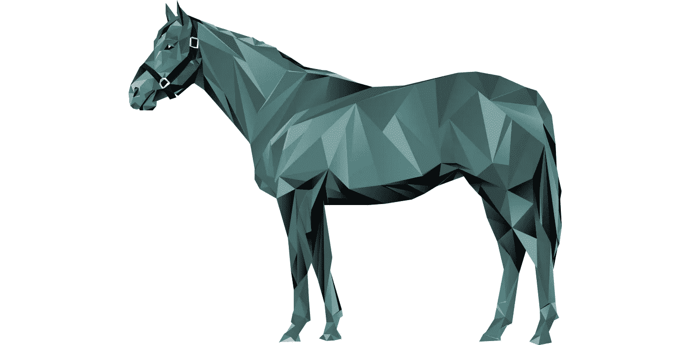*

*This is not a Trojan Horse. This is a ZED horse, and you can uh, [race it on the blockchain](https://zed.run/).*

*一旦你真正投入到你热爱的 NFT 项目和社区中，你会开始看到非功能性交易不仅仅是钱的问题，即使当非功能性交易不可避免的熊市到来时，你也会留下来，你会继续建设和投资社区，发展 NFT 的生态系统，正是因为这个原因，如果一切顺利的话，大约四年后， 就像 2017 年那些早期真正相信 CryptoPunks 的人一样，他们为炒作而来，为内心而留，经历了整整四年的毫无价值以及外部世界价格和利息的停滞，今天都成为了数不清的肮脏的富有的百万富翁。*

*记住——艺术和许多其他最好的资产，如收藏品和古董，很大程度上源于它们的情感粘性。如果你打算卖掉你的狗，感觉情绪不好，即使有人为你的狗提供远远超过市场价值的价格，比如 30，000 美元，你可能不会卖掉它。相反，如果你一时冲动买了 Sparky，价格远远超过了 Sparky 的价值，而现在 Sparkies 的价值只有你购买不可替代的 Sparky 的十分之一，你可能不会后悔，不会因为买了你的 Sparky 而自责，也不会以 90%的损失把它卖给公正的收藏家。*

*一件艺术品和任何其他种类的 NFT 也是如此。如果你对出售它感到难过，即使获得了巨大的收益——很可能其他人也会有同样的感觉，因此市场上出售的资产会越来越少，我们都知道——供求关系决定价格。如果情感粘性导致某些非功能性食物的购买者不想以任何价格出售它们，或者至少不愿意以改变生活的价格出售，那么市场上的非功能性食物将会少得多，购买者将需要支付更高的价格来获得这些非功能性食物。最终，当有限的稀缺收藏品中所有能够获得这种程度的情感粘性的非功能性物品被越来越富有的人悄悄抽走时，他们不需要以任何价格出售它们，供应将进一步萎缩，直到它可能实际上不存在，此时价格也可能相应地达到相反方向的类似流动性点，接近有效无穷大的极限。*

*什么样的项目可能实现这种社区增长和情感粘性？典型的项目要么是其特定领域中最 OG 的，如亲民党 NFT 项目的[crypto punk](https://www.larvalabs.com/cryptopunks)，要么是生成艺术作品的 [Art Blocks](https://artblocks.io/) (我在 NFT 空间看过的最好的 [作品中的](https://zeneca33.substack.com/p/letter-19-art-blocks-2)[两件，这些作品让我个人对艺术作品深信不疑)，和/或在执行过程中最新颖的，最有可能产生衍生产品，如](https://zeneca33.substack.com/p/letter-10-art-blocks) [Loot 项目](https://www.lootproject.com/)， (遵循[迪伦·菲尔德(Dylan Field)出色的迷因链规则](https://twitter.com/zoink/status/1437236693413744641)，或者有潜力围绕游戏等核心前提进行最持续的互动和可扩展社区的项目，如[守护者协会](https://www.guildofguardians.com/)(由制作 OG 区块链交易卡游戏的同一批人制作，[被解放的神](https://godsunchained.com/)，以及主要的 NFT L2 平台之一，[不可变 X](https://www.immutable.com/) )。*

*1/1 限量版艺术品也属于这一类，但风险要大得多，大约相当于在现实世界中投资艺术品。从本质上来说，这类似于天使投资——如果你有令人难以置信的好品味和判断力，并且相信你能比其他人更好地抓住这个 NFT 和元宇宙时代的新时代精神的艺术家，并超越人群获得巨大的声誉和未来的成功，那么你肯定可以在所有人之前找到合适的艺术家并收集他们的作品，从而赚到大笔钱。*

*如果你做不到，你很有可能会被套牢，持有的艺术品永远不会升值，而且很有可能与你购买时的货币贬值。尽管如此——我发现投资 1/1 艺术是迄今为止一个人可以在 NFT 从事的最有情感意义的努力，艺术家在这里赚的钱确实改变了生活，所以很多时候我投资 1/1 艺术只是为了购买我喜欢的作品，即使它们涨了 10 倍我也不会卖，即使它们跌了 10 倍我也不在乎，为了支持那些非常不可思议的艺术家， 令人惊叹的人，并帮助鼓励他们继续制作他们不可思议的艺术，并有意义地在经济上支持他们实现这一目标。*

*寻找这些 1/1 或限量版艺术品的最佳地方是在平台上，如 [SuperRare](https://superrare.com/) 、 [KnownOrigin](https://knownorigin.io/) 和 [Foundation](https://foundation.app/) (小心最后一个——它不像前两个那样精心策划，已知在那里会发现骗局)。还有一些不那么精心策划的平台，如 [Showtime](https://tryshowtime.com/) 、 [Rarible](https://rarible.com/) 、 [MakersPlace](https://makersplace.com/) ，甚至 [OpenSea](https://opensea.io/) (所有二级销售交易活动的大部分都在这里发生)，但对于这些平台，你需要非常小心，以免上当受骗，尽管你肯定也可以在这里找到未经加工的钻石。*

*Protip:你可以使用一种策略来发现和购买真正的时尚引领者正在购买的东西，那就是关注他们在这些不同平台上的账户。因为区块链对每个人来说都是完全透明的，你可以看到每个人都在买什么，这包括超级成功的艺术家自己在买什么(购买一个已经成功的艺术家大约类似于，比如说，在股票首次公开募股后购买股票，而购买一个潜力巨大但尚未成功的艺术家类似于天使投资，具有相应的无限高风险和回报)。我很幸运地在我的旅程中很早就与 NFT 空间中最成功的生成艺术家之一交了朋友，在竞标了他的一件作品后，我现在基本上只买他让我买的东西，这对于进行伟大的投资和购买最时尚的艺术作品来说都很棒，尽管对艺术仍然一无所知*

*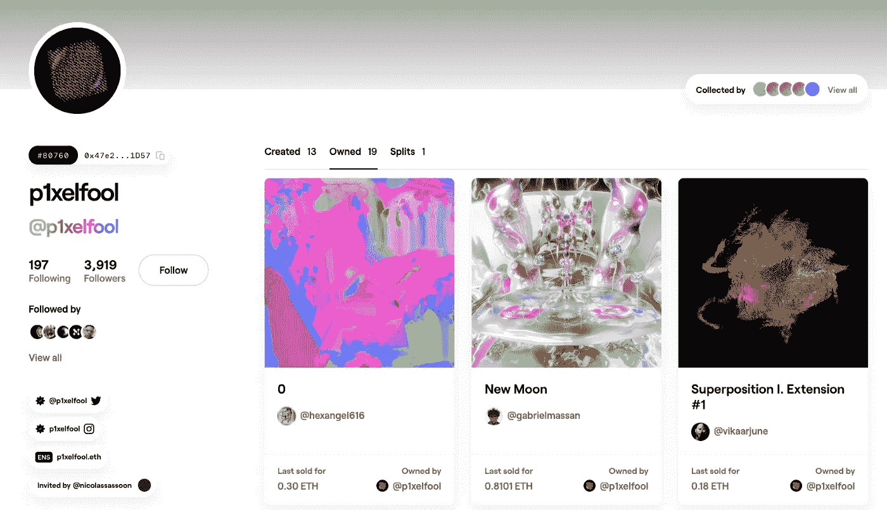*

*Spy on what all the cool kids are buying!!!*

*当然，这些仅仅是起点，事实上甚至不是我特别建议你投资的项目，因为我非常非常强烈地不想承担建议任何人在这个领域投资的责任。NFT 的空间现在甚至比 2017 年更早，对于加密来说，这个领域是如此的新生，虽然我非常自信地说 NFTs 将深刻而永久地改变我们所知道的世界，就像我在 1999 年对互联网说的那样，如果我当时不是真的 7 岁，我也不会那么自信地宣布任何*特定的* NFT 项目现在都将经受住时间的考验，并最终达到那个世界状态。警惕那些宣称这些事情的人，确保你从基本原则出发评估他们的主张，摆脱所有的炒作。*

*2017 年，我非常强烈地向任何人明确表示，在决定投资任何加密货币之前，他们必须自己做大量的研究，加密货币 101 只是一个最起码的起点，希望为他们配备少量资源，开始他们自己的加密货币研究和投资之旅。在 2021 年，事情完全不同，我基本上完全准备好告诉每个人 yolo 进入以太坊(但以一种衡量美元成本平均的方式，你可以用我和我妻子制作的这个方便的完全免费的工具， [CryptoAutoInvestor](http://cryptoautoinvestor.com/) ，随机完全无关的插头)，但这仍然是 2017 年前的 NFTs，你必须把这大约 101 分钟的 NFTs 作为真正的 NFTs 101(哈哈，NFTs 101 分钟，明白吗？多合适啊。lol)在真正投入和投资任何项目之前，做自己的研究，达到 NFTs 201 或理想的 420.69。*

*如果你有兴趣和我以及成千上万的其他人一起做这件事，我的妻子[麦](https://twitter.com/mai_on_chain)和我启动了第一个[教育项目](https://www.curiousaddys.com/)，专门向新来者介绍非艺术作品，并为非艺术作品的创作者和收藏者免费提供所有工具，例如 [HeyMint.xyz](https://heymint.xyz/) 用于寻找和创建允许加入 NFT 项目的人，以及 [HeyMint Launchpad](https://launchpad.heymint.xyz/) 帮助创作者毫不费力地生成艺术和智能合同，以在完全不需要任何技术技能的情况下推出 NFT 收藏。*

*我们的目标是将 crypto 和 NFT 生态系统的现有老手以及该领域的新来者聚集在一起，以便我们可以建立尽可能好的平台，向尽可能多的人介绍 NFTs 和 crypto，并将这两者真正纳入主流。*

*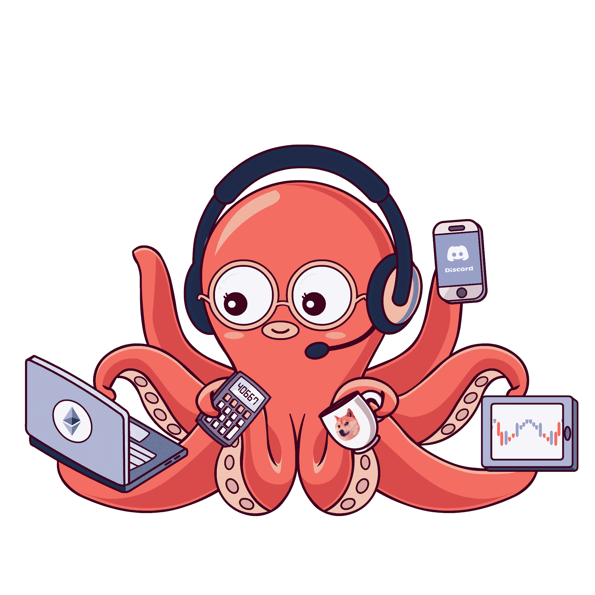*

*Tell me this isn’t the cutest octopus ever!!! Don’t you want to [learn about crypto and NFTs with this adorably cute octopus](https://www.curiousaddys.com/)?!*

*如果你对这一使命和目的有共鸣，并且你有兴趣了解更多，请查看[我们的网站这里](https://www.curiousaddys.com/)和[在 Twitter 上关注我们](https://twitter.com/CuriousAddys)和/或[加入我们的争论](https://discord.com/invite/q4ywBEMpfy)来与我们聊天，帮助我们建立向任何人介绍 NFTs 和 crypto 的最佳方式，而不必像你一样强迫他们在媒体上忍受 100 分钟的阅读:)。*

*好了，就这样吧！感谢阅读，去玩吧，别把钱都输光了！*

*PS:如果你读到这里，欢迎你每花一分钟看完这篇文章就鼓掌一次(protip，你只要按住鼓掌键就可以为一篇文章鼓掌不止一次！神奇！作弊魔术！)如果你愿意，或者就在 Twitter 上对我大喊大叫，说我浪费了你这么多的生命。由你决定。不管怎样，谢谢你给我这个特权，让我通过教你愚蠢的网络图片来破坏你今天剩下的计划🙏*

> *加入 Coinmonks [电报频道](https://t.me/coincodecap)和 [Youtube 频道](https://www.youtube.com/c/coinmonks/videos)获取每日[加密新闻](http://coincodecap.com/)*

## *另外，阅读*

*   *[密码电报信号](http://Top 4 Telegram Channels for Crypto Traders) | [密码交易机器人](/coinmonks/crypto-trading-bot-c2ffce8acb2a)*
*   *[复制交易](/coinmonks/top-10-crypto-copy-trading-platforms-for-beginners-d0c37c7d698c) | [加密税务软件](/coinmonks/crypto-tax-software-ed4b4810e338)*
*   *[网格交易](https://coincodecap.com/grid-trading) | [加密硬件钱包](/coinmonks/the-best-cryptocurrency-hardware-wallets-of-2020-e28b1c124069)*
*   *[加密交换](/coinmonks/crypto-exchange-dd2f9d6f3769) | [印度的加密应用](/coinmonks/buy-bitcoin-in-india-feb50ddfef94)*