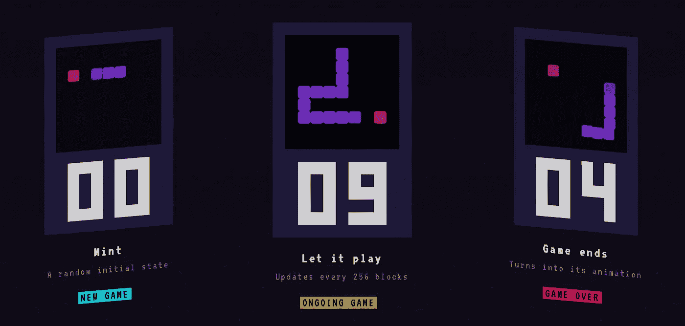

# NFT 是适应性实体

> 原文：<https://medium.com/coinmonks/nfts-are-adaptive-entities-e6d1a0796c7c?source=collection_archive---------1----------------------->

Feature montage by Takens Theorem / with permission from [j1mmy.eth](https://twitter.com/j1mmyeth)

## NFT 项目反映了他们的网络利基，他们正在发展

作为一个概念，“模因”诞生于 20 世纪 70 年代末，在著名的《自私的基因》一书中。通过与基因的类比，模因的概念是文化和行为选择的单位。迷因在人与人之间传播——一种发型，一首歌，一种表达方式。当迷因抓住你时，在某种意义上，它已经“寄生”了你的神经系统；你的大脑和行为是其[生态位](https://en.wikipedia.org/wiki/Ecological_niche)的一部分:

*From* [*The Selfish Gene*](https://books.google.com/books?id=WkHO9HI7koEC&q=parasitize#v=snippet&q=parasitize&f=false) *(1976)*

安德鲁·斯坦沃尔德把非功能性思维称为新形式的“货币化迷因”。在一篇关于这个想法的富有远见的[马孜红帖](https://andrewsteinwold.substack.com/p/-nfts-are-monetizable-memes)中，他使用了这个迷因概念，就像它最初的表述一样字面上和尖锐:“货币化迷因最令人兴奋的部分是，这只是冰山一角。我们将看到这些资产以我们还不太了解的各种方式发展。”

Andrew Steinwold’s [tweet](https://twitter.com/AndrewSteinwold/status/1372170860757446660).

直觉上，这个想法有一些令人信服的地方——毕竟，NFT 是我们当前数字文化的一部分。因此，它们也受到类似的模因分析似乎是合理的。但是 Andrew 在上面的暗示是，NFT 正在从一个新的基质中出现——加密领域创造了一个分散的、不受审查的公共分类账。随着 [EVM](https://en.wikipedia.org/wiki/Ethereum#Virtual_machine) 链的普及，NFT 将有可能在一个开放的、可组合的计算生态系统中进行交互和[相互构建](https://opensea.io/collection/toon)。NFT 空间产生了“活的结构”,当它们进一步寄生于食物链——和我们——时，它们可能会适应、进化。

# NFT 人的“DNA”

这篇简短的帖子表明，我们已经可以在这个链条本身中看到这种进化动态的迹象。最近的一个例子非常符合这一分析。 *Loot* 是游戏物品列表的简单 SVG 图像，[呼应经典*地下城&龙*](https://www.theverge.com/22655077/loot-social-network-open-source-nft) 和其他幻想游戏(见[令牌#1 这里](https://opensea.io/assets/0xff9c1b15b16263c61d017ee9f65c50e4ae0113d7/1))。它的简单性使它很容易复制。 [*打劫*](https://opensea.io/collection/lootproject) NFT 合同被反复复制成新的，传播[窒息网络](https://twitter.com/takenstheorem/status/1433838990113878019)的“突变”。 [*More Loot*](https://opensea.io/collection/more-loot) 衍生品实际上是没有上限的，在刚刚过去的 9 月(2021 年)的一段时间里，它在[几乎每个街区](https://twitter.com/takenstheorem/status/1434313218927824897)都有一笔交易。

Loot and its derivatives deploying onto Ethereum.

这个例子表明，在进化的意义上，NFT 项目确实是迷因。*战利品*字面变异，继续繁殖。这里的“利基”是 NFT 爱好者的想法，他们分享了这种兴奋——这个项目在概念上和技术上都很有趣，有着非常熟悉的复古主题。

Loot 展示了另一个将不同的 NFT 项目分类的想法。 *Loot* 是一个链上 NFT——每个 *Loot* SVG 图像都存在于契约中。如果创造者多姆·霍夫曼和*战利品*的[网站](http://lootproject.com/resources)一起消失了，剩下的只是以太坊的账本，它仍然有可能在[契约的](https://etherscan.io/address/0xff9c1b15b16263c61d017ee9f65c50e4ae0113d7#readContract) `tokenURI()`功能中恢复你的 SVG，以及你的“战利品”的所有特征现在有许多这样的“链上”NFT。在此处和[处](https://twitter.com/takenstheorem/status/1438681674473033728)见列表。

所以这个进化框架比简单地研究战利品的概念、文化属性更深入。这些特性可以被认为是它的“表现型”，它的[可以直接观察到的特性](https://evolution.berkeley.edu/genotype-versus-phenotype/)。有了链上 NFT，以及它们有时精心制作的契约，就有可能研究编程策略如何也具有这些进化特性。这也有一个有趣的生物学类比。想想安德鲁·斯坦沃尔德关于令人惊讶的新进化特性的笔记。通过研究这些契约，我们可以调查这些迷因的“DNA”中的适应性特征——在它们的基础契约中(它们的“基因型”)。考虑两个例子。

## 凭记忆:Avastars

*Avastars* 是首批完全在线的 NFT 艺术项目之一。艺术家 [Marmota vs Milky](https://makersplace.com/marmotavsmilky/) 创造了一套精细的、高清晰度的 SVG 功能，可以用来组成一个巨大的可能的虚拟形象档案空间。在与 [nft42](https://www.nft42.com) 的合作中，他们在 2020 年初发布了这个[美丽 nft 项目](https://nft.substack.com/p/the-art-of-avastars)。在 2020 年至 2021 年期间，这些*虚拟形象的许多粉丝沉迷于[滚动](https://twitter.com/AvaStarsNFT/status/1316458091890827267)他们的网站，以创造[完美适合他们想要的虚拟形象的特征](https://nft.substack.com/p/avastar-combinations-and-traits)。就在这个月， *Avastars* 发布了“复制人工厂”——以前的所有者现在可以重组他们的 NFT 的特征来创造新的、独特的 Avastars: [*复制人*](https://twitter.com/chafomon/status/1463160704949706764) 。*

*当研究 Avastar 的“DNA”，即合同时，我们很快就会发现，这个 NFT 项目在一定程度上是一个特殊领域的功能——当时以太坊的网络条件。天然气价格可能低至 5-10 gwei，而乙醚价格徘徊在 200-300 美元左右。以太扫描可以揭示项目是如何发布的，我们看到这些漂亮的 SVG 层被直接编码到合同上的内存中:*

**

*[Deploying SVG features](https://etherscan.io/txs?a=0xf3e778f839934fc819cfa1040aabacecba01e049&p=177) directly into memory. (Etherscan)*

*当时，主要的 *Avastars* 合同部署的天然气成本为 10 美元。它的全套功能，*超过 500 种*，售价[不到 2000 美元](https://twitter.com/seaofarrows/status/1463137042737545223)。但是从那以后以太的价格已经上涨，在我写这篇文章的时候以太坊的基本费用已经上涨了 10 到 20 倍。仅发布合同*一项*的成本就可能约为 2000 美元。为了发布整批艺术特征，项目[可能花费超过 30 万美元](https://twitter.com/seaofarrows/status/1463175486520143873)。*

*当建造一个 Avastar 时，合同会将这些层组装到你的产品中。这是 100%的链——`renderAvastar()`函数可用于[恢复](https://etherscan.io/address/0xf3e778f839934fc819cfa1040aabacecba01e049#readContract)您的 SVG 图像。*

**

*[Comments](https://etherscan.io/address/0xf3e778f839934fc819cfa1040aabacecba01e049#code) can be fun: “assemble SVG sandwich.” (Etherscan)*

**

*[Avastar #14912](https://opensea.io/assets/0xf3e778f839934fc819cfa1040aabacecba01e049/14912)*

## *来自计算:弯弯曲曲*

*其他占用大量内存的方法可以在创新的早期项目中看到，如[*crypto sketches*](https://www.cryptosketches.com)，它在 2018 年初部署的 ERC-20 中存储了完整的艺术动画。有些人还在交易中使用 calldata，如神秘的神经网络生成的怪物 [*0xmons*](https://blog.0xmons.xyz/79081566310) *。*这个项目将编码的 NFT 存储在一个相对便宜的事务调用数据中。*

**

*[CryptoSketches](https://www.cryptosketches.com) from 2018 by [Joey Chips](https://twitter.com/joeychips). 100% data on chain, even the dynamics.*

*但是还有另一个策略。策略是使用计算而不是内存——通过*如何构造*来编码 NFT，而不是预先构造并显式存储它的各个部分。*

*稍后的 2020 年的例子可以在**中看到，由 [NateAlex](https://twitter.com/NateAlexNFT) 制作，它编码了一个精心制作的美丽的 100%链生成艺术品。的[合同部署](https://etherscan.io/tx/0xbde683a5941e4c3b65a629b459e16ebc63eff11b1512cb4ab448aae7cddce0a0)面临超过 60 gwei 的天然气价格。该合同每次都通过在 mint 设置一个独特的号码来重建艺术品。这种重建是通过合同调用完成的——它是免费的。事实上，因为这些片段是通过计算一个种子生成的， *Squiggly* 有一个公共函数`renderFromSeed()`，可以使用[来探索一个“合成的 Squiggly”，即你的片段*可能*看起来是什么样子。该方法定义了一个函数，每次*计算*该块。](https://twitter.com/NateAlexNFT/status/1452396086333685763)***

****

**[Drawing Squigglies](https://etherscan.io/address/0x36f379400de6c6bcdf4408b282f8b685c56adc60#code), inside renderFromSeed() (Etherscan)**

**我最近经历了这种战略转变。两个项目，[*_ 币*](https://takenstheorem.medium.com/the-coin-f66bc3bfaae2) 和 [*高斯时计*](https://takenstheorem.medium.com/gaussian-timepieces-9dc08cc8b344) 就是这样区分的。*_ coin*碎片将比特币历史编码为数据驱动的可视化，存储在内存中，所有者可以用 CSS 修改它们——它以 6 gwei 的天然气价格部署。*高斯时钟*是链上代表时间的动态 SVG 动画。为了克服今年秋天的汽油问题，这些钟表由一组组装功能构成，通过使用令牌 ID 和所有者地址作为输入进行修改(本着*歪歪扭扭*的精神)。**

****

**[Squiggly #66](https://opensea.io/assets/0x36f379400de6c6bcdf4408b282f8b685c56adc60/66)**

# **假设**

**上面的讨论提出了一个假设。不仅仅是创作者适应了网络。这显然是真的(而且研究起来仍然很有趣)。相反，假设更深入一点，即 NFT 及其合同的适应可以用进化的视角来理解——*项目* *作为一个整体*是适应性的实体，受到创作者和收集者的外部世界和市场力量的约束，但也受到链本身的约束。我们在项目的“DNA”中看到了这一点，即合同是如何组合起来实现特定目标的。**

**这里可以考虑更多的例子。这些其他项目将表明，内存和计算之间的区别并不是那么明显——项目可以平衡这些需求，以提出创造性的解决方案。从进化的角度来看，这又是有意义的——NFT 项目的特点是复杂的，而且适应性更灵活。例子包括 [*Brotchain*](https://brotchain.art) 的位图、 [*奇怪的吸引子*](https://strangeattractors.art) 的 3D 渲染、[*blit map*](https://www.blitmap.com)*—*甚至像 [*Moon in Motion*](https://opensea.io/collection/moon-in-motion) 那样跃入世界的片段，其基于链上时间戳更新月亮相位的可视化。**

**当我们欣赏一个 NFT 项目时，我们应该考虑它的这些特征吗？对于一些[新兴的策展框架](https://twitter.com/FingerprintsDAO)，这些技术细节可能是一个项目吸引力的关键特征。再考虑一下 Avastars 。Avastars 的这一技术特征使其引人入胜，而“早”不仅仅是指某件事情先于其他事情发生——早也可以意味着本质上的不同。Avastars 是“重型”NFT，他们的合同在一个曾经在费用和以太价格上更加宽松的网络上装载了精心制作的艺术品。它有着来自过去的物品的简朴的重量，永远延续到未来，以此来激励那些沿着链条向下浮动并检查合同细节的人的敬畏。**

**Floating past Avastars on the chain.**

**在目前资源有限的情况下，NFT 的一些项目已经进入了新的领域。#CleanNFT 运动导致了 [Tezos](https://twitter.com/objktcom) 上的重大创新。像 Polygon(以太坊侧链)和 Solana 和 Avalanche 这样的 EVM/PoS 链已经吸引了一些发展。这些平台上的项目受到非常不同的资源限制，比较这些生态系统中的 NFT“DNA”可能会很有趣。**

**未来可能会变得更加有趣。我们可能将人工智能与非功能性思维融合在一起，而适应性过程可能会更加复杂。Alethea AI 的项目令人兴奋，他们将 NFTs 的链上起源与训练和部署 AI 所需的外部服务器融合在一起。思考:拥有聊天机器人，同伴。由于各种显而易见的原因，这种复杂性无法在 chain 上编码。然而，小规模的人工智能片段有可能在链上编码，在链外使用和组装以创造新的变体。由 [Inner Space](https://twitter.com/the_innerspace) 和 [Captain Pixel](https://twitter.com/CaptPixel) 开发的一个令人惊叹的最新项目 [*ArcadeGlyphs*](https://www.arcadeglyphs.io) 实现了一个简单的人工智能来在线玩街机游戏，产生 NFT 表演的动态作为最终的视觉表示。**

****

**From [ArcadeGlyphs](https://www.arcadeglyphs.io)**

# **结论**

**上述假设也有例外。 [*以 Autoglyphs*](https://etherscan.io/address/0xd4e4078ca3495de5b1d4db434bebc5a986197782) 为例，2019 年以 6 gwei 费用部署，但在其`draw()`功能中使用了重建方式。但是这种对假设的违背并不奇怪。在进化过程中被“选择”的特征通常已经在群体中得到证实。面对生态系统的变化，它们的频率被放大或减弱。当网络允许的时候, *Avastars* 方法是另一种选择的极其罕见和精彩的例证。**

**进化隐喻在某些方面偏离了这些科学理论。**

**例如，这些 NFT 项目实际上是“智能设计师”的产物，这一概念在进化论的解释中是被避免的。以上 *Avastars* 等中的图案都是字面上的设计。但是它们的性质仍然可以被看作是有机体(NFT)和环境(网络等)之间的共振。)很久以前因达尔文的预言而出名。**

****

**Darwin’s [predictable moth](https://en.wikipedia.org/wiki/Xanthopan) (Wikipedia)**

**NFTs 和生物进化之间还有一个区别，特别是完全连锁的 NFTs。这个更诡异。在最初的进化公式中，行为模因当然可以死亡，就像生物有机体一样。这是整个进化动态的关键部分。一个 NFT 项目可能会失去关注，静静地坐在链条上，没有参与。那是“死亡”吗？非功能性交通工具永久存在于公共区块链上，但通常是功能性的。他们是“活化石”。当它们被挖出时，它们可以在一个新的可能更吉祥的地方再次传播。从这个意义上说，他们是不朽的。**

**在[的 Twitter](https://twitter.com/takenstheorem) 或者他们的 [WIP 博客](https://takenstheorem.weebly.com/blog.html)上遵循塔肯斯定理。**

*****披露*** : Takens 拥有上述几个项目，包括由 [Joey Chips](https://twitter.com/joeychips) 在 CryptoSketches 上创作的“可收藏的 Vitalik”。显然，这些都不是财务建议；但这是有趣的建议。**

> **加入 Coinmonks [电报频道](https://t.me/coincodecap)和 [Youtube 频道](https://www.youtube.com/c/coinmonks/videos)了解加密交易和投资**

## **另外，阅读**

*   **[如何在 WazirX 上购买柴犬(SHIB)币？](https://blog.coincodecap.com/buy-shiba-wazirx)**
*   **[比特币主根](https://blog.coincodecap.com/bitcoin-taproot) | [排名前 6 的比特币信用卡](/coinmonks/bitcoin-credit-card-bc8ab6f377c6)**
*   **[最佳免费加密信号](https://blog.coincodecap.com/free-crypto-signals) | [YoBit 评论](/coinmonks/yobit-review-175464162c62) | [Bitbns 评论](/coinmonks/bitbns-review-38256a07e161)**
*   **[huo bi 的加密交易信号](https://blog.coincodecap.com/huobi-crypto-trading-signals) | [BitMEX 评论](https://blog.coincodecap.com/bitmex-review)**
*   **[7 个最佳零费用加密交换平台](https://blog.coincodecap.com/zero-fee-crypto-exchanges)**
*   **[去中心化交易所](https://blog.coincodecap.com/what-are-decentralized-exchanges) | [比特恩斯 FIP](https://blog.coincodecap.com/bitbns-fip) | [Pionex 评论](https://blog.coincodecap.com/pionex-review-exchange-with-crypto-trading-bot)**
*   **[用信用卡购买密码的 10 个最佳地点](https://blog.coincodecap.com/buy-crypto-with-credit-card)**
*   **[OKEx 回顾](/coinmonks/okex-review-6b369304110f) | [Kucoin 交易机器人](/coinmonks/kucoin-trading-bot-automate-your-trades-8cf0ca2138e0) | [期货交易机器人](/coinmonks/futures-trading-bots-5a282ccee3f5)**
*   **[AscendEx Staking](https://blog.coincodecap.com/ascendex-staking)|[Bot Ocean Review](https://blog.coincodecap.com/bot-ocean-review)|[最佳比特币钱包](https://blog.coincodecap.com/bitcoin-wallets-india)**
*   **[霍比评论](https://blog.coincodecap.com/huobi-review) | [OKEx 保证金交易](https://blog.coincodecap.com/okex-margin-trading) | [期货交易](https://blog.coincodecap.com/futures-trading)**
*   **[Godex.io 审核](/coinmonks/godex-io-review-7366086519fb) | [邀请审核](/coinmonks/invity-review-70f3030c0502) | [BitForex 审核](https://blog.coincodecap.com/bitforex-review)**
*   **[Crypto.com 费用](/coinmonks/binance-fees-8588ec17965) | [僵尸加密审查](/coinmonks/botcrypto-review-2021-build-your-own-trading-bot-coincodecap-6b8332d736c7) | [替代品](https://blog.coincodecap.com/crypto-com-alternatives)**