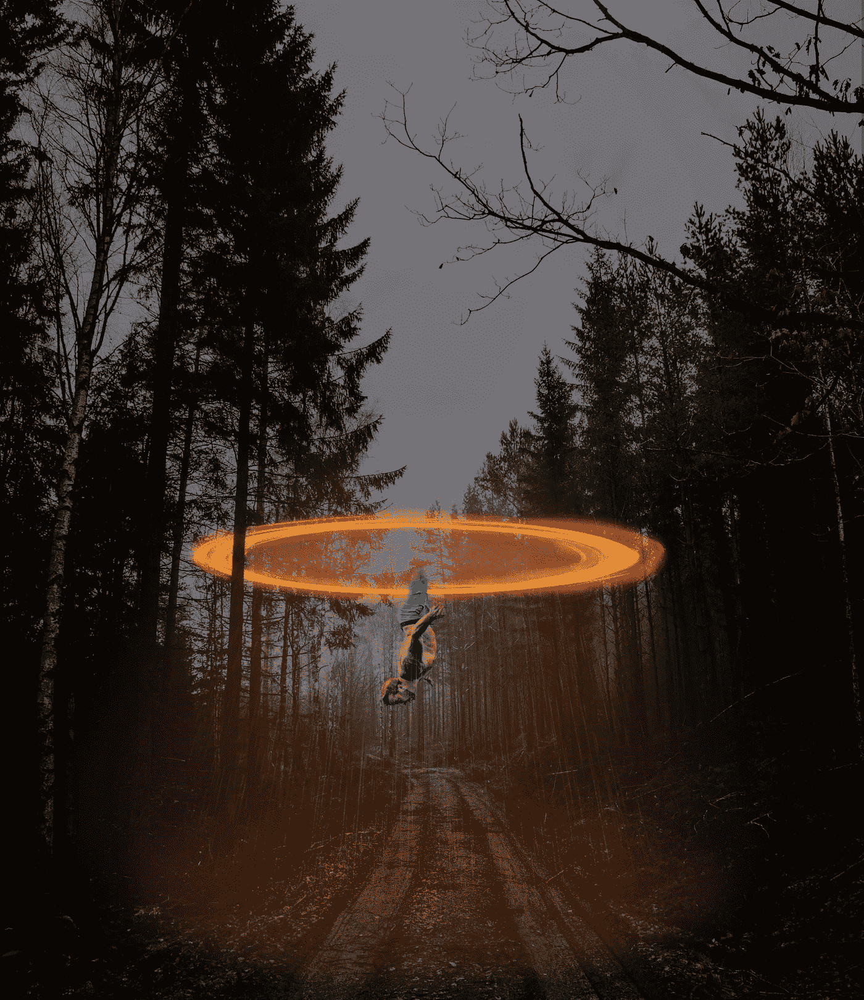

# NFTs 不仅仅是艺术吗

> 原文：<https://medium.com/coinmonks/nfts-are-not-just-for-art-and-gains-d1733ff617d3?source=collection_archive---------7----------------------->

## NFT 的真正潜力

[Here’s an NFT I created. I call it — “Whoops Where Am I?”](https://rarible.com/token/0xd07dc4262bcdbf85190c01c996b4c06a461d2430:99435:0x678e06e78b65f5f61d715b9619f2f8f1da62b711)

空气中弥漫着 NFT 时尚。价值数百万美元的艺术品正在被购买，就好像是免费的一样。这场 NFT 泡沫在危机中给了艺术家机会，当 NFT 给了艺术家对他们作品的控制权时，许多杰作的赝品在互联网上游荡。

> 艺术的价值在于旁观者的眼中。