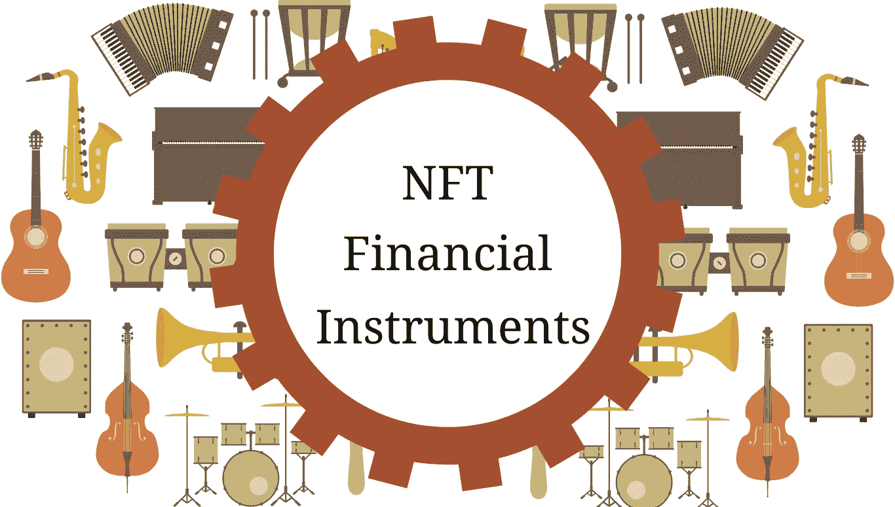

# 作为金融工具的非金融资产:获取资本和产生收入的三种新方法

> 原文：<https://medium.com/coinmonks/nfts-as-financial-instruments-three-new-ways-to-access-capital-and-generate-income-466eca8ceee9?source=collection_archive---------1----------------------->

随着[数字艺术代币](https://blockchainfiles.org/why-do-digital-art-nfts-have-value/)被广泛交易，不可替代代币(NFT)最近成为头条新闻。这篇文章将探讨 NFTs 如何被用作金融工具，比如抵押或租赁资产。将非金融交易作为一种金融工具的概念还没有得到充分的探索，但随着非金融交易获得更广泛的采用和使用，这一概念将会发展。我们将介绍三个例子来说明非功能性金融工具在未来如何被用作金融工具，并介绍一个例子来说明它们的局限性。

# NFTs 作为抵押品

有价值的实物资产可以通过抵押作为金融工具。这在抵押贷款中最常见，即房屋被用作贷款的抵押品。虽然以住房为抵押贷款很容易，但许多其他资产很难抵押。因为非金融资产易于交换，所以它们具有流动性，易于在公平市场上进行估价。在未来，NFTs 将为用户提供一种简单而安全的方式，使用许多数字和实物资产作为贷款抵押。

当用户从贷方取得抵押贷款时，他们将从贷方的账户中支付。NFT 将被锁定在智能合约中。如果贷款被偿还，则 NFT 将被转移回用户，而如果贷款没有被及时偿还，则 NFT 和对数字和物理资产的任何潜在权利将被转移到贷方。这种服务的一个当前例子是平台 NFTFI。

# 用于租赁的 NFTs

今天，你可以找到几乎任何实物资产出租，无论是超级跑车，电动工具，或名牌包。虽然 NFTs 可用于租赁有形资产的权利，但它们也将促进数字资产的租赁，使用户能够产生额外收入。

例如，流行视频游戏中的角色可以由 NFT 来代表。这个角色很罕见，在电子游戏中拥有特殊的力量。使用智能合同，角色的所有者可以将 NFT 出租给其他用户临时使用和享受，同时所有者可以产生收入。

# 通过非金融交易筹集资本

通常在商业中，筹集资金是必要的，无论是建立一个原型，支付员工工资，还是投资基础设施。传统上，资本主要是通过股权获得的，即企业以部分所有权换取资本。然而，对于特定的商业案例，非股权交易可能是股权模式的替代方案。

想象一个基于订阅的企业，例如“Bondex”Bondex 希望建立一家公司，以每月 250 美元的价格向订户提供金融服务。为了开展业务和开发服务产品，Bondex 大约需要 250 万美元。Bondex 不想放弃他们公司的任何股权。NFT 可以为 Bondex 提供一个不通过股权融资的解决方案。

Bondex 决定以 2500 美元的价格发行 1000 个独特的 NFT。NFT 让用户以每月 100 美元的折扣价获得金融服务产品。这意味着每年节省 1，800 美元。这种节约激励用户贡献资本以释放节约，因为存在可量化的价值。投资者也可以出资，希望他们能以高于支付价格的价格转售代币。除此之外，NFTs 还可以转租。例如，投资者可能以 5000 美元购买两个代币，然后以 2000 美元的价格出租。这将 1000 美元的储蓄转移给承租人，同时为投资者产生 80%的年回报率。如果 Bondex 愿意的话，他们可以要求每次租赁一个令牌都要支付版税。

现在，让我们考虑谁从这种类型的安排中受益。Bondex 能够在不放弃股权的情况下筹集资金。他们可能也尝试过打折预售订阅。然而，如果服务很差，这种主张会给用户带来风险。非森林交易创造了获利机会，刺激投资者和用户消除与前期成本相关的风险。购买 NFT 的用户受益于未来的储蓄。一旦 Bondex 开始提供服务，购买 NFT 的投资者可以出售或出租 NFT，并从中获利。甚至是从投资者那里购买或获得 NFT 的用户。NFTs 提供了一种融资方式，在这种方式下，每个人都可以获得积极的结果。

# NFT 的自动做市

非金融交易作为一种金融工具的局限性只有在考虑可兑换性时才真正显现出来。在大多数加密货币市场中，自动做市商总是通过以市场汇率买卖代币来促进交易。这保持了交易的准确性和效率，并使大多数加密货币非常具有流动性。

由于 NFT 的核心属性:不可替代性，实现自动做市商是不可能的。不可替代性意味着每个代币都有决定其市场价值的独立属性。例如，分散土地中的每块虚拟土地都具有不同的特征，这些特征决定了市场价值，例如:

1.  包裹的尺寸
2.  在地图上的位置
3.  这块土地已经产生了多少收入
4.  环境
5.  每日交通量

在讨论这个问题时，我们认为你可以将价格相似、交易量最大的 NFT 打包成可替换的 [ERC-20](https://blockchainfiles.org/erc-20-tokens-a-standard-for-cryptocurrencies-on-the-ethereum-blockchain/) 代币，以便将它们加入流动性池。然而，因为 NFT 的交易价格可以被操纵，以使资产适合给定的池，如果没有持续的审计，这是不可行的。

目前唯一适合 NFTs 的交易解决方案是点对点市场，它需要买卖双方就价格达成一致。虽然这意味着 NFT 不像可替代代币那样具有流动性，但我们预计这不会阻碍它们作为金融工具的使用。

# 结论

NFTs 如何被用作金融工具的许多用例才刚刚开始被发现和探索。在未来的几年里，我们一定会看到无数新的方法可以用来获得资本和创造收入。

# 参考

哥伦比亚特区三目(2020 年)。*利用不可替代代币的 NFT.finance。*英国伦敦:伦敦帝国理工学院计算机系。

> 加入 [Coinmonks 电报频道](https://t.me/coincodecap)，了解加密交易和投资

## 另外，阅读

*   [什么是融资融券交易](https://blog.coincodecap.com/margin-trading) | [成本平均法](https://blog.coincodecap.com/dca)
*   [BigONE 交易所评论](/coinmonks/bigone-exchange-review-64705d85a1d4) | [电网交易机器人](https://blog.coincodecap.com/grid-trading)
*   [3 商业评论](/coinmonks/3commas-review-an-excellent-crypto-trading-bot-2020-1313a58bec92) | [Pionex 评论](/coinmonks/pionex-review-exchange-with-crypto-trading-bot-1e459d0191ea) | [Coinrule 评论](/coinmonks/coinrule-review-2021-a-beginner-friendly-crypto-trading-bot-daf0504848ba)
*   [莱杰 vs n 格拉夫](/coinmonks/ledger-vs-ngrave-zero-7e40f0c1d694) | [莱杰纳诺 s vs x](/coinmonks/ledger-nano-s-vs-x-battery-hardware-price-storage-59a6663fe3b0) | [币安评论](/coinmonks/binance-review-ee10d3bf3b6e)
*   [Bybit 交易所评论](/coinmonks/bybit-exchange-review-dbd570019b71) | [Bityard 评论](/coinmonks/bityard-review-7d104239be35) | [CoinSpot 评论](https://blog.coincodecap.com/coinspot-review)