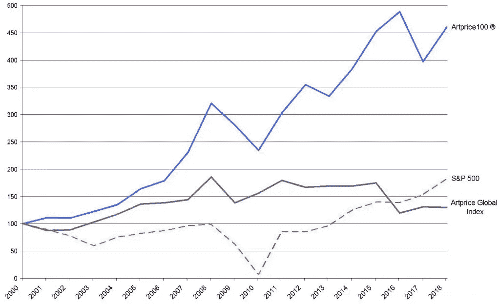

# NFTs、比特币和价值基础

> 原文：<https://medium.com/coinmonks/nfts-bitcoin-and-the-foundation-of-value-24cc7591612d?source=collection_archive---------3----------------------->

## 为什么 NFTs 可能不会像比特币对待金钱那样破坏艺术

2017 年 11 月，被认为是达芬奇所画的耶稣基督肖像*成为有史以来最昂贵的画作，[在拍卖会上以超过 4.5 亿美元的价格售出](https://edition.cnn.com/style/article/salvator-mundi-leonardo-da-vinci-whereabouts/index.html)。这个价格标签的合理性是什么？很难说清楚。直到最近，人们甚至还没有达成共识，认为这幅画是真的，甚至不是这位著名的文艺复兴时期的人画的，而是更有可能是一名学生([“萨尔瓦尔特·芒迪](https://www.vulture.com/2019/04/salvator-mundi-leonardo-da-vinci.html)”的发明)。就在 2005 年，这幅画在新奥尔良的拍卖会上仅售 1000 美元。仅仅过了十年，这个价格已经涨到了近 5 亿美元。*

2021 年，不可替代代币(NFT)越来越受欢迎，围绕价值和收藏品提出了类似的问题。随着总市值达到数百亿美元，数字艺术家毕普的一幅 NFT 作品以 69.3 美元的价格破纪录售出，很明显，非功能性数字电视有价值，因为人们在为它们花钱。虽然当前围绕非金融交易的讨论很快就接受了它们，认为它们将像比特币拥有金钱一样颠覆艺术和收藏品，但不太清楚的是，假设的价值主张，特别是它们与非金融交易作为艺术的关系，是否经得起仔细审查。考虑到这个领域的投资金额，尝试理解这些东西到底是如何被估价的，既有帮助又有责任。


Art vs. Art, “*Salvator Mundi” (left) and Beeple’s EVERYDAYS (right)*

是什么赋予了资产价值是经济学的核心问题之一。自从比特币诞生以来，它就变得特别有趣。比特币似乎凭空创造了价值，这打破了所有先例。自比特币的第一个[汇率](https://www.investopedia.com/news/bitcoin-pizza-day-celebrating-20-million-pizza-order/)以来，每一个牛市周期都伴随着加密货币领域的一些其他时尚。首先是模仿者(Litecoin，Dogecoin)，然后是“下一代”(Ethereum，Monero，Stellar)，然后是 ICOs ( [Dentacoin](https://www.notion.so/NFTs-Bitcoin-and-the-Value-Function-of-Collectibles-1d404eb1e75f4c8085c5c4b1db5f002b) 有人知道吗？)，以及最近的不可替代代币(NFT)和去中心化金融(DeFi)。每一次循环都会产生数十亿乃至数万亿美元的价值，这似乎也是无中生有。

这些叙述很容易纠缠在一起，混淆不清。如果比特币分叉或被复制，是否违反了支持者所说的有助于其价值的稀缺性原则？如果金钱不需要像黄金这样有形的东西，也不需要有一个中央机构的支持，那么艺术如果不是有形的，是否同样有价值？如果不可替代性是艺术的价值所在(谁不想拥有“独一无二”的东西)？)，那么同样的情况是否可以应用在数字领域呢？这一切都回到了什么是物有所值以及如何定价的问题上。

如果没有一个理性和一致的价值基础，那么估值就只不过是投机泡沫。由于比特币的历史表现及其网络的性质，比特币具有价值并可以充当存储价值，这已经成为不言自明的道理。但是比特币的主要用途是作为货币。理解其中的原因不仅仅是比特币和货币。

# 收藏品的价值功能

为了更具体地描述如何思考这个问题，设计一个框架，一个价值函数，来描述人们在给收藏品赋予价值时有意或无意地倾向于应用的特征，将是有用的。通过这种方式，我们可以尝试更有意识地描述价格中包含的信息，或者更重要的是，将包含的信息。

出于本文的目的，我建议收藏品的价值可以概括为以下特征的函数，其中大部分是时间的递增或递减函数:

```
**Intrinsic Value** (relatively stable over time)
**Scarcity** (Non-fungibility) + 
**Novelty** (decreasing function of time, increasing function of scarcity) + 
**Cost of Preservation** (PoW, increasing over time) + 
**Utility** (relatively stable over time) + 
**Store of Value** (function of time in either direction)
```

这篇文章的剩余部分将依次讨论这些特征，以及它们与非功能性测试的关系。

# 收藏品的内在价值

当许多黄金迷支持黄金作为货币(反对比特币)时，他们谈论的是黄金的“内在价值”。这种想法认为，黄金作为货币是有价值的，因为它本身就有非货币用途的价值(如珠宝和电子产品)。将此应用于艺术品等收藏品，在加密货币和货币特征的更广泛背景下具有指导意义，但它也可以让我们了解 NFT 市场。

显而易见，让一件艺术品有价值的不仅仅是其材料的“内在价值”，这些材料实际上会随着时间的推移而贬值。然而，它的美学价值可以被描述为艺术品的内在价值，例如将它挂在墙上对其所有者的价值。所以，价值 4.5 亿美元的达芬奇肯定挂在某个地方的博物馆里，对吗？还是作为某人家中私人收藏的一部分？虽然原本计划在卢浮宫展出，但除了所有者之外，没有人知道(或承认知道)这幅达芬奇的画在出售后最终去了哪里。关于[它最可能的位置](https://edition.cnn.com/style/article/salvator-mundi-leonardo-da-vinci-whereabouts/index.html)的最佳猜测是，它隐藏在一个黑暗的、气候可控的储存容器中，藏在任意数量的“自由港”、[国际免税区中的一个，这些免税区存在于新加波、塞浦路斯和日内瓦等地的机场和港口](https://www.npr.org/sections/money/2018/02/09/584555705/episode-823-planet-monet)(克里斯托弗·诺兰电影[中的一个主要动作场景发生在自由港](https://www.youtube.com/watch?v=yNCsT-xvaTg)的艺术收藏中)。


Beeple’s “EVERYDAYS: THE FIRST 5000 DAYS” ([source](https://bafybeiamjvnjv7pb2pzfpuy5mgb6atofqxv65p34nj77mjo5vf5t3cvhfm.ipfs.dweb.link/))

不管价值 5 亿美元的 Salvator Mundi*是否存放在自由港，世界上最有价值的艺术品大多都存放在那里，这似乎表明，价值至少不仅仅在于内在、材料或审美，即使它曾经是这样开始的。无法测量这些隐藏的私人收藏单元中收藏了多少艺术品，但几乎可以肯定有数十亿美元。2016 年，[《纽约时报》](https://www.nytimes.com/2016/05/29/arts/design/one-of-the-worlds-greatest-art-collections-hides-behind-this-fence.html)描述了一些在自由港发现的物品:*

> 两年前意大利警方在日内瓦发现的伊特鲁里亚石棺，是在 45 箱被掠夺的文物中发现的吗[……]价值 2800 万美元的安迪·沃霍尔、杰弗·昆斯、胡安·米罗等人的作品，现在存放在日内瓦自由港[，…以及俄罗斯亿万富翁德米特里·m·雷博洛夫列夫的 20 亿美元藏品。

这种趋势似乎更倾向于认为艺术品和收藏品的价值部分在于其美学价值，但更大程度上可能是作为长期价值储存手段，尤其是考虑到自由港的税收影响(或缺乏税收影响)。

## 主观价值理论

不言而喻，数字货币没有有形的内在价值，但尽管有视觉，因此可以说是有形的组成部分，数字艺术也是如此。艺术爱好者可能不会像在墙上一样重视电脑屏幕上的美学上令人愉悦的艺术作品。这就留下了关于他们赋予艺术家权力的长期能力的问题，正如经常承诺的那样，并进一步削弱了 NFT 以同样方式保存长期价值的能力的论点。

> 像皮普尔·NFT 这样的数字收藏品能像阿达·芬奇或莫奈那样成为价值储存手段吗？


[Non-fungible Tulip #6](https://opensea.io/assets/0x495f947276749ce646f68ac8c248420045cb7b5e/102738285709442980354704496827582257671450150611622528758357035837395623215105)

尽管存在上述问题，但一个无可争议的事实是，相对而言，有相当多的人看重非功能性金融工具，他们愿意在这些工具上投入大量资金。收藏品都有价格，无论它们是实物艺术品、稀有的棒球卡，还是不可替代的数字代币，如[比尔](https://www.beeple-crap.com/everydays)、[郁金香](https://opensea.io/collection/tulipmanianft)或[数字摇滚](https://www.cnbc.com/2021/08/23/people-are-paying-millions-of-dollars-for-digital-pictures-of-rocks.html)，价格是市场传递价值信号的方式。

具体来说，根据奥地利经济学派的说法，它们象征着“主观价值”。正如米塞斯在《[人类行动:经济学论文](https://cdn.mises.org/Human%20Action_3.pdf)》中首先描述的那样:“最终总是个人的主观价值判断决定了价格的形成。”或者，卡尔·门格尔在[经济学原理](https://cdn.mises.org/Principles%20of%20Economics_5.pdf)中做了更详细的介绍:

> *因此，价值不是商品所固有的东西，不是商品的财产，而仅仅是我们首先赋予满足我们的需要的重要性，也就是说，赋予我们的生活和幸福的重要性，因此，作为满足我们的需要的唯一原因，它延续到经济商品中。*

因此，如果一件商品不一定要有“内在的”价值才能被估价，而是要满足某种主观需要，即“价值不存在于人的意识之外”(门格尔，[属性](https://www.aier.org/article/misess-regression-theorem-bitcoin-and-subjective-value-theory/))，那么主观衡量标准可以以类似的方式应用于收藏品。但是，如果用于实物收藏品估价的特征不能转移到数字收藏品上，也许这标志着一个错误的估价，如果不是高估的话。

# 稀有收藏品的价值

```
Intrinsic Value (relatively stable over time)
**Scarcity** (Non-fungibility) + 
Novelty (decreasing function of time, increasing function of scarcity) + 
Cost of Preservation (PoW, increasing over time) + 
Utility (relatively stable over time) + 
Store of Value (function of time in either direction)
```

接下来让我们谈谈最重要的参数之一，也是经常被吹捧为 NFTs 创新的参数:**稀缺性**。

数字收藏品(NFT)争论的核心主要在于它们的独特性:它们是有价值的，因为它们是不可替代的，这是一个由区块链加密强制执行的特征。简而言之，达芬奇的原作是有价值的，因为它是不可复制的，并且可以与[媲美](https://www.investopedia.com/terms/r/rival_good.asp)。它是独一无二的，因此如果你碰巧拥有一个，这意味着你是唯一拥有它的人，稀缺性转化为一定数量的投机价值。这有一定的逻辑意义，因为一幅毕加索近乎完美的复制品，仅被训练有素的专业人士认定为如此，其售价仍仅相当于售价为[1.794 亿美元](https://www.pablo-ruiz-picasso.net/work-1027.php)的原作的一小部分，尽管它能够服务于*许多相同的目的，例如在装饰良好的走廊上突出重点，没有*可察觉的*差异。仍然只有一幅毕加索的真迹。*


“broccoli, the seasoned trowel” Crypto Coven NFT ID [#908](https://opensea.io/assets/0x5180db8f5c931aae63c74266b211f580155ecac8/908)

另一方面，人类历史上创造了大量独特的艺术，每天都有新的艺术产生，但这些艺术几乎抵不上它所描绘的画布。事实上，大多数艺术家会选择出售他们原创作品的复制品，而不是专注于原创作品，因为他们可以通过可替代性策略赚取更多。

这种衡量价值的方法在数字领域变得更加模糊。原始的实物艺术本来就具有竞争性，这意味着我拥有一件实物艺术必然会使其他用户或消费者也无法拥有该艺术。此外，虽然艺术在技术上是[非排他性的](https://corporatefinanceinstitute.com/resources/knowledge/economics/non-excludable-goods/)，因为许多人，而不仅仅是所有者，可以从艺术中获得乐趣，例如，它可以被借给或捐赠给博物馆，这实际上取决于所有者的判断。我们在上面的 *Salvator Munti* 的例子中看到了这一点，它原本预计将在博物馆展出。只要它还在储存中(或者在私人游艇上)，没有人能够从这种商品中获得效用，因为它在物理领域中的不可替代性。但是，对于可以无限制复制和传播的数字艺术来说，这怎么可能是真的呢？

# 两次拍卖的故事

纽约拍卖行[佳士得](https://www.christies.com/?lid=1&sc_lang=en)负责了近年来艺术界最大的两次拍卖:莱昂纳多·达芬奇[的 *Salvator Mundi* 有史以来最大的实物艺术品拍卖，成交价为 4 . 6 亿美元](https://www.christies.com/lot/lot-6110563?ldp_breadcrumb=back&intObjectID=6110563&from=salessummary&lid=1)和有史以来最大的数字艺术品拍卖[beepel 的*everydays:前 5000 天*成交价为 6930 万美元](https://onlineonly.christies.com/s/first-open-beeple/beeple-b-1981-1/112924)。根据这种非排他性的观点，比较佳士得拍卖这两件艺术品的页面是有启发性的。


除了 Beeple 列表中的技术语言之外，有一点非常突出，那就是需要明确地将数字艺术品描述为独一无二的(重点是后加的)。

> *铸造于 2021 年 2 月 16 日。* ***这部作品独一无二。***

当然，没有必要证明达芬奇的独特性。这是艺术品本身所固有的，所以那些竞拍者可以放心地认为他们得到的是真品。即使已经画了几幅，实际上也不可能先有一幅以上，或者艺术家甚至同时创作了多幅。事实上，*萨尔瓦托·芒迪*被认为是达芬奇被复制最多的作品之一，“数十件复制品挂在世界各地的博物馆里”([来源](https://www.vulture.com/2019/04/salvator-mundi-leonardo-da-vinci.html))，也就是说，我们*知道*它不是独一无二的，但这不是竞拍者关心的；他们在乎的是原创，而数字艺术并非如此。

进一步检查列表，我们可以看到实际上买了什么。达芬奇的物理细节被描述(“面板上的油”，“25 7/8 x 18 英寸。”等。).虽然我们知道这幅油画是在 25 7/8 x 18 英寸的。panel 被买走了，这个星球上只有少数人知道它在哪里，甚至知道它是否还存在。我们所拥有的基本上就是一张购物收据。虽然这张收据的持有者可以在法庭上证明他们是艺术品的合法所有者，但它并不能保证拥有。换句话说，购买证明并不能保证你拥有你所购买的物品(这就是你最终得到被盗艺术品的原因)。

多亏了区块链的魔力，我们可以追查到蜜蜂的真伪。我们从佳士得了解到，它是通过一个智能合约被铸造为 id #40913 的令牌，该合约部署在区块链以太坊的地址[0x 2a 46 F2 ffd 99 e 19 a 89476 e2f 62270 e0a 35 bbf 0756](https://etherscan.io/address/0x2a46f2ffd99e19a89476e2f62270e0a35bbf0756#readContract)。在 [Etherscan.io](http://Etherscan.io) 上检查此地址，并查询此特定 tokenId 的 tokenURI，我们得到以下结果:

```
ipfs://ipfs/QmPAg1mjxcEQPPtqsLoEcauVedaeMH81WXDPvPx3VC5zUz
```

(注意，这个 URI 的格式不正确，多了一个`ipfs/`。我们一会儿将回到这一点)

从可以访问 IPFS 网络的浏览器(如 [Brave](https://brave.com/brave-integrates-ipfs/) )查询(正确的)URI，我们得到一个包含以下数据的 JSON:


在这里，我们看到了佳士得清单上的许多相同信息(很好的可验证性)，但我们也看到了`raw_media_file`的一个属性，它包含另一个网址，将任何导航到它的人带到拍卖网站上描述的全分辨率、21069x21069 像素的数字图像。


Ether Rock ID 42 which [sold for $1.3m](https://twitter.com/etherrockprice/status/1429908317015445509?ref_src=twsrc%5Etfw%7Ctwcamp%5Etweetembed%7Ctwterm%5E1429908317015445509%7Ctwgr%5E%7Ctwcon%5Es1_&ref_url=https%3A%2F%2Fmaxbit.cc%2Fsingle-etherrock-sells-for-over-1-3-million-as-nft-mania-continues%2F)

与达·芬奇的作品相比,“在区块链上进行”的拍卖有着明显的便利性。以太坊契约为购买和所有权提供了一个很好的、方便的记录，而对于实物艺术品来说，购买只是获得所有权证明、独立验证、储存和运输的漫长过程中的第一步。另一方面，我们可以看到 *Salvatore Mundi* 如何有效地成为独家商品的明显区别，因为除了所有者之外的任何人都可以享受它的数字表示和从佳士得购买的证明。然而，Beeple 是不可排除的，因为任何人都可以访问它，所有实际出售的东西似乎只是购买的证明，即收据。

雪上加霜的是，合法购买该收据甚至不能保证所购买的潜在艺术品的真实性，这仍然需要由可信的第三方来决定。这实际上使 NFTs 成为一个更有效的系统，许多支持者说它将有助于利用艺术家:

让事情变得更加复杂的是，出售给比尔·NFT 的购买凭证实际上导致了一个破碎的 URI。那么他们拥有什么？据称，NFT 将所有权的客观性从物理世界带到了数字世界，就像比特币之于货币一样。但是，如果我们把这个想法引向它的逻辑结论，那么蜜蜂的主人客观上拥有一个破碎的 URI。只是因为我们假设卖方*的意思是*转让有效 URI 的所有权，我们才主观地将所有权归于可能出售的艺术品。这意味着，虽然所有权可能在法庭上站得住脚，但在“区块链”的客观法庭上似乎站不住脚，这完全违背了目的。

# 新颖性和回归定理

```
Intrinsic Value (relatively stable over time) +
Scarcity (Non-fungibility) +
**Novelty** (decreasing function of time, increasing function of scarcity) +
Cost of Preservation (PoW) +
Utility (relatively stable over time) +
Store of Value (function of time in either direction)
```

回归定理是奥地利经济学派的另一个支柱，由米塞斯在他 1912 年的著作《货币和信贷理论》中首次描述。简而言之，该理论认为，任何用作货币的商品都可以追溯到它没有被用作交换媒介但有一些非货币用途的时间点。

> 如果我们继续这样越走越远，我们最终一定会到达这样一个点，在这个点上，我们再也找不到客观交换中的任何组成部分——货币的价值，这种价值来自基于货币作为共同交换媒介的功能的估价；在这里，货币的价值就是除了作为货币之外在其他方面有用的物品的价值

*(* [*货币信用理论*](https://cdn.mises.org/Theory%20of%20Money%20and%20Credit.pdf) *)，引用自* [*米塞斯回归定理，比特币，以及主观价值理论*](https://www.aier.org/article/misess-regression-theorem-bitcoin-and-subjective-value-theory/) *)*

多年来，比特币一直被用作价值储存手段(SoV)和交易媒介(MoE ),包括现在[甚至被民族国家](https://www.nytimes.com/2021/09/07/world/americas/el-salvador-bitcoin.html)使用，比特币的创造和随后的成功使这一理论受到质疑。对比特币的一个普遍批评是，它不能充当 MoE，因为它的价值无法追溯到“直接使用价值”。然而，它已经被如此使用，所以要么米塞斯是错的，要么我们都生活在一个集体的错觉中，价格将为零。


[CryptoPunk 3100](https://www.larvalabs.com/cryptopunks/details/3100)

有几种[理论](https://cdn.mises.org/Bitcoin%20the%20Regression%20Theorem%20and%20the%20Emergence%20of%20a%20New%20Medium%20of%20Exchange.pdf) [有助于](https://www.youtube.com/watch?v=Vti1jkhEDoA) [努力](https://www.aier.org/article/misess-regression-theorem-bitcoin-and-subjective-value-theory/)解决这个看似矛盾的问题，但我们不会在这里花太多时间。然而，值得一提的是，比特币在成为货币或有汇率的交换媒介之前，确实具有直接使用价值，这是作为一种积分系统，奖励给赢得比特币安全模型核心工作证明竞赛的节点。只是在这个积分系统建立之后，比特币才[后来被采用为交换媒介](https://www.investopedia.com/news/bitcoin-pizza-day-celebrating-20-million-pizza-order/)并发展出一种汇率。

康拉德·格拉夫[认为](https://www.konradsgraf.com/blog1/2013/2/27/in-depth-bitcoins-the-regression-theorem-and-that-curious-bu.html)比特币最初的直接使用价值是作为一种社会信号机制(重点后加):

> *换句话说，在各种亚文化中，仅仅是拥有、知识和使用就可以承载社会成员的信号功能，就像穿着某种风格的衣服一样。对于那些关注这种信号的人来说，这些也是*直接消耗值*。直接使用的价值观，无论是心理学的还是社会学的，* ***不需要得到任何人的认可，除了在给定的亚文化中实际评价*** *(根据方法论个人主义和主观价值)。*

因此，比特币最初不是被用来交换商品和服务或储存价值，而是作为一种象征，表明你是某个特定团体的一员，也就是说，它是一种新奇事物。此外，“为了激发相关类型的人类行为，食物并不一定是有形的；他们只需要稀缺”。


NFTs first showed up on top of bitcoin in 2016

这可能夸大了比特币的情况，因为有很多其他方式向 cypherpunk 程序员发出信号，表明你是团队的一员(首先是代码和邮件列表贡献)，而比特币的实际所有权，尤其是在早期，是相当模糊的。例如，我们甚至不确定哪些早期比特币是由中本聪或其他实体开采的(见塞尔吉奥·德米安·勒纳 2013 年的论文[研究早期开采的硬币的运动](https://bitslog.com/2013/04/17/the-well-deserved-fortune-of-satoshi-nakamoto/))。

另一方面，NFT 非常适合社交信号，因为它们主要用作明确可消费媒体(通常是数字图像)的替身。在 Twitter 上简单搜索“ [NFT](https://twitter.com/search?q=%23NFT&src=typed_query&f=top) ”一词，并注意到所有出现在顶部结果中的 [CryptoPunk](https://www.larvalabs.com/cryptopunks) 和 [BoredApe](https://boredapeyachtclub.com/#/) 头像，这一点就变得很明显了。没有办法(至少目前没有办法)直接、加密地证明 Twitter 用户对图片的所有权；只要有一个头像来表明你是这个部落的一员就足够了。

事实上，你也可以公开展示你在这上面花了多少可支配收入，这也有其吸引力和新奇之处。这就是所谓的凡勃伦商品:一种违反直觉的需求会随着价格上涨的商品，通常是因为它“在炫耀性消费和炫耀性休闲的实践中，作为一种身份象征是可取的”。一种产品可能是维布伦商品，因为它是一种定位商品，很少有人能拥有”([维基百科](https://en.wikipedia.org/wiki/Veblen_good))。

这整个想法有点让人想起可能是，如果不是第一个，肯定是最明目张胆的数字凡勃伦商品:名为“我很富有”的 iOS 应用程序，在 app store 上售价为 1000 美元。


“I am rich”’s original app store listing

> *你的 iPhone 或 iPod touch 上的红色图标总是提醒你(当你给别人看的时候也提醒他们)你买得起这个。*
> 
> *这是一件完全没有隐藏功能的艺术品。*

所以，从字面上来说，这是一件艺术品，向人们展示你足够富有，可以花 1000 美元买它。


Public verification on the Ethereum blockchain that someone spent 400 ETH ($1.3m at the time) on a digital rock ([Etherscan.io](https://etherscan.io/address/0x41f28833be34e6ede3c58d1f597bef429861c4e2#readContract))

# 新奇×时间×稀缺

正如在价值函数的公式中所提到的，时间和稀缺性在*新颖性*对它的贡献中扮演了一个角色。当曾经新奇的商品在市场上存在足够长的时间，更多的竞争者和替代品出现在网上，冲淡了市场时，新鲜感就会消失。稀缺性确实增加了新奇感，尤其是在采用周期的早期。值得注意的是，这种新奇感并非来自特定类型的 NFT(无论是 CryptoPunk、CryptoCoven、BoredApe、Pudgy Penguin 还是 Rowdy Roo ),而是，如果我们将这种新奇感视为“了解”crypto 领域新东西的信号，那么它就是一个 NFT。也就是说，所有非专利技术(包括尚未制造的)的新颖性会随着时间的推移而降低，因此每个新的 NFT，尽管表面上是独特的和不可替代的，也会稀释整个市场中单个非专利技术的价值，当然对每个新制造的非专利技术来说也是如此。

# 新鲜感+时间=怀旧

一种值得提及并受到时间正面影响的新奇事物是怀旧。当市场参与者对收藏品产生情感联系时，怀旧可以提供某种价格底线。也许一件艺术品在你的家族里已经传了好几代了，或者也许你和一张棒球卡有着个人的联系，因为童年时看到你的球队赢得世界职业棒球大赛的记忆。在任何一种情况下，这种联系都会增加新奇感，而这种新奇感的力量会随着时间的推移而增加，这反过来又会增加商品的主观价值。目前还不清楚 NFTs 有没有可能有这样的特性，但是随着时间的推移我们只能确定。

# 保存成本

```
Intrinsic Value (relatively stable over time) +
Scarcity (Non-fungibility) +
Novelty (decreasing function of time, increasing function of scarcity) +
**Cost of Preservation** (PoW, increases over time) +
Utility (relatively stable over time) +
Store of Value (function of time in either direction)
```

在我看来，这是实物商品和数字商品分歧最大的领域之一，也是这个主题中最新颖、探索最少的领域。


让我们考虑一张迈克尔·乔丹 1986-87 年的 Fleer 新秀卡(其中一张最近以 15 万美元的价格售出)。这些对于比较来说是有用的，因为现在有基于体育的 NFT，比如 Top Shots。当乔丹新秀卡第一次出现时，它们显然是有限的，因为在迈克尔·乔丹在 NBA 的第一年，只有这么多可以或将要印刷。这对于锡安威廉姆森的 [NFT 来说也是一样的(并且是可证明的)。](https://nbatopshot.com/listings/p2p/c561f66b-5bd8-451c-8686-156073c3fb69+d012e87f-7aec-4f5d-969b-2af03890ab4f)

然而，其他事情发生了，使迈克尔乔丹牌更有价值。假设只印了 100 张，爱丽丝、鲍勃和卡罗尔碰巧都买了一包 1986 年的卡片。

假设四年后的 1990 年，Carol 的房子被洪水淹没，装有她卡片的盒子被水损坏。这有效地将卡的总供应量减少了 1%。

鲍勃认为乔丹被高估了(他毕竟只是被选中的第三号球员)，他不可能和魔术师约翰逊或拉里·伯德这样的人竞争。所以鲍勃从来没把这张卡放在心上，把它扔进抽屉里，在那里它磨损了。供应量再次减少 1%。

另一方面，爱丽丝在大学期间一直关注着乔丹的职业生涯，知道那里有一些特别的东西。她买了一盒卡片。当她不得不搬家时，她会确保密切跟踪它，总是把它放在附近。在乔丹获得第一个冠军后，她投资了一台除湿机来保持它的新鲜状态，这样她就可以把它传给她的孩子。

这里值得注意的是，增加爱丽丝投资价值的不仅仅是新奇感(乔丹成为 [G.O.A.T.](https://www.dictionary.com/e/slang/g-o-a-t/) )或稀缺性，她还真的投入了自己的时间和资源，首先建立(看到了乔丹的潜力)，然后保持其价值，放弃了在其他地方花费这些资源的机会成本。这一过程让人想起比特币的工作证明(Proof of Work ),即矿工消耗(并生产)电力，这些电力原本可以用来生产小部件，以保护比特币区块链，并因此获得比特币补偿。从长期来看，保证比特币价值的是用来保护比特币的机会成本。

> 在数字领域，没有什么比花费更多的资源来保存项目更能增加保存的机会

虽然 NFT 确实会导致物品丢失(保管人或钱包被盗、忘记密码等)，从而导致总体供应量减少，但在数字领域，没有什么比花费更多资源来保存物品更有可能保存下来。比特币的伟大创新之一是，保护价值数十亿美元的数字货币的手段是开源的，实际上是商品化的，因此对于某人来说，保护价值 10 美元的比特币和保护价值 10 亿美元的比特币一样经济实惠。相比之下，用于保存一件艺术品的单一存储单元不能用于保存任何其他物品，你越想保护你的物品免受风险，你就必须投入更多的资源来保护它。


[The Real Goat Society](https://etherscan.io/address/0x2f14f1b6c350c41801b2b7ba9445670d7e2ffc70) token #214

考虑到列奥纳多·达·芬奇的 *Salvator Mundi，这个因素变得更加明显。* Alexander Parish 是 2005 年以 1000 美元买下这幅画的投机者[将拍卖中的投标描述为赌博](https://www.vulture.com/2019/04/salvator-mundi-leonardo-da-vinci.html):“你对一件艺术品有很好的感觉，你打赌你比拍卖人更了解它。”这不仅仅是赌这幅画的未来投机价值。这幅画之所以便宜，是因为它被认为是达芬奇的复制品(而且是一幅糟糕的复制品)，而不是真迹。因此，第一资源被花费在一个保存不佳的复制品上，除了改善绘画的审美效用外，它几乎没有其他用处。当时，T4 花了十年时间和金钱来修复和研究这件作品。如果它只是另一个复制品，或者像许多人起初认为的那样，是达芬奇的一个学生画的，那么这些资源将不再可回收。

更不用说要将这幅画保存超过 5 个世纪需要付出的代价了。一些人认为，人类因时间的缓慢侵蚀而丢失的艺术品相当于“比世界上所有博物馆加起来还要多的杰作”有时它们在意外中被毁坏，有时艺术品会在自然或人为的灾难中丢失，比如在 911 袭击中丢失的价值约 1 亿美元的 T4 艺术品。相比之下，您可以通过加密备份来保护您的数字艺术作品，而无需支付边际成本，还可以进行地理分布，并在所有数字资产中重复使用相同的安全设置。相比之下，保护一件艺术品免受恐怖袭击的成本，在资源投资方面确实没有功能上的对等物，这是比特币等数字货币的优势。自由港代表了这种投资的一个例子，它不仅提供了一个避税地[，还提供了一个地方](https://www.nytimes.com/2016/05/29/arts/design/one-of-the-worlds-greatest-art-collections-hides-behind-this-fence.html)“在气候控制的环境中，财产受到保护，通常在视频监控下，在防火墙后面。”如果你认为旧金山的租金很高，想象一下日内瓦自由港。

这些成本是收藏品长期价值的基础，无论是一张扑克牌，一双篮球鞋，还是一幅价值连城的画。它们代表了这些资源本可以花在其他地方的被放弃的享受。这些成本也是一个赌注。现在投资保护、保存或评估一件收藏品是一场赌博，赌这件收藏品会在未来提供更大的回报，尽管这种回报远远不能保证。但由于市场作为一个整体投资于这些成本，它们反过来提供了关于这些资产长期生存能力的有价值的价格信号，而不仅仅是投机。

# 效用

```
Scarcity (Non-fungibility) +
Novelty (decreasing function of time, increasing function of scarcity) +
Cost of Preservation (PoW, increases over time) +
**Utility** (relatively stable over time)
Store of Value (function of time in either direction)
```

效用在价值函数的计算中有两种表现方式:内在的和网络的。内在价值已经包括在内了。在艺术中，这是审美上的好处(你可以用一件好的赝品有效地达到这一点)。当然，在很多情况下，一件物品可能会展示其内在价值和网络价值，正如不断增长的 sneakerhead 社区所展示的那样，在那里我们可以找到[一双售价 16k](https://stockx.com/news/the-10-most-expensive-sneakers-in-stockx-history/) 的鞋子，但不能找到*仅仅是*在一场篮球比赛中的使用。

当试图说明被铸造为不可替代令牌的数字插图的价值时，网络效用的价值更有希望。首先，考虑一下钱是如何运作的。我拥有的比特币更有价值，因为有其他人愿意接受它来换取商品和服务。对于非功能性网络游戏来说，除了作为社交信号的网络效用之外，当应用于特定网络的规则中时，它们还可以提供特殊的用途，尤其是作为游戏中的工具或角色。在物理领域，我们有神奇宝贝和万智牌(MTG)作为例子。像臭名昭著的[黑莲花](https://mtg.fandom.com/wiki/Black_Lotus)这样的 MTG 卡不仅像体育卡一样因相对稀缺而获得价值，还因为游戏的受欢迎程度，甚至玩起来有多赚钱(有超过 100 万美元奖金池的 [MTG 锦标赛](https://www.esportsearnings.com/games/567-magic-the-gathering-arena/largest-tournaments))。这意味着拥有一张强大的卡可以转化为游戏中更好的性能，即效用。


Magic the Gathering’s Black Lotus [which sold for $511,100](https://www.polygon.com/2021/1/27/22253079/magic-the-gathering-black-lotus-auction-price-2021)

没有理由不能将上述内容有效地转化到数字领域(事实上，在许多情况下，即使没有区块链也是如此)。在游戏中赋予其所有者独特能力的可证明稀缺的数字物品将被游戏的其他玩家视为有价值的物品(参见上面的主观价值理论部分)。游戏的网络效应越强，这些物品对现有玩家就越有价值。此外，有一种[飞轮效应](https://www.jimcollins.com/concepts/the-flywheel.html)在这里，游戏物品变得更有价值可以吸引更多的人来玩游戏，并改善游戏本身，从而使游戏物品变得更有价值。

然而，值得注意的是，这种类型的价值完全依赖于游戏本身的集中关注。即使不是全部，大多数最成功的视频游戏都是以非常大的规模运行的，拥有跨越创意、技术、销售和营销的大型团队，以及支持游戏的大型、昂贵的服务器和网络基础设施。这种集中化显然提供了价值，但也回避了这样一个问题:这需要放在区块链上吗？交易和销售数字的、供应受限的物品的能力可以通过一个中央服务器来完成，就像 MTG 卡片的印刷商可以强制实施有限的黑莲花供应(或者相反地[增加供应以改善游戏机制](https://www.npr.org/sections/money/2018/12/26/679311116/episode-609-the-curse-of-the-black-lotus))。应用程序本身固有的集中性，而公用事业 NFT 的任何特征都不要求它去中心化以获得价值。

有人可能会说，能够在游戏生态系统之外进行交易会增加价值，但我认为这只是表面现象。人们经常声称，因为游戏物品是完全开放的，任何人都可以接管游戏的维护或在相同物品的基础上创建一个竞争游戏。但是为什么会有人这么做呢？为一个游戏发行(和销售)NFT 的主要动机是作为一种集资机制来引导一个游戏和一个社区。在现有的 NFT 生态系统上开发一款游戏意味着你要承担游戏维护的所有费用，却没有多少金钱上的好处。


Bored Ape Yacht Club NFTs where ownership of an NFT grants membership into special “members only” channels

这种引导游戏和社区的能力似乎是像区块链 NFTs 这样的系统提供的主要附加值:绕过典型的筹款渠道，为你的游戏发行一些有限发行的头像。然而，这些优势都与为智能合约编写的一行代码无关。

当你有效地摆脱炒作时，分散化是这个计算中的一个次要因素；任何寻求最大化他们正在构建的 NFT 的效用的团队都可能不太关心分权，而更关心增加他们的初始资金筹集和引导他们的社区。这反过来会产生进一步的集中拉力。为什么要承担建造 NFT 和支持额外工程工作和区块链基础设施的额外工程成本。一旦炒作的气球放掉气，很难想象基于游戏的 NFTs 能维持目前的估值。

# 价值储存——圣杯

```
Scarcity (Non-fungibility) +
Novelty (decreasing function of time, increasing function of scarcity) +
Cost of Preservation (PoW, increases over time) +
Utility (relatively stable over time)
**Store of Value** (function of time in either direction)
```

当以上开始到位，并能够持续很长一段时间，收藏品可以开始建立自己作为价值储存，从纯粹的投机(或实用)转向更长期的投资。

这正是为什么自 2008 年金融危机后各国央行变得更加自信和干预主义以来，收藏品领域的价格上涨趋势在过去 15 年里一直在加速。例如，对日内瓦自由港的[审计显示，自 2007 年以来，一些仓库中储存的货物价值大幅增加，主要是艺术品等高价值货物的增加。“蓝筹艺术品在过去 20 年中的表现超过标准普尔 500 指数 250% (](https://www.nytimes.com/2016/05/29/arts/design/one-of-the-worlds-greatest-art-collections-hides-behind-this-fence.html) [来源](https://www.artprice.com/artmarketinsight/artprice-launches-its-blue-chip-art-market-index-artprice100-designed-for-financiers-and-investors-2))。甚至神奇宝贝卡片也开始看起来像一个很好的长期赌注，2020 年一个 Charizard [的销售创下了 22 万美元](https://screenrant.com/pokemon-logic-charizard-first-edition-card-record-sale/)的新纪录。



Artprice Bluechip art market index 20 year performance

稀缺性是商品成为价值储存手段的核心论点。只能有 2100 万个比特币。只有一幅达芬奇的原作*是萨尔瓦托·芒迪*画的。迈克尔·乔丹新秀卡只能有一年。因此，只存在 100 张数字摇滚购买收据就足够了吗？这样，当供应保持不变时，需求将继续增加。

时间会证明一切。从长期来看，市场通常是理性的，但在寻求均衡的过程中，市场在短期内是不可靠的。加密货币市场现在泡沫特别多，由于触发快乐的印钞机、多轮经济刺激和全球低利率，对不稳定资产的投机性投资是获得现金回报的好地方，但对基本价格信号不利。

早期采用 NFT 的社会信号可能会提供足够的基础，以建立一个可持续的长期价值商品储存库。然而，我认为重要的是要承认，实物收藏品的许多特征并不容易转移到数字领域；甚至稀缺的本质也不能以同样的方式应用。一份独特的购买证明并不等同于一件独特的艺术品。因此，如果当前或未来 NFT 估值的论点是基于它们对实物收藏品特征的镜像，就像比特币的论点是基于它对货币特征的镜像和改进一样，这些论点可能无法超越当前的投机泡沫。

不管我们如何评价它们，如果没有别的原因，仅仅因为区块链是不可改变的，那么非功能性原则无疑会存在。现在的所有者投资于他们的成功，并清楚地意识到他们购买的商品的价值。尽管如此，价格发现将会继续，新的使用案例将会被探索，因为媒体的真正新颖的特性将会被实验。NFTs 可能会有一条可行的前进道路，并且可能会有令人信服的有价值的提议，如[筹款机制](https://www.nbcnews.com/tech/security/nft-silk-road-founders-art-sells-6-million-rcna8369)、[不受审查的域名](https://handshake.org/)、持不同政见者授权工具或你所在部落的社交信号。也许不如艺术家赋权新领域的承诺、新一代网络 3 的收藏品或长期价值储存。

> 加入 Coinmonks [电报频道](https://t.me/coincodecap)和 [Youtube 频道](https://www.youtube.com/c/coinmonks/videos)了解加密交易和投资

## 也阅读

[](https://blog.coincodecap.com/bitsgap-review) [## 获取信号、交易机器人和套利

### 编辑描述

blog.coincodecap.com](https://blog.coincodecap.com/bitsgap-review) [](https://blog.coincodecap.com/best-telegram-channels) [## 40 个最佳电报频道，用于加密、电影、表演和演讲| CoinCodeCap

### 编辑描述

blog.coincodecap.com](https://blog.coincodecap.com/best-telegram-channels) [](https://blog.coincodecap.com/best-social-trading-platforms) [## 5 个最佳社交交易平台[2021] | CoinCodeCap

### 困惑于社交交易和副本交易哪个平台最好？本文将带您了解各种…

blog.coincodecap.com](https://blog.coincodecap.com/best-social-trading-platforms) [](https://blog.coincodecap.com/blockfi-review) [## BlockFi 评论 2021:利弊和利率| CoinCodeCap

### 编辑描述

blog.coincodecap.com](https://blog.coincodecap.com/blockfi-review) [](/coinmonks/buy-bitcoin-in-india-feb50ddfef94) [## 如何在印度购买比特币？2021 年购买比特币的 7 款最佳应用[手机版]

### 如何使用移动应用程序购买比特币印度

medium.com](/coinmonks/buy-bitcoin-in-india-feb50ddfef94) [](/coinmonks/best-crypto-tax-tool-for-my-money-72d4b430816b) [## 加密税务软件——五大最佳比特币税务计算器[2021]

### 不管你是刚接触加密还是已经在这个领域呆了一段时间，你都需要交税。

medium.com](/coinmonks/best-crypto-tax-tool-for-my-money-72d4b430816b) [](https://blog.coincodecap.com/best-hardware-wallet-bitcoin) [## 存储比特币的最佳加密硬件钱包[2021] | CoinCodeCap

### 编辑描述

blog.coincodecap.com](https://blog.coincodecap.com/best-hardware-wallet-bitcoin) [](/coinmonks/pionex-review-exchange-with-crypto-trading-bot-1e459d0191ea) [## Pionex 评论 2021 |免费加密交易机器人和交换

### Pionex 是为交易自动化提供工具的后起之秀。Pionex 上提供了 9 个加密交易机器人…

medium.com](/coinmonks/pionex-review-exchange-with-crypto-trading-bot-1e459d0191ea)