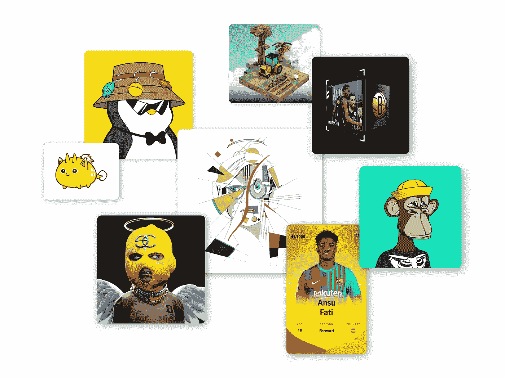

# NFTs 的品牌问题:他们不仅仅是艺术和头像

> 原文：<https://medium.com/coinmonks/nfts-branding-problem-they-re-so-much-more-than-art-and-avatars-870fc4418e17?source=collection_archive---------11----------------------->

## 说你“买了一张 NFT”就像说你“买了一张票”。当然，但是为了什么？

Various NFTs, from avatars to art, [NBA Top Shot](https://nbatopshot.com/), [Sorare](https://sorare.com/), and [The Sandbox](https://www.sandbox.game/en/).

不管你沉浸在这个领域有多深，我想你最近一定听说过很多术语''*。它似乎在创纪录的时间里成为了今年的流行语。大多数不消费的人…*