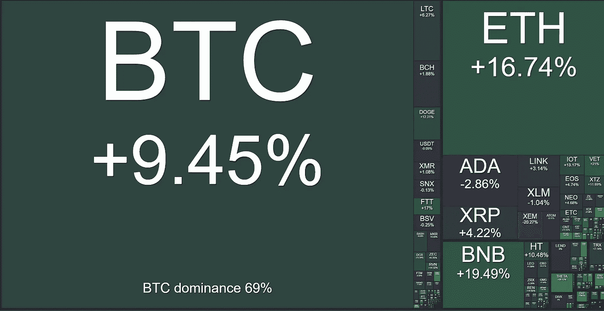

# NFTs —第二次降临

> 原文：<https://medium.com/coinmonks/nfts-the-second-coming-6bdfb6a0e8c8?source=collection_archive---------5----------------------->

## **加密中的星期**

本周伊始，比特币行业内充斥着极其乐观的消息，这些消息已将 BTC 挤出盘整区间，并有望达到约 5.8 万美元的历史高点。许多技术，如 NFTs、BTC 福克斯和 DeFi 协议和应用，都经历了其宣传周期和经常令人困惑的创新和实验期，比如 300MB 块、食品农业、生产测试、CryptoPunks、白帽黑客等。然而，在 BTC，人们真切地感觉到，比特币“这个行业”作为一种成熟的金融资产，正在被那些致力于了解该技术固有属性的人所重视。本周的开始完美地突出了这一点。

周一，Stone Ridge 子公司 NYDIG 为其以比特币为中心的金融服务业务完成了 2 亿美元的增长资本融资，该业务最近向 SEC 申请了管理比特币 ETF 的许可证，这肯定是 2021 年的市场必然趋势。这轮融资主要由摩根士丹利(Morgan Stanley)、纽约人寿(New York Life)、万通保险(MassMutual)和索罗斯基金管理公司(Soros Fund Management)牵头，代表了 NYDIG 目前服务的客户类型，并计划大规模开放。无论从哪个角度看，这都是一场真正的机构游戏，令人放心的是，其产品中有着比特币至上的精神。首席执行官 Robert Guttman 分享了我们之前持有(并经常重复)的以下信念:

*公司有信托责任考虑持有 100%的美元资产是否符合股东的最大利益——罗伯特·古特曼*

值得注意的一点是，随着更多机构产品竞争进入市场，难怪 DCG 旗下的 gray 看到其旗舰产品 GBTC 的溢价变为负值，因为投资者发现投资锁定期更少、风险敞口更低，套利机会关闭了。NYDIG 就是其中之一，最近来自目的投资公司的加拿大 ETF 也是如此，银河数码公司也将很快推出类似的产品。

继 NYDIG 成功筹集资金以扩大机构对 BTC 的采用之后，将国库储备分配给比特币的正常化与挪威能源巨头 Aker 一起迈出了一大步，宣布了一项区块流合作。这家由挪威最富有的人之一领导的公司宣布，他们已经成立了 Seetee，该公司将直接投资比特币作为国库资产，投资比特币相关的公司和技术，并投资比特币采矿。这是 Aker 经过深思熟虑、高度自信和明智的举措，将利用其石油和天然气经验来优化比特币采矿的能源需求，这是上周报道的一个主题。他们对这次商业行动的完整解释可以在这里阅读[。](https://www.seetee.io/static/shareholder_letter-6ae7e85717c28831bf1c0eca1d632722.pdf?utm_source=hs_email&utm_medium=email&_hsenc=p2ANqtz--eNlHTpRL_SiCGiMghHxinf7ebcVLL27nWdQpHAoiDRq6_M00v3nADibqOy1xDYXrVrUj5)

这可能是石油和天然气公司进入这一领域的开始吗？能源生产和比特币开采的协同本质是显而易见的，因此我们不认为 Aker 会是第一个也是最后一个这样做的人。

作为 NYDIG 和 Aker 新闻之后的最后一点，社交媒体高度期待进一步即将发布的机构收养新闻。随着 BTC 以前所未有的速度大规模、有规律地离开比特币基地，人们对谁是买家的猜测越来越强烈。正如我们之前说过的，流动性危机正在形成，这可能会比许多人预期的更快地推动 BTC 达到六位数。

**Chart from Glassnode showing BTC held on exchange at a record 2 year low.**

**NFTs——第二次降临**

几周来，随着不可替代代币(NFT)的复兴吸引了以太坊和更广泛的加密社区的想象力，比特币在新闻报道中一直处于次要位置。随着比特币在下方盘整，并在过去 3 周的大部分时间里与 50，000 美元调情，NFT 的炒作以及交易量和媒体曝光率飙升，艺术、娱乐和音乐行业的细分市场都越来越多的加入了这股潮流。如今，crypto 的发展速度惊人，平衡的报道充满挑战，因为有太多的创新、产品发布、投机、投资和增长…NFTs 的复兴就是一个很好的例子。第一波区块链 NFT 是由 Dapper Laps 的 Cryptokitties 创造的，于 2017 年发布，受到了同等程度的嘲笑、好奇和惊叹。然而，我们得出的结论是，收集包括猫在内的数字化稀缺物品的自由市场需求是存在的，这些物品都可以在以太坊的区块链上交易。当时，这对于技术界的许多人来说并不奇怪，因为数字收藏品已经在多人游戏中被购买、交易和使用了多年。

Chart showing current volume of traded NFTs. Source: The Block Crypto

人类决定了商品在社会中的价值，多年来收集了“无价值”的稀有商品，如棒球卡、古董鼻烟壶、帕尼尼足球卡、签名和有问题的抽象艺术品，这些商品的生产成本很低。数字和互联网时代正在向我们袭来，随之而来的是对我们周围一切的破坏，NFTs 是对我们人类收集稀缺品、纪念品和独家原创物品的欲望的最新破坏。

值得注意的是，在当前这个类似 ICO 的 NFT 泡沫中，音乐行业利用技术的能力直接吸引粉丝，用不可复制的可验证和可证明的独特内容进行点对点互动。可以对 NFTs 进行编程，使其包含拥有者的身份和来源，以及音乐和视频等内容的安全文件链接。这对于艺术家来说具有明显的金钱价值，他们希望将新的原创艺术分发给最想要的粉丝，而不需要昂贵的中介、代理和经理。“需要是所有发明之母”，在新的 COVID normal 时期，艺术家的收入来源正在枯竭，因此，NFT 是一个受欢迎的收入来源。Diplo，Paris Hilton，Grimes，Deadmau5 都在利用这项技术吸引粉丝以及最近通过 NFT 拍卖发布最新专辑的 Leon Kings。

对区块链技术和智能合约的这一最新进化用例得出一些猜测性的结论，我们注意到 Twitter(由著名比特币创造者杰克·多西创建)最近购买了音乐流媒体公司 Tidal 的多数股权，Jay Z 持有部分股权。我们还注意到，大约在同一时间，杰克通过 NFT 拍卖平台[贵重物品](https://v.cent.co/tweet/20?utm_source=hs_email&utm_medium=email&_hsenc=p2ANqtz--eNlHTpRL_SiCGiMghHxinf7ebcVLL27nWdQpHAoiDRq6_M00v3nADibqOy1xDYXrVrUj5)出售了他在 Twitter 平台上的第一条推文。撰写本文时的最高出价是惊人的 250 万美元。将这些点连接起来，我们现在看到的，而且一旦泡沫破裂，很可能会留下的，是多个市场的融合。社交媒体、流媒体网站、分散式金融、音乐行业、加密货币、艺术，所有这些领域都相互重叠，因为非功能性网络技术可能会给用户和创作者带来有价值的好处，并且分散式点对点技术、自由市场和互联网经济促进了这一过程。Jack 和 Jay Z 可能预见到了这一趋势的发展和成熟。

尽管大肆宣传，但在广告和营销、电影、艺术创作、拍卖、活动票务、播客、新闻服务、商品和游戏中，NFTs 的潜在用例非常丰富，我们将饶有兴趣地关注这一快速发展的领域。

Crypto weekly performance: 10th March 2021\. Source [www.bitgur.com](http://www.bitgur.com/?utm_source=hs_email&utm_medium=email&_hsenc=p2ANqtz--eNlHTpRL_SiCGiMghHxinf7ebcVLL27nWdQpHAoiDRq6_M00v3nADibqOy1xDYXrVrUj5)

> 加入 Coinmonks [Telegram group](https://t.me/joinchat/EPmjKpNYwRMsBI4p) 并了解加密交易和投资

## 另外，阅读

*   最好的[密码交易机器人](/coinmonks/crypto-trading-bot-c2ffce8acb2a)
*   [印度比特币交易所](/coinmonks/bitcoin-exchange-in-india-7f1fe79715c9)
*   [比特币储蓄账户](/coinmonks/bitcoin-savings-account-e65b13f92451)
*   最好的[加密税务软件](/coinmonks/best-crypto-tax-tool-for-my-money-72d4b430816b)
*   [电网交易](https://blog.coincodecap.com/grid-trading)
*   [最佳加密交易所](/coinmonks/crypto-exchange-dd2f9d6f3769)