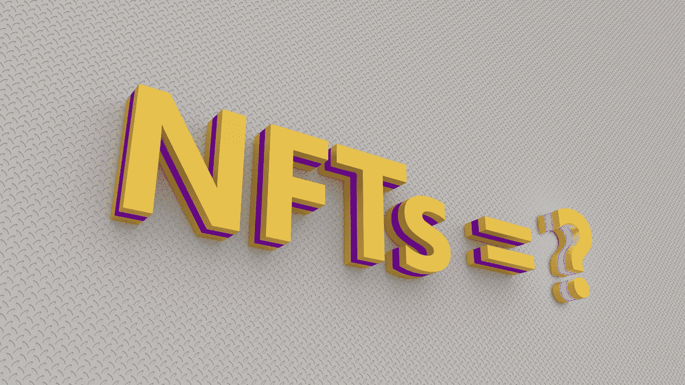
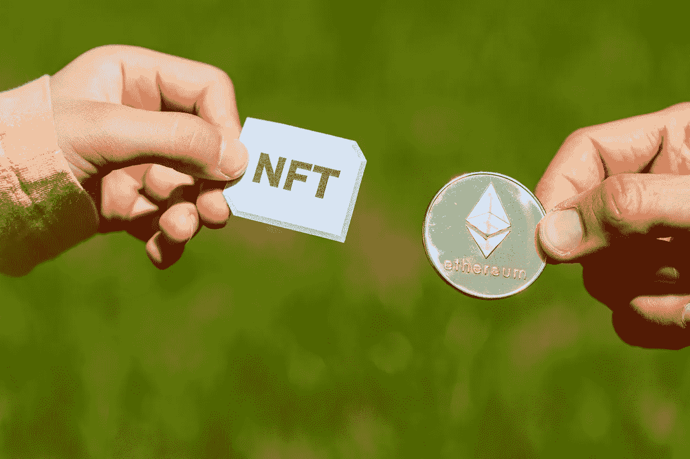

# 非功能性数字技术是什么？它们如何影响数字世界

> 原文：<https://medium.com/coinmonks/nfts-what-are-they-and-how-theyre-impacting-the-digital-landscape-d6d1cfc360e2?source=collection_archive---------10----------------------->

当你听说一件[皮普尔艺术作品拍出了 6900 万美元](https://www.theverge.com/2021/3/11/22325054/beeple-christies-nft-sale-cost-everydays-69-million)或者一条[290 万美元的推特](https://www.bbc.com/news/business-56492358#:~:text=Twitter%20founder%20Jack%20Dorsey's%20first,by%20Mr%20Dorsey%20for%20charity.)时，你开始怀疑。NFTs 值得大肆宣传吗，或者它只是一种时尚？

更重要的是，它们到底是什么？

把这篇文章看作是 NFT 及其对数字世界影响的“初学者指南”。

> 订阅 [**Coinmonks Youtube 频道**](https://www.youtube.com/c/coinmonks/videos) 获取每日加密新闻。

# 什么是 NFT？

NFT 是不可替换令牌的首字母缩写。NFT 是属于区块链网络上每个用户的唯一令牌。这意味着每个令牌都有不同的值。因此，你不能用另一种资产来替代它，就像可替代资产一样。

例如，对于比特币这样的可替代资产，你可以卖掉一个，换成另一个相同的。然而，对于 NFT，每一个都是独一无二的，没有类似的替换。

# 非功能性测试的起源

尽管 NFT 只是最近才流行起来，但它已经存在了一段时间。一些人认为，它们的起源可以追溯到 2013 年，从彩色硬币开始。彩色硬币被用来发行代表实物资产的代币。

比特币被用作彩色硬币的基础资产，每种彩色硬币代表等量的比特币。

虽然这可行，但它并不完美，因为它不容易实现或从一个地方转移到另一个地方。因此，还有改进的余地。以 ERC-721 的形式出现。

# 什么是 ERC-721？

ERC 代表以太坊征求意见。这是开发人员用来在以太坊区块链网络上创建不同令牌的协议，很像 NFTs 的情况。721 部分指的是一种特定的令牌类型，其值存储并记录在区块链上。

以太坊联合创始人、现在的 ConsenSys 创始人 Joseph Lubin 这样解释 ERC-721:

“在我们的设计中，我们关注可替代性，因为对于分散式应用程序来说，一件重要的事情是将不可替代的令牌作为一种资产类别。”

# NFTs 是加密货币吗？

关于 NFTs 最大的误解之一是它们是一种加密形式。尽管它们共享一些属性，但它们是完全不同的数字资产。对于相似性部分，两种资产都通过数字记录存储在区块链上。但也仅此而已。

比特币和以太坊等加密货币的价值更加透明和清晰。一个加密与同类的另一个加密具有相同的值。因此，你可以很容易地把一个换成另一个。

然而，对于非功能性测试来说，不存在同类方法，因为每个方法都是独一无二的。因此，你不应该混淆可替代资产和加密货币。

此外，NFT 和加密货币的目标不同。虽然两者都旨在以某种方式改变世界，但加密货币专注于创造可以作为替代货币形式的货币单位。

另一方面，NFT 旨在充当资产的数字所有权。因此，每个令牌都是唯一的，都有自己的属性。

# NFTs 背后的价值

人们以荒谬的价格出售 NFT 的例子数不胜数。对于那些不在科技领域或者不熟悉区块链科技的人来说，这简直不可思议。

通俗地说，NFT 是现实生活中资产的数字表示。这些资产可以是艺术品、游戏中的物品、视频、音乐，甚至是一条推文。NFT 交易通常在网上进行，并通过加密货币进行。

# 拥有令牌是否意味着拥有资产？

这就是 NFT 变得既有趣又令人困惑的地方。购买 NFT 的人不购买与令牌相关联的资产的所有权或版权。

作为购买者，您将拥有的是令牌所有权的数字表示。因此，资产所有者可以继续制造更多代币并出售。

那么，如果一个人不拥有 NFT，为什么要购买这种资产，尤其是溢价购买？

嗯，首先，主要的驱动力是利用 NFT 的日益流行。对于资产所有者来说，这是一个从他们的资产中赚钱的机会，而不需要实际放弃他们的所有权。

随着受欢迎程度的上升，投资者现在看到了一个从 NFT 价值上升中获利的机会。就像过去几年中以太坊等加密货币的价值飙升一样，这也是一些人眼中的 NFT。

这方面最好的例子是 NBA。他们正在投资一些项目，这些项目将让他们以 NFT 格式销售比赛片段。看起来，就像几十年来受粉丝欢迎的扑克牌一样，这些 NFT 也将如此。

尽管粉丝们没有原创视频的版权，但很可能很多人会投资。这是因为拥有这样的数字资产伴随着吹嘘的权利，它可能足以让令牌在未来获得更高的价值。

# 如何购买 NFT

对于艺术收藏家和体育迷等群体来说，NFT 预示着一个激动人心的未来。它们允许你拥有你最欣赏的资产的数字代币。所以，如果你热衷于行动，有几件事你需要开始做。

首先，你需要一个数字钱包，让你可以存储加密货币和 NFT。你还需要购买一种加密货币。有几个平台，包括比特币基地、T2、eToro 和北海巨妖，你可以用信用卡购买密码。

当然，你购买的加密货币将取决于 NFT 卖家接受的货币。

# NFTs Juts 是一时的时尚还是比这更有意义的东西？

公平地说，NFTs 的价值不遵循常规规则。然而，这并不是说它们不那么有价值。实际上，正是由于这种独特性和挖掘人们的兴趣，导致他们的人气迅速上升。一些加里·维的涂鸦作品刚刚在[克里斯蒂拍卖行以 120 万美元](https://www.cnbc.com/2021/10/01/christies-auctioned-gary-vaynerchuks-nft-art-for-1point2-million.html)售出

随着人们对数码产品的喜爱和重视程度的提高，没有比现在更好的时机了。

约翰·拉德福德——波恩数字公司首席执行官

> 加入 Coinmonks [电报频道](https://t.me/coincodecap)和 [Youtube 频道](https://www.youtube.com/c/coinmonks/videos)了解加密交易和投资

## 另外，阅读

*   [什么是融资融券交易](https://blog.coincodecap.com/margin-trading) | [成本平均法](https://blog.coincodecap.com/dca)
*   [支持卡审核](https://blog.coincodecap.com/uphold-card-review) | [信任钱包 vs 元掩码](https://blog.coincodecap.com/trust-wallet-vs-metamask)
*   [Exness 点评](https://blog.coincodecap.com/exness-review)|[moon xbt Vs bit get Vs Bingbon](https://blog.coincodecap.com/bingbon-vs-bitget-vs-moonxbt)
*   [如何开始通过加密贷款赚取被动收入](https://blog.coincodecap.com/passive-income-crypto-lending)
*   [BigONE 交易所评论](/coinmonks/bigone-exchange-review-64705d85a1d4) | [电网交易 Bot](https://blog.coincodecap.com/grid-trading)
*   [新加坡十大最佳加密交易所](https://blog.coincodecap.com/crypto-exchange-in-singapore) | [收购 AXS](https://blog.coincodecap.com/buy-axs-token)
*   [投资印度的最佳加密软件](https://blog.coincodecap.com/best-crypto-to-invest-in-india-in-2021) | [WazirX P2P](https://blog.coincodecap.com/wazirx-p2p)
*   [7 个最佳零费用加密交易平台](https://blog.coincodecap.com/zero-fee-crypto-exchanges)
*   [分散交易所](https://blog.coincodecap.com/what-are-decentralized-exchanges) | [比特 FIP](https://blog.coincodecap.com/bitbns-fip)
*   [用信用卡购买密码的 10 个最佳地点](https://blog.coincodecap.com/buy-crypto-with-credit-card)
*   [加拿大最佳加密交易机器人](https://blog.coincodecap.com/5-best-crypto-trading-bots-in-canada) | [Bybit vs 币安](https://blog.coincodecap.com/bybit-binance-moonxbt)
*   [火币的加密交易信号](https://blog.coincodecap.com/huobi-crypto-trading-signals) | [Swapzone 审查](/coinmonks/swapzone-review-crypto-exchange-data-aggregator-e0ad78e55ed7)
*   最佳[密码交易机器人](https://blog.coincodecap.com/best-crypto-trading-bots) | [购买索拉纳](https://blog.coincodecap.com/buy-solana) | [矩阵导出评论](https://blog.coincodecap.com/matrixport-review)
*   [Coldcard 评论](https://blog.coincodecap.com/coldcard-review) | [BOXtradEX 评论](https://blog.coincodecap.com/boxtradex-review)|[unis WAP 指南](https://blog.coincodecap.com/uniswap)
*   [阿联酋 5 大最佳加密交易所](https://blog.coincodecap.com/best-crypto-exchanges-in-uae) | [SimpleSwap 评论](https://blog.coincodecap.com/simpleswap-review)
*   购买 Dogecoin 的 7 种最佳方式 | [ZebPay 评论](https://blog.coincodecap.com/zebpay-review)
*   [最佳期货交易信号](https://blog.coincodecap.com/futures-trading-signals) | [流动性交易回顾](https://blog.coincodecap.com/liquid-exchange-review)
*   [3 商业评论](/coinmonks/3commas-review-an-excellent-crypto-trading-bot-2020-1313a58bec92) | [Pionex 评论](https://blog.coincodecap.com/pionex-review-exchange-with-crypto-trading-bot) | [Coinrule 评论](/coinmonks/coinrule-review-2021-a-beginner-friendly-crypto-trading-bot-daf0504848ba)
*   [莱杰 vs n rave](/coinmonks/ledger-vs-ngrave-zero-7e40f0c1d694)|[莱杰 nano s vs x](/coinmonks/ledger-nano-s-vs-x-battery-hardware-price-storage-59a6663fe3b0) | [币安评论](/coinmonks/binance-review-ee10d3bf3b6e)
*   [Bybit 交易所评论](/coinmonks/bybit-exchange-review-dbd570019b71) | [Bityard 评论](https://blog.coincodecap.com/bityard-reivew) | [CoinSpot 评论](https://blog.coincodecap.com/coinspot-review)
*   [3 commas vs crypto hopper](/coinmonks/3commas-vs-pionex-vs-cryptohopper-best-crypto-bot-6a98d2baa203)|[赚取秘密利息](/coinmonks/earn-crypto-interest-b10b810fdda3)
*   最好的比特币[硬件钱包](/coinmonks/hardware-wallets-dfa1211730c6) | [BitBox02 回顾](/coinmonks/bitbox02-review-your-swiss-bitcoin-hardware-wallet-c36c88fff29)
*   [BlockFi vs 摄氏度](/coinmonks/blockfi-vs-celsius-vs-hodlnaut-8a1cc8c26630) | [Hodlnaut 审核](/coinmonks/hodlnaut-review-best-way-to-hodl-is-to-earn-interest-on-your-bitcoin-6658a8c19edf) | [KuCoin 审核](https://blog.coincodecap.com/kucoin-review)