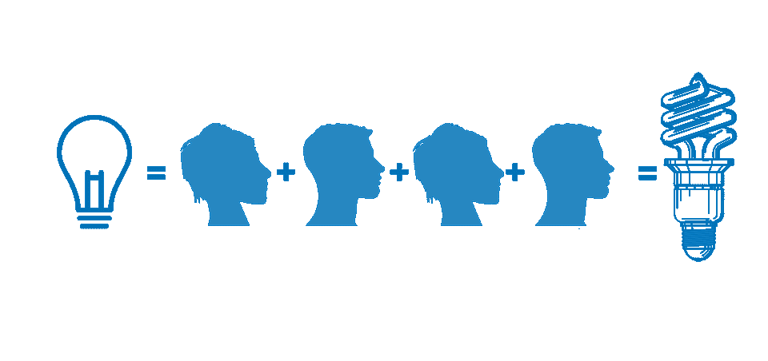
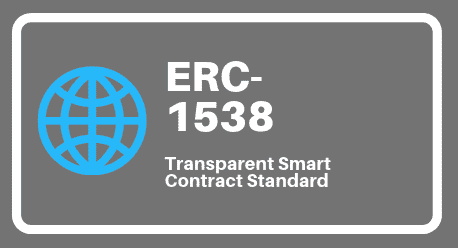
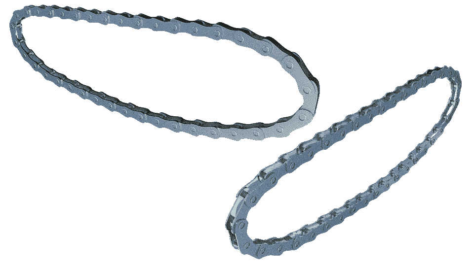
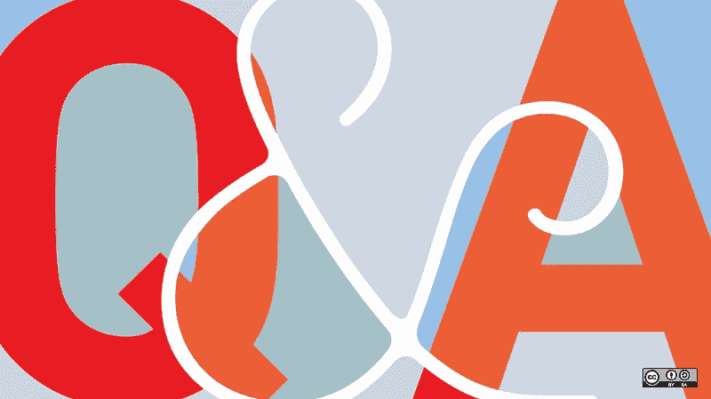
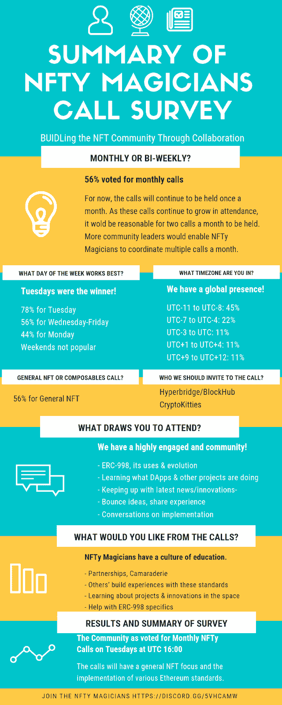

# NFTy 魔术师更新 2018 年 11 月

> 原文：<https://medium.com/coinmonks/nfty-magicians-update-november-2018-dba5e3657e8?source=collection_archive---------4----------------------->

# [ERC721](http://erc721.org) 不可替代物， [ERC998](http://ERC998.org) 可替代物， [ERC1538](https://github.com/ethereum/EIPs/issues/1538) 透明合同

BUIDLing a crypto community based off of collaboration and innovation for non-fungible tokens.

# **11 月电话会议总结**

电话会议从介绍开始，分享了我们正在进行的工作，以及我们工作的出发点。在围绕 [ERC1538](https://github.com/ethereum/EIPs/issues/1538) 透明合同和 [ERC998](http://erc998.org) 所有权循环的精彩对话开始之前，Haley 简要回顾了 10 月份的电话会议。 [Mintable](http://mintable.app) 公布了他们的 alpha 发布日期，2018 年 12 月 1 日。娜塔莉分享了 NFTy 魔术师电话调查的结果。有几个关于合作和会面机会的请求。*请一定要伸出手来参加聚会！*

> 一定要把这位叫做的魔术师添加到你的[日历](https://calendar.google.com/calendar?cid=Z2tjb2I2dDNoMXRsbWg5MWlqOGcxbWdkNzRAZ3JvdXAuY2FsZW5kYXIuZ29vZ2xlLmNvbQ)中！

# NFTy 魔术师的介绍:

首先给出不和谐的处理，接着是简短的介绍。

*   **Abhi (Abhi，**[**CryptoKitties**](http://CryptoKitties.co)**)——加拿大不列颠哥伦比亚省温哥华。帮助制作 Kitty 帽子，对 ERC998 感兴趣。**
*   **ChristianHentschel—(**[**Chris Hentschel**](https://github.com/chentschel?tab=repositories)**，TradeStars)阿根廷布宜诺斯艾利斯。:**使用可组合 NFT 的梦幻运动 DApp 中的贸易明星。克里斯很早就加入了 NFTy 社区。
*   **撞击— (** [**埃里克·穆伊泽，**](https://twitter.com/ericmuyser?ref_src=twsrc%5Egoogle%7Ctwcamp%5Eserp%7Ctwgr%5Eauthor)**[**HyperBridge**](https://twitter.com/Hyperbridge)**)—加拿大不列颠哥伦比亚省温哥华**。从 [Alexandra Moxin](https://twitter.com/Alexandra933) 那里听说了这个社区。Eric 希望看到更广泛的采用，并愿意合作。看着 ERC998 和 SES 博士。**
*   ****Flockonus(**[**Fabiano**](https://twitter.com/flockonus)**，**[**CryptoKitties**](https://www.cryptokitties.co/)**)—加拿大不列颠哥伦比亚省温哥华。从 Matt Lockyer 那里了解 NFTy 魔术师社区。ERC998 自下而上的兴趣。****
*   ****Hsummers (** [**哈利**](https://twitter.com/haleyrsum) **，** [**莫肯斯**](https://mokens.io/)**)——美国内华达州里诺。第一次听说 ERC998 和 NFTy 魔术师是在 Matt Lockey 写的早期更新中。在 mokens 处于测试阶段时加入了 Nick。****
*   ****Jomessin | OpenSea(**[**Jordan Messina**](http://jordanmessina.com/)**，**[**OpenSea**](https://opensea.io/)**)—美国纽约锡拉丘兹。Kitty Hats w/ Abhi 对 NFT 空间，尤其是市场感兴趣。****
*   ****失踪编号** —麦克风问题:(**
*   ****穆德根(** [**尼克·穆奇**](https://twitter.com/mudgen) **，** [**莫肯斯**](http://mokens.io/) **) —美国加州萨克拉门托**ERC 998 合著者，ERC1538 作者，莫肯斯创始人。**
*   ****Nathalie-ckc(**[**Nathalie Chan King Choy**](https://twitter.com/nathalie_ckc)**)——加拿大不列颠哥伦比亚省温哥华**——在五月份温哥华的一次会议上遇见了 NFTy 魔术师 Matt Lockyer 和 ERC998 创始人，之后加入。**
*   ****Scottrepreneur(**[**斯科特**](https://twitter.com/scottrepreneur) **，** [**网站**](http://www.scottherren.com/) **) —美国德克萨斯州奥斯汀。**尝试将一些稳定的硬币放入一个 Moken，并尝试看看如何让 NFTs 成为主流。**
*   ****Spaded(**[**Zach**](https://twitter.com/ZachBurks4)**，**[**Mintable**](https://mintable.app/)**)——泰国曼谷(原加州)**——自从 CryptoKitties 在黑客马拉松上出来做 beta 测试后就一直在 ERC721 工作。致力于铸造。**
*   ****佐普| Nonfungible.com(**[**佐普**](https://twitter.com/Gauthier_Z)**)——法国巴黎。**与丹共同创办(Dafky2000)。我希望为 NFT 市场带来透明度，并提高人们对即将到来的 NFT 项目的认识。**

# ****ERC1538:讨论由** [**尼克·穆奇**](https://twitter.com/mudgen) 主持**

***使用新的*[*ERC 1538*](https://github.com/ethereum/EIPs/issues/1538)*作为 NFT 合同的合同架构。***

****

**ERC1538 — Transparent Smart Contract Standard**

**[ERC1538](https://github.com/ethereum/EIPs/issues/1538) 是一种随着时间的推移升级智能合同、添加功能和发展的方式。尼克在制作《T2》时偶然发现了这一点。[莫肯斯](http://mokens.io)是 [ERC998](http://erc998.org) (Composables)，并希望合同能够在大小上增长，但合同只能有这么大。经过研究，发现与此最相关的是 [OpenZeppelin](https://openzeppelin.org/) VTables。Nick 决定提出 [ERC1538](https://github.com/ethereum/EIPs/issues/1538) 标准，因为现有的升级标准没有解决尺寸增长的问题。 [ERC1538](https://github.com/ethereum/EIPs/issues/1538) 本质上也是透明的。这是为了解决与可升级智能合约和安全影响相关的信任问题。通过以可见和可证明的方式发布更改，使可升级合同变得更加可信。这个想法类似于开源软件和源代码版本控制。**

****

***Fabiano 提问:*
既然智能合约被认为是不可变的，用户会怎么想？**

**Nick 的回答:
我希望用户界面能够很好地显示合同是如何随着时间的推移而变化的。我也希望看到安全和领域专家担保合同历史，这些变化是真正的*改进*而不是黑幕。我还可以看到智能合同有多个所有者，而不是只有一个所有者可以进行升级。这将降低单点故障的可能性，比如所有者的私钥被黑客攻击。然后，您可以让多个所有者发送一个事务，以便继续升级。**

**在瑞士联邦理工学院， [Aragon](https://aragon.org/) 团队正在为黑客马拉松创建类似 Github repo 的东西。**

**法比亚诺评论:
也许一些治理会有所帮助。例如，在协定中添加，在一定数量的块之后，使更改生效。这样，人们就能抬起头来，看到即将到来的变化。添加功能可能是琐碎的，更新现有的功能更可能是有争议的。**

***来自 Abhi 的评论:*
同意人们需要一个功能将被改变的警告，特别是如果它是一个被频繁使用的契约。如果有人正在使用一个正在改变的合同，可能会有糟糕的用户体验。**

**【Eric 的评论:
升级/变更问题不仅对这个提案很重要，对很多系统都很重要。也许试运行升级的结果会有所帮助。希望确保用户的资产所有权不会受到影响。**

**【Nick 的评论:
希望看到最佳实践的发展。一个可能的策略是，如果你有一个运行良好的函数，不要改变它。但是相反，如果你想增加功能，可以制作一个增加功能的新功能，而不是替换原来的功能。**

**【Nathalie 评论:
在传统的软件工程产品中，当一个新的特性出来替代一个旧的特性时，往往在新的代码出来之后，会有一个旧代码的弃用期。这给用户时间从旧代码过渡到新代码。**

# ****ERC998:讨论由弗洛克诺斯(** [**法比亚诺**](https://twitter.com/flockonus) **)** 主持**

***自底向上的 rootOwnerOf 方法，所有权循环。***

****

**[CryptoKitties](http://CryptoKitties.co) 一直在研究 rootOwnerOf，主要是研究[组件](http://erc998.org)的自底向上的用例。rootOwnerOf 可以跟随 998 或 721 的所有权链。他们对什么可能不理想有一些想法。例如，如果您拥有物品 A 和 B，在极端情况下，将 A 设置为由 B and B 拥有，然后由 A 拥有。这将创建一个耗尽汽油的循环。对于天然气来说，长长的所有权链可能变得不可预测。有没有人考虑过将一些令牌或者一定跳数列入白名单/黑名单？**

****

***扎克的问题:*
你能在做转让前检查所有权吗？**

**尼克的回答:
我试过了，但是没用。替代方法:用户可能会使用 web UI。在进行传输之前，UI 可以更容易地检查循环。**

**扎克的问题:
你能有一张地图吗？**

**尼克的回答:
你会有一份 NFT 家孩子的记录。**

**Zach 的评论:子元素的映射或数组可以在转移之前检查，或者如果一个令牌有代码**

***尼克点评:*《T2》为 A-B 案效力。当您引入更深层次的所有权链时，当 A 拥有 B 拥有 C …拥有 A 时，它会变得更加复杂。有兴趣了解更多可能的更好方法——可能最好是与代码讨论。 [ERC998 参考实现发布在 GitHub](https://github.com/mattlockyer/composables-998) 。很高兴讨论和/或获得拉式请求。**

***法比亚诺评论:*
如果你有 998 连接到其他 998 上，那你就有可能得到一个长循环。如果您有 998 连接到 721，那就更简单了。坚固性在内存中没有映射，所以在合理使用气体的情况下很难在运行时检测到循环。**

***尼克点评:*
环路燃气问题。如果没有循环，它确实需要一些气体来递归，但在大多数情况下不会太多气体。**

***来自 Abhi 的问题:*
通话中有人有一个拥有很长所有权链的用例吗？998 可以做很多工作，但是应该首先关注真正的用例。**

**【Haley 评论:
试图找出你会故意做循环的原因。类比:一群 NFT 狼依附在一个头上——容易分解。如果彼此拴在一起，就更难分解。**

***尼克评论:*
是的，可以看到循环在游戏中有一些功能，人们在标准的基础上增加了自己的定制功能。**

# ****来自 NFT 联盟的最新消息:讨论引领者，h summers(**[**Haley**](https://twitter.com/haleyrsum)**)****

****

**[0xCert](https://0xcert.org) 联系了 NFT 项目的各个组织，加入了 [NFT 联盟](https://nonfungiblealliance.org/)。NFT 联盟的成立旨在缩小不同项目需求之间的沟通差距，并为伙伴关系创造一个平台。如果您感兴趣，请联系 Haley 或 Urban:**

*   **哈利·萨默斯:haleyrebeccasummers@gmail.com**
*   **城市奥斯瓦尔德:urban@0xcert.org**

## **来自 Haley 关于洛杉矶的[密码投资峰会](https://cryptoinvestsummit.io/)和拉斯维加斯的[世界密码大会](https://worldcryptocon.com/)的更新。**

**人们终于开始理解 NFTs 了。两个不同的人起了鸡皮疙瘩，我告诉他们关于组合，代币拥有其他代币。我和来自 [POA 网络](https://poa.network/)的 [Sky Minert](https://www.linkedin.com/in/schuylerminert/) 进行了一次最好的对话。**

> **[POA 网络](https://poa.network/)是以太坊的侧链，利用权威证明作为其共识机制。POA 为开发人员提供了在以太坊标准中编码的灵活性，以及 POA Network 解决方案在区块链网络中的可扩展性和互操作性的额外优势。**

**[POA 网络](https://poa.network/)有一个[桥](https://poa.network/bridge)用于以太坊 ERC20s 和 ERC721s。POA 上已经有两款 NFT 游戏， [Everdragons](https://everdragons.com/) 和 [DopeRaider](https://doperaider.com) 。 [Sky](https://www.linkedin.com/in/schuylerminert/) 有兴趣与其他希望在 POA 网络上部署智能合同或通过 [POA 桥](https://poa.network/bridge)迁移令牌的 DApps 进行交流。**

# ****NFTy 魔术师电话调查反馈汇总:由 Nathalie-ckc (Nathalie)主持讨论****

**结果信息图。**

****

# ****社区更新来自** [**娜塔莉**](https://twitter.com/nathalie_ckc)**

**Nathalie 和 Zach (Spaded)于 11 月初在温哥华的 [DCTRL](https://twitter.com/dctrlvan?lang=en) 现场连线。**

# ****DApp 更新自** [**可造币**](http://mintable.app) **:讨论由 Spaded (** [**扎克**](https://twitter.com/ZachBurks4) **)****

****

**[可制造的](http://mintable.app) alpha 版本将于 2018 年 12 月 1 日发布。任何人都可以像 [BlockExplorer](https://blockexplorer.com/) 一样浏览 ERC721s。图片在 [NFTy 魔术师总频道](https://discord.gg/5vHcaMW)。任何有兴趣测试 [Mintable](http://mintable.app) 或参与 alpha 版本的人，请联系 Discord 上的 Spaded ( [Zach](https://twitter.com/ZachBurks4) )。**

# ****来自**[**Eric muy ser**](https://twitter.com/ericmuyser)的协作请求**

****

**[Eric](https://twitter.com/ericmuyser) 希望 NFT 资产允许另一个游戏开发商向 NFT 添加功能，在另一个游戏中使用升级后的功能，然后让同一个 NFT 将属性向上传播到原始游戏。然而，游戏导演不会这样做，直到它流畅地工作，经济是健全的，有信任，和高可用性。**

> **这是一个先有鸡还是先有蛋的难题——除非我们让它变得简单，否则他们不会做。**

**SES 博士是谷歌研究员马克·S·米勒的一个项目。米勒正在创建一个 javascript 智能合同系统 [Agoric](https://agoric.com/proof-of-concept-release/) 。SES 将权限和操作容器化，允许接口以安全的方式共享数据。每个人都在构建这些很酷的界面，SES 为数据共享创造了一个安全的承诺。这样，每个人都不会重新发明轮子。**

**Hyperbridge 将把 998 市场建成[街区枢纽](https://blockhub.nl/)。但是 BlockHub 被设计成一个[道](https://en.wikipedia.org/wiki/The_DAO_(organization))驱动的区块链解决方案协作环境。Hyperbridge 不想重做已经做好的一切，只是在基础上增加 5%的努力。如果接口是即插即用的就更好了。这对双方都是双赢，对区块链来说也是巨大的胜利。请[平埃里克](https://twitter.com/ericmuyser)就此话题进行进一步的交谈。**

# ****即将到来的 NFT 聚会****

****

**[NFT 迈阿密聚会](https://www.meetup.com/NFT-Miami/)将于 2018 年 11 月 28 日举行，由[贾尼达勒塔主办。](https://twitter.com/giannidalerta?lang=en)**

## ****请务必将** [**NFTy 魔术师召唤**](https://calendar.google.com/calendar?cid=Z2tjb2I2dDNoMXRsbWg5MWlqOGcxbWdkNzRAZ3JvdXAuY2FsZW5kYXIuZ29vZ2xlLmNvbQ) **添加到您的** [**日历**](https://calendar.google.com/calendar?cid=Z2tjb2I2dDNoMXRsbWg5MWlqOGcxbWdkNzRAZ3JvdXAuY2FsZW5kYXIuZ29vZ2xlLmNvbQ) **中，以便您可以加入** [**未来召唤**](https://calendar.google.com/calendar?cid=Z2tjb2I2dDNoMXRsbWg5MWlqOGcxbWdkNzRAZ3JvdXAuY2FsZW5kYXIuZ29vZ2xlLmNvbQ) **！****

**NFTy 魔术师每月电话会议于每月的第二个星期二 16:00 UTC 在 NFTy 魔术师不和谐的通用语音频道举行。**

**我们接受电话会议前的议程建议。如果你想添加一个不可替换的令牌相关的话题，请张贴在我们的 Discord 上并@-提及 nathalie-ckc 以确保它被记录下来。**

****

**[NFTy Magicians](https://www.nftymagicians.org/)**

****[**NFTy 魔术师**](https://discord.gg/5vHcaMW) **举办** [**月度例会**](https://calendar.google.com/calendar?cid=Z2tjb2I2dDNoMXRsbWg5MWlqOGcxbWdkNzRAZ3JvdXAuY2FsZW5kYXIuZ29vZ2xlLmNvbQ) **！我们邀请你加入** [**不和小组**](https://discord.gg/5vHcaMW) **成为 NFT 运动的一份子。******

******作者:** [**哈利·萨默斯**](https://twitter.com/haleyrsum)****

******编导、编剧:** [**陈景财**](https://www.linkedin.com/in/nathalie-ckc/) [**尼克·穆奇**](/@mudgen)****

## ******背景及往期更新**
- [介绍 Crypto components](/coinmonks/introducing-crypto-composables-ee5701fde217) -ERC 998[更新#1](/coinmonks/crypto-composables-erc-998-update-1cc437c13664) 、[、#2](/coinmonks/crypto-composables-erc-998-update-2-4b160df79836) 、[、#3](/@mattdlockyer/crypto-composables-erc-998-update-3-first-contact-f3930a08636) 、 [#4](https://hackernoon.com/crypto-composables-erc-998-update-4-the-namening-7a05d28f3401) 、 [#5、# 6
-](/coinmonks/crypto-composables-erc-998-update-5-eb0a748a9889)[更新 2018 年 10 月:“打造 Crypto NFT 社区”](/coinmonks/buidling-the-crypto-nft-community-crypto-composables-erc998-update-189a7c5333a7)****

> ****[直接在您的收件箱中获得最佳软件交易](https://coincodecap.com/?utm_source=coinmonks)****

********