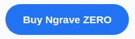
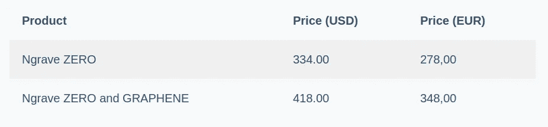

# n rave ZERO review 2022—最佳硬件钱包

> 原文：<https://medium.com/coinmonks/ngrave-zero-review-c465cf8307fc?source=collection_archive---------0----------------------->

NGRAVE ZERO

一个[硬件钱包](/coinmonks/the-best-cryptocurrency-hardware-wallets-of-2020-e28b1c124069)是一个存储加密货币的物理设备。这种钱包可以在离线模式下包含私钥。硬件钱包既不能连接互联网，也不能运行复杂的应用程序。因此，它们被认为是安全的，不会受到攻击。在本文中，我们将回顾加密货币市场中的顶级硬件钱包 NGRAVE ZERO。

[**n rave**](https://shop.ngrave.io/?sca_ref=380802.hYAXqGXOgJ)是一家数字资产安全公司。NGRAVE 的首要目标是为每个人提供一个安全可靠的加密货币钱包。

NGRAVE 的产品套件是与世界领先的纳米技术机构[大学间微电子中心(IMEC)](https://www.imec-int.com/en) 以及应用密码学研究小组、[计算机安全和工业密码学](https://www.esat.kuleuven.be/cosic/) (COSIC)和许多其他顶级合作伙伴密切合作构建的。

NGRAVE 同时提供硬件和软件安全解决方案。产品套件 1.0 由一个[硬件钱包 n rave ZERO](https://shop.ngrave.io/?sca_ref=380802.hYAXqGXOgJ)、NGRAVE GRAPHENE(一种不锈钢的加密谜题，作为备份来保护你的密钥安全)和一个移动应用 NGRAVE LIQUID 组成。

[**n rave ZERO**](https://shop.ngrave.io/?sca_ref=380802.hYAXqGXOgJ)是一款完全离线、物理防篡改的硬件钱包。因此，消除了任何种类的远程攻击媒介。它是从零开始设计和开发的，以安全为核心目的，在欧洲比利时制造。

# n 零审核:汇总

NGRAVE ZERO review: Summary

NGRAVE

# 物理性质

以下是 NGRAVE ZERO wallet 的属性。

*   钱包的尺寸是 125 毫米×72 毫米×14 毫米
*   它有一个 4 英寸的彩色高像素密度屏幕。
*   NGRAVE ZERO 的屏幕分辨率为 480 x 800 像素。
*   拥有 LCD 电容式 600 Cd/m2 高亮度触摸屏。
*   它配有一个 640 x 480 的内置摄像头。
*   NGRAVE ZERO 有一个 12 x 12 mm 的指纹传感器。
*   它提供了一个内置的光传感器。
*   在这个装置的侧面有一个“打开”按钮。
*   NGRAVE ZERO 防水防尘。
*   为了防止篡改，它有一个外壳，内壳和 PCB。

NGRAVE ZERO review: Physical Appearance

## 连通性

[**n rave**](https://shop.ngrave.io/?sca_ref=380802.hYAXqGXOgJ)是独立设备。它不需要任何连接，如 USB、Wifi、NFC 或蓝牙。因此，它将数字攻击面降至最低。黑客无法攻击该设备，因为它处于永久离线状态。它完全是“气隙”的。

NGRAVE 有一个 USB-C 端口，仅用于墙壁充电。固件更新也可以通过 USB 安全传输。在更新到安全启动模式之前，设备需要重新启动。

所有的更新都在一个隔离的分区中进行验证，比如 USB。它与设备的其他部分完全隔离。此外，固件更新由 EAL7 认证(世界上最高的安全认证)操作系统负责，以确保它们可以在完全安全的情况下进行。

Ngrave ZERO review: The connection between ZERO(offline) and LIQUID(online)

通过 NGRAVE LIQUID 应用程序可以在线连接到区块链。钱包和私钥保持完全脱机。交易的签署和账户的同步通过单向二维码进行。这种通过二维码进行的交流是从钱包到应用程序进行交流的唯一方式。私钥上的信息不会离开钱包。

# 零:安全审查

设备上的固件通过了 EAL7、ce、FCC、ROHS 和 EAL7 的认证，是世界上最高的安全保证和认证。它使用了 STM32MP157C (2019) MPU(微处理单元)，与其他 cold wallets 的典型 MCU(微控制器单元)相比，性能要优越得多。

MP1 于 2019 年发布，并于 2020 年进一步微调，是目前最先进和防篡改的组件之一。

关于安全性，该设备在几个不同的层上也完全防篡改。固件本身也内置了一个强大的防篡改框架。当您第一次打开设备时，您必须进行加密认证，以确保您的设备在到达之前没有被篡改。当你第一次启动时，这是在一个非常简单但重要的安全步骤中完成的。

有两种方法可以用你的 NGRAVE ZERO 钱包创建密钥。第一种方法是选择 12、18 或 24 个单词的恢复种子短语，这是当今大多数钱包支持的。第二种方法是创建一个非常个性化的密钥，也称为“NGRAVE Perfect Key”。这个密钥是 256 位主种子(24 个单词的助记短语)的 64 个字符的十六进制等价物，它在安全性方面有一些改进。这是业内乃至全世界最好的密钥生成系统。

# 如何创建 NGRAVE 完美密钥

*   您可以选择一个 4-8 位数的 pin 码。
*   为了保护您的私钥，NGRAVE 还添加了生物特征数据。你得用手指在指纹传感器上按几下才能完整记录你的指纹。然后，您的指纹将被添加到密钥生成过程中，以实现额外的个性化。
*   相机将从内置的光传感器获取光线。通过测量环境光，该设备进一步增强了密钥的随机性和强度。所有这些信息都将由内部芯片进行处理，制成一把钥匙。该密钥随后将开始实时更改其值。您可以与密钥进行交互，并通过与它进行交互来使它成为您自己的密钥，最终甚至使 NGRAVE 无法知道您创建了哪个密钥。该过程还消除了硬件钱包制造商甚至情报机构对密钥的任何后门。
*   您可以选择“冻结”和“解冻”来开始和停止密钥实时变化。您可以多次这样做。您也可以高亮显示想要随机播放的按键的特定部分。这使得与用户的交互直观且快速，并且升级了密钥的安全性。

NGRAVE Perfect Key

# 备份石墨烯板:备份你的钥匙

现在，您需要备份这些密钥。我们通常将恢复种子短语写在纸上，但是 NGRAVE 提供了一些特殊的东西。

它提供了一种高质量的不锈钢解决方案，称为[n 石墨烯](https://shop.ngrave.io/?sca_ref=380802.hYAXqGXOgJ)。这是一个非常耐用的密码难题。它可以承受房屋火灾(1660°C/3020°F)、水、震动、腐蚀或任何此类极端情况。这是非电子的加密解决方案。它由两个盘子组成，你可以把它们放在不同的地方。你需要两块板来完成钥匙。

对于你在屏幕上看到的每个字符，你都可以用自动压花笔在石墨烯上打一个洞。它有一个点击机制，可以产生物理力量在第一个盘子上打孔，而不会损坏第二个盘子。你对所有的角色都这样做。第一个标牌上的字符对每个顾客都有不同的排列。上板有 1024 个孔。有 10^ 78 可能的上板配置，相当于宇宙中的原子数量。这样**钥匙就分裂成了两块板**。所以只有这两个板块在一起你才能知道关键。它消除了单点故障，以防有人发现你的一个盘子，因为他们不能扣除你的钥匙的价值。

NGRAVE GRAPHENE Plates review

假设你丢了一个盘子。n rave 建议顾客购买多个下层盘子，因为下层盘子比上层盘子便宜，而且上层盘子在你丢失的情况下可以被 n rave 收回。然后你可以把钥匙放在两个下面的盘子里。

如果你失去了上层板块。您可以从以下选项中选择

1.  NGRAVE 会在交付给客户的每个包裹上附上订单号。通过在专用 NGRAVE 服务器或区块链界面中输入订单号，您可以了解上板配置。
2.  你可以在 NGRAVE 团队中用你的 KYC 数据来证明你自己。您可以联系客户支持部门，他们会保存所有订单的离线记录，并获取有关配置的信息。

您还有权告诉 NGRAVE 团队不要存储您的订单详细信息。如果选择此选项，即使丢失了上板配置，也永远无法恢复。

你应该始终避免给这些盘子拍照或把它们储存在网上。

这些板块也有死后的连续性。地点可以在遗嘱、传统公证人或区块链公证人中规定。

[n rave ZERO](https://blog.coincodecap.com/go/ngrave)在 ARM TrustZone 模块中有一个完整性验证器。当我们启动钱包时，它会定期检查软件，以确定是否有任何不想要的运行任务。它检查真实性和完整性。

钱包中没有调试访问，从而消除了闪存芯片的可能性。您不能修改固件。如果该设备检测到有人试图访问硬件，它会清除自己以及密钥。

私人钥匙从不离开钱包。只有通过不包含任何敏感信息的 QR 码才能进行通信。

# 零:硬件审查

[n rave ZERO](https://shop.ngrave.io/?sca_ref=380802.hYAXqGXOgJ)是一款多层防篡改硬件设备。它使用高端材料。金属外壳屏蔽了可能被攻击者获取的无线电频率，并在进行暴力攻击时减少了私钥的范围。NGRAVE 使用定制固件，该固件已经过安全专家的验证，并计划将其开源以供社区审查。

NGRAVE ZERO 耗电 1200 mAH(超高效低功耗)。它使用 USB 兼容电池充电器，并采用低功耗电源管理。

# 加密货币支持

它支持比特币、以太坊、EOS、莱特币、Neo 和许多其他货币。它还支持 1000+ ERC20 令牌。

# 与其他应用程序的兼容性

n rave 有自己的 app，名为 NGRAVE LIQUID。可以扫描钱包里的二维码下载 Ngrave 手机钱包。您可以进一步扫描下一个二维码，以便将设备上的所有帐户同步到您的应用程序。

NGRAVE ZERO 和 LIQUID 之间的所有通信都将通过二维码进行。零钱包与液体连通，然后液体与区块链连通。它可以获取所有事务的所有实时数据。它无法访问您的私钥。它给我们带来了强大的移动应用体验。

Ngrave LIQUID review

# NGRAVE ZERO 是如何工作的？

使用 NGRAVE LIQUID 和 ZERO 完成交易总共需要五个步骤。

1.  您需要在您的应用程序中创建一个具有流动性的交易请求
2.  你需要用你的硬件钱包 ZERO 生成的二维码扫描液体生成的二维码。
3.  您现在必须验证交易细节。然后你需要在你的零钱包里签字交易。
4.  在 LIQUID 应用程序的帮助下扫描钱包中的签名。
5.  您的交易将在区块链网络上广播和记录。

因此，我们可以得出结论，从生成交易，到签署交易，最后广播交易，一切都将在不需要连接到任何网络的情况下完成。

# 零价格

NGRAVE ZERO Pricing review

你可以[预订](https://shop.ngrave.io/)它，预计发货时间是 2020 年 1 月。

请在评论区告诉我们你对我们的 NGRAVE ZERO 评论的看法。

> 加入 Coinmonks [电报频道](https://t.me/coincodecap)和 [Youtube 频道](https://www.youtube.com/c/coinmonks/videos)获取每日[加密新闻](http://coincodecap.com/)

## 另外，阅读

*   [复制交易](/coinmonks/top-10-crypto-copy-trading-platforms-for-beginners-d0c37c7d698c) | [加密税务软件](/coinmonks/crypto-tax-software-ed4b4810e338)
*   [网格交易](https://coincodecap.com/grid-trading) | [加密硬件钱包](/coinmonks/the-best-cryptocurrency-hardware-wallets-of-2020-e28b1c124069)
*   [密码电报信号](/coinmonks/top-3-telegram-channels-for-crypto-traders-in-2021-8385f4411ff4) | [密码交易机器人](/coinmonks/crypto-trading-bot-c2ffce8acb2a)
*   [最佳加密交易所](/coinmonks/crypto-exchange-dd2f9d6f3769) | [最佳加密交易所](/coinmonks/bitcoin-exchange-in-india-7f1fe79715c9)
*   面向开发者的最佳加密 API
*   [特雷佐 vs 莱杰](/coinmonks/ledger-vs-trezor-best-hardware-wallet-to-secure-cryptocurrency-22c7a3fd391e) | [恩格拉夫 vs 特雷佐](https://coincodecap.com/ngrave-vs-trezor)
*   [莱杰 Nano S vs 特雷佐 one vs 特雷佐 T vs 莱杰 Nano X](https://coincodecap.com/ledger-nano-s-vs-trezor-one-vs-trezor-t-vs-ledger-nano-xledger-nano-s-vs-trezor-one-vs-trezor-t-vs-ledger-nano-x)
*   [n rave vs Ledger](https://coincodecap.com/ledger-vs-ngrave-zero)|[Ledger Nano S vs Ledger Nano X](https://coincodecap.com/ledger-nano-s-vs-x)
*   最佳[密码借贷平台](/coinmonks/top-5-crypto-lending-platforms-in-2020-that-you-need-to-know-a1b675cec3fa)
*   [免费加密信号](/coinmonks/free-crypto-signals-48b25e61a8da) | [加密交易机器人](/coinmonks/crypto-trading-bot-c2ffce8acb2a)
*   杠杆代币的终极指南
*   [埃利帕尔泰坦评论](/coinmonks/ellipal-titan-review-85e9071dd029)
*   [总账 vs 平均](https://coincodecap.com/ledger-vs-ngrave-zero)
*   [SecuX STONE 五金钱包回顾](https://coincodecap.com/secux-stone-hardware-wallet-review)
*   [莱杰纳米 S vs 莱杰纳米 X](https://coincodecap.com/ledger-nano-s-vs-x)