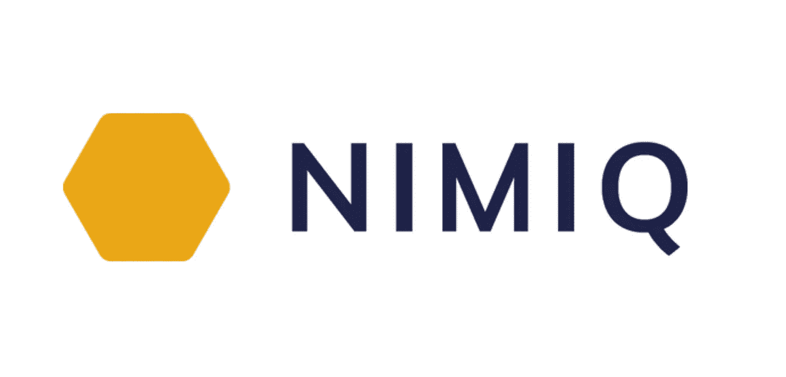

# Nimiq:首个基于浏览器的区块链

> 原文：<https://medium.com/coinmonks/nimiq-the-first-browser-based-blockchain-d7b68390a4a9?source=collection_archive---------7----------------------->

## 了解这个即将推出新功能的惊人项目！

Image from [Nimiq Developer Center](https://www.nimiq.com/developers/#apis)

## **什么是 Nimiq？**

顾名思义，Nimiq 是一个基于浏览器的区块链，它利用 JavaScript、WebAssembly 和 IndexedDB 等 web 技术来实现真正的点对点连接。不像其他区块链像比特币或以太坊，Nimiq 节点…