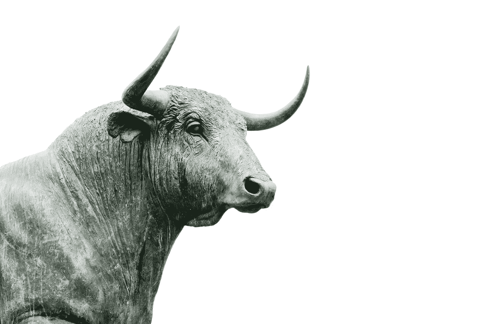

# 没有公牛。这个比特币减半的牛市周期正在放缓。

> 原文：<https://medium.com/coinmonks/no-bull-this-bitcoin-halving-bull-cycle-is-slowing-down-6cfe7d317f65?source=collection_archive---------0----------------------->

Photo by [Hans Eiskonen](https://unsplash.com/@eiskonen) on [Unsplash](https://unsplash.com/photos/wn57cSQ7VzI)

这个减半周期已经进行了 11 个月，我的两个主要目标已经实现。2021 年 2 月，我的第一个目标是 50k-54k 美元，我完全确定这个目标会实现。

[我的第二个目标是 65，000 美元，我认为这个目标有 90%的可能性实现](/coinmonks/working-backwards-to-find-bitcoins-ultimate-target-price-this-halving-cycle-389bc60011a8)，最近一次是在 2021 年的 4 月份。