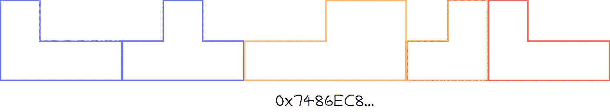
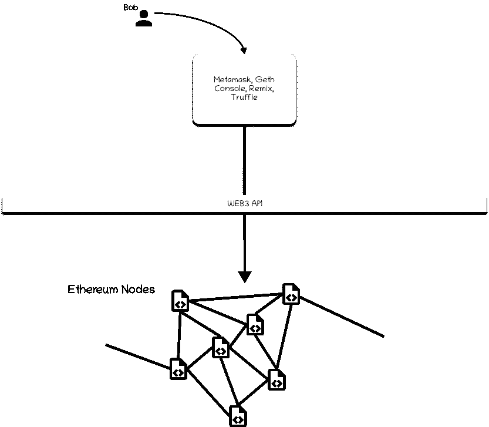

# 节点和 Web3

> 原文：<https://medium.com/coinmonks/node-and-web3-8de60f2152b4?source=collection_archive---------9----------------------->

Photo by [Eleventh Wave](https://unsplash.com/@11th_wave?utm_source=medium&utm_medium=referral) on [Unsplash](https://unsplash.com?utm_source=medium&utm_medium=referral)

在学习区块链和整个生态系统时，我有许多问题没有很快找到答案。由于使用了如此多的术语和行话，即使对其他人来说很容易，我也很难理解一些概念。在本文中，我旨在解释其中的一些术语。跳入水中。

先来画一张图吧！顾名思义，分散系统是分散的，而不是集中的。我们的数字分类帐文章(附上链接)讨论了每个节点如何携带分类帐副本。这意味着这个区块链上的每个节点都维护相同的数据。假设爱丽丝的笔记本电脑里有这个链条的副本。现在鲍勃想创造一只[密码猫](https://www.cryptokitties.co/)宝宝。在这个链的某个地方，Bob 必须执行函数调用来生成这个 Kitty。

你可以想象区块链智能合约是一个巨大的俄罗斯方块。

上图可以被认为是一个智能合同，它位于给定的地址中。这里的每个块都是一个函数，并且具有特定的结构(由参数和函数名决定)。给定这个智能契约的地址和结构(通常称为 ABI)，Bob 可以调用该函数并执行它。

Bob 将他的函数执行作为一个事务广播给链上的所有节点。挖掘器节点现在接收该事务，并尝试挖掘包含该事务的下一个块。这里的 Alice 可能是两种类型的节点之一。爱丽丝可能会尝试开采这一块，并获得一些奖励(加密货币)作为激励。或者，她可能会尝试在笔记本电脑上复制整个链来参与这个区块链(这也同样重要)。所以，简而言之:

1.  事务发送到所有节点。
2.  矿工节点开始工作。
3.  **挖掘的**块再次被广播到所有节点。
4.  非挖掘器节点记录这个块。挖掘器节点也记录这个块，现在尝试开始挖掘下一个块。

现在你可能会想到这样做的后果。这个区块链上每个人做的每一笔交易都有记录。这个完整的拷贝也存在于区块链上的每一个节点。因此，你可以想象，在决定区块链中存储什么时，必须非常谨慎。此外，不能创建占用大量计算资源的函数。它可能会阻止区块链网络的整个功能。因此，这些值中的每一个都有限制。

# 智能合同上的数据存储

智能契约有两个主要的东西，状态/变量和函数。状态存储值，函数对这些值进行操作。智能合约以键值格式存储变量及其值。智能合约中正好有 2 个⁵⁶唯一键可用。每个存储 32 字节(2⁵).因此，一个合同可以存储(2 个⁵⁶ * 2⁵)字节，也就是 2 个⁶字节。可能还会有其他问题，比如在达到这个存储级别之前会出现[哈希冲突](https://freemanlaw.com/hash-collisions-explained/)。

# 智能合同中高效代码的重要性

在以太坊区块链或任何其他具有智能合约的区块链上执行功能意味着你必须使用其他人的计算资源。众所周知，世界上没有免费的东西😄。每当你想在区块链上执行一项交易，你都需要支付一笔不小的交易费用。挖掘器的工作是挖掘发送到给定块中的事务。为此，鲍勃将付给矿工一小笔矿工费。但是如果事务执行一个可能无限循环运行的函数，Bob 完全是在浪费矿工的资源。因此这里引入两个主要概念:**气限**和**气费**。

# 汽油限量，汽油费

要开车，你需要汽油。你向加油站支付 X 美元，得到 Y 美元的汽油，可以让你的车行驶一段距离。类似地，当你执行一项交易时，你告诉矿工你愿意支付 X 天然气费来完成 Y 数量的计算。这里可能出现两种情况。您设置的限制比要求的多或少。
超过限额时，剩余金额将退还到您的帐户中。但如果限额少了，交易就还原了，你还是赔光了花的钱。
例如，执行从 Alice 向 Bob 汇款的简单交易最少需要 21，000 个气体单位。如果爱丽丝决定支付 200 gwei( [Giga Wei](https://en.wikipedia.org/wiki/Wei_Dai) )，那么这笔交易花费的矿工费为 21,000 * 200 = 4,200,000 gwei 或 0.0042 ETH(每个 gwei 等于 0.000000001 ETH/10^-9 ETH)。所以如果爱丽丝想付给鲍勃 1 ETH，她就得花 1.0042 ETH。0.0042 ETH 这是天然气的总价格，或者用通俗的话来说，就是矿工的费用。

# Bob 如何发送交易？

我们一直在讨论 Bob 如何向以太坊智能合约发送交易。但是鲍勃是如何着手做这件事的呢？Web3 来了！

Web3 是与节点交互的网关。你可能听说过 Metamask。元掩码为用户提供了与以太坊节点交互的接口。查询数据，执行函数，发送以太到其他账户，Metamask 可以做到这一切，甚至更多。Metamask 还可以作为一个钱包帐户，通过它您可以存储您的加密货币。像 Metamask 一样，有无数的应用程序可以帮助像我们这样的日常用户与区块链节点进行交互。

# 结论

总而言之，我们已经学会了如何:

1.  节点负责挑选事务并将它们挖掘到块中。
2.  节点存储区块链上的所有数据。所有的数据都是开放给大家验证的。这就是赋予区块链我们都知道的安全性。
3.  我们已经看到了什么是矿工费，以及为什么区块链上的每笔交易都需要矿工费。
4.  我们还看到了 Web3 是什么，以及它如何帮助我们与区块链的节点进行交互。

一些进一步阅读的链接:

1.  [以太坊 EVM 画报](https://takenobu-hs.github.io/downloads/ethereum_evm_illustrated.pdf)
2.  [汽油和费用](https://ethereum.org/en/developers/docs/gas/)
3.  [以太坊](https://hudsonjameson.com/2017-06-27-accounts-transactions-gas-ethereum/)中的账户、交易、Gas 和 Block Gas 限额
4.  [合同内存大小](https://ethereum.stackexchange.com/questions/986/can-a-contracts-internal-storage-keep-increasing-forever)
5.  [估算智能合同成本](/scrappy-squirrels/estimating-smart-contract-costs-f65acf818c26)

本文原载于博客，[blockchainseasy . github . io](https://blockchainiseasy.github.io)。

[https://blockchainiseasy.github.io/Web3-and-node/](https://blockchainiseasy.github.io/Web3-and-node/)

> 加入 Coinmonks [电报频道](https://t.me/coincodecap)和 [Youtube 频道](https://www.youtube.com/c/coinmonks/videos)了解加密交易和投资

## 也阅读

 [## 杠杆代币[多头代币]终极指南

### 杠杆化令牌是具有杠杆化风险敞口的 ERC20 令牌，不考虑保证金、要求、管理…

medium.com](/coinmonks/leveraged-token-3f5257808b22)  [## 最佳加密交易所| 2021 年十大加密货币交易所

### 加密货币交易所的加密交易需要了解市场，这可以帮助你获得利润。之前…

blog.coincodecap.com](https://blog.coincodecap.com/crypto-exchange)  [## 2021 年最佳加密交换平台| CoinCodeCap

### 如果我们看看今天的场景，许多加密货币交换平台提供了广泛的功能和深度…

blog.coincodecap.com](https://blog.coincodecap.com/best-swap-platforms)  [## 加密税务软件——五大最佳比特币税务计算器[2021]

### 不管你是刚接触加密还是已经在这个领域呆了一段时间，你都需要交税。

medium.com](/coinmonks/best-crypto-tax-tool-for-my-money-72d4b430816b)  [## 存储比特币的最佳加密硬件钱包[2021] | CoinCodeCap

### 保管您的数字资产很容易，但找到正确的存储方式却是一项繁琐的任务。在线钱包有一个风险…

blog.coincodecap.com](https://blog.coincodecap.com/best-hardware-wallet-bitcoin)  [## Pionex 评论 2021 |免费加密交易机器人和交换

### Pionex 是为交易自动化提供工具的后起之秀。Pionex 上提供了 9 个加密交易机器人…

medium.com](/coinmonks/pionex-review-exchange-with-crypto-trading-bot-1e459d0191ea)  [## 仙境提供了 83，412%的 APY 赌注:仙境是一个骗局吗？CoinCodeCap

### 仙境是雪崩网络的第一个基于时间令牌的分散储备货币协议。一篮子…

blog.coincodecap.com](https://blog.coincodecap.com/wonderland-offers-an-83412-apy-on-staking-is-wonderland-a-scam)  [## 天秤座货币——脸书的加密货币

### 自 2018 年马克·扎克伯格决定致力于改善区块链以来，关于天秤座货币的传言就一直存在…

blog.coincodecap.com](https://blog.coincodecap.com/libra-currency-a-cryptocurrency-by-facebook)