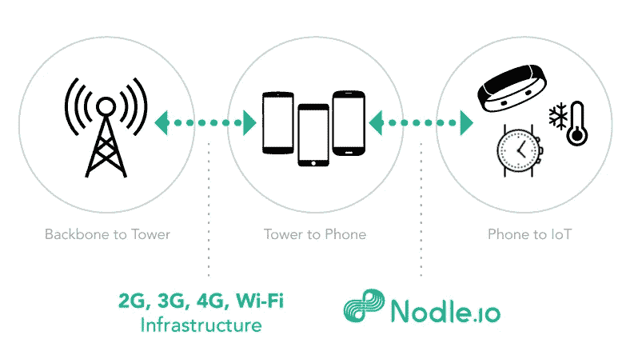

# Nodle，NODL 贡献的物联网解决方案

> 原文：<https://medium.com/coinmonks/nodle-the-iot-solution-for-a-nodl-contribution-8ce83fcda1d0?source=collection_archive---------5----------------------->

## ~dwulf

 [## 结节状副链

### 多达 8.5 亿个 NODL 代币将被分配给众筹贷款参与者，每个点至少有 20 个 NODL 代币…

parachain.nodle.com](https://parachain.nodle.com/?referralCode=5DkDSgA29qRjbrDNQhYZtUDZ8GJFkWXNLn45RS9zS5prvjJR) 

## **Nodle vs 氦**

除了 Acala、Astar、Manta 和 Parallel 之外，我支持的 parachain 项目之一是 Nodle。

我一直希望有一个 Polkadot 驱动的物联网和氦物联网开采解决方案的替代品，这需要昂贵的专有硬件(他们过去只需要一个 Raspberry Pi，现在如果你想开采氦，你必须获得他们的硬件开采解决方案)

Nodle 允许任何设备，主要是手机，作为一个矿工，发现无线设备(低能耗蓝牙，wifi 等)。)并使用它来累积 NODL 令牌，该令牌用于货币化网络，特别是网状网络。

氦网络使用洛拉万设备，我为 HNT，氦的本地硬币令牌。Nodle 使用大多数设备网络机制，包括蓝牙和 Wifi，但我对他们是否也使用 LoRaWAN 设备很感兴趣。这就是为什么我对他们如此兴奋的关键点。

## **Nodle 移动应用**

因此，移动应用程序是光滑的，Android 需要一些工具，我有一个 Pixel 5a，必须关闭电池优化，当然，允许访问设备的 GPS。之后，应用程序开始工作。

当它发现设备时，你会得到 NODL 代币，NODL 硬币代币的一部分，加到你的总数中。它开箱即用。

给你一个建议，尽快拿一份你的助记单词。因此，如果您的设备丢失或损坏，您可以将钱包移植到另一台设备上。我创建 Raspberry Pi 只是为了让更多的矿工能够访问更多的设备进行探索。

## **为什么要向 Nodle Crowdloan 捐款**

主要是因为我觉得，像阿卡拉，阿斯塔，曼塔。Nodle 为区块链提供了强大的效用。特别是设备发现和管理。我看到了在这个平台上构建的大量机会。

首先也是最重要的是它的实用功能，在物联网网状网络上交叉和交换数据，能够识别提供物资库存和责任的设备。除此之外，NODL 硬币/代币的经济性，虽然还没有美元价值，但它被用作区块链的商业用途，例如，可以用于支付网络和在线服务。

此外，一份 NODL 也不错。是的，你也可以挖掘它，但为我做贡献是一种方式，表明我在这个游戏中有皮肤，并希望适当地投资我个人天赋中没有的东西，投资他们的天赋，使之成为现实。

## **氦劳拉万**

好，我提到了氦和诺德尔的比较。因为 Nodle 使用任何设备和氦 HNT，过去把它放在树莓派上是没问题的，但现在他们强迫购买他们自己的矿工并抬高价格。这就是为什么 Nodle 很重要，因为他们可以使用任何设备，甚至是你的设备，Raspberry Pi，Pixel 5a，Galaxy 平板电脑，或者你的家用电脑…它甚至可以在 Linux 上运行。

氦的采矿设备通过位置证明运行这些矿工，并通过远程 LoRaWAN 硬件传输，从而获得奖励。在我所在的田纳西州，这种情况很少，但在市区就更多了。

## **Nodle 低功耗蓝牙**

虽然 Nodle 应用程序确实需要关闭电池优化，并通过 Nodle 应用程序访问 GPS。不像氦赚取 HNT 的基础上证明的位置。Nodle 基于发现证据获得其相应的硬币/代币 NODL，我认为它有更好的增长和收入比率。

## **结论**

毫无疑问，在我看来，能够融入物联网网络，实际上是建立了一个与互联网的连接，通过 Nodle 货币化，为用户提供了最佳的 onboarding 选项，建立在 Substrate 和 Polkadot 之上，为其提供了一个坚实的基础，因为 parachain 插槽提供了 Polkadot 安全性。

在我支持的所有项目中，Acala、Astar、Manta 和 Parallel。Nodle 是自然界中最实用的产品，为物联网设备提供了前所未有的市场。

请加入 Nodle，支持他们的众筹贷款，谢谢。

> [Nodle 项目推荐链接](https://parachain.nodle.com/?referralCode=5DkDSgA29qRjbrDNQhYZtUDZ8GJFkWXNLn45RS9zS5prvjJR)
> 10%推荐提升(双方各 5%)
> -5dkdsga 29 qrjbrdnqhyztudz 8 gjfkwxnln 45 RS 9 zs 5 prvjjjr

> 加入 Coinmonks [电报频道](https://t.me/coincodecap)和 [Youtube 频道](https://www.youtube.com/c/coinmonks/videos)了解加密交易和投资

## 另外，阅读

*   [我的密码交易经验](/coinmonks/my-experience-with-crypto-copy-trading-d6feb2ce3ac5) | [比特币基地评论](/coinmonks/coinbase-review-6ef4e0f56064)
*   [CoinFLEX 评论](https://blog.coincodecap.com/coinflex-review) | [AEX 交易所评论](https://blog.coincodecap.com/aex-exchange-review) | [UPbit 评论](https://blog.coincodecap.com/upbit-review)
*   [AscendEx 保证金交易](https://blog.coincodecap.com/ascendex-margin-trading) | [Bitfinex 赌注](https://blog.coincodecap.com/bitfinex-staking) | [bitFlyer 点评](https://blog.coincodecap.com/bitflyer-review)
*   [麻雀交换评论](https://blog.coincodecap.com/sparrow-exchange-review) | [纳什交换评论](https://blog.coincodecap.com/nash-exchange-review)
*   [支持卡审核](https://blog.coincodecap.com/uphold-card-review) | [信任钱包 vs 元掩码](https://blog.coincodecap.com/trust-wallet-vs-metamask)
*   [Exness 回顾](https://blog.coincodecap.com/exness-review)|[moon xbt Vs bit get Vs Bingbon](https://blog.coincodecap.com/bingbon-vs-bitget-vs-moonxbt)
*   [如何开始通过加密贷款赚取被动收入](https://blog.coincodecap.com/passive-income-crypto-lending)
*   [加密货币储蓄账户](/coinmonks/cryptocurrency-savings-accounts-be3bc0feffbf) | [加密交易机器人](https://blog.coincodecap.com/best-crypto-trading-bots)