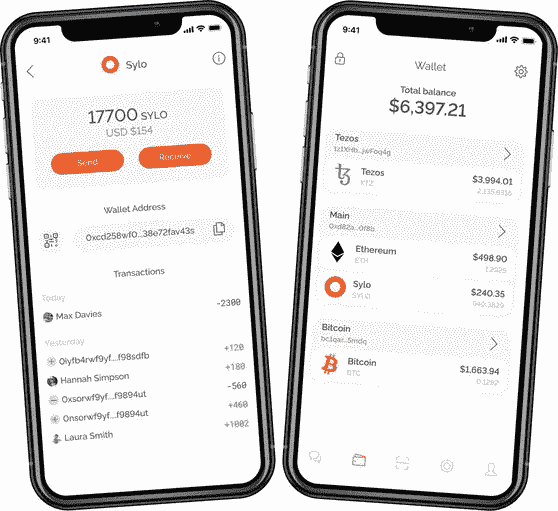
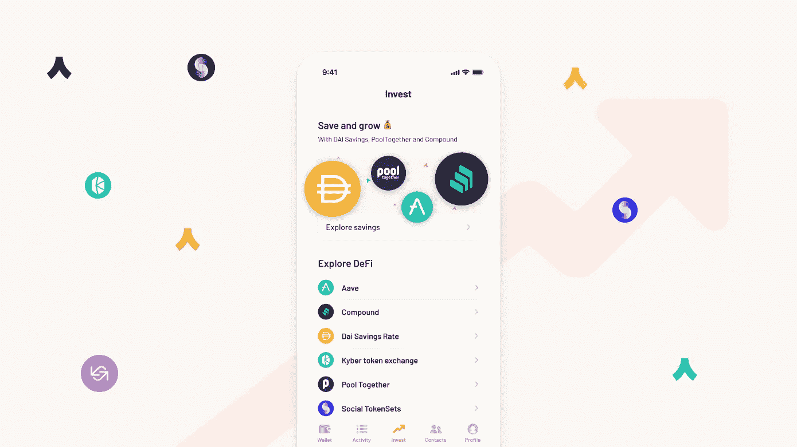
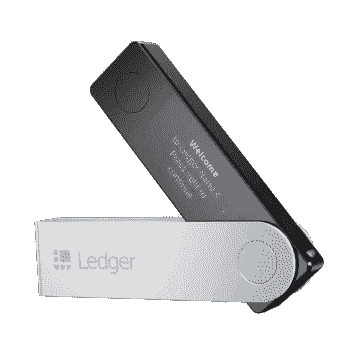
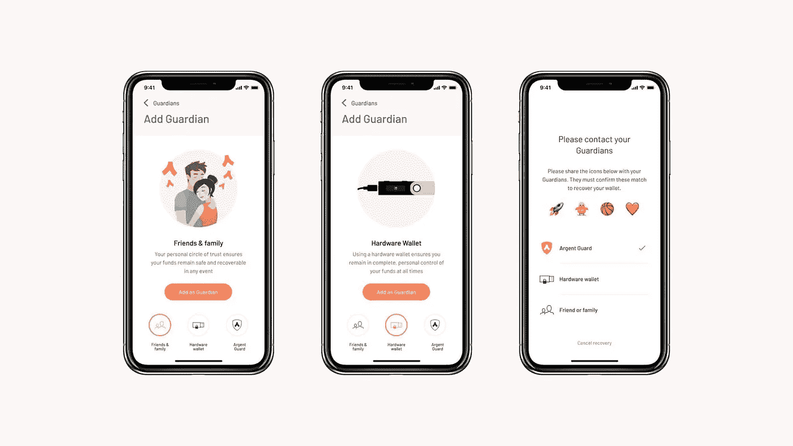
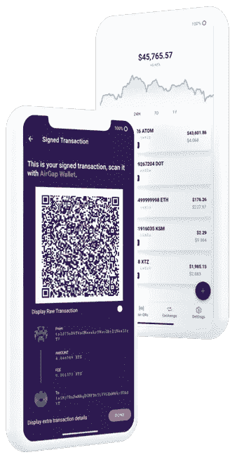

# 非保管加密钱包:探索六种类型

> 原文：<https://medium.com/coinmonks/non-custodial-crypto-wallets-six-types-explored-a8bc1187cf4a?source=collection_archive---------0----------------------->


Image from [edge.app](https://edge.app/why-non-custodial-wallets-matter/)

随着比特币吸引了前所未有的兴趣，去中心化金融席卷了加密世界，现在是扩展加密货币运动中一个基本概念的好时机:自我保管。

当你把钱存入银行时，你相信银行会保护你的资产。如果银行破产或“丢失”内部账本，你的资金显然会面临风险。随着 2009 年比特币的到来，人类找到了将钱藏在床垫下的数字等价物——也就是说，一种在通常被称为自托管或非托管钱包的钱包中直接持有数字价值单位的方式。

自我监护是否是一个好主意是另一个问题。有[“不是你的钥匙，不是你的硬币”](https://www.ledger.com/academy/not-your-keys-not-your-coins-why-it-matters)的原则，也有人们丢失这些钥匙的历史。持有你的资金的加密货币交易所可能会被黑客攻击，但你也一样。一位观察家最近对成为你自己的银行的想法有了一个[的有趣观点](https://www.bloomberg.com/opinion/articles/2021-01-12/don-t-forget-your-bitcoins):

```
*Let me put it this way, do you make your own shoes? The reason we have banks is that we don’t want to deal with all those things that banks do*.
```

然而，如果你能够自信地管理自我保管的风险，非保管钱包不仅能让你完全控制自己的资产，还能让你在蓬勃发展的去中心化金融生态系统中互动。

在这篇文章中，我想介绍六种不同类型的非保管钱包，并提供一个介绍性的指南。

```
Hold on, what exactly is a wallet?In the cryptoverse, a wallet is an application holding pairs of public and private cryptographic keys, each corresponding to an account*.*The public key is used to track ownership or balances, as well as to receive payments. The private key is used to create signatures for transactions — for instance, one that transfers your funds.With the mathematical primitives of [public key cryptography](https://en.wikipedia.org/wiki/Public-key_cryptography), one can establish whether a signature is valid by verifying it against the corresponding transaction and its sender’s public key. However, it is impossible to reverse engineer the private key from this information. In other words, you can prove that you possess a private key without ever revealing it.A key factor in classifying wallets is their approach to securing private keys.
```

# 浏览器钱包


The Metamask Fox

Metamask 是迄今为止使用最广泛的浏览器钱包。使用 Metamask，您可以持有基于以太坊的令牌，并直接从浏览器与以太坊 dapps(如 Compound 或 Uniswap)进行交互。除了其直观的界面，这也带来了令人难以置信的用户体验。

另一方面，Metamask 在浏览器上存储私钥。尽管私钥有密码保护，但任何存储在连接到互联网的设备上的数据——顾名思义——都更容易被黑客攻击。然而，通过将元掩码[与硬件钱包](https://metamask.zendesk.com/hc/en-us/articles/360020394612-How-to-connect-a-Trezor-or-Ledger-Hardware-Wallet)结合使用，您可以在对便利性影响最小的情况下解决该漏洞。阅读下面关于硬件钱包的更多信息。

*你是 Tezos 的粉丝吗？签出* [*灭霸*](https://thanoswallet.com/) *作为对等物。*

# 手机钱包



Sylo Smart Wallet

这里真的有很多人。[比特币基地](https://wallet.coinbase.com/)和[币安](https://trustwallet.com/)有他们官方的非保管式移动钱包。[状态](https://status.im/)将以太坊钱包与消息应用相结合。Sylo 扩大了身份的范围，包括比特币和 Tezos。[银色](https://www.argent.xyz/)原生集成以太坊 DeFi。这样的例子不胜枚举。



Ethereum DeFi on Argent

越来越多的情况下，你可以通过一个叫做 [WalletConnect](https://walletconnect.org/) 的开放协议将手机钱包与以太坊 dapps 结合使用。如果 given dapp 还集成了 WalletConnect，则可以通过扫描二维码来签署交易。

与 Metamask 一样，虽然移动钱包往往受到密码保护，但在联网设备上存储私钥是一个固有的漏洞。

*Argent 也是一款智能合约钱包。下面了解更多。*

# **硬件钱包**



Ledger Nano X

硬件钱包是一种加密的离线设备，用于存储您的私钥。它可以签署交易，但是它*从不*以纯文本形式发布任何私有密钥。该设备的功能很少，减少了它的攻击面。只要任何恢复代码也离线存储，这意味着硬件钱包明显不容易被黑客攻击。

[Ledger](https://www.ledger.com/) 是加密领域的旗舰硬件钱包。它可以通过 LedgerLive 与多个区块链互动，并通过 Metamask 等一系列生态系统钱包签署交易。简而言之，顶级安全性带来的便利。

话虽如此，总账*公司*最近遭遇[客户信息](https://www.forbes.com/sites/kenrapoza/2021/12/28/after-ledger-hack-who-can-you-trust-for-bitcoin-storage/?sh=7caa593a3840)大规模泄露。由于钱包是非托管的，这不会直接危及任何资金——但它导致了一系列网络钓鱼攻击。

# 智能合约钱包

智能合约钱包是一种构造，通过这种构造，令牌保存在由私钥-公钥对控制的智能合约上。使用该模型，您可以拥有恢复、每日交易限额、锁定等逻辑，同时保持非托管。例如，使用 Argent，您可以定义一个或多个“[监护人](https://support.argent.xyz/hc/en-us/articles/360022631992-About-guardians)”，他们可以锁定您的钱包，批准钱包恢复或批准超过您每日限额的转账。



Selecting a Guardian on Argent

智能合约钱包可以很容易地被硬件钱包保护。例如，如果您在 Argent 上添加一个总帐帐户作为监护人，您可以要求您的总帐批准任何超出您定义的限额的转帐。

更广泛地说，选择可信的人或设备作为钱包守护者的概念通常被称为“社会恢复”。随着生态系统的不断发展，智能合约钱包和社会恢复将在让自我保管更加方便用户方面发挥关键作用。

# 空隙

[AirGap](https://airgap.it/) 以“[air gap](https://en.wikipedia.org/wiki/Air_gap_(networking))的理念创新安全性，将私钥*与互联网或任何其他设备完全*隔离。



The air-gapped vault application holding your private key (left) and the wallet application (right)

硬件钱包需要通过 USB 连接到您的计算机，以便签署交易。理论上，这使得它容易受到[旁道攻击](https://en.wikipedia.org/wiki/Side-channel_attack)。通过读取 USB 端口的功耗，老练的攻击者可以导出私钥，或者至少限制搜索范围，以便通过暴力找到它。

莱杰用一个专门的安全芯片解决了侧信道攻击，但是我们不会在这篇文章中解决这个问题。

AirGap 的想法是将 AirGap 钱包放在您的日常设备上，并将私钥保存在离线设备上的 AirGap 保管库中。通过这种设置，您可以按以下步骤执行交易:

1.  在 AirGap Wallet 上创建交易，为未签名的*交易生成二维码。*
2.  用 AirGap Vault 扫描第一个二维码，为*签名的*交易生成第二个二维码。
3.  用 AirGap 钱包扫描第二个二维码，广播已签名的交易。

你可以在这里看到流程[。重要的一点是，私钥在整个过程中保持完全隔离。](https://www.youtube.com/watch?v=qbfFp2gw3MU)

作为一个附加功能，AirGap 通过[沙米尔的秘密共享](https://en.wikipedia.org/wiki/Shamir%27s_Secret_Sharing#High-level_explanation)概念支持社会恢复。你的私钥被分成几部分，称为*份、*，每份都交给一个信任的联系人。要重建私钥，需要预先定义的最小份额数。

AirGap 钱包目前支持包括比特币、以太坊、Tezos 和 Polkadot 在内的多种区块链。尽管还处于采用曲线的早期，但 AirGap 提供了独特的、引人注目的角度，我很高兴看到它的发展。

# 花托


Animation from the Torus website.

[Torus](https://tor.us/) 协议允许你通过 Google、Twitter 和其他基于 [OAuth 标准](https://en.wikipedia.org/wiki/OAuth)的登录来生成和访问非保管钱包。它甚至允许你向一个*电子邮件地址*或*社交账号*发送资金。如果接收者还没有钱包，一旦他们设置了钱包，他们就可以访问任何资金。

没有更多的助记短语要保护，登录流程感觉像正常的互联网，Torus 用户体验是大规模采用的一个突破。

你可以在这里了解更多关于 Torus 的机制。它还利用了沙米尔的秘密共享。当您登录时，浏览器会根据多个 Torus 节点收到的信息“重建”私钥。私钥不存储在任何其他地方，只为会话保留。

查看以太坊的 [Torus 钱包](https://app.tor.us/)和 Tezos 的 [Kukai 钱包](https://wallet.kukai.app/)。

__ __

总体而言，钱包生态系统不缺乏质量或创新。我希望这个指南对你有用。

```
Disclaimer. None of the above is intended as advice on self-custody or endorsement of a particular wallet. Do your own research before holding funds on a non-custodial wallet.HODL to the 🌒 safely 🔐 
🚀 🚀 🚀
```

> 加入 coin monks[Telegram group](https://t.me/joinchat/EPmjKpNYwRMsBI4p)学习加密交易和投资

## 另外，阅读

*   [学习以太坊和 Web3 开发](http://blog.coincodecap.com/go/learn)
*   最好的[密码交易机器人](/coinmonks/crypto-trading-bot-c2ffce8acb2a)
*   [3 商业评论](/coinmonks/3commas-review-an-excellent-crypto-trading-bot-2020-1313a58bec92) | [Pionex 评论](/coinmonks/pionex-review-exchange-with-crypto-trading-bot-1e459d0191ea) | [Coinrule 评论](https://blog.coincodecap.com/coinrule-review-a-perfect-trading-bot)
*   [AAX 交易所评论](/coinmonks/aax-exchange-review-2021-67c5ea09330c) | [德里比特评论](/coinmonks/deribit-review-options-fees-apis-and-testnet-2ca16c4bbdb2) | [FTX 密码交易所评论](/coinmonks/ftx-crypto-exchange-review-53664ac1198f)
*   [n 零审核](/coinmonks/ngrave-zero-review-c465cf8307fc)
*   [Bybit 交换审查](/coinmonks/bybit-exchange-review-dbd570019b71)
*   [3Commas vs Cryptohopper](/coinmonks/3commas-vs-pionex-vs-cryptohopper-best-crypto-bot-6a98d2baa203)
*   最好的比特币[硬件钱包](/coinmonks/the-best-cryptocurrency-hardware-wallets-of-2020-e28b1c124069?source=friends_link&sk=324dd9ff8556ab578d71e7ad7658ad7c)
*   [密码本交易平台](/coinmonks/top-10-crypto-copy-trading-platforms-for-beginners-d0c37c7d698c)
*   [莱杰纳米 s vs x](https://blog.coincodecap.com/ledger-nano-s-vs-x)
*   [Vauld Review](https://blog.coincodecap.com/vauld-review)|[you hodler Review](/coinmonks/youhodler-4-easy-ways-to-make-money-98969b9689f2)
*   最好的[加密税务软件](/coinmonks/best-crypto-tax-tool-for-my-money-72d4b430816b)
*   最佳[加密贷款平台](/coinmonks/top-5-crypto-lending-platforms-in-2020-that-you-need-to-know-a1b675cec3fa)
*   [莱杰纳米 S vs 特雷佐 one vs 特雷佐 T vs 莱杰纳米 X](https://blog.coincodecap.com/ledger-nano-s-vs-trezor-one-ledger-nano-x-trezor-t)
*   [block fi vs Celsius](/coinmonks/blockfi-vs-celsius-vs-hodlnaut-8a1cc8c26630)vs Hodlnaut
*   [Bitsgap 审查](/coinmonks/bitsgap-review-a-crypto-trading-bot-that-makes-easy-money-a5d88a336df2) | [Quadency 审查](/coinmonks/quadency-review-a-crypto-trading-automation-platform-3068eaa374e1)
*   [硬币追踪审查](/coinmonks/cointracking-review-a-reliable-cryptocurrency-tax-software-5114e3eb5737)
*   [埃利帕尔泰坦评论](/coinmonks/ellipal-titan-review-85e9071dd029) | [赛克斯斯通评论](https://blog.coincodecap.com/secux-stone-hardware-wallet-review)
*   [区块链评论](/coinmonks/blockfi-review-53096053c097) |在你的密码中赚取高达 8.6%的利息
*   [DEX Explorer](https://explorer.bitquery.io/ethereum/dex) 和[区块链 API](https://explorer.bitquery.io/graphql)
*   [加密套利](/coinmonks/crypto-arbitrage-guide-how-to-make-money-as-a-beginner-62bfe5c868f6)指南:新手如何赚钱
*   最佳[加密制图工具](/coinmonks/what-are-the-best-charting-platforms-for-cryptocurrency-trading-85aade584d80)
*   了解比特币最好的[书籍有哪些？](/coinmonks/what-are-the-best-books-to-learn-bitcoin-409aeb9aff4b)

> [直接在您的收件箱中获得最佳软件交易](/coinmonks/newsletters/coinmonks)

[](https://medium.com/coinmonks/newsletters/coinmonks)