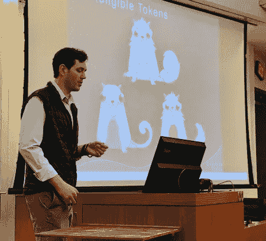

# 为什么不可替换令牌很有价值？

> 原文：<https://medium.com/coinmonks/non-fungible-tokens-ac1c1a7aebed?source=collection_archive---------0----------------------->

区块链技术是罕见的进步之一，可以根除各种不同的行业，并从根本上改变许多流程。然而，在目前的状态下，许多潜在的应用仅仅是潜在的。区块链技术中最早产生吸引力的一个领域是不可替代代币(NFTs——本质上是数字收藏品)。虽然肯定有项目尚未启动或完全开发，但市场上当前的项目(CryptoKitties、KittyHats、Crypto Punks 等)已经帮助证明了该空间的价值。通过这样做，我相信 NFT 市场已经成为比一般加密货币更好的渠道，有助于将区块链技术的应用纳入主流。在下面的段落中，我将简要讨论什么是非功能性技术，当前市场在哪里，以及为什么它有助于增加区块链技术的采用。

“可替换的”这个词描述的是一个可以被另一个相同的项目替换的项目。因此，不可替代性意味着一个特定的事物是独一无二的，具有数量有限的区别特征。

> 非功能性令牌是独一无二的、可区分的令牌，在以太坊区块链上大多被实现为 ERC-721 令牌，它们具有各自的特征和身份

把这些代币想象成数字收藏品或财产，比如棒球卡、艺术品甚至法律文件。

自早期人类以来，独特和罕见的收藏品(如珠子、贝壳和元素)一直很受欢迎，并经常引发强烈的情感。通过在区块链 NFTs 上创造数字稀缺性，创造出无需去银行或律师等第三方就能被验证为真实的数字物品。目前虚拟商品和可下载内容(DLC)的例子有配件、装备、“皮肤”、额外的游戏关卡/地图等等。所有的虚拟物品和 DLC 都是人们在网上购买的，并在游戏中使用，以使他们的角色更加独特或为玩家增加新的体验。

在虚拟物品和 DLC 空间中有各种各样的类别。在一个这样的类别中，EA 在 2016 年制作了超过 [$1B 的(“附加组件”，即额外的地图、关卡等)。如果你把人们在稀有“皮肤”(本质上是汽车、枪支等的油漆工作)、他们角色的装备和一些“秘密收藏品”上的花费组合在一起，这个数字会跃入](https://consumerist.com/2017/04/19/how-much-do-video-game-companies-make-off-dlc-and-add-ons-around-5b-a-year/)[两位数十亿大关](https://www.tonysheng.com/crypto-collectibles-trillion)。关于目前的密码收藏品市场，有一些[的密码猫](https://www.cryptokitties.co/)售价超过 6 万美元，甚至有一只[卖到了 11.3 万美元](https://www.cnbc.com/2017/12/06/meet-cryptokitties-the-new-digital-beanie-babies-selling-for-100k.html)。

## **为什么 NFT 有价值？**

非金融资产的不可信赖性和稀缺性创造了拥有它们的诱人理由。NFT 是灵活的，因为它们位于区块链上，因此是不可信的(不需要第三方进行存储、验证等)。如果一个游戏关闭了，在那个游戏中使用的 NFTs 仍然可以被他们的购买者所拥有，因为它们是在购买者的唯一保管下，而不是在游戏开发者拥有的数据库中。因此，与当前的虚拟物品和 DLC 相比，NFTs 的不可信任性质创造了数字收藏品的保管优势。此外，区块链上用来创造 NFT 的合同将确切地显示该收藏品有多稀有。由于没有第三方监督，除了合同中的内容之外，不存在稀释的威胁。NFT 的明显稀缺性和保管优势使其相对于目前可用的虚拟物品和 DLC 具有竞争优势。随着 NFT 空间的增长，人们将开始欣赏区块链技术相对于传统信任系统的优势，并更有可能在生活的其他方面采用它。

**我期待看到 NFT 的领域:**

*   法律文件
*   游戏(“皮肤”、地图等)
*   传统收藏品(卡片、饰品等)

上述应用也将是有趣的(例如，KittyRace 使用 CryptoKitties 相互竞争)。

**几个 NFT 项目:**

*   [加密小猫](https://www.cryptokitties.co/)
*   [KittyRace](https://kittyrace.com/)
*   [小猫咪](https://www.kittyhats.co/)
*   [隐朋克](https://www.larvalabs.com/cryptopunks)
*   [分权](https://decentraland.org/)
*   [以太飞船](https://ethercraft.io/)
*   [以太门](http://ethermon.net/)
*   [总账图例](https://ledgerlegends.com/)
*   [达摩](https://dharma.io/)
*   [隐宠物](https://www.cryptopets.co/)
*   [加密机器人](https://cryptobots.me/)

**其他资源:**

*   [数字收藏品和数字的怪异未来](https://hackernoon.com/digital-collectibles-and-the-weird-future-of-digibles-f75f4bf0f9aa)
*   [解剖 ERC 721](/blockchannel/the-anatomy-of-erc721-2576e40bfc5b)
*   密码收藏品可能价值数万亿吗？
*   [不可信数字资产(NFTs)](https://www.tonysheng.com/nfts-and-games)
*   [僵尸吃小猫](https://www.nickgrossman.is/2018/zombies-eating-kitties/)
*   [数字收藏品:一种新兴的代币类别](https://thecontrol.co/digital-collectibles-a-new-category-of-tokens-emerging-fb991c1dff6a)
*   [不可替换令牌概述](https://hackernoon.com/an-overview-of-non-fungible-tokens-5f140c32a70a)

> [直接在您的收件箱中获得最佳软件交易](https://coincodecap.com/?utm_source=coinmonks)

