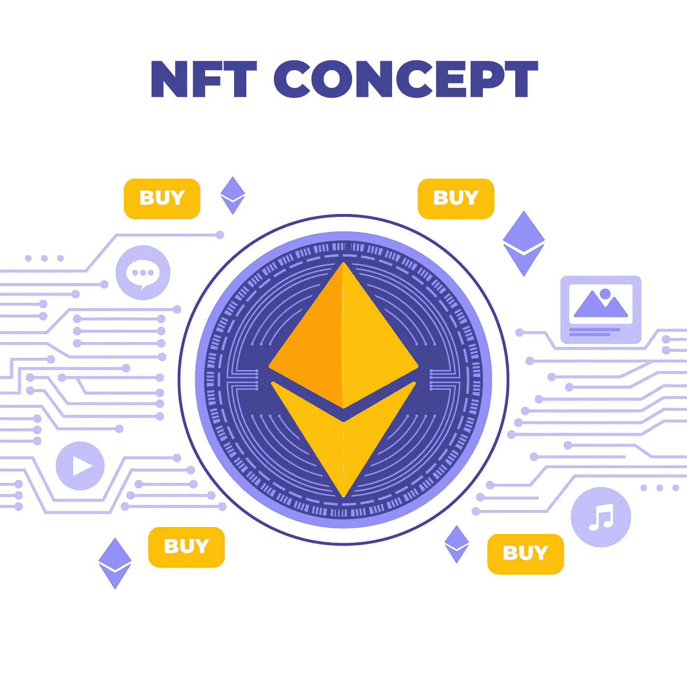

# 不可替换令牌(NFTs)概念

> 原文：<https://medium.com/coinmonks/non-fungible-tokens-nfts-concept-343571189bf4?source=collection_archive---------3----------------------->

Non-fungible tokens (NFTs) Concept

不可替代令牌(NFT)是区块链上的加密所有物，具有特殊的唯一识别码和元数据，可将其与其他所有物区分开来。与加密货币不同，它们不能等价交易或交换。这与加密货币等可替代代币不同，加密货币与可替代代币完全相同，因此可以用作工业交易的媒介。

每个 NFT 的精彩建筑都有相当多的使用案例。例如，这是对实物财产(如真实的房地产和艺术品)进行数字化表征的最佳方式。因为他们完全基于区块链，NFTs 可以额外用于摆脱中介，将艺术家与观众联系起来，或者用于身份管理。非正规金融交易可以摆脱中介机构，简化交易，并创造新的市场。

*   NFT 是存在于区块链上的特殊加密令牌，不能被复制。
*   NFT 可以用来表示真实世界的小工具，如艺术品和房地产。
*   “令牌化”这些真实世界的有形财产允许它们被更正确地买卖和交易，同时降低欺诈的可能性。
*   NFTs 还可以用来表示个人的身份、财产权等等。

# 了解 NFTs

像实物货币一样，加密货币是可替代的，它们可以相互交易或交换。例如，一个比特币与任何其他比特币的价格都是恒定的。同样，一个单位的乙醚总是等于其他单位的乙醚。这种可替代性属性使得加密货币适合用作数字经济中不可渗透的交易媒介。

NFT 通过使每个令牌都是特殊的和不可替代的来改变加密范式，从而使一个不可替代的令牌不可能等同于另一个令牌。它是不动产的数字表示，并且由于每个令牌都包括唯一的、不可转移的标识以将其与不同的令牌区分开，因此被等同于数字护照。它们还可以扩展，这意味着你可以将一种 NFT 与其他任何一种混合起来，产生第三种特殊的 NFT。

就像比特币一样，NFT 还额外加入了持有要点，以便于令牌持有者进行识别和切换。所有者还可以在 NFTs 中添加与资产相关的元数据或属性。例如，代表浓缩咖啡豆的代币可以被标记为真实交易。或者，艺术家可以在元数据中用他们自己的签名来表示他们的数字作品。

NFTs 是从 ERC-721 标准发展而来的。ERC-721 由负责 ERC-20[智能合约](https://cryptoworldfinace.blogspot.com/2021/12/understanding-smart-contract-and-use.html)的一些相同人员开发，定义了最小化的接口——交易和分配游戏代币所需的所有权细节、安全性和元数据。ERC-1155 将军采取了类似的思路，通过减少 NFTs 所需的交易和存储费用，并将多种不可替代的令牌分批加入智能合约。

也许 NFTs 最广为人知的用例是[的 cryptokitties](https://www.cryptokitties.co/) 。cryptokitties 于 2017 年 11 月推出，是以太坊区块链上带有特殊身份的猫的数字表示。每只小猫都是特别的，并且有一个以太电荷。它们相互繁殖，产生新的后代，与它们的父母相比，新的后代具有特定的属性和价值。在推出后的几周内，cryptokitties 积累了一个粉丝群，他们花了价值 2000 万美元购买、喂养和培育它们。一些狂热分子甚至为此花费了超过 10 万美元。

*阅读:* [*分形 NFT 电玩城*](https://cryptoworldfinace.blogspot.com/2021/12/fractal-nft-gaming-marketplace.html)

[*2022 年区块链技术趋势*](https://cryptoworldfinace.blogspot.com/2021/12/blockchain-technology-trends-for-2022.html)

# NFTs 是如何工作的？

NFT 由在线市场提供，包括 [OpenSea](https://opensea.io/) 、[rarable](https://rarible.com/)和 [Nifty Gateway](https://niftygateway.com/) 。他们使用多种加密货币进行交易。然而，大多数 NFT 是以太坊区块链的阶段。当然，数字快照和不同的财产可以毫无困难地复制——这就是为什么每一笔 NFT 交易都被记录在区块链上，所以谁拥有哪项资产是显而易见的。区块链是一个共享的数字账本，由世界各地的计算机系统维护，因此是无法伪造的。

# 为什么不可替换的令牌很重要？

不可替代的代币是在相当简单的加密货币理念基础上发展而来的。现代金融结构包括针对独特资产类型的最先进的买卖和抵押结构，从实际的房地产到借贷合同再到艺术品。通过支持物理资产的数字表示，NFTs 在改造这种基础设施方面领先了一步。

可以肯定的是，用数字来表示物理物品的想法已经不再新奇，使用特殊的标识也不再新奇。然而，当这些标准与智能合约的防篡改区块链的优势相结合时，它们将成为变革的强大压力。

或许，NFTs 最明显的优势是市场效率。将实物资产转换为数字资产简化了方法并消除了中介。在区块链上表现数字或实物艺术品的 NFTs 消除了对零售商的需求，并让艺术家立即与他们的观众联系起来。它们还可以增强企业流程。例如，酒瓶的 NFT 将使家具链中的特殊演员更容易参与其中，并通过完整的流程帮助音乐的起源、生产和销售。咨询公司安永(Ernst & Young)已经为它的一个客户找到了这样的答案。

不可替换的令牌对于标识管理来说是额外的优势。考虑希望在每个出入境点出示物理护照的情况。通过将男性或女性护照转换为具有个人特殊特征的非随身携带护照，简化各管辖区的出入境方式是可行的。扩展这个用例，NFTs 也可以用于数字领域内的身份管理。

NFTs 还可以通过使用细分的实物财产(如实际的房地产)来使投资民主化。在几个所有者之间分割数字实际财产比分割物理财产要简单得多。那种象征化的伦理希望不再局限于实际的财产；它可以扩展到不同的资产，如艺术品。因此，一个被描绘的需求通常不再只有一个主人。它的数字等价物可以有几个所有者，每个所有者负责这幅画的一小部分。这种准备工作应该会扩大其真正的价值和收入。

对非技术产业来说，最激动人心的机会在于引进新的市场和投资类型。考虑一个被分成几个部分的实际财产，每个部分都包含独一无二的特征和财产类型。其中一个分区可能是海边，而另一个是复杂的娱乐区，但另一个是住宅区。根据其特点，每块土地都是独一无二的，定价不同，并用 NFT 来表示。通过将适用的元数据整合到每个特殊的 NFT 中，房地产交易这一复杂而繁琐的事务可以得到简化。

区块链以太坊上的一个数字现实平台，已经实现了这样一个概念。随着非功能性金融工具越来越先进，并内置于货币基础设施中，在现实世界中，将成本和位置不同的土地部分符号化的平等理念付诸实施也可能变得可行。[阅读更多](https://cryptoworldfinace.blogspot.com/2021/12/non-fungible-tokens-nfts-concept.html)。

> 加入 Coinmonks [电报频道](https://t.me/coincodecap)和 [Youtube 频道](https://www.youtube.com/c/coinmonks/videos)了解加密交易和投资

## 另外，阅读

*   [赢取注册奖金——10 大最佳加密平台](https://blog.coincodecap.com/earn-sign-up-bonus)
*   [Exness 评测](https://blog.coincodecap.com/exness-review)|[moon xbt Vs bit get Vs Bingbon](https://blog.coincodecap.com/bingbon-vs-bitget-vs-moonxbt)
*   [如何开始通过加密贷款赚取被动收入](https://blog.coincodecap.com/passive-income-crypto-lending)
*   [Coldcard 评论](https://blog.coincodecap.com/coldcard-review) | [BOXtradEX 评论](https://blog.coincodecap.com/boxtradex-review)|[uni swap 指南](https://blog.coincodecap.com/uniswap)
*   [比特币基地 vs 瓦济克斯](https://blog.coincodecap.com/coinbase-vs-wazirx) | [比特鲁点评](https://blog.coincodecap.com/bitrue-review) | [波洛涅克斯 vs 比特鲁](https://blog.coincodecap.com/poloniex-vs-bittrex)
*   [阿联酋 5 大最佳加密交易所](https://blog.coincodecap.com/best-crypto-exchanges-in-uae) | [SimpleSwap 评论](https://blog.coincodecap.com/simpleswap-review)
*   [购买 Dogecoin 的 7 种最佳方式](https://blog.coincodecap.com/ways-to-buy-dogecoin) | [ZebPay 评论](https://blog.coincodecap.com/zebpay-review)
*   [如何在 Bitbns 上购买柴犬(SHIB)币？](https://blog.coincodecap.com/buy-shiba-bitbns)
*   [iTop VPN 审查](https://blog.coincodecap.com/itop-vpn-review) | [曼陀罗交易所审查](https://blog.coincodecap.com/mandala-exchange-review)
*   [最佳期货交易信号](https://blog.coincodecap.com/futures-trading-signals) | [流动性交易所评论](https://blog.coincodecap.com/liquid-exchange-review)
*   [最佳加密交易信号电报](/coinmonks/best-crypto-signals-telegram-5785cdbc4b2b) | [MoonXBT 评论](/coinmonks/moonxbt-review-6e4ab26d037)
*   [OKEx 评论](/coinmonks/okex-review-6b369304110f) | [Coinswitch 俱吠罗评论](/coinmonks/coinswitch-kuber-review-1a8dc5c7a739) | [比特币基地收费](/coinmonks/coinbase-fees-831e77d4f2c5)
*   [AscendEX 审查](/coinmonks/ascendex-review-53e829cf75fa) | [OKEx 交易机器人](/coinmonks/okex-trading-bots-234920f61e60) | [OKEx 交易机器人](/coinmonks/okex-trading-bots-234920f61e60)
*   [火币交易机器人](https://blog.coincodecap.com/huobi-trading-bot) | [如何购买 ADA](https://blog.coincodecap.com/buy-ada-cardano) | [Geco？一次审查](https://blog.coincodecap.com/geco-one-review)