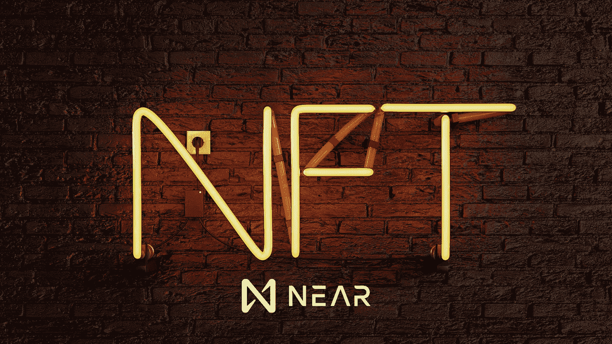

# NEAR 协议上的不可替换令牌

> 原文：<https://medium.com/coinmonks/non-fungible-tokens-on-near-protocol-3f1a5157d0eb?source=collection_archive---------1----------------------->

## NEAR 是开源的下一代区块链，本文旨在解释为什么 NEAR 是 NFTs 的最佳区块链。

[不可替代代币](https://en.wikipedia.org/wiki/Non-fungible_token) (NFTs)是代表现实世界资产的数字资产，如音乐、视频、艺术、财产、游戏等。使用 NFTs，我们可以通过智能合约、加密货币和区块链技术交易真实世界的资产。NFTs 的受欢迎程度似乎已经爆炸，因为 [NFT 市场今年到目前为止已经增长到 25 亿美元](https://www.aljazeera.com/economy/2021/7/5/off-the-chain-nft-market-surges-to-2-5b-so-far-in-2021)，越来越多的人不断通过创建他们的 NFT 资产进入 NFT，因为这有助于他们在世界范围内销售他们的艺术，不受任何边界的限制。

有许多工具和市场可以创建和销售您的 NFTs，但是在本文中，我们将只讨论 NEAR 协议，并解释为什么 NEAR 是 NFTs 的最佳选择。

# NFT 铸造工具和市场在附近

铸造或创造一个 NFT 并不复杂，但是像[以太坊](https://en.wikipedia.org/wiki/Ethereum)这样的平台铸造一个 NFT 要花费大约[60-120 美元的高额交易费，但是](https://postergrind.com/how-much-does-it-cost-to-mint-an-nft/) [NEAR protocol](https://near.org/) 有一些先进的平台，使用它们你可以毫不费力地铸造你的 NFT。

如果你想为你的艺术、 [Defi](https://en.wikipedia.org/wiki/Decentralized_finance) 、音乐、照片等创造一个 NFT。，然后你可以访问 [Mintbase](https://mintbase.io/) ，这是一个近基础平台，允许任何人以非常可靠和便宜的成本建立他们的 NFT 商店。

对于 NFT 收集卡的创造者和爱好者，NEAR protocol 推出了 [paras.id](https://paras.id/) 使用它你可以创建和列出你的 NFT 卡，任何人都可以使用 NEAR tokens 轻松购买它们。

许多艺术爱好者投入大量金钱购买艺术品，但有些人却无力购买一幅奢华的画作。不过，现在 [Snark.arts](https://snark.art/) 给了他们购买一小块奢侈艺术品的能力，这意味着现在你可以从你最喜欢的艺术家那里购买一小部分艺术品。

假设你是 NFT 领域的新手，想免费制造一些 NFT 来试验这项技术。在这种情况下，您可以查看 NEAR 协议上的 [Pluminite](https://pluminite.com) 平台，它允许每个用户免费创建他们的前三个 NFT，这意味着您甚至不需要 NEAR 令牌来铸造您的前三个 NFT。

NEAR 协议中的所有上述平台不仅有助于 NFT 的创建，也有助于 NFT 的购买/销售，因为所有平台都在区块链附近利用，所以它将天然气成本降低了 10，000-100，000 倍，并且交易速度非常快。

# 附近一些独特的 NFT 平台

NEAR 与所有嘻哈爱好者的 [Ed Young](https://www.coindesk.com/nfts-of-hip-hop-icons-hit-near-blockchain-to-mark-juneteenth) 合作，推出了一系列不可替代的[代币](https://nft.hiphop/)，上面有嘻哈音乐 47 年历史中标志性人物的肖像，你可以使用信用卡为你最喜欢的角色出价，这意味着加密新手也可以参加拍卖。

帮助粉丝参与流媒体、电子竞技团队、影响者等。NEAR 推出了 Arterra 平台，粉丝可以从他们最喜欢的创作者或电子竞技团队那里收集 NFT。

Pixelparty 是区块链附近的一个 NFT，它只包含 600 个代币，每个代币代表 Pixelparty 框架的一个子框架，你可以在这里写下你最喜欢的角色，或者用它来播放广告。

如果你喜欢区块链驱动的游戏，不要忘记检查 [Metamon](https://www.metamon.app/) 平台，在那里你可以收集独特的 NFT 为基础的怪物，你可以结合两个怪物来进化，所以当你进化时，你会变得更强大，更稀有。

如果你是一个柯基犬爱好者，你可以在区块链附近的 corgis3d 平台创建、收集、发送或交易 NFT 柯基犬。

# 为什么协议附近是 NFT 最好的地方？

NEAR 是一个区块链的开源证明，允许廉价和超快速的交易来创建人类可读的钱包地址。NEAR 使用 [Rust](https://en.wikipedia.org/wiki/Rust_(programming_language)) 或 [AssemblyScript](https://en.wikipedia.org/wiki/AssemblyScript) 来创建合同，因此大多数开发人员无需学习其他语言就可以开始工作。为了处理更多的用户，NEAR 像脸书和任何主要的高流量网站一样使用动态再分片。

NEAR 为[智能合约](https://en.wikipedia.org/wiki/Smart_contract)用户提供[协议级别的版税](https://near.org/blog/near-protocol-economics/)，这意味着通过您的智能合约进行的交易越多，您将获得部分交易费用。NEAR 比以太坊便宜 10，000-100，000 倍。

NEAR 有[彩虹桥](https://near.org/bridge/) e 和[极光 EVM](https://docs.near.org/docs/develop/eth/evm) (以太坊虚拟机)，在这里你可以使用彩虹桥将你的以太坊资产移入 NEAR 生态系统。EVM 帮助建立以太坊兼容的环境来构建以太坊兼容的应用程序。

# 结论

这一段是我对这篇文章的看法，我总是希望以便宜的交易费购买 NFT，因为有时我支付了 NFT 价格的 2 倍的汽油费，并等待了不到 15 分钟才明白我钱包里的 NFT 是不公平的。从 NFT 创造者的角度来看，我猜他们也想要一个便宜的地方来铸造他们的 NFT。通过利用区块链附近的优势，并根据不同用户的需求针对不同的用户，上述所有平台都是负担得起的、可靠的和快速的。

## 另外，阅读

 [## 使用 Rarible [2021]创建并出售您的第一个 NFT

### 在本文中，我将讨论加密硬币和代币之间的区别。然后，我将讨论可替代的和…

blog.coincodecap.com](https://blog.coincodecap.com/create-nft)