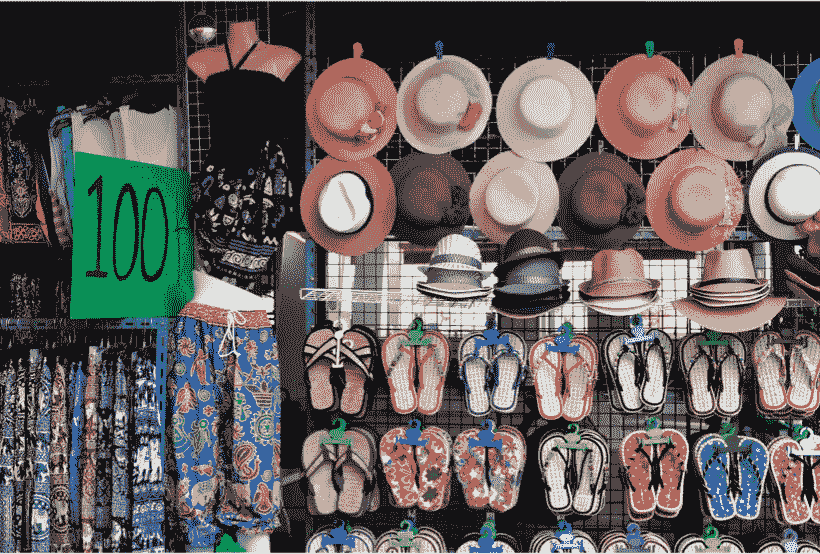

# 不可替代代币:非洲反假币战争中的代理人？

> 原文：<https://medium.com/coinmonks/non-fungible-tokens-the-agent-in-the-war-against-counterfeiting-in-africa-35f029917225?source=collection_archive---------13----------------------->

根据 [2018 全球假冒&商标侵权报告](https://allafrica.com/stories/201912120270.html)，2017 年全球假冒金额达到 1.2 万亿美元，预计到 2022 年可能达到 2.3 万亿美元。

根据具体情况，假冒自然会导致正品价格的下降或上升。然而，不管驱动这些产品价格变化的环境如何，很明显，大规模的假冒行为可能会伤害消费者，阻碍贫穷和新兴经济体的增长，特别是在非洲。

人们只能想象被假币的存在压垮的国家税收的潜在损失。更不用说对人们健康的直接影响了。根据[世界卫生组织](https://www.pharmaceutical-technology.com/features/counterfeit-drugs-africa/)，假药是世界上最有利可图的假冒商品，全球市场价值约 2000 亿美元，非洲约占全球病例的 42%。

那么，我们能做些什么来遏制这种情况呢？而且真的能遏制吗？

答案是肯定的，但有一个警告。为了能够在这场斗争中产生重大影响，必须广泛采用各种方法来实现这一目标。这就把我们带到了**不可替代令牌(NFT)**的使用上。

## **什么是不可替换令牌？**

不可替换令牌(NFT)是存储在区块链上的数据单元，用于证明数字资产是唯一的，因此不可互换或分割。它们不同于比特币或以太币，比特币或以太币是可替代的代币，因为它们可以互换，即可以与任何其他同类代币进行交换。

NFT 为创建和交易数字资产提供了无数选择，例如来自非洲各地艺术家和工匠的原创艺术品、音乐甚至真实世界的资产，允许他们保留自己的版权和知识产权。

换句话说，NFTs 将提供数字和现实世界中资产的价值和来源。原始内容和产品，例如但不限于视频、音乐作品、摄影、艺术品、文本、文学作品、服装、配件，都可以成为非专利技术并公开交易。

## **不可替换令牌如何工作？**

不可替换的令牌是通过包含不同信息的智能合约存储在区块链中的软件代码数据片段，使它们易于跟踪、验证和不可改变。每个令牌代表并链接到唯一的数字或物理对象，从而证明真实性和所有权。

NFT 通过消除对伪造和假冒的担忧，保证数字或现实世界资产的安全和合法权利。区块链技术固有的清晰透明的审核机制允许验证或证明真实性。因此，如果一个人购买了被列为 NFT 的资产，他就可以确信该资产或产品的完整性。

NFTs 提供的另一个价值是，一旦产品或资产被转售，所有权证明也随之转移。

NFT 大多使用以太坊网络，但其他区块链也开始采用 NFT，如币安智能链(BSC)。

## **结论**

随着非洲变得更加数字化，伪造仍然是非洲大陆的一个瘟疫，NFTs 可以为所有权和财产的令牌化提供一个可行的解决方案。这些令牌允许对现实世界的资产进行适当的数字化和存储，同时保持它们的安全。

随着用例扩展到数字身份记录和稀缺现实资产的表示，NFT 技术已被证明是区块链行业中的一个大增长领域。

在非洲，采用国家森林小组的条件已经成熟。要问的问题，“非洲准备好采用这项技术了吗？”

> 加入 Coinmonks [电报频道](https://t.me/coincodecap)和 [Youtube 频道](https://www.youtube.com/c/coinmonks/videos)了解加密交易和投资

## 另外，阅读

*   [网格交易机器人](https://blog.coincodecap.com/grid-trading) | [Cryptohopper 审查](/coinmonks/cryptohopper-review-a388ff5bae88) | [Bexplus 审查](https://blog.coincodecap.com/bexplus-review)
*   [7 个最佳零费用加密交易平台](https://blog.coincodecap.com/zero-fee-crypto-exchanges)
*   [分散交易所](https://blog.coincodecap.com/what-are-decentralized-exchanges) | [比特 FIP](https://blog.coincodecap.com/bitbns-fip) | [Pionex 审查](https://blog.coincodecap.com/pionex-review-exchange-with-crypto-trading-bot)
*   用信用卡购买密码的 10 个最佳地点
*   [加密复制交易平台](/coinmonks/top-10-crypto-copy-trading-platforms-for-beginners-d0c37c7d698c) | [如何在 WazirX 上购买比特币](/coinmonks/buy-bitcoin-on-wazirx-2d12b7989af1)
*   [CoinLoan 点评](https://blog.coincodecap.com/coinloan-review)|【Crypto.com】点评 | [火币保证金交易](/coinmonks/huobi-margin-trading-b3b06cdc1519)
*   [Bookmap 评论](https://blog.coincodecap.com/bookmap-review-2021-best-trading-software) | [美国 5 大最佳加密交易所](https://blog.coincodecap.com/crypto-exchange-usa)
*   最佳加密[硬件钱包](/coinmonks/hardware-wallets-dfa1211730c6) | [Bitbns 评论](/coinmonks/bitbns-review-38256a07e161)
*   [新加坡十大最佳加密交易所](https://blog.coincodecap.com/crypto-exchange-in-singapore) | [购买 AXS](https://blog.coincodecap.com/buy-axs-token)
*   [投资印度的最佳加密软件](https://blog.coincodecap.com/best-crypto-to-invest-in-india-in-2021) | [WazirX P2P](https://blog.coincodecap.com/wazirx-p2p)
*   [加拿大最佳加密交易机器人](https://blog.coincodecap.com/5-best-crypto-trading-bots-in-canada) | [库币评论](https://blog.coincodecap.com/kucoin-review)
*   [用于 Huobi 的加密交易信号](https://blog.coincodecap.com/huobi-crypto-trading-signals) | [HitBTC 审查](/coinmonks/hitbtc-review-c5143c5d53c2)