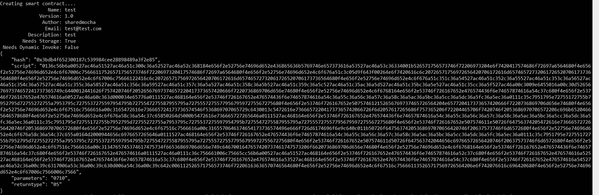

# nOS dAPP 入门指南 2

> 原文：<https://medium.com/coinmonks/nos-dapp-getting-started-guide-2-e4f7524375f?source=collection_archive---------8----------------------->


## * *这是一个由 3 部分组成的系列，介绍 nOS 以及编写和安装智能合同以及使用 React 开发 dApp 的详细步骤

欢迎使用 nOS dAPP 入门指南 2。您可以查看[指南 1](/@SharedMocha/nos-dapp-getting-started-guide-187e72ed9ace) 和[指南 3](/@SharedMocha/nos-dapp-getting-started-guide-3-435320d550eb)

在这里，我们将深入探讨如何编写和部署智能合约。

# 在这里做什么？

我们将安装所需的工具，并学习如何编写和安装智能合同。在核心部分，我们将用 python 编写一个智能契约，它被编译成。avm 文件并被部署到区块链。好消息是，我们只需要编写智能合同，并将其移动到“nOS-Local”文件夹，其余的将由“nOS-Local”处理

# 详细步骤

**第一步** :-安装 nOS-Local 并测试。[点击此处获取说明](https://github.com/nos/nos-local)

第二步 :-现在让我们写一份智能合同。

Git 克隆“https://github . com/dean press/neo sense . git”作为起点。

启动您最喜欢的 IDE，并在合同中修改或编写新代码。([合同示例](https://github.com/deanpress/neosense/blob/master/contract/neosense.py)

有用的链接-

 [## 概述-新审计委员会 0.4.4 文件

### 编译器是一个工具，用于将 Python 文件编译成在 Neo 虚拟机中使用的格式。后者是…

新宝儿. readthedocs.io](http://neo-boa.readthedocs.io/en/latest/overview.html)  [## 概述-新审计委员会 0.4.4 文件

### 编译器是一个工具，用于将 Python 文件编译成在 Neo 虚拟机中使用的格式。后者是…

新宝儿. readthedocs.io](http://neo-boa.readthedocs.io/en/latest/overview.html) 

**步骤 3** -现在让我们将智能合约部署到 nOS-Local 上。

A.)转到机器上的“nos-local”文件夹。这是你从 github 克隆的包含“nos-local”的 repo 文件夹。

B.)转到“合同”文件夹，用“contract.py”的名称粘贴您的合同。

C.)转到命令提示符(或)终端并切换到“nos-local”

```
cd ....\nos-local
```

D.)运行“MAKEwin”命令并按照说明操作。注意，您的提示应该是这样的


E.)一旦出现`neo-python`提示符(钱包密码为“**因为**”)，运行以下命令

```
open wallet ./neo-privnet.wallet
build /smart-contracts/contract.py
import contract /smart-contracts/contract.avm 0710 05 True False
```


现在，您可以看到智能合约正在创建。

运行最后一个命令后的输出如下所示



*记下* ***散列*** *随后需要。*

填写合同元数据的提示。如果你很急，就按一下`[enter]`😉。

等待几分钟，nOS 名称服务合同就展开了！

现在，让我们测试新的智能合约。

收集一些元数据如下-

*智能合约哈希*—0x 3 BD B4 f 652300187 c 539984 CEE 28898489 a3f2e 85 "

* *您在上面复制的哈希。这样每次跑步都会不一样。

*你的钱包地址*—AK 2 njjpjr 6 o 664 cwjki 1 qrxjqeic 2 zrp 8y

* *只要您从“nos-local”使用钱包，钱包地址就是相同的。如果没有，运行命令“钱包”获取您的地址


现在，运行“测试调用”命令，如下所示

示例-“test invoke 0 x3 BD B4 f 652300187 c 539984 CEE 28898489 a3 f2e 85 register product[' argument 1 '，' argument2 '，' argument3']”

*0x 3 BD B4 f 652300187 c 539984 CEE 28898489 a3 f2e 85*—您的智能合约哈希

注册产品-您在智能合约中的操作。这是[智能合约](https://github.com/deanpress/neosense/blob/master/contract/neosense.py)的一部分

*参数 1、参数 2、参数 3* —您在 smart contract 中传递给操作的数据

[点击此处查看示例](https://github.com/nos/name-service/tree/a5818e7e60282bd8c8154e1ffec4482f5cfa5ec2)

如果一切顺利，您应该会看到如下内容。*不要点击任何东西，因为进程仍在运行*


几秒钟后，你会看到如下结果


# 常见问题和有用的调试方法

没有正确发送参数—确保每个参数的开头和结尾都包含撇号

您可以在 pyton 智能契约中添加 printf()或 notify("message ")进行调试。