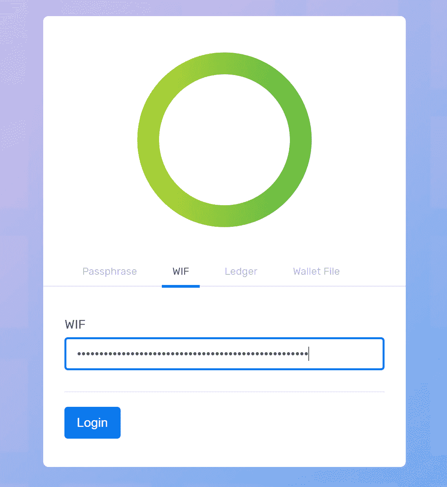
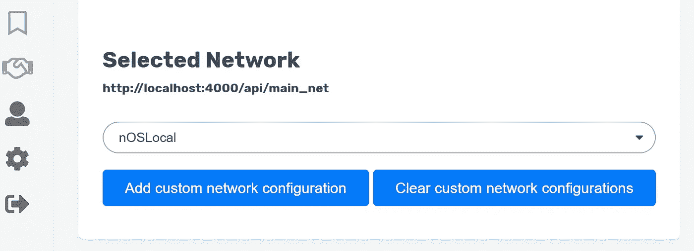
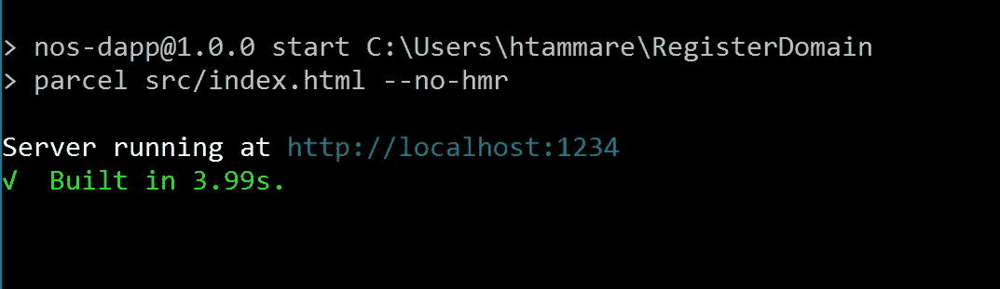
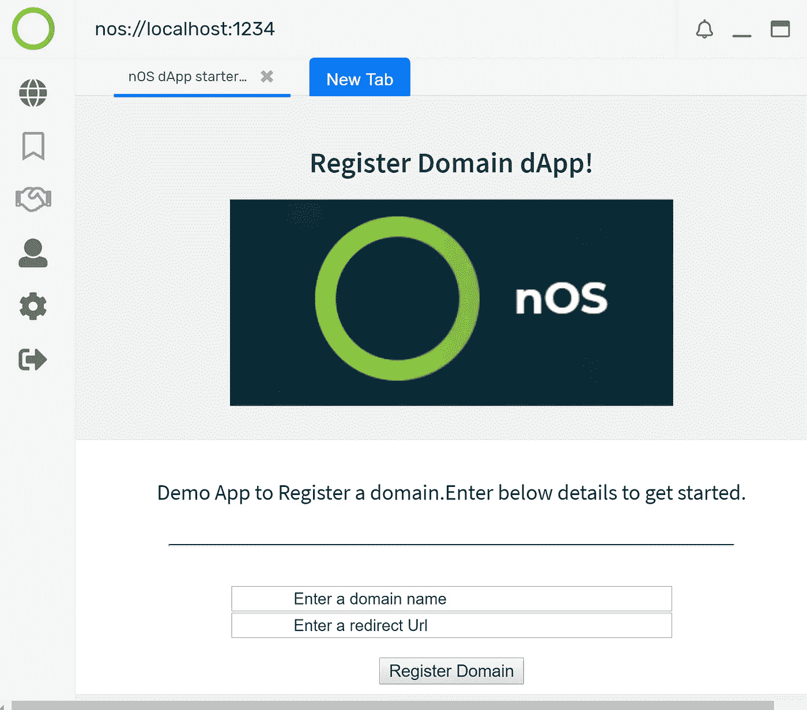

# nOS dAPP 入门指南 3

> 原文：<https://medium.com/coinmonks/nos-dapp-getting-started-guide-3-435320d550eb?source=collection_archive---------11----------------------->

## * *这是一个由 3 部分组成的系列，介绍 nOS 以及编写和安装智能合同以及使用 React 开发 dApp 的详细步骤

欢迎使用 nOS dAPP 入门指南 3。您可以查看[指南 1](/@SharedMocha/nos-dapp-getting-started-guide-187e72ed9ace) 和[指南 2](/@SharedMocha/nos-dapp-getting-started-guide-2-e4f7524375f)

在这里，我们将深入了解如何使用 React 编写(或)修改 dApp，并从 nos 客户端测试它。

# 在这里做什么？

我们将安装所需的工具，并学习如何在 React 中编写 dApp 并测试它。在核心部分，我们将使用这个[信息](/nos-io/one-click-nos-dapp-development-create-nos-dapp-e086997f0f3d)创建一个 dAPP。之后，我们修改代码，并从 nos-client 测试它。好消息是我们只需要修改很少的代码并测试它。其余全部由 [dApp builder starter kit](/nos-io/one-click-nos-dapp-development-create-nos-dapp-e086997f0f3d) 处理。

# 先决条件

**步骤 1 :-** 返回 neo-python 控制台(这是与[指南 2](/@SharedMocha/nos-dapp-getting-started-guide-2-e4f7524375f) 中相同的控制台/终端)，输入以下命令提取钱包地址

```
neo> wallet
```

**第 2 步:-** 现在保存您获得的地址。我使用的是 [nos-local](https://github.com/nos/nos-local) 中给出的默认钱包，所以我的地址是“AK 2 njjpjr 6 o 664 cwjki 1 qrxjqeic 2 zrp 8y”

**步骤 3 :-** 现在，让我们提取与我们的地址相关联的 WIF 密钥。我们这样做是为了登录到 nos-client 并调用我们的智能契约。请注意，我们在[指南 2](/@SharedMocha/nos-dapp-getting-started-guide-2-e4f7524375f) 中使用相同的钱包部署了智能合约

```
neo> export WIF AK2nJJpJr6o664CWJKi1QRXjqeic2zRp8y
```

或者，如果您使用的是 [nos-local](https://github.com/nos/nos-local) 的默认钱包，那么您的 WIF 密钥将是‘kxdgvekzgsbppfuvfw 67 opqbsjideiqthurksdl 1 r 7 ygagyaeynr’

**步骤 4 :-** 记下您从 nos-Local 部署的智能合约的散列。查看此[链接](/@SharedMocha/nos-dapp-getting-started-guide-2-e4f7524375f)了解更多信息

**步骤 5 :-** 最后，确保您的 [nos-local](https://github.com/nos/nos-local) 正在使用默认的[智能合约](https://github.com/nos/name-service/blob/a5818e7e60282bd8c8154e1ffec4482f5cfa5ec2/contract.py)运行

# 详细步骤

**第一步** :-安装 nOS-Client 并测试。[点击此处获取指示](https://github.com/nos/client)。使用获得的 WIF 密钥登录。



**第二步:-** 在 nos-client 中设置你的网络为 nOSLocal，如下图。



现在让我们开始编写或更新 dApp。

** *注意——你可以按照这个* [*链接*](/nos-io/one-click-nos-dapp-development-create-nos-dapp-e086997f0f3d) *来创建自己的 dapp。这里我们将使用现有的 dApp。*

在命令提示符或终端中运行以下命令来克隆示例报表

```
$ git clone https://github.com/SharedMocha/RegisterDomain.git
```

在命令提示符或终端中导航到“RegisterDomain”文件夹

```
$ cd C:\Users\***\RegisterDomain
```

最后，运行以下命令来启动它

```
npm start
```

请注意，您会看到类似下面的内容



**步骤 4** :-转到 nos 客户端并启动“localhost:1234”，您应该会看到以下屏幕。



输入“域名”和“重定向 Url ”,然后单击“注册域名”按钮。现在，我们将得到一个带有事务散列的弹出(或)警告框。您还可以在 nos-local 控制台(或)终端中查看更多详细信息。

**如何添加更多字段？**

要添加更多的领域，我们需要作出 2 个变化

变化 1。)更新和测试您的智能合约并进行部署。点击[链接](/@SharedMocha/nos-dapp-getting-started-guide-2-e4f7524375f)获取更多信息。

更改 2.1)转到下面的文件，并添加新的字段和按钮，以便在 dApp UI 上显示。

```
C:\Users\**\RegisterDomain\src\components\NOSActions\index.jsx
```

在文件中添加一个变量，如下所示

```
let newField
```

现在在你的构造函数中声明它

```
constructor(props) {super(props)this.state = {newField: " "}}
```

现在定义一个输入字段来接受如下值

```
<input value = {this.state.newField} 
onChange ={this.handleNewFieldChange.bind(this)}
type = "text"name = "newField" />
```

最后，定义一个变化函数

```
handleNewFieldChange(e) 
{this.setState({newField: e.target.value});}
```

现在，您可以将这个“新字段”传递到您的参数中进行调用，如下所示

```
args = [newField]
```

改 2.2。)定义一个按钮并用您的自定义“操作”调用 invoke

按钮代码

```
<button 
onClick = {() => this.handleAlert(this.props.nos.invoke(invoke).then(txid => alert(`Invoke tx id: ${txid}`)).catch(err => alert(`Error: ${err.message}`)))} >
New Button </button>
```

现在，修改 ScriptHash、操作、参数

* *脚本哈希是从 nos-Local 获取的已部署智能合约的哈希。

```
// Add your smart contract's scriptHash here
const scriptHash = "e60a3fa8149a853eb4dff4f6ed93c931646a9e22";// The operation of your smart contract you want to 
invokeconst operation = "SampleOperation";// The necessary arguments for you invoke
let args = [this.state.newField];
```

* *请注意，我在这里没有修改“调用”代码。

# 常见问题和有用的调试方法

“无法在地址*****8 处调用智能协定”-如果您遇到此错误，请通过包含警报或日志消息来检查您的参数是否被正确传递。

也可以在[不和谐](https://discordapp.com/invite/eGFAskm)里问社区。

> 请随意派生我的代码来添加新的操作和字段。截至目前，我只有'注册域'