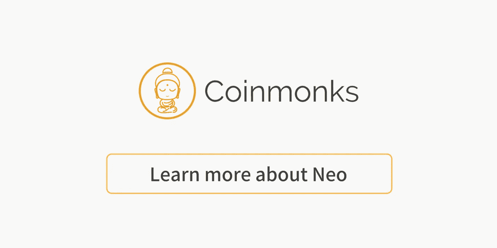

# nOS，分散式应用商店(程序员解释)

> 原文：<https://medium.com/coinmonks/nos-decentralized-app-store-programmer-explain-83898207109e?source=collection_archive---------4----------------------->

去中心化的应用商店+去中心化的 Google Play +去中心化的 Chrome 网站

nOS, Decentralized App Store

> **简单来说 nOS 是什么？**

nOS 是通向新智能经济的大门。

> **nOS 试图解决什么问题？**

**没有建立/运行 dApp 的动力**

区块链是每个人都想要的好技术，但是有`no incentive`建立一个去中心化的 App，让每个人免费使用。

**需要几个开发者**

然而，即使有了`Financial support`。对于开发者来说，在没有了解它如何工作的`knowing fundamental(it takes more than a month for a experienced full-stack developer)`的情况下，开始构建一个，然后在区块链的基础上开始构建 dApp，这仍然是`difficult`。

此外，您需要

1.  一个区块链开发者
2.  一名后端开发人员
3.  三个前端开发者(Web、IOS、Android)

构建一个完整的 MVP(最小可行产品)dApp。

> nOS 就是它的解决方案！

**没有建立/运行 dApp 的动机？**

nOS 是一个分散的应用程序商店，它会通过运行应用程序并保持高质量来支付你(作为应用程序的所有者)的费用。

**需要几个开发者？**

nOS 是一个建立在 NEO 之上的项目，这意味着前端开发者可以从 NEO 智能经济中获益。有`[Javascript-SDK](https://github.com/CityOfZion/neon-js)`(针对 javascript 开发者)`[Python-SDK](https://github.com/CityOfZion/neo-python\)`(针对 python 开发者)，还有几种流行的语言。如果你是一个想为新智能经济做贡献的开发者，请点击这里查看。

此外，如果你知道`React.js`、`Vue.js`或`vanilla javascript`，还有一个`[start-kit](https://github.com/nos/create-nos-dapp)`可以让你马上开始构建 dApp。

> **nOS 的有用链接**

Youtube 视频: [**nOS —今日新闻播客**](https://www.youtube.com/watch?v=KQTosKK9Adw)

Github: [**nOS**](https://github.com/nos)

Github: [**几个可以和尼奥区块链**](https://github.com/cityOfZion/) 交互的 SDK

不和谐 nOS: [**nOS**](https://discord.gg/63ZhTUY)

不和谐 NEO: [**NEO 智能经济**](https://discord.gg/Gfk3jsk)

**Click to read lean more about Neo**