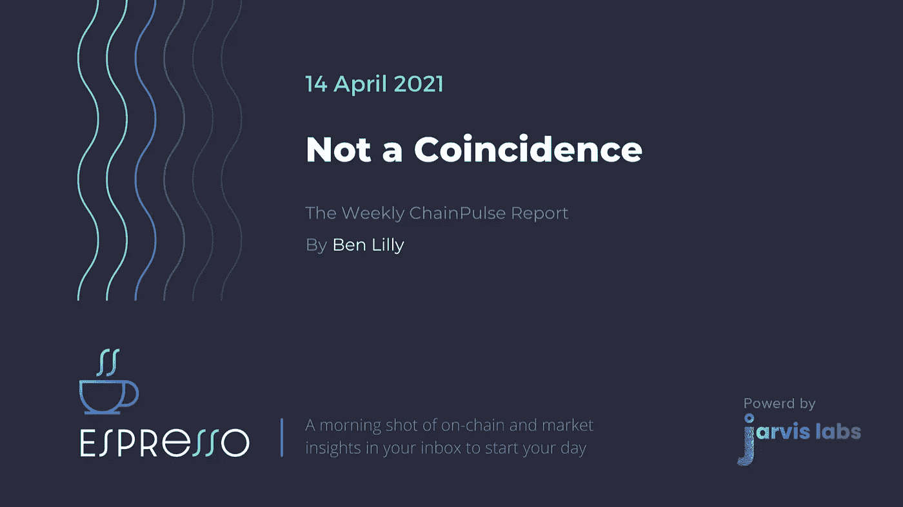
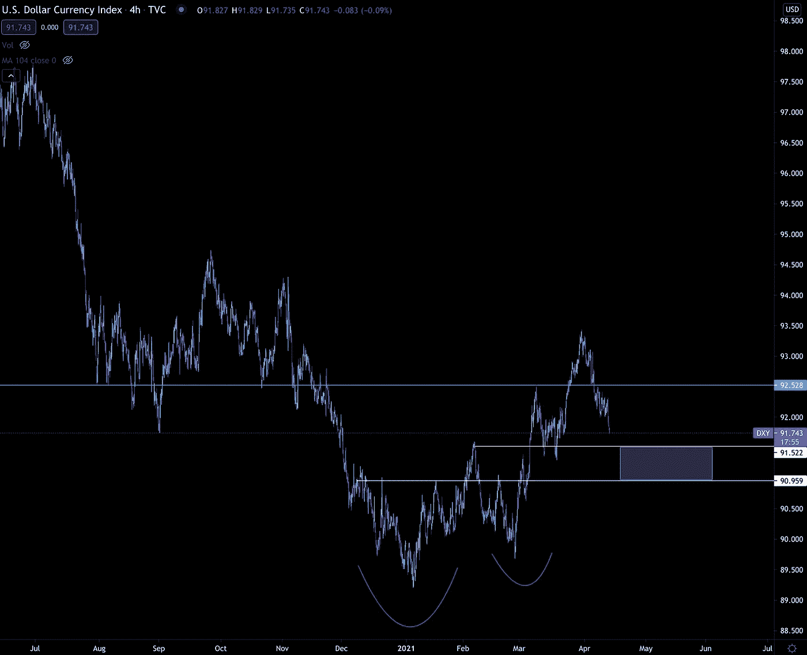
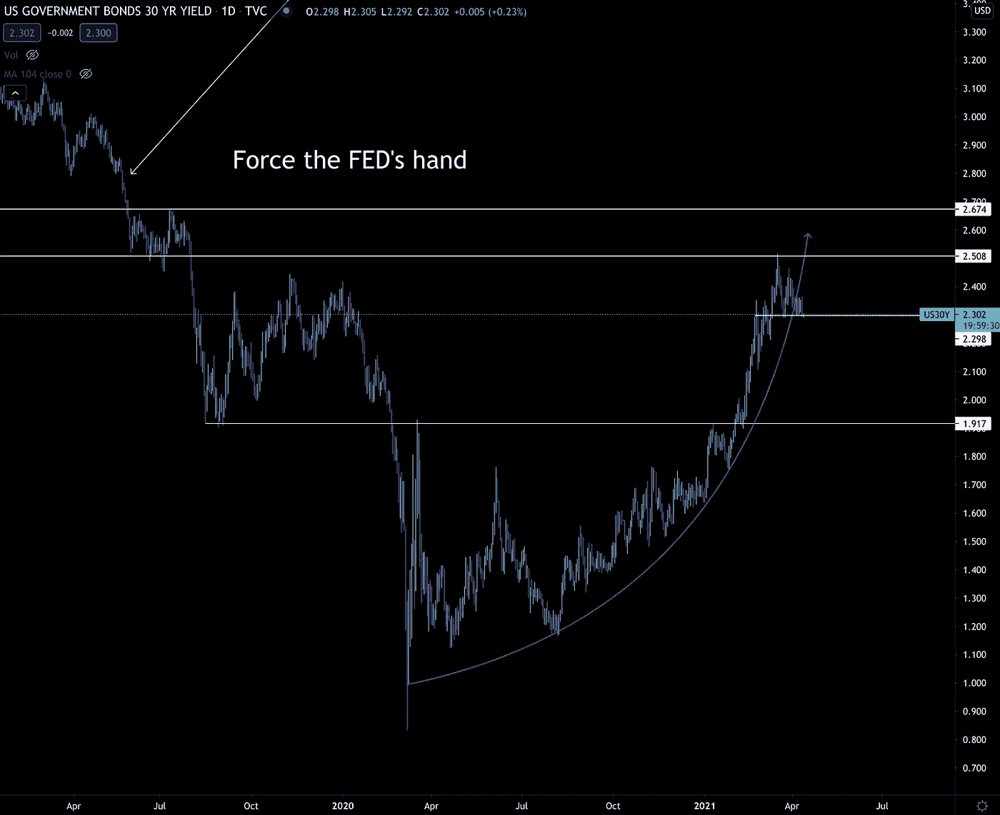
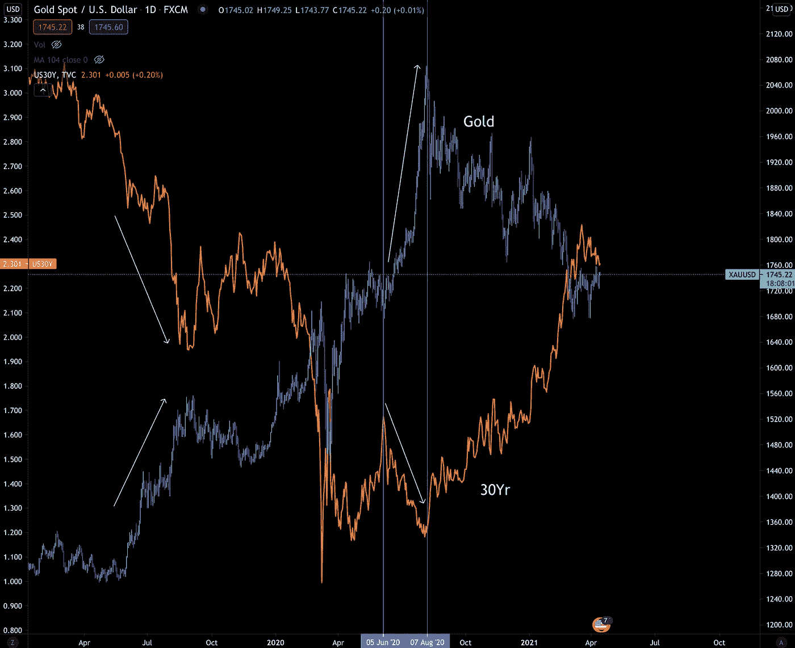
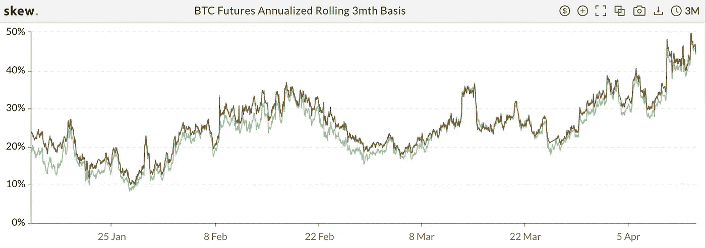
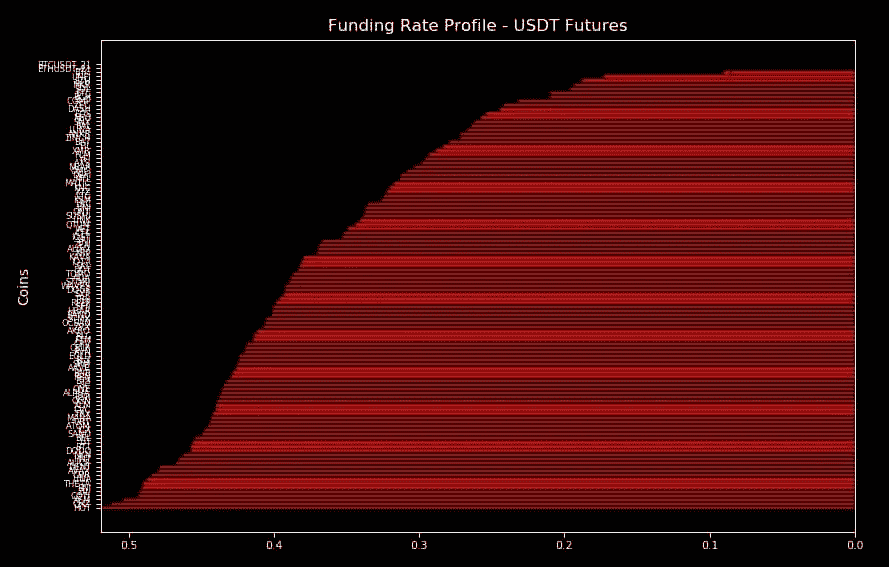
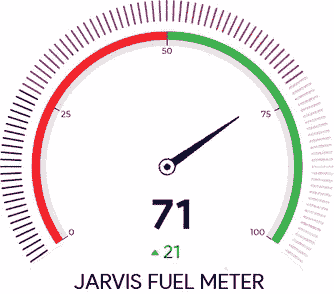
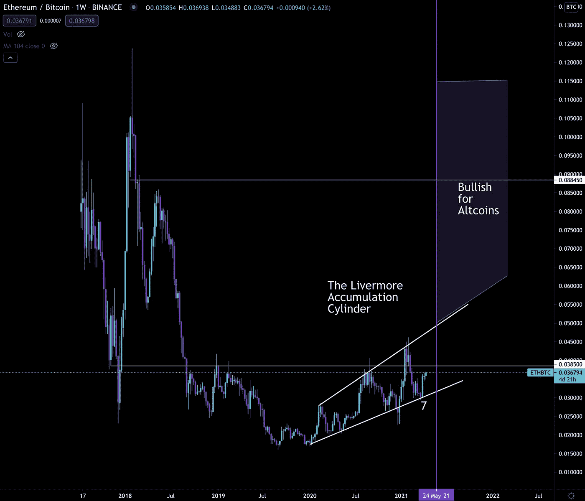

# 并非巧合——每周连锁脉搏报告

> 原文：<https://medium.com/coinmonks/not-a-coincidence-weekly-chainpulse-report-4407775d819d?source=collection_archive---------7----------------------->

关于比特币在非法金融中的使用的广泛概括被严重夸大了。

对于大多数读者来说，这并不奇怪。很像下一行…

区块链分析是一种非常有效的打击犯罪和情报收集工具。

33 岁的中情局老兵、前局长迈克尔·莫雷尔在他的公开论文中陈述了显而易见的事实，该论文是由新成立的游说团体“创新加密委员会”( CCI)委托撰写的。以上是他的话。

对秘密原生生物来说这并不是什么惊天动地的事情。但是当它来自一个在世界上最隐秘的政府机构工作的经验丰富的政府官员时，它是值得注意的。

回想一下，上周我们提到新成立的加密创新委员会(CCI)游说团体是由比特币基地、富达数字资产和 Square with Paradigm in the mix 成立的。这篇委托论文是他们第一次真正的宣传。

然后，为了给自己的立场增添趣味，他接着提到，如果美国浪费精力和资源去追逐一个幽灵，而不是利用区块链，那么它将会对中国产生严重的地缘政治影响。

他敦促美国跟上中国的步伐。他还提到，他曾经认为像耶伦部长和欧洲央行行长克里斯蒂娜·拉加德这样的人是这个星球上最见多识广的人。

开枪了。

同一天，美国国会共和党领袖凯文·麦卡锡在美国消费者新闻与商业频道接受采访，被记者问及…

(我转述)我们让比特币基地上市了……我不知道你是否看到了耶伦和美联储主席鲍威尔谈论这件事，但你觉得他们对数字货币或比特币有很好的理解吗？他们需要对比特币标准进行补救性解读吗？

众议员麦卡锡回应道(再次，我转述)…

他们试图通过忽略它来摆脱它。他们不应该忽视它。基数还会继续增长。那些监管更好的人开始理解这对未来意味着什么。其他国家也在前进，尤其是中国…

我想向前看，而不是向后看，也不想逃避现实。

又开枪了。

这里需要注意的是，这不是巧合。当华盛顿齐心协力时，你会看到语言上的相似之处。看看前中情局局长转而支持 CCI 和众议院共和党领袖的言论，竞争已经开始。

我喜欢把它看作是一种“戳到他们战斗或逃跑”的策略。

从某种意义上说，这些评论是为了产生一种反应……激怒监管者，这是边界欺凌。

这里更有趣的是中国。

请记住，这两种声音都在说，如果美国不拥抱区块链、数字资产，以及以一种奇怪的方式拥抱比特币，他们将被中国打败。

不到一周前，彼得·泰尔也说过同样的话，当时他谈到中国试图压低美元。他这样做的方式是以这样一种方式谈论比特币，即美国监管机构需要开始更认真地对待比特币。

(如果你对彼得·泰尔的故事感兴趣，可以看看纳撒尼尔·惠特莫尔的播客

这是彼得·泰尔……贝宝的联合创始人……比特币的倡导者。

这些家伙正在利用中国作为比特币利用事实获得应有关注的一种方式。

4D 国际象棋…

这些政党在比特币和加密货币中有既得利益，并准备与监管机构和央行行长平分秋色。

我想不出比这更有趣的电视真人秀了。

随着比特币基地明天冲击传统股票市场，我预计华尔街和风投会更加活跃。

正如我在昨天的[新闻报道中所说，](https://cointelegraph.com/news/analysts-say-coinbase-listing-represents-a-watershed-moment-for-crypto)

> *比特币基地是一个分水岭，它让你在加密领域看到的一些估值合法化，尤其是在 dex 周围，这些公司的员工数量和运营支出(opex)只有比特币基地或 ICE 的一小部分。*
> 
> *加密是一种具有难以置信的数量和多样性的资产，而且还将继续增长。比特币基地展示了在这个市场投资是多么有利可图。*
> 
> 我预计紧随其后的将是一波并购和风险投资活动，因为私人投资者将要求他们的基金经理涉足这一领域。

金钱将渴望获得曝光率。如果中央银行和政府限制它的流动，我们会在媒体上看到有趣的反应。

请记住，对金融任务组(FATF)有关虚拟资产和服务提供商标准的为期 12 个月的审查将于 6 月结束。今年 7 月，我们有望第一次看到美国的数字美元。这两个事件正在酝酿中，这就是为什么我们看到泰尔、CCI 和国会议员站出来说话。

游戏显然已经开始了。

> *如果这是您的第一份每周 ChainPulse 报告，我们贾维斯实验室的团队欢迎您。在这篇文章中，我们从全球宏观市场的角度，从 10，000 英尺的角度看比特币和加密市场，以及帮助你导航未来一周的粒度视图，来看市场的样子。*
> 
> *把它当成你交易比特币和密码的路线图。*
> 
> *我们每周三发布这一期，然后在周五周末之前以及交易周开始时(周一)发布这篇文章的简短更新。这样你就知道我们是否在绕路。*

好吧，我已经在影响比特币的全球问题上洒了很多墨水。所以我将再次把全局宏部分做得非常短…

# 宏指令

在这一部分中，我们倾向于触及美联储政策、全球货币政策、DXY(美元指数)、黄金和债券等主题。我们这样做是为了了解未来几周可能会影响比特币的因素。

目前，DXY 对比特币有利，因为它最近一直在下跌。指数未能守住 92.5 的阻力位。这让比特币的价格毫无阻碍地上涨。

现在，我们正在观察那个紫色的方框，寻找一个可能构成中枢或反转区域的区域。如果美元失去这个区间，比特币可能会走高。

此外，我们经常碰到政府债券收益率。这主要是由于他们在宏观市场的影响。当价格飙升或快速波动时，它可能会波及其他资产类别。

此外，由于如此依赖美联储及其在美国国债市场上的行动，有必要密切关注。

目前，收益率似乎没有显示出任何优势。实际上似乎已经失去了抛物线趋势，甚至失去了现在的区间。

在之前的问题中，我们谈到了任何高于 2.5 和/或 2.67 的波动都可能导致美联储被迫通过收益率曲线控制采取行动，也就是通过更多的国债购买来增加 QE。

你可以在图表的文字中看到。

由于这仍然成立，我将保留文本以供日后参考。但请注意，收益率不会有走高的威胁。相反，我们现在不得不质疑当它们下降时意味着什么…

收益率下降——如果稳定的话——可能会导致其他市场的趋势继续。

为了弄清楚为什么会出现这种情况，我们可以依靠黄金与 30 年期收益率图。

事实证明，这实际上是黄金上涨的催化剂。只有当金融系统处于紧急状态，每个人都想要安全和现金时，它才会与收益率同步。

(有人跟进我几周前的黄金走势图吗？现在看起来很强壮)

总之，DXY 和收益率没有给比特币带来直接的阻力。感觉我已经有六个月没有这种感觉了。

# 宏链上节拍

这是从 10000 英尺的角度看比特币和加密技术。我们关注的问题是，市场过热了吗？现在是对冲的时候了吗？与之前的周期相比，我们处于什么位置？

上周，我们动用工具箱来判断市场是否已经触顶。我们的结论是不，市场可以推高。

从那时起，几乎没有什么变化。

为了给这一部分应有的关注，我想把明天的浓缩咖啡献给它。随着我们开始考虑未来几周甚至更高的高点，预计市场将出现宏观连锁崩溃。

# 链式脉冲

这是贾维斯实验室的面包和黄油。我们的专长是日常生活。目前的结构是什么，这对价格意味着什么，什么时候是进入市场的好时机。

带着这些问题，我们开发了自己的专有交易软件 Jarvis AI。我们依靠它来找到市场的脉搏。

ETH (51k)和 LINK (544k)是我们在过去两天看到的两个主要外汇流出交易。他们都迅速做出反应，创下历史新高。我只提到这些交易，因为该团队预计在未来几周内，大额替代硬币将占主导地位。

最简单的方法就是通过 ETH/BTC 图表来展示。你可以在本周图表下面看一下。

现在，关于昨天比特币和许多其他代币的突破性上涨，唯一令人担忧的问题是融资利率。根据我们上周的问题，我们已经预料到这种情况。

我们的结论是，这可能会成为新的规范。我们需要适应它。

对于我们的客户，我们概述了这将在下一阶段如何展开的各种场景。最有可能的情况是我们所说的“情况 2”。

在场景 2 中，我们详细描述了一个秘密牛市可能是什么样子……一个价格上涨、融资利率持续飙升的全面牛市。

在这种情况下，价格将看起来像一系列的快速上涨，然后是一段时间的盘整。

如果是这样的话，活动将在期货市场。

特别是，我们预计交易者会在每次上涨时套利。他们将通过 3mo 或 6mo 期货来实现这一目标。例如，这是现货价格的 3mo 滚动溢价。

如您所见，在过去两周内，出现了几次高峰。

利用这一点的交易者是这样做的:做空合约，在现货市场买入，以保持 delta 中性或方向无偏…然后等待溢价随着价格整合而下降…平仓以捕捉溢价…然后通过现货市场回到加密。

这就是为什么我们一直告诉我们的读者这条腿是最好的经验，通过现场。期货不做多。

这些峰值将会继续。事实上，自周一以来，我们已经看到融资利率几乎翻了一番。

这是最新的资金利率曲线。

请记住，0.4 的利率相当于 438%的年化利率(每天 0.4 * 3 次* 365 天)。

我们使用未实现 PnL 结合融资利率的风险指标也出现了大幅上升。价值飙升至 75 英镑。

这种混合功能有助于警告我们潜在的级联清算事件。价格越高，发生的可能性就越大……这是因为高融资加上低利润或未实现亏损意味着许多头寸可能会很快平仓。

幸运的是，市场上的燃料仍然看涨，价格将保持 3 月份的高位。

总而言之，目前的结构看起来不错。

我们现在主要关注的是这次电流爆发的反应。它是在价格回升之前清算多头头寸，还是在价格回升之前吸收 3mo/6mo 期货合约的溢价？

我们倾向于合并，但这只是有根据的猜测。

我们会随时通知你。

# 本周图表

我们现在看到的图表是 ETH/BTC。这是一张我们一直关注的图表，因为这将决定我们是否会有未来的替代赛季。

目前来看，它似乎暗示了对大盘股替代硬币的看涨。

在接下来的几天里，我们希望看到当价格接近 0.0385 时会有什么反应。这是一个非常重要的领域。任何突破这条线将是非常乐观的大盘股替代硬币。这里的拒绝将意味着比特币是近期的最佳选择。

注意……汽缸上方的一个裂口可能会产生一个完全成熟的替代季节。把这张图表放在你的后口袋里。

你的脉搏在加密，

本·莉莉

又及——你喜欢每周的 ChainPulse 报告吗？我们每周一、三、五在 Espresso 上发布 is。[请务必点击此处](https://jarvislabs.substack.com/welcome)进行订阅，并将其免费发送到您的收件箱。

> 加入 Coinmonks [电报集团](https://t.me/joinchat/Trz8jaxd6xEsBI4p)，了解加密交易和投资

## 另外，阅读

*   最好的[加密交易机器人](/coinmonks/crypto-trading-bot-c2ffce8acb2a) | [网格交易机器人](https://blog.coincodecap.com/grid-trading)
*   [加密复制交易平台](/coinmonks/top-10-crypto-copy-trading-platforms-for-beginners-d0c37c7d698c) | [如何在 WazirX 上购买比特币](/coinmonks/buy-bitcoin-on-wazirx-2d12b7989af1)
*   [CoinLoan 审核](/coinmonks/coinloan-review-18128b9badc4)|[Crypto.com 审核](/coinmonks/crypto-com-review-f143dca1f74c) | [火币保证金交易](/coinmonks/huobi-margin-trading-b3b06cdc1519)
*   [尤霍德勒 vs 考尼洛 vs 霍德诺特](/coinmonks/youhodler-vs-coinloan-vs-hodlnaut-b1050acde55a) | [Cryptohopper vs 哈斯博特](https://blog.coincodecap.com/cryptohopper-vs-haasbot)
*   [杠杆代币](/coinmonks/leveraged-token-3f5257808b22) | [最佳密码交易所](/coinmonks/crypto-exchange-dd2f9d6f3769) | [Paxful 点评](/coinmonks/paxful-review-4daf2354ab70)
*   [加密套利](/coinmonks/crypto-arbitrage-guide-how-to-make-money-as-a-beginner-62bfe5c868f6)指南| [如何做空比特币](/coinmonks/how-to-short-bitcoin-568a2d0b4ae5)
*   [如何在印度购买比特币？](/coinmonks/buy-bitcoin-in-india-feb50ddfef94) | [WazirX 审核](/coinmonks/wazirx-review-5c811b074f5b) | [BitMEX 审核](https://blog.coincodecap.com/bitmex-review)
*   [印度比特币交易所](/coinmonks/bitcoin-exchange-in-india-7f1fe79715c9) | [比特币储蓄账户](/coinmonks/bitcoin-savings-account-e65b13f92451)
*   [币安收费](/coinmonks/binance-fees-8588ec17965) | [Botcrypto 审查](/coinmonks/botcrypto-review-2021-build-your-own-trading-bot-coincodecap-6b8332d736c7) | [Hotbit 审查](/coinmonks/hotbit-review-cd5bec41dafb) | [KuCoin 审查](https://blog.coincodecap.com/kucoin-review)
*   [我的密码交易经验](/coinmonks/my-experience-with-crypto-copy-trading-d6feb2ce3ac5) | [购买硬币评论](https://blog.coincodecap.com/buycoins-review)
*   [逐位融资融券交易](/coinmonks/bybit-margin-trading-e5071676244e) | [币安融资融券交易](/coinmonks/binance-margin-trading-c9eb5e9d2116) | [超位审核](/coinmonks/overbit-review-9446ed4f2188)
*   [加密货币储蓄账户](/coinmonks/cryptocurrency-savings-accounts-be3bc0feffbf) | [YoBit 审核](/coinmonks/yobit-review-175464162c62) | [Bitbns 审核](/coinmonks/bitbns-review-38256a07e161)
*   [Botsfolio vs nap bots vs Mudrex](/coinmonks/botsfolio-vs-napbots-vs-mudrex-c81344970c02)|[gate . io 交流回顾](/coinmonks/gate-io-exchange-review-61bf87b7078f)
*   [最佳比特币保证金交易](/coinmonks/bitcoin-margin-trading-exchange-bcbfcbf7b8e3) | [萝莉点评](/coinmonks/lolli-review-e6ddc7895ad8) | [比特币保证金交易](https://blog.coincodecap.com/bityard-margin-trading)
*   [创造并出售你的第一个 NFT](https://blog.coincodecap.com/create-nft) | [本地比特币评论](/coinmonks/localbitcoins-review-6cc001c6ed56)
*   [加密保证金交易交易所](/coinmonks/crypto-margin-trading-exchanges-428b1f7ad108) | [赚取比特币](/coinmonks/earn-bitcoin-6e8bd3c592d9) | [Mudrex 投资](https://blog.coincodecap.com/mudrex-invest-review-the-best-way-to-invest-in-crypto)
*   [如何在印度购买以太坊？](https://blog.coincodecap.com/buy-ethereum-in-india) | [如何在币安购买比特币](https://blog.coincodecap.com/buy-bitcoin-binance)
*   [顶级付费加密货币和区块链课程](https://blog.coincodecap.com/blockchain-courses) | [币安评论](/coinmonks/binance-review-ee10d3bf3b6e)
*   [MXC 交易所评论](/coinmonks/mxc-exchange-review-3af0ec1cba8c) | [Pionex vs 币安](https://blog.coincodecap.com/pionex-vs-binance) | [Pionex 套利机器人](https://blog.coincodecap.com/pionex-arbitrage-bot)
*   [在美国如何使用 BitMEX？](https://blog.coincodecap.com/use-bitmex-in-usa) | [BitMEX 评论](https://blog.coincodecap.com/bitmex-review)