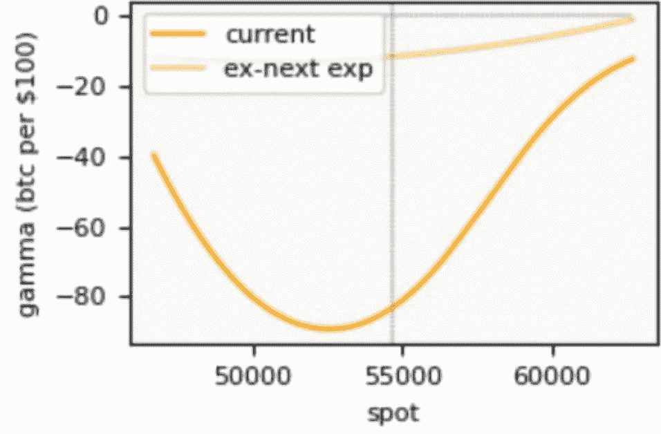
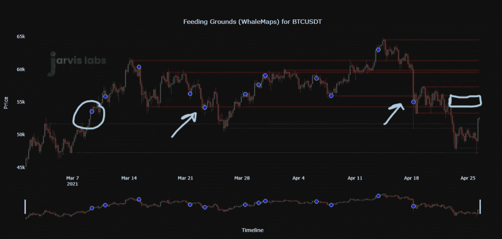
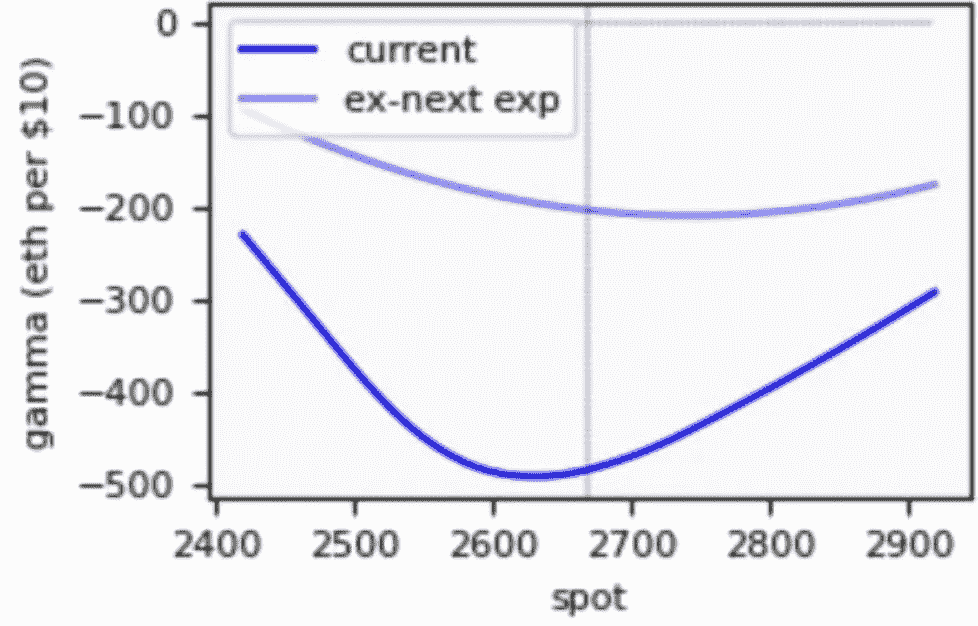
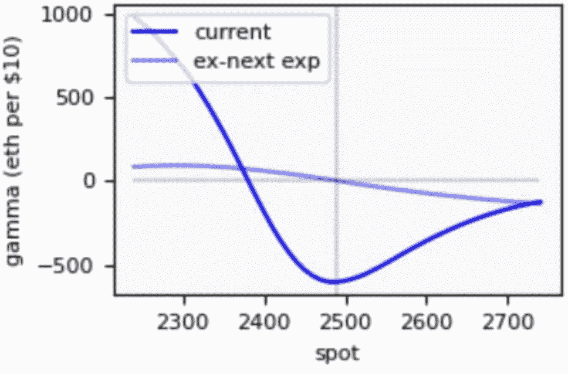
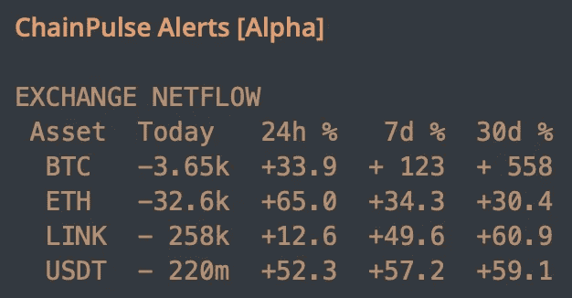

# 不像看起来那么稳定

> 原文：<https://medium.com/coinmonks/not-as-steady-as-it-looks-2a0e174ac5e5?source=collection_archive---------8----------------------->

## 使用 gamma 和链上分析评估比特币和以太的市场结构。

在评估市场时，我们结合链上数据、技术和当前市场结构。

这不是一件容易的事。解释起来也不简单。但它是独一无二的。

我们的大部分研究都是为了找到更好的方法来弄清楚目前的市场结构。

通过这种方式，我们可以更好地决定市场的走向。

我们正在做的最新工作围绕着期权市场中一个叫做 gamma 的指标。如果这封希腊信对你来说是陌生的，我推荐你读一下这篇文章，“一个做市商如何获得回报”。它解释了伽马射线是什么，以及它如何影响价格是在泥泞中运行还是有火箭助推器。

我们倾向于用它来衡量在特定价格范围内价格的波动程度。如果 gamma 非常负，那么我们预计价格会在最负的地方快速上涨。如果是正面的，我们认为 gamma 是价格波动的阻尼器——更低的波动性。

当我们将价格移动的速度与支撑和阻力配对时，我们可以开始对市场有一个更清晰的展望。

就期权而言，德里比特是市场上最活跃的地方。因此，我们默认引用它们的到期日及其未结利息。每周五都有合同在世界协调时 8:00 到期。我们将开始关注这些到期日。

有了这些背景知识，让我们看看 gamma 今天是什么样子。

现在它是为高度波动而设置的。

以下是截至世界协调时 4 月 28 日 14:00 比特币的当前结构。

现在图表告诉我们，比特币每移动 100 美元，我们可能会看到大约 80 BTC 在价格移动的方向上交易。

如果价格开始下跌，对冲其头寸的做市商将每下跌 100 美元卖出大约 80 BTC。同样，对于价格上涨，情况也是如此。

现在，从这张图表中可以看出，如果比特币开始攀升至 55000 美元以上，所需的对冲数量就会减少。因此，伽马射线对市场的影响越来越小。

如果价格开始跌破 5 万美元，同样的事情也会发生。

如果我们把这个和我们昨天分享的关于链上支撑/阻力的图表结合起来，我们开始对市场的结构有一个更清晰的了解。

我们在 55，000 美元处有很强的阻力，任何强有力的拒绝都可能导致价格快速下跌。

这告诉我们应该做好被拒绝的准备。

此外，在上面的伽玛图表中，你会注意到有一条较浅的阴影曲线。在本周五期权到期后，那条浅色曲线将成为市场上当前的伽玛曲线。

这意味着目前的结构是我们如何进入未来的真实写照。

对于以太坊…

这是伽马射线。

这是一个类似的设置。重要的区别是本周五到期后的伽玛设置。

价格将有上涨的动力。现在有更多的下跌动力，类似于比特币。这强化了以 5.5 万美元拒绝可能的表现。

现在要注意的一件有趣的事情是，我们是如何见证伽马射线随着时间的推移而移动的。它的低点不断转移到更高的价格点。

为了理解我的意思，这是 4 月 22 日的伽马射线图。

有点类似于今天的样子。我们接近曲线的最陡部分，价格的动力是向上的。

这是一个值得关注的问题，因为它可能会持续一段时间，也许这就是以太坊比比特币更强劲的原因。

> 解读负伽马值时需要注意的一点是，它并不能预测价格的涨跌。它只是告诉我们对冲活动可能如何影响价格行为。
> 
> *由于两个读数都是负面的(对价格的中等影响)，期权市场正在制造更多的价格波动。*

综上所述…当我们将伽玛与链上信噪比图配对时，以较低的价格进行长时间填充是合理的。

此外，如果到期日过后，网流看起来很强劲，比特币的价格突破了 55-57k 美元区域，那么这是价格上涨的一个好机会……特别是 ETH。

你的脉搏在加密，

B

附:这是昨天的网络流量。注意，我今天已经看到了稳定的货币流出量。所以当你阅读这些数据时，请记住这一点。

> 加入 [Coinmonks 电报小组](https://t.me/joinchat/uiLERCQL1fQ5ZjA1)，了解加密交易和投资

## 另外，阅读

*   最好的[加密交易机器人](/coinmonks/crypto-trading-bot-c2ffce8acb2a) | [网格交易机器人](https://blog.coincodecap.com/grid-trading)
*   [加密副本交易平台](/coinmonks/top-10-crypto-copy-trading-platforms-for-beginners-d0c37c7d698c) | [五大 BlockFi 替代方案](https://blog.coincodecap.com/blockfi-alternatives)
*   [CoinLoan 审核](/coinmonks/coinloan-review-18128b9badc4)|[Crypto.com 审核](/coinmonks/crypto-com-review-f143dca1f74c) | [火币保证金交易](/coinmonks/huobi-margin-trading-b3b06cdc1519)
*   [尤霍德勒 vs 考尼洛 vs 霍德诺特](/coinmonks/youhodler-vs-coinloan-vs-hodlnaut-b1050acde55a) | [Cryptohopper vs 哈斯博特](https://blog.coincodecap.com/cryptohopper-vs-haasbot)
*   [杠杆代币](/coinmonks/leveraged-token-3f5257808b22) | [最佳密码交易所](/coinmonks/crypto-exchange-dd2f9d6f3769) | [Paxful 点评](/coinmonks/paxful-review-4daf2354ab70)
*   [如何在印度购买比特币？](/coinmonks/buy-bitcoin-in-india-feb50ddfef94) | [WazirX 评论](/coinmonks/wazirx-review-5c811b074f5b) | [BitMEX 评论](https://blog.coincodecap.com/bitmex-review)
*   [双子座 vs 比特币基地](https://blog.coincodecap.com/gemini-vs-coinbase) | [比特币基地 vs 北海巨妖](https://blog.coincodecap.com/kraken-vs-coinbase)|[coin jar vs coin spot](https://blog.coincodecap.com/coinspot-vs-coinjar)
*   [币安 vs 北海巨妖](https://blog.coincodecap.com/binance-vs-kraken) | [美元成本平均交易机器人](https://blog.coincodecap.com/pionex-dca-bot)
*   [印度比特币交易所](/coinmonks/bitcoin-exchange-in-india-7f1fe79715c9) | [比特币储蓄账户](/coinmonks/bitcoin-savings-account-e65b13f92451)
*   [币安收费](/coinmonks/binance-fees-8588ec17965) | [Botcrypto 审查](/coinmonks/botcrypto-review-2021-build-your-own-trading-bot-coincodecap-6b8332d736c7) | [Hotbit 审查](/coinmonks/hotbit-review-cd5bec41dafb) | [KuCoin 审查](https://blog.coincodecap.com/kucoin-review)
*   [我的密码副本交易经验](/coinmonks/my-experience-with-crypto-copy-trading-d6feb2ce3ac5) | [购买硬币评论](https://blog.coincodecap.com/buycoins-review)
*   [加密货币储蓄账户](/coinmonks/cryptocurrency-savings-accounts-be3bc0feffbf) | [YoBit 审查](/coinmonks/yobit-review-175464162c62) | [Bitbns 审查](/coinmonks/bitbns-review-38256a07e161)
*   [最佳比特币保证金交易](/coinmonks/bitcoin-margin-trading-exchange-bcbfcbf7b8e3) | [比特币保证金交易](https://blog.coincodecap.com/bityard-margin-trading)
*   [加密保证金交易交易所](/coinmonks/crypto-margin-trading-exchanges-428b1f7ad108) | [赚取比特币](/coinmonks/earn-bitcoin-6e8bd3c592d9) | [Mudrex 投资](https://blog.coincodecap.com/mudrex-invest-review-the-best-way-to-invest-in-crypto)
*   [BlockFi 信用卡](https://blog.coincodecap.com/blockfi-credit-card) | [如何在币安购买比特币](https://blog.coincodecap.com/buy-bitcoin-binance)
*   [顶级付费加密货币和区块链课程](https://blog.coincodecap.com/blockchain-courses) | [币安评论](/coinmonks/binance-review-ee10d3bf3b6e)
*   [MXC 交易所评论](/coinmonks/mxc-exchange-review-3af0ec1cba8c) | [Pionex vs 币安](https://blog.coincodecap.com/pionex-vs-binance) | [Pionex 套利机器人](https://blog.coincodecap.com/pionex-arbitrage-bot)
*   [在美国如何使用 BitMEX？](https://blog.coincodecap.com/use-bitmex-in-usa) | [BitMEX 回顾](https://blog.coincodecap.com/bitmex-review) | [币安 vs Bittrex](https://blog.coincodecap.com/binance-vs-bittrex)