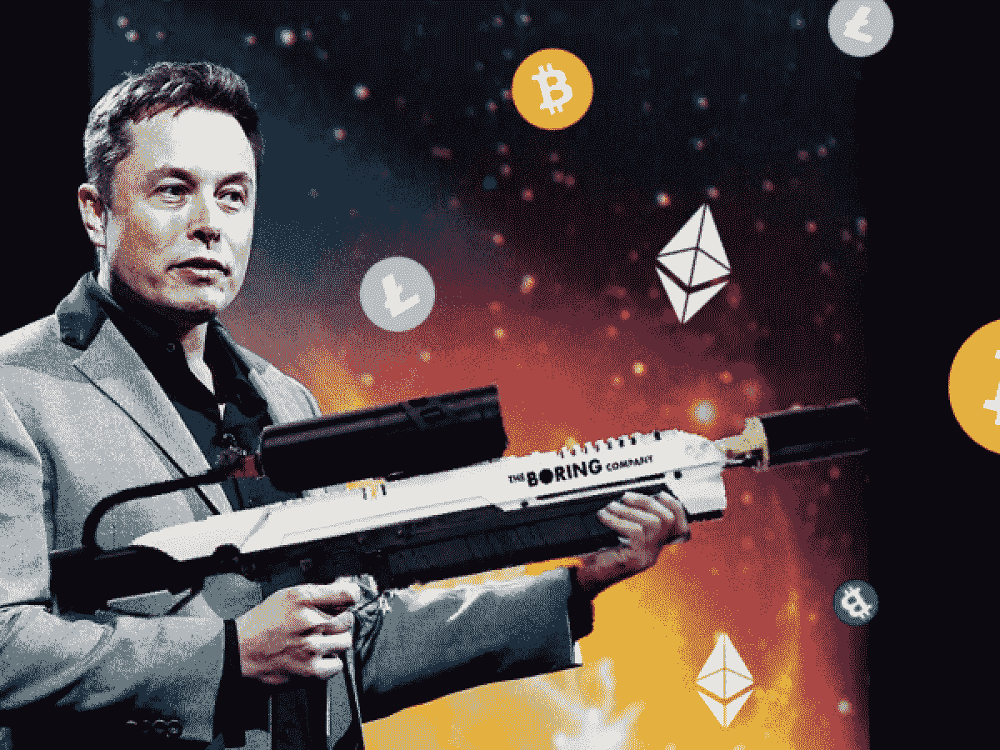

# 不是投资建议

> 原文：<https://medium.com/coinmonks/not-investment-advice-dda27251ab9f?source=collection_archive---------0----------------------->

## 这是为了我所有在混乱中寻找秩序的朋友、家人和爱人的利益。

生活就是在正确的时间出现在正确的地点。有时候，公共汽车离开车站没有你，你一整天都搞砸了。如果你幸运的话，你的计划保持不变，你只需赶上下一趟车。生活常常觉得它在与我们作对。尤其是当我们认为我们已经想通了一切的时候。

一个很好的例子是，当 COVID 在 2020 年初蔓延时，我不愿意进入股市。当股票暴跌 20%时，逻辑尖叫着“远离”。报告的收入将不可避免地被粉碎，从而无法避开衰退。然后意想不到的事情发生了:经济衰退中的牛市。美联储向金融系统注入新印制的货币，股市以一种对抗地心引力的方式起飞。我错过了那趟车。我相信一切都会以眼泪结束。这与我在 2016 年对加密货币的痛苦有着惊人的相似——那是一段没有人会输的欢庆时期。直到我做到了。这是一颗难以下咽的药丸，而且是在“好时光”里。考虑到目前是“糟糕的时期”，股市上涨是在回避必然性。

> 成长来自进步。而苦难就是过程。

在某些圈子里，我被称为 BTC 先生或比特币耶稣。比特币领域过去的 5 年是一场痛苦的马拉松。愿我的痛苦转化为你的屈服。以下是传统市场趋势、棘手情况和关键差异的大杂烩。[比特币](https://blog.coincodecap.com/a-candid-explanation-of-bitcoin)只是一道甜点。

> 就像埃隆·马斯克的《不是喷火器》:这“不是投资建议”

# 趋势

*   股票加码。没有狗屎，夏洛克。任何“热门股票”的市盈率都很高。在疫情早期，投资股票似乎是疯狂的。我对美联储的权力一无所知。它通过印制大量钞票避免了经济衰退。美联储已经变成了一个诡计多端的小马(这是一个地狱般的诡计)，没有理由他们不能冲洗和重复几次。也就是说，股票估值进一步脱离金融现实，就相当于反弹。TLDR；趁热打铁，但当乐队流行时，它将是从地狱自由落体。
*   房地产不会均匀涨跌。随着逃离城市中心的人们变成垃圾箱——长期被高估或受到 COVID 的沉重打击，将有一些更热的市场在平衡中上升。具有讽刺意味的是，尽管房租下降，房价却保持不变或有所上涨。这是由财富不平等驱动的巨大市场扭曲。TLDR；大量印钞直接进入了富人的口袋，他们碰巧已经拥有房产，从而推高了房价。随着人们接受减薪或失业，租金价格已经下降。这种矛盾使得潜在买家认为两倍的所有权变得不可靠(高财产税，较低的租金，COVID 非驱逐法)。
*   债券无关紧要，因为它们没有收益。如果你还没有看到墙上的字，那么新闻快报——随着时间的推移，每个国家都将转向负利率(NIRP)。美国是最后一个倒下的多米诺骨牌，尽可能长时间地保持零利率(ZIRP)。TLDR；将债券设定为零会从安全的固定收益中冲走数万亿美元，并使许多受托人与他们的契约发生冲突，迫使他们采取越来越多的“冒险”头寸，以使自己免于负债。
*   税收必然会增加。拜登已经宣布他的目标是将加州的最高支持率提高到令人流泪的 62%。当你威胁到富人的财务时，他们有会计师和律师从中脱身。我们总统 750 美元的纳税申报表就是一个最好的例子。离岸账户，空壳公司，税收漏洞没有富人不能智取的税收计划。有钱人总能找到出路。TLDR；美国人破产了，美国将榨取富人的脂肪滴在穷人身上。那不是社会主义的第一章吗？当大笔资金受到挤压时，当一大块资金进入比特币时，我不会感到惊讶。税收威胁越大，比特币受益者就越多。
*   没有人能区分谎言和真相。媒体太有偏见了，新闻变得太容易印刷了。编造一个谎言需要一秒钟，而拆穿它需要一年。真相有什么价值？没有人有精力去追寻真相。这种想法将在“比特币差异化”下继续。
*   政府体制大体上已经演变成了一个更糟糕的版本。这包括效率低下，无目的的工作，以及越来越需要用更多的钱来支持它的事业。民主也许是我们拥有的最好的东西，但它是一个破碎的系统。不难得出这样的结论:中国包裹在共产主义之下的资本主义制度优于美国的资本主义与民主相结合的平衡之举。至少从纯粹的 GDP 表现来看是如此。

# 棘手的情况

*   越来越难找到放钱的地方了。安全资产类别(债券)已经被系统地中性化了。高风险资产(股票)正变得越来越没有吸引力。美联储用这些宽松的货币创造了一个怪物。股票现在就像摇摆不定的积木塔，没有任何基础。房屋估价与租金价格成了一个矛盾体。这就是混沌的前身的样子。最糟糕的部分？他们不能把怪物放回壁橱里，事实上他们需要继续喂养那只野兽。有什么好消息？突然间，比特币开始吸引新的人群。
*   养老基金、401K 基金、首席财务官开始以新的眼光看待比特币。并不是说比特币是新的，改进的。而是周围的一切都在系统性的腐烂。养老基金经理依赖债券来获得几个百分点的回报——这种选择已经没有了。养老基金多年来一直是幕后黑手。现在他们的问题正在加速，恐惧变成了绝望。19 万亿美元是美国养老金和退休基金的总和。他们会把这些钱重新分配到哪里以获得回报？幸运地拥有健康现金储备的首席财务官面临着一个类似的令人不安的难题:“通胀 pacman 会把我生吞活剥。我如何保护我的国库储备？”像 Square 和 MicroStrategy 这样的公司已经率先涉足比特币。就像破解 4 分钟一英里一样，这些先驱们现在已经把它变成了全美董事会的一个合适话题。
*   通货膨胀是无形的税收。这还将决定未来十年的竞争环境，因为政府将需要更多债务来偿还现有债务。税收不受欢迎，通货膨胀是同一枚硬币的另一面，它是看不见的。我们今天所说的刺激资金就是明天的 UBI(普遍基本收入)。这直接导致了美联储账户和 CBDC(中央银行数字货币)，正如《全民银行法案》中提到的那样。
*   CPI 就是扯淡。老派基金经理坚持关注 CPI(消费者价格指数),但对于任何有常识的人来说，CPI 毫无意义。球门柱不断移动，货物篮子不断变化，使数字看起来正确。这是最糟糕的挂钩方式。根据我们向系统中注入的资金量，2020 年通货膨胀率将上升 20-25%。这是迈克尔·塞勒(Michael Saylor)在决定将 MicroStrategy 的大部分国库基金配置给比特币时的关键认识:“当我意识到自己坐在一个价值 5 亿美元的冰块上时，我有一种下沉的感觉。”当你知道银行里的钱在 2020 年将会贬值 20 %- 25 %,甚至更高时，银行里的钱就不再稳定了。

# 区别

*   不讨论信任，因为它只存在于狭小的个人空间里。机构和媒体系统地摧毁了我们对他们的信任以及他们的声誉。在古代社会，信任被视为高于金钱的无形美德。这就是比特币的特别之处。你不必相信“他们”。有了比特币，你就拥有了信任。你是信任。运行自己的节点就是这个意思。你购买和赚取的比特币可以在区块链上被追踪到。它受益于网络效应。这就是比特币的力量所在…用户决定通过 node 获得他们的钱的所有权。这种程度的信任是人民的力量。只需要一个互联网连接。金钱的价值与信任直接相关。截至本文撰写之时，比特币的区块链一直在炮制不可动摇的真理，其正常运行时间为 99.9857119343%，全球 24/7/365 都可访问。对于任何在国际上旅行过的人来说，试图通过货币兑换，支付疯狂的费用，这是显而易见的。
*   稀缺的价值从未如此明显。我们正在印制被遗忘的钞票。这意味着你口袋里的钱随着每一轮万亿美元的刺激而大幅贬值。你知道你的净值(分子)。问题是你不知道实际上有多少钱(分母)。对于所有的技术人员来说，这就像知道你的初创公司给了你多少股票期权，却不知道有多少股票已经发行。这是一个巨大的盲点。硬通货是一种价值储存手段。截至 2020 年，美元已经完全失去了这一特征。比特币的标志是 2100 万英镑的硬性上限。这是有史以来创造的最大的价值储存。这并不夸张。如果你拥有 1 个比特币，恭喜你。也就是 1/2100 万。你可以整天计算的数学。在比特币中，我们说“玩愚蠢的游戏，赢得愚蠢的奖品。”你的投资依赖于什么样的支付轨道？比特币为持有者提供了可预测的数学基础。相比之下，货币和投资数字毫无意义，目标也在下滑。我们都努力工作赚钱。把它放在一个比投机更有信心的地方。
*   通货膨胀让你沮丧？比特币是世界上第一个确定性通胀系统。这意味着你可以精确计算过去、现在或未来的通货膨胀率。世界正在失去控制，因为金钱正在失去对零利率和负利率等概念的控制。这反过来在债券、房地产和股票市场制造混乱。政府别无选择，只能继续与债务怪兽美杜莎战斗，他们剩下的唯一答案就是给怪兽喂更多的债务。这笔债由你和我来偿还。这是一个无法逃避的天坑。比特币的通胀率在当下挑战黄金。当比特币的通胀率低于黄金时，黄金迷们会吓得屁滚尿流。
*   众所周知，金钱是一种基于借据的系统。债务导致更多的债务。几十年来，黄金一直被认为是有价值的。任何黄金上的欠条都不是黄金。如果世界变得越来越不可预测，你的借据也会变得不可预测。“承诺”给你黄金的人更有可能食言。要么有，要么没有。用比特币的说法，这叫做“不是你的钥匙，不是你的比特币。”比特币很独特，因为它符合硬通货的所有标准，很像黄金。美元是债务，这不一样。
*   比特币也是你唯一可以个人托管的数字资产。Robinhood、Fidelity、Schwab 和 Etrade 账户中持有的所有股票和债券只是授予您访问权限。银行也是如此。你不拥有那些资产，你拥有进入的权利。机构控制着一切。如果菲亚特系统开始动摇，你的“投资组合”突然发生变化，不要感到震惊。这看起来深不可测，但只要拍拍土耳其、伊朗、委内瑞拉任何一个人的肩膀，这个名单还会继续下去。有一天事情进展顺利，然后生活突然改变了。挤兑银行。资产不可访问。出国航班会对你进行搜身检查，看你是否试图将黄金带出国。雷伊·达里奥详细描述了“大重置”，隐私和自由将受到限制，以从混乱中恢复秩序。你拥有多少真正属于你的资产？主权所有权与第三方托管截然不同。这给人的印象是一种偏执的行为，但这并没有抓住重点。在我们这个便利的时代，人们已经完全忘记了真正的所有权和责任意味着什么。那是难以下咽的药丸。但这就是男人和男孩的区别。人们明白在他们的领域内他们有权得到什么，因为这是通过鲜血、汗水和泪水赢得的。
*   “运行数字。”让我们重温一下 2100 万这个数字。有记录显示，有多少比特币被鲸鱼、机构和企业吞噬。地球上的百万富翁比比特币还多。这意味着，如果你拥有 1 个比特币，你就已经遥遥领先了。如果企业开始将一定比例的现金储备配置给比特币，仅此一项就将改变整个游戏格局。
*   供求:比特币可以通过交易所获得。随着对我们的机构和政府的信任受到侵蚀，比特币制造者正在从交易所中取出硬币，并采取必要措施保管自己的硬币。这意味着交易所的流通供给减少。此外，机构、养老金、企业等的需求也在不断增长。你会得到一个专利比特币月亮活动的完美风暴，又名“NGU(数字上升)技术”。
*   系统和架构:人类总是以部落的形式组织起来。这意味着金字塔形的等级制度。当我提到我们的政府系统被破坏时，这并不是一种侮辱，因为我不希望如此。这些系统以其现代形式趋向于权力集中在顶端:社会臭名昭著的 1%。当 26 个亿万富翁的净财富相当于社会底层的 40 亿人时，它就坏了。然而，这正是系统设计的结构。这实际上是我们所处的结构的结果，所以不可能完全出乎意料。
*   比特币对人类来说是一种全新的形态，但在本质上比泥土还要古老。自然界中最常见的分散网络是菌丝体:产生蘑菇的地下根系。菌丝体可以追溯到 8 亿年前。有记录的第一种陆地哺乳动物大约有 2 亿岁了。菌丝体在每一次大灭绝事件中都存活了下来。它是一个无头、智能、单细胞的复杂网络，通过分散的命令运行。像菌丝体这样的分散网络在某种程度上具有集中式网络梦寐以求的非凡弹性。这不是技术问题，这是自然问题。比特币的分散架构反映了蘑菇状菌丝结构。这和互联网已经潜入我们生活的每一个角落是一个道理。菌丝就是这么做的。它通过与周围的元素发展共生关系而快速成长和繁荣。它有能力将岩石分解成土壤，并与树木交换养分。互联网是第一个专注于通信的数字菌丝体网络。比特币是第二个专注于价值(金钱)的数字菌丝体网络。

> 蘑菇可以喂养你，杀死你，或者治愈你。不要赌菌丝体会死，它会在我们死后很久还存在。

# 结论:“不要买比特币”，DYOR

我已经学会了不要说“买比特币”，因为它不起作用，而且非常令人倒胃口。我在这里的希望是描绘一幅更大的画布，描绘最传统意义上的政治和金钱。比特币的存在只是为了与我们的传统市场形成对比，创造对话。

我个人认为比特币是一种奇妙的调色板清洁剂，可以清洁艰难的现在和丑陋的未来。如前所述，这不是投资建议。我发现投资建议更有可能破坏而不是帮助家庭和友谊。我不想参与其中。

我很想分享我的想法，希望能引发我们之间的对话。我曾经相信我对现实有很强的掌控力。随着我的成熟，我意识到收集意见是有价值的。我正试图利用我的人类菌丝体网络来获取新的见解和观点，以拓宽我自己的状态感。我很想听听你的。请不要犹豫在下面评论或分享。