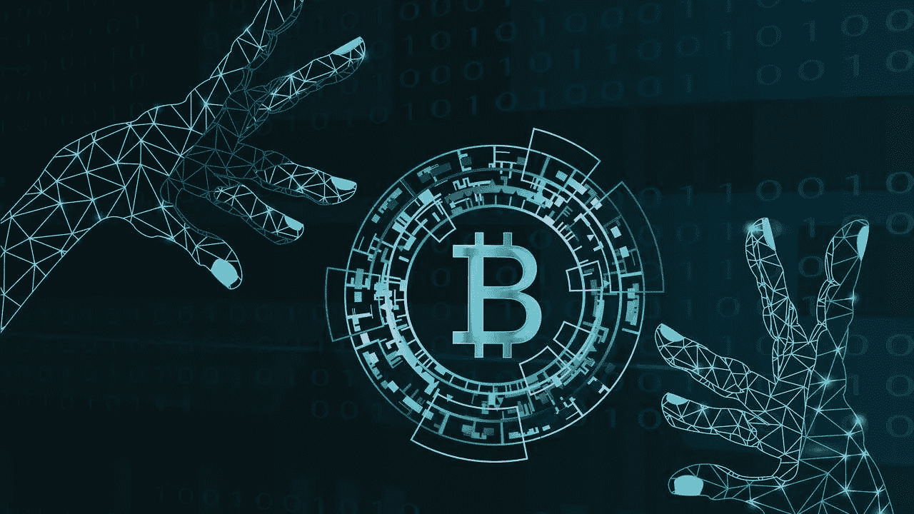

# 努里埃尔·鲁比尼对加密货币的立场是错误的

> 原文：<https://medium.com/coinmonks/nouriel-roubinis-position-on-cryptocurrencies-is-wrong-693f2e962376?source=collection_archive---------2----------------------->

我想先说我是鲁比尼教授的超级粉丝。我一直在关注他的工作，他对经济的看法，采访等。但现在他的推特风暴和最新的[文章:“大区块链谎言”](https://www.project-syndicate.org/commentary/blockchain-big-lie-by-nouriel-roubini-2018-10)关于整个加密货币现象有多糟糕充其量是被误导了。

我认为 Nouriel 应该后退一步，检查一下他为什么如此强烈地反对所有加密货币和区块链，也许我们需要停止将这些资产称为“货币”以避免混淆，让我们称它们为数字资产，因为这些是安全的数字记录，具有透明和可编程(可预测)供应增长的证书，是可审计和不可改变的，不受世界上所有专制政府的突发奇想的影响。显然，并非所有加密货币都具有这些特征，但这是前提，好的一面是，不具备这些特征的加密货币很难假装具备这些特征。

我们可以争论任何给定的加密货币，它的安全性，治理，基本价值等。然而，毫无疑问，99%的硬币/代币没有实际价值，将会消失。大多数项目没有真正的效用或用例，就像 1999 年的大多数网络公司没有存在和筹集资金的业务一样。忽视整个概念似乎是不合逻辑和狭隘的。尤其是比特币，它是透明的，不受任何团体的控制，从运营的角度来看，它一直非常稳定和可预测。Nouriel 称比特币和其他加密货币为“所有泡沫之母”。这充其量是一个重大的夸张。网络泡沫或者 2008 年的市场崩溃呢？他还称比特币已死，这又是一派夸张。

比特币诞生已经快 10 年了，让我们来看看证据:

1)每 10 分钟生成一个区块，其开采回报与 10 年前的预期一致。

2)2100 万个上限——许多比特币克隆体是通过硬分叉创建的，将会有更多的分叉，但最初的比特币仍然只有 2100 万个硬币被开采。

3)sha 256—10 年前的计划。

4)有许多交易所、钱包等被盗。，但是比特币 MainNet 没有问题。

5)强大的开源社区仍在推动项目向前发展

6)分散化——大型矿池确实提出了理论问题，但还没有实际问题出现。

7)产生的每个块仍然是 10 年前预期的不可变的。

8)比特币仍然是迄今为止最成功的加密货币，仍在增长，吸引着散户和机构投资者。

现在让我们来看看 Nouriel 提出的一些批评:

> 因此，基于战俘的 BTC 已经死亡，而新的秘密梦想家的嵌合体已经出现。[@ VitalikButerin](https://twitter.com/VitalikButerin)2013 年承诺 PoS。仍然不见踪影。任何对密码学有所了解的人都知道，PoS 将会是一个比 PoW 更集中的矿业寡头垄断，因此也不安全

战俘死了？好吧，比特币没有死，PoW 也做得很好。它正在使用大量的电力，但这并不意味着它死了(我将在这篇文章的后面处理 PoW)。至于 PoS，Ether 还没有实现真正的 PoS，但这并不意味着 PoS 是失败的，我们可以看看 EOS 或 Tendermint 中 PoS 的工作示例。

> 每天 1100 万美元除以每天 17 万笔交易，得出每笔交易的交易成本为 65 美元。&密码迷们不明白:有人以某种方式在系统中支付了这种交易成本。所有交易成本之母！撇开 BTC 的环境灾难不谈

比特币区块链每天产生 1800 个比特币(以目前每 10 分钟产生 12.5 个比特币的速度计算)，如果我们假设比特币的当前价格为 6300，那么这大约是 1130 万美元。用这个数字除以每天的交易次数，Nouriel 得出了一个非常吓人的数字:每笔交易 65 美元。但这不是真的，不存在 65 美元的直接成本，而是存在通货膨胀成本，目前有 1730 万比特币在流通，因此每天开采的 1800 个比特币仅代表超过一个基点。0.0104%乘以 365 天，比特币供应量的年增长率为 3.78%。有人可能会认为，供应的增加应该会导致通胀，在一个完美的世界里，我们应该会看到 3.78%的通胀率。但比特币的采用正在增加，对比特币感兴趣的人数和机构的增长速度远远超过 3.78%。此外，由于比特币的供应每天都在增长，但每天生产的新比特币数量在百分比基础上保持稳定(目前)，供应的增长正在放缓，在 2 年内，这一增长将减半，这将进一步降低通货膨胀。因此，每笔交易 65 美元是一个耸人听闻的数字，但非常容易误导。

> 电量(*)如此之大，以至于代表了一场环境灾难。如果加密货币被广泛使用，这场灾难将会毁灭地球。幸运的是，99.9%的狗屎硬币正在融化和消失。谢天谢地。*

*现在让我们谈谈电力，PoW 过程中使用的电量是巨大的，PoW 是浪费的，我不知道加密社区中有谁不同意这一点。这是人们寻找替代能源和不同共识模型如 PoS 或 DAG 等的原因之一。但是，我们不要假装加密货币是人类唯一从事的浪费活动，我可以想到一百万个浪费活动的例子:休闲旅游，电视，任何军事活动，等等。高电流消耗电力并不意味着加密货币不应该存在。*

> *秘密世界的财富比朝鲜更加集中。基尼系数 1.0 意味着一个人控制了一个国家 100%的收入/财富，而朝鲜的基尼系数是 0.86，比特币的基尼系数是惊人的 0.88。BTC 的不平等比北朝鲜更严重*

*鲁比尼教授正在用基尼系数来说明比特币比朝鲜更集中。这是一个非常耸人听闻的说法。但是这个系数是怎么算出来的呢？有许多钱包可以容纳多个所有者的硬币。看看像比特币基地、币安或灰度这样的公司，它们在主钱包里为所有客户装着硬币。他们有多少客户？如果这些钱包被视为比特币集中化的标志，那将完全是误导。嘉信理财和 Etrade 不以客户的名义持有股票。这会引起警报吗？不，不是真的。*

*我可以继续说下去，但我要指出一点，加密领域的许多人都同意鲁比尼的观点。*

> *在 DAPPS，75%的用例是加密猫、庞氏/金字塔计划和赌场游戏。剩下的指数甚至没人用来交换硬币。以太坊并没有阻止这些庞氏骗局，因为他们是从这些犯罪企业中获利的吸血鬼*

*或者*

> *是的，秘密之地是所有价格操纵的源头:泵 n 转储计划、欺骗、洗盘交易、抢先交易、内幕交易、交易所利益冲突、系绳和其他伪稳定货币——一项学术研究证明，由法令创造的硬币支撑了 BTC 80%的股价*

*加密领域有很多问题，99%的山寨币或者很多人称之为“狗屎币”一文不值，ico 有很多欺诈行为，市场被洗白交易操纵，等等。这没什么大不了的。这个市场还很早，有很多实验和滥用，大多数项目都会失败。所有理性的人都会同意这一点。许多人将这些问题视为机遇，并正在努力解决这些问题。*

*我们可以看看网络热潮，看到完全相同的模式，但回过头来看，仅仅因为 99%的原始项目都失败了，就呼吁消灭互联网，这将是非常愚蠢的。在 1999 年，将. com 添加到公司名称中是一种快速筹集资金的方式，大多数公司在此后不久就失败了，但今天 100%的公司都是互联网公司，1999-2000 年所有失败的项目都在互联网的发展中发挥了一定的作用。*

*我认为区块链像任何其他发明一样应该以批判的眼光来看待，但我们不要完全否定它。任何特定的项目都可能失败，技术会发展，但分布式共识的概念非常强大。市场会解决问题的。我认为加密货币代表了一种非常新的东西，一种全球性的自由企业现象。有来自印度和乌克兰的开发者，有来自中国和俄罗斯的矿工，有来自世界各个角落的企业家，他们共同努力建设这个无国界的系统。我们以前没有见过这种国际合作。我并不是说应该忽视监管或者不应该纳税，不，我们都应该遵守我们称之为家园的国家的法律，但加密货币将对国家法定货币施加压力，并让政治家们注意到这一点。政府将不得不制定政策来吸引本国公民的资本参与当地经济。尤其是对于像委内瑞拉和伊朗这样本币贬值的国家，它们的公民现在有了一个选择。加密货币让普通公民更容易控制自己的资本，而不必委托给一个或另一个政府。这是一种非常强大且影响深远的能力。所有这些都将让世界变得更加美好，这还是在我开始谈论可替代性、资产支持代币以及我们正在可替代网络中构建的东西之前。*

*这是我的最后一点。有事实，也有观点。我们可以争论观点，我们甚至可以争论事实，当涉及到密码世界中发生的所有不好的事情时，我们可能会就事实达成一致。是的，有骗子利用 ICO 从容易受骗的公众那里筹钱。是的，到目前为止，大多数项目都会失败。是的，交易场所存在价格操纵和各种滥用行为(我很难称之为加密交易所)，但这并不能否定区块链和加密货币整体加密货币理念的价值。到了最后，这些都不重要了。Nouriel 可能不会很快改变他的观点，许多密码爱好者将继续宣扬去中心化世界的美好未来。重要的是市场，市场将决定比特币和所有“狗屎币”的价格。尽管市场存在种种缺陷和主观性，但它是客观的。如果加密货币的适应范围扩大，价格将会上涨，否则，区块链可能会失败并消失。意见的分歧让市场发挥作用。因此，让鲁比尼教授像往常一样成为末日博士，让加密啦啦队做他们的工作。企业家将继续从事成千上万个不同的项目，这些项目的成功将决定区块链和加密货币的未来谁对谁错。*

*继续加密，敬请关注！*

> *[在您的收件箱中直接获得最佳软件交易](https://coincodecap.com/?utm_source=coinmonks)*

**

*___________________________________________________________________*

*Dan Raykhman，可替代网络的首席执行官*

**如果你喜欢这篇文章，请“鼓掌”，这样它会被更多的人分享。你也可以* [*推特我*](https://twitter.com/DaRaykhman) *你的想法或者在*[*LinkedIn*](https://www.linkedin.com/in/danraykhman/)*上找我。**

*___________________________________________________________________*