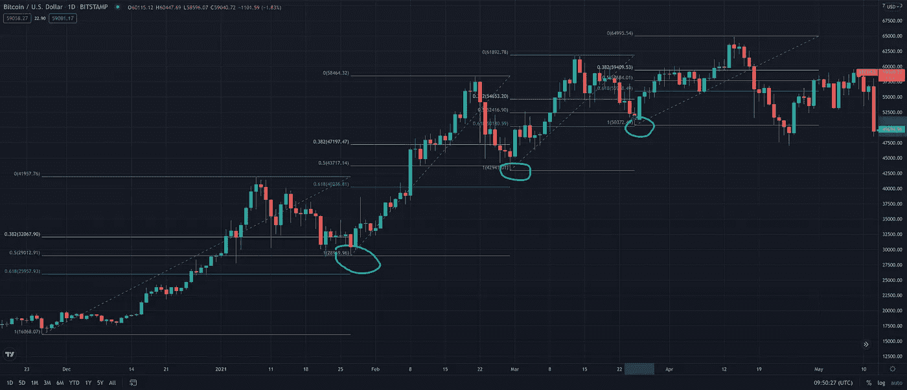

# 11 月概览

> 原文：<https://medium.com/coinmonks/november-overview-b247afc6b960?source=collection_archive---------8----------------------->

## 您对数字资产世界的每月简报

> 文章作者 [Lesia M.](https://twitter.com/LesiaMrch)

Photo by: Monstera | Pexels.com

*   **十一月回顾** *——BTC 健康检查*
*   **机构加密采用** *-第三季度 VC 投资增长
    -机构采用新闻*
*   **DeFi，交流&杂项** *-宪法道现象
    -更多 DeFi &杂项新闻*
*   **监管机构对** *-通货膨胀不再是‘昙花一现’
    -新闻在加密监管*

# **十一月回顾**

11 月对 crypto 来说又是一个动荡的月份:

BTC 本月下跌 7%，在 11 月 10 日的 69，000 美元高点和 11 月 28 日的 53，300 美元低点之间波动；

ETH 在 11 月上涨了 8%，在 11 月 10 日的 4.9K 美元和 11 月 26 日的 3.9K 美元之间波动。

BTC 的未平仓合约继续以快于加密货币价格的速度增长，这表明新的杠杆正在进入市场。始于 10 月份的一系列调整并没有消除现有的杠杆，自 9 月底以来杠杆一直在累积。各交易所的融资利率普遍为正，这表明新的 OI 正在进入多头头寸，表明衍生品交易员一致看涨。

*Source: JKL Research | app.intotheblock.com*

我们正在密切关注潜在反弹水平的纤维回撤。在从 2020 年底到 2021 年 5 月的前一轮牛市中，BTC 修正向下回撤至. 5-.618 斐波纳契水平，然后反弹继续上升趋势。

*Source: Tradingview.com*

在 2021 年 7 月至 9 月的上升趋势中，我们目睹了同样的模式。

*Source: Tradingview.com*

在当前周期中，BTC 已经从 11 月 26 日至 28 日的. 5 fib 水平反弹，目前正在. 38 水平附近盘整。我们将在未来几天密切关注加密货币的价格走势，因为突破 0.38 水平在历史上一直是比特币看涨势头的良好指标。

## **套利**

虽然 11 月初基差和融资利率都很高，为套利提供了足够的空间，但过去几周利率持平，永久市场整体放缓。套利机会目前相当低，因为市场在下一步行动之前会进行盘整。

# **机构收养**

根据 Galaxy 2021 年 11 月 23 日的研究报告，风险投资在加密领域的投资在 2021 年第三季度达到了历史最高水平。与此同时，秘密风险投资的估值与更广泛的风险市场之间的差距继续扩大，引发了这种积累从长期来看是否可持续的问题。

然而，这种有意义的机构流入加密空间符合我们的观点，即 11 月份的修正并不是加密冬天的迹象，我们还将见证另一次上涨。

## **关于机构收养的更多信息:**

> 加密风险投资公司 Paradigm 宣布成立 25 亿美元的基金，这是业内最大的基金([阅读更多信息](https://www.coindesk.com/business/2021/11/15/crypto-venture-firm-paradigm-announces-25b-fund-industrys-largest/)
> 
> 蒂姆·库克说他拥有加密货币，而且他“对此感兴趣已经有一段时间了”([阅读更多](https://www.cnbc.com/2021/11/09/apple-ceo-tim-cook-says-he-owns-cryptocurrency.html))
> 
> Twitter 成立加密团队，探索去中心化的应用程序([阅读更多信息](https://www.ft.com/content/ca4aca6e-b05f-4466-bf10-1d984c2650c4)
> 
> 芝加哥商品交易所集团将于 12 月 6 日推出微型乙醚期货(阅读更多信息)
> 
> 随着另一只基金的推出，比特币期货交易所交易基金的狂热正在迅速消退([阅读更多](https://www.bloomberg.com/news/articles/2021-11-16/bitcoin-futures-etf-frenzy-is-fading-fast-as-another-fund-debuts))
> 
> SEC 拒绝 VanEck 的比特币交易所交易基金最新现货上市冷落([阅读更多](https://www.bloomberg.com/news/articles/2021-11-12/sec-rejects-vaneck-s-bitcoin-etf-application-to-trade-on-cboe))
> 
> 富达在加拿大推出现货比特币交易所交易基金，而不是在美国等待美国证券交易委员会([阅读更多](https://seekingalpha.com/news/3775630-fidelity-launches-a-spot-bitcoin-etf-in-canada-not-waiting-for-the-sec-in-the-us))

# **DEFI，交易所&杂项**

## **体质道现象**

宪法岛不知从哪里冒出来，超过 17，000 人聚集在一起，进行快闪式的搜索，试图购买 243 年前的美国宪法原始纸质副本。尽管该组织在拍卖中败给了出价更高的买家，但 DAO 组织还是吸引了那些密切关注加密领域的人的注意力。([阅读更多](https://forkast.news/what-is-a-dao-decentralized-autonomous-organization/))

简而言之，分散自治组织(DAO)是一种纯粹基于智能契约运行的区块链治理结构，由 DAO 的创始人进行编码。与首席执行官或高层结构不同，所有关于如何运行 DAO 的组织决策都是由令牌持有者公开投票做出的。与此同时，选票根据持有的代币数量进行加权——因此，谁持有的代币越多，谁的投票权就越高。

因此，DAOs 非常符合区块链在生活的各个方面日益分散化的广泛叙述。然而，围绕 DAOs 有几个主要的问题，安全性是首要的。在最好的区块链传统中，DAO 的代码是开源的，让每个人(包括攻击者)都可以访问组织的代码和智能合约。除非这些代码是防弹的，否则总是有可能遭到各种攻击(就像 2016 年 DAO 的 1.5 亿美元盗窃案)。

最后，Dao 在密码行业正获得越来越多的关注。在目前的发展阶段，Dao 还不足以取代任何传统的公司董事会。然而，它们似乎会成为“下一个大事件”，我们将在不久的将来密切关注它们。([阅读更多](https://www.cnbc.com/2021/10/25/what-are-daos-what-to-know-about-the-next-big-trend-in-crypto.html))

最近，道项目竞相提供最高的 APY 赌注本国货币，有些提供高达 70，000%的 APY。他们的赌注池承诺的高赌注回报确保了项目的本地令牌的良好性能，保护了必须从池中赎回流动性的协议。随着如此多的加密散户投资者渴望(超)高风险/高回报的努力，这些项目的 TLV 继续呈指数增长，有可能取代正在进行的 NFT 炒作。

## **更多关于 DeFi，exchange&杂项:**

> 比特币期待已久的升级产品 Taproot 已经激活！([阅读更多](https://www.coindesk.com/tech/2021/11/13/taproot-bitcoins-long-anticipated-upgrade-activates-this-weekend/))
> 
> 据报道，洛杉矶湖人队的主场将以 7 亿美元的价格更名为 Crypto.com 竞技场
> 
> 已停业的比特币交易所 Mt Gox 的修复计划现已最终确定([阅读更多信息](https://www.theblockcrypto.com/linked/124536/rehabilitation-plan-for-defunct-bitcoin-exchange-mt-gox-is-now-finalized))
> 
> 据中国人民银行官员称，10%的中国人已经开通了数字人民币钱包

# **密码规则**

11 月开始和结束时，美联储终于承认通胀担忧，并寻求缩减每月债券购买量。11 月 3 日，美联储宣布将每月削减 150 亿美元的债券购买量。([阅读更多信息](https://www.bbc.com/news/business-59152804))这并不令人震惊，美国 2s10s 曲线保持相当平坦，约为 120 个基点(相比之下，6 月高点约为 160 个基点)。然而，故事并没有就此结束。

11 月 10 日，星期三，CPI 通货膨胀数据冲击了市场，比一年前增长了 6.2%。这标志着通货膨胀率连续第五个月超过 5%。随着实际利率大幅降至负值，市场不再相信美联储的“暂时性通胀”说法，而是在寻找价值资产的替代储存手段。([阅读更多信息](https://www.bloomberg.com/news/articles/2021-11-10/inflation-builds-with-biggest-gain-in-consumer-prices-since-1990))在这一消息发布后，BTC 创下了 69000 美元的历史新高，瑞士联邦理工学院的股价达到了 49000 美元

有鉴于此，11 月 30 日杰罗姆·鲍威尔向参议院委员会表示，随着经济面临进一步的通胀压力，宣布的缩减计划可能会加快。([阅读更多](https://www.cnbc.com/2021/11/30/powell-says-fed-will-discuss-speeding-up-bond-buying-taper-at-december-meeting.html))

## **关于加密规则的更多信息:**

> 拜登的工作小组呼吁像监管银行一样监管银行
> 
> 随着拜登签署基础设施法案，参议员寻求解决加密报告问题
> 
> 随着加密市场下跌，萨尔瓦多购买了 100 多个比特币([阅读更多](https://www.coindesk.com/business/2021/11/26/el-salvador-buys-100-more-bitcoins-as-crypto-market-falls/))
> 
> 纽约市长表示，他希望用比特币支付薪酬
> 
> 埃里克·亚当斯(Eric Adams)的目标是用类似迈阿密的硬币让纽约变得对密码友好
> 
> 迈阿密市长称他将接受比特币支付他的下一份薪水
> 
> 哈萨克斯坦限制零售玩家的加密投资([了解更多](https://www.coindesk.com/policy/2021/11/04/kazakhstan-introduces-crypto-investment-limits-for-retail-players-report/?utm_medium=email&_hsmi=179265698&_hsenc=p2ANqtz-9OuwBUAnGkEAEXBGn27Wq71hvy40sLuE4Wfin6itxUapbo83vo6gxE060zHWAE7uzqaA8VhGtNUv2LqAxFmV2J8jXkZA&utm_content=179265698&utm_source=hs_email)

## 放弃

*本材料的内容未经任何监管机构审核。建议您对本材料的内容保持谨慎。虽然本材料中包含的信息是从据信可靠的来源汇编的，但 JKL 不代表或保证本材料中包含的信息的准确性、完整性或可靠性。如果您对本材料的任何内容有任何疑问，您应该获得独立的专业意见。JKL 或其任何关联公司，或其任何或其各自的董事、高级职员、员工和代表都不会对因使用或依赖本材料中包含的任何信息而导致的任何直接、间接或后果性损失承担任何责任或义务。本材料不构成认购或购买任何金融产品的要约或邀请。其目的不是提供任何信贷或其他评估的基础，也不应被视为购买任何金融产品的建议。*

## 另外，阅读

*   [加拿大最好的加密交易机器人](https://blog.coincodecap.com/5-best-crypto-trading-bots-in-canada) | [赌注加密](https://blog.coincodecap.com/staking-crypto)
*   [如何在印度购买比特币？](/coinmonks/buy-bitcoin-in-india-feb50ddfef94) | [WazirX 审查](/coinmonks/wazirx-review-5c811b074f5b)
*   [最佳网上赌场](https://blog.coincodecap.com/best-online-casinos) | [硬件钱包](/coinmonks/hardware-wallets-dfa1211730c6)
*   [Bookmap 评论](https://blog.coincodecap.com/bookmap-review-2021-best-trading-software) | [美国 5 大最佳加密交易所](https://blog.coincodecap.com/crypto-exchange-usa)
*   [如何在 FTX 交易所交易期货](https://blog.coincodecap.com/ftx-futures-trading) | [OKEx vs 币安](https://blog.coincodecap.com/okex-vs-binance)
*   [如何在势不可挡的域名上购买域名？](https://blog.coincodecap.com/buy-domain-on-unstoppable-domains)
*   [印度的加密税](https://blog.coincodecap.com/crypto-tax-india) | [altFINS 审查](https://blog.coincodecap.com/altfins-review) | [Prokey 审查](/coinmonks/prokey-review-26611173c13c)
*   [布洛克菲 vs 比特币基地](https://blog.coincodecap.com/blockfi-vs-coinbase) | [比特坎评论](https://blog.coincodecap.com/bitkan-review) | [币安评论](/coinmonks/binance-review-ee10d3bf3b6e)
*   [Coldcard 评论](https://blog.coincodecap.com/coldcard-review) | [BOXtradEX 评论](https://blog.coincodecap.com/boxtradex-review)|[uni swap 指南](https://blog.coincodecap.com/uniswap)
*   [阿联酋 5 大最佳加密交易所](https://blog.coincodecap.com/best-crypto-exchanges-in-uae) | [SimpleSwap 评论](https://blog.coincodecap.com/simpleswap-review)
*   购买 Dogecoin 的 7 种最佳方式
*   [iTop VPN 审查](https://blog.coincodecap.com/itop-vpn-review) | [曼陀罗交易所审查](https://blog.coincodecap.com/mandala-exchange-review)
*   [比特币基地 vs 瓦济克斯](https://blog.coincodecap.com/coinbase-vs-wazirx) | [比特鲁点评](https://blog.coincodecap.com/bitrue-review) | [波洛涅克斯 vs 比特鲁](https://blog.coincodecap.com/poloniex-vs-bittrex)
*   [美国最佳加密交易机器人](https://blog.coincodecap.com/crypto-trading-bots-in-the-us) | [经常性回顾](https://blog.coincodecap.com/changelly-review)