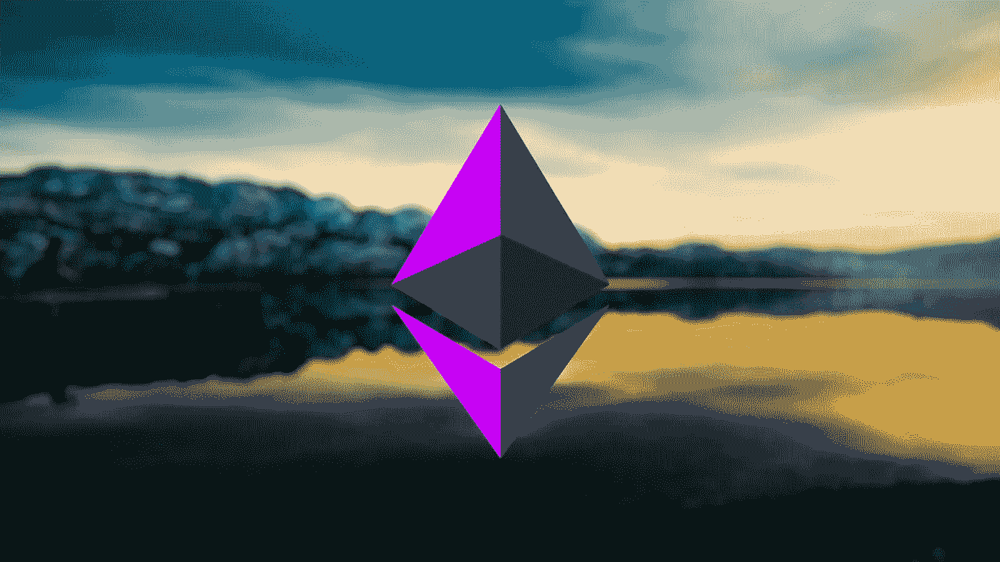
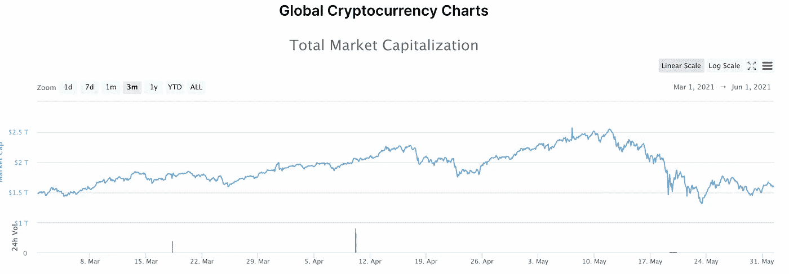
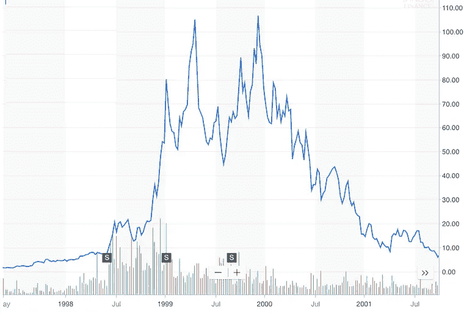
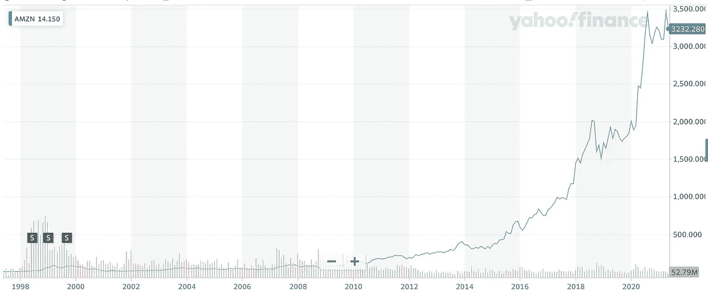
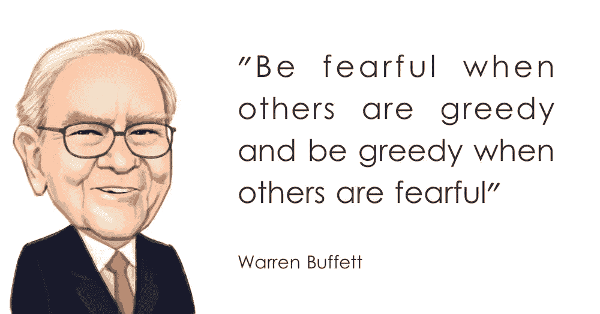

# 现在是购买更多 ETH 的时候了

> 原文：<https://medium.com/coinmonks/now-is-time-to-buy-more-eth-2a059c1b0532?source=collection_archive---------0----------------------->

## 为什么我在五月中旬的“崩盘”后慢慢积累了更多的 ETH

Source from [Pinterest](https://www.pinterest.com/pin/92746073559949696/)

和往常一样，这篇文章是为教育目的而写的。这既不构成财务建议，也不构成交易建议。过去的表现并不代表未来的结果。

*不要投资超过你能承受的损失。这不是财务建议；总是自己做研究:)*

五月中旬疼。

在一周的时间内，加密技术的总市值从 2.5 万亿美元下降到 1.5 万亿美元。BTC 下跌了 40%，ETH 下跌了 60%，一些替代硬币下跌了 80%+

币安智能链上的协议让[不断被闪付贷款](https://cryptobriefing.com/another-security-attack-binance-smart-chain/)利用，有时甚至是彻底的加固。

Source: CoinMarketCap

生活在恐惧中是很容易的——无休止地盯着比特币基地的红色烛台，考虑是否应该点击闪亮的红色按钮卖掉所有东西。

推特上充斥着悲观的消息。人们到处被清算。焦虑显而易见。

我想这两个星期我唯一的可取之处就是焦虑，我刚到纽约，忙于 IRL 计划，没有时间整天盯着图表和在 Twitter 上，哈哈。

结果，我[钻石交出了](https://www.cyberdefinitions.com/definitions/DIAMOND_HANDS.html)我所有的加密头寸。虽然我可以通过出场和再出场赚一点钱，但我已经开始承认我不擅长把握市场时机，而且只需要做做就可以了。

不仅如此，我一直在慢慢买入 dip，因为我相信底层技术。

为什么会这样呢？为什么我对这项技术如此深信不疑？

我可以从两个伟大的人物那里获得灵感:罗伊·阿马拉和查理·芒格。

# 阿马拉定律

> “我们倾向于高估一项技术的短期效果，而低估其长期效果。”——罗伊·阿马拉

美国科学家罗伊·阿马拉的格言让我们对人类心理有所了解:我们对新事物感到非常兴奋，但很少能够理解影响的大小。

我坚信未来会比我们想象的更加陌生。

自动驾驶汽车、无人机送货、元宇宙、无许可货币、基因组学和无限生命。

由于阿马拉定律，我们在短期内会看到资产类别中的泡沫，但当我们缩小范围时，真正转型的想法和技术的增长将呈指数增长。

请看下面亚马逊和 Salesforce 的一个小例子:

抱歉，嵌入的推文不是很清楚。这是另一个展示阿玛拉定律的亚马逊图表:

左边的图表显示了亚马逊“泡沫”在互联网泡沫期间破裂，但这是其重新定义世界购物方式的轨迹中的一个微小修正(如右边的图表所示)。

# 可怜的查理年鉴

我敢肯定，许多人会阅读前面的部分，并认为，“很明显，转换技术的价值将呈指数增长…但是，吉米，你怎么知道加密是这些技术之一呢？我们只有回想起来才能知道。此外，你怎么知道 crypto 不会成为另一个看起来像是变革性技术的雅虎或美国在线，直到它不是？”

在第一点上，你是对的……对一项新兴技术有高度的信心是彼得·泰尔在*零比一*中谈到的那些[秘密之一，在](https://coffeeandjunk.com/peter-thiel-secrets/)很少有人同意你的观点。

关于第二点，这就是我们从查理·芒格(尽管他不懂密码)那里得到的实质内容。

伯克希尔·哈撒韦公司的查理·芒格在他的书*《可怜的查理年鉴》中描述了他的投资理论——尤其是关于进场价格和资本回报率之间的关系。*

**从长远来看，投资者从一家企业获得的回报将大致相当于该企业本身从其资本中获得的回报。**

进一步说，投资一个好企业的“坏”(即高)切入点总是胜过投资一个“好”切入点的好企业。

请记住这一点，因为这是沃伦·巴菲特著名的价值投资的基础。

就这一点而言，在我看来，没有哪家资产/公司的资本回报率比瑞士联邦理工学院更高。

**后 ETH2 合并和后 EIP 1559，以太将成为具有通货紧缩供应模型的利益相关共识机制的原生资产。**

ELI5，这意味着 ETH 的持有者将直接获得 Ethereum 平台产生的费用(即收入)的补偿。

并且由于 EIP-1559 的通货紧缩成分，平台的使用量越大，平台的基础资产就越有价值。

以太坊 2.0 研究员 Justin Drake 预计，至少在最初，ETH 的股东将获得高达 25%的年利率。

基本上 25%的资本回报率，因为数字资产的财务结构比企业简单。

如果查理·芒格认为 18% ROC 是一家“伟大”的公司，等他听到 ETH…

不仅仅是 ETH。

像 Aave、Uniswap 和 Yearn 这样的 DeFi 蓝筹协议为其资产持有者带来了疯狂的资本回报。这些是真正的公司创造收入，并从本质上将收入重新分配给用户——建立在大众化获取资金的 Web3 精神之上。

例如，渴望目前的市盈率为 12 倍，比一家成立 3 年、CAGR 增长 100%以上、盈利的科技初创公司的估值还要低一个数量级。

# 结束语

[比特币恐惧和贪婪指数](https://twitter.com/BitcoinFear)每天追踪加密市场情绪。过去几周，情绪从“极度恐惧”徘徊到正常的“恐惧”。

但现在是时候展现我的崇高信念了。

这不仅仅是盲目的信任，我所做的决定背后有强大的财务和数据支持。

我的想法并不孤单:a16z 正在筹集[他们迄今为止最大的加密基金](https://news.bitcoin.com/andreessen-horowitz-discusses-raising-third-crypto-fund-to-2-billion-sources-say/)1B，[凯西·伍德正在积累](https://www.barrons.com/articles/cathie-wood-ark-invest-bought-coinbase-bitcoin-51621630885)更多的 GBTC 和硬币，资本[流入仍然是正的](https://cointelegraph.com/news/unprecedented-capital-inflows-into-bitcoin-remove-12k-btc-from-coinbase-in-an-hour)——表明机构投资者的看涨情绪正在积累。

引用查理·芒格导师的话:

如果你认为这篇博文值得你花上 5 分钟来阅读，请帮我鼓掌(最多 50 次)或者与一个会从这篇内容中受益的朋友分享。非常感谢！

## 另外，阅读

*   [加密保证金交易交易所](/coinmonks/crypto-margin-trading-exchanges-428b1f7ad108) | [赚取比特币](/coinmonks/earn-bitcoin-6e8bd3c592d9) | [Mudrex 投资](https://blog.coincodecap.com/mudrex-invest-review-the-best-way-to-invest-in-crypto)
*   [BlockFi 信用卡](https://blog.coincodecap.com/blockfi-credit-card) | [如何在币安购买比特币](https://blog.coincodecap.com/buy-bitcoin-binance) | [网格交易机器人](https://blog.coincodecap.com/grid-trading)
*   [加密副本交易平台](/coinmonks/top-10-crypto-copy-trading-platforms-for-beginners-d0c37c7d698c) | [五大 BlockFi 替代方案](https://blog.coincodecap.com/blockfi-alternatives)