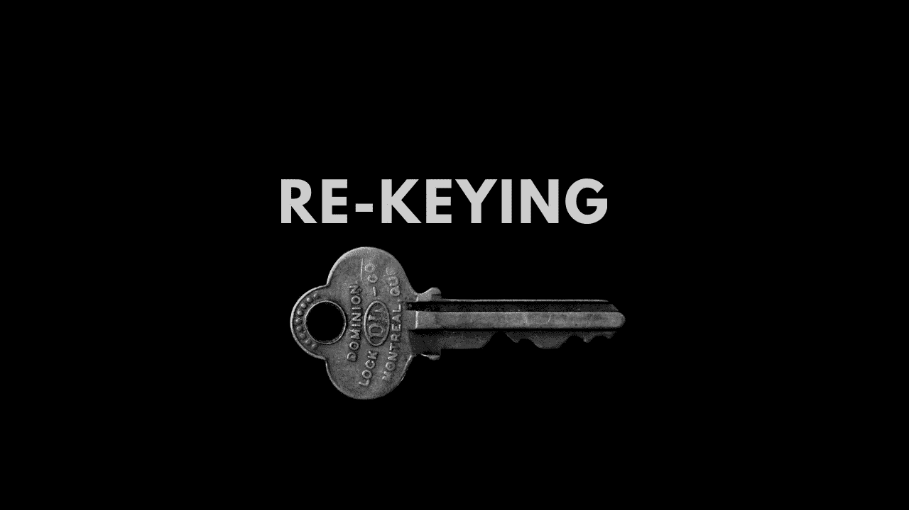

# 现在是时候通过重设密钥来保护您的加密钱包了

> 原文：<https://medium.com/coinmonks/now-its-time-to-secure-your-crypto-wallet-by-rekeying-it-3dfc7b9734a3?source=collection_archive---------2----------------------->

## 这篇文章将告诉你，现在你可以多次改变你的私钥来保护你的密码，而不用改变公钥。

Image credit unplash and edited at canva

加密和区块链领域的每个人都必须熟悉术语[公钥](https://spectrocoin.com/en/faqs/bitcoins/what-is-a-public-key.html)和[私钥](https://en.bitcoin.it/wiki/Private_key)，其中公钥用于接收支付，私钥用于访问钱包， 但是有一个我们都面临的问题，我们不能改变私钥和一些时间来保护我们的 [crypto](http://blog.coincodecap.com/tag/crypto) 我们创建了完整的新钱包，但是新钱包也附带了一个新的公钥，我们可能不需要它，所以如果我告诉你，使用密钥更新功能，你可以任意多次改变你的私钥，而不会影响你的公钥，会怎么样？ 所以继续阅读这篇文章，我会给你关于密钥更新功能的细节。

# 密钥更新前的问题:

由于[网络钓鱼](https://en.wikipedia.org/wiki/Phishing)攻击，每年有数百万个密码被盗，因此为了保护密码，您需要定期更改您的私钥，这不是一个简单的过程，因为要获得新的私钥，您必须创建一个新的钱包，并且必须将旧钱包中的所有硬币/令牌转移到新钱包中，然后如果您在做生意，您必须将新的私钥发送给所有的业务合作伙伴，等等。

通常创建钱包并不灵活，例如，在您登录到您的钱包后，您意识到这是一个钓鱼网站，现在您需要将您的资金转移到一个新的钱包，现在需要创建一个新的钱包，但在您创建新的钱包之前，您的资金可能会被盗。

如果你是一个供应商或机构，那么你的消费者和商业伙伴将很难跟踪你的公众，因为你要把它改成[保护你的密码](/coinmonks/the-best-cryptocurrency-hardware-wallets-of-2020-e28b1c124069)。

# 密钥更新后的解决方案:

密钥更新将为您提供**灵活性**在不更改公钥的情况下更改您的私钥，因此您可以频繁地更改您的私钥，以最大限度地保护您的钱包免受安全威胁。

密钥更新为您提供了**连续性**来终身使用相同的公钥，而不用担心。作为供应商或机构，您可以分配一个公钥，这样您的消费者就不会遇到任何问题来跟踪您的公钥。

更换密钥有助于提高您的**运营效率**，因为它有助于您维护您的公钥，并帮助您摆脱频繁将资产转移到新钱包的情况。

# 重置密钥的使用案例:

有了密钥更新功能，您可以解锁更多激动人心的用例，因为您将能够重新分配合同的所有权。将密钥更新为单独的私人支出密钥、[多重签名](https://en.bitcoin.it/wiki/Multisignature)密钥或[无状态智能合同](/@childsmaidment/stateless-smart-contracts-21830b0cd1b6)。

如果你是一个[保管](https://hackernoon.com/importance-of-digital-asset-custody-bad3f90c3446)提供者，那么你可以一直存储私钥，而只需要管理一个公共地址密钥，你可以给你的用户更多的控制权来管理他们的私钥，并且你可以通过定期改变你的私钥来提高你的安全级别。

# 结论:

如果你看到密钥更新是一种创新的方式来保护您的资产，密钥更新将节省您的大量时间和交易费用，因为每次您创建一个新的钱包，它不仅需要一些时间，而且需要一些交易费用在资金转移。密钥更新功能目前仅在 Algorand 中可用，使用它您可以为您的资金启用另一个安全层。

## 另外，阅读

*   最好的[加密交易机器人](/coinmonks/crypto-trading-bot-c2ffce8acb2a)
*   [密码本交易平台](/coinmonks/top-10-crypto-copy-trading-platforms-for-beginners-d0c37c7d698c)
*   最好的[加密税务软件](/coinmonks/best-crypto-tax-tool-for-my-money-72d4b430816b)
*   [最佳加密交易平台](/coinmonks/the-best-crypto-trading-platforms-in-2020-the-definitive-guide-updated-c72f8b874555)
*   最佳[加密贷款平台](/coinmonks/top-5-crypto-lending-platforms-in-2020-that-you-need-to-know-a1b675cec3fa)
*   [最佳区块链分析工具](https://bitquery.io/blog/best-blockchain-analysis-tools-and-software)
*   [加密套利](/coinmonks/crypto-arbitrage-guide-how-to-make-money-as-a-beginner-62bfe5c868f6)指南:新手如何赚钱
*   最佳[加密制图工具](/coinmonks/what-are-the-best-charting-platforms-for-cryptocurrency-trading-85aade584d80)
*   [莱杰 vs 特雷佐](/coinmonks/ledger-vs-trezor-best-hardware-wallet-to-secure-cryptocurrency-22c7a3fd391e)
*   了解比特币的[最佳书籍有哪些？](/coinmonks/what-are-the-best-books-to-learn-bitcoin-409aeb9aff4b)
*   [3 商业评论](/coinmonks/3commas-review-an-excellent-crypto-trading-bot-2020-1313a58bec92)
*   [AAX 交易所审核](/coinmonks/aax-exchange-review-2021-67c5ea09330c) |推荐代码、交易费用、利弊
*   [Deribit 审查](/coinmonks/deribit-review-options-fees-apis-and-testnet-2ca16c4bbdb2) |选项、费用、API 和 Testnet
*   [FTX 密码交易所评论](/coinmonks/ftx-crypto-exchange-review-53664ac1198f)
*   [n 零审核](/coinmonks/ngrave-zero-review-c465cf8307fc)
*   [Bybit 交换审查](/coinmonks/bybit-exchange-review-dbd570019b71)
*   [3Commas vs Cryptohopper](/coinmonks/cryptohopper-vs-3commas-vs-shrimpy-a2c16095b8fe)
*   最好的比特币[硬件钱包](/coinmonks/the-best-cryptocurrency-hardware-wallets-of-2020-e28b1c124069?source=friends_link&sk=324dd9ff8556ab578d71e7ad7658ad7c)
*   最佳 [monero 钱包](https://blog.coincodecap.com/best-monero-wallets)
*   [莱杰纳米 s vs x](https://blog.coincodecap.com/ledger-nano-s-vs-x)
*   [bits gap vs 3 commas vs quad ency](https://blog.coincodecap.com/bitsgap-3commas-quadency)
*   [莱杰纳米 S vs 特雷佐 one vs 特雷佐 T vs 莱杰纳米 X](https://blog.coincodecap.com/ledger-nano-s-vs-trezor-one-ledger-nano-x-trezor-t)
*   [block fi vs Celsius](/coinmonks/blockfi-vs-celsius-vs-hodlnaut-8a1cc8c26630)vs Hodlnaut
*   Bitsgap 评论——一个轻松赚钱的加密交易机器人
*   为专业人士设计的加密交易机器人
*   [PrimeXBT 审查](/coinmonks/primexbt-review-88e0815be858) |杠杆交易、费用和交易
*   [埃利帕尔泰坦评论](/coinmonks/ellipal-titan-review-85e9071dd029)
*   [赛克斯·斯通评论](https://blog.coincodecap.com/secux-stone-hardware-wallet-review)
*   [BlockFi 审查](/coinmonks/blockfi-review-53096053c097) |赚取高达 8.6%的加密利息