# 现在没有借口开始使用 lightning 了

> 原文：<https://medium.com/coinmonks/now-theres-no-excuse-to-get-started-with-lightning-6d30e1487002?source=collection_archive---------0----------------------->

## 如何充分发挥比特币的潜力:利用 Umbrel OS 近乎即时、几乎免费的比特币交易。

Public lightning network channels [https://explorer.acinq.co/](https://explorer.acinq.co/)

第一次使用闪电网络时，你会惊讶于你发送比特币的速度之快，而且几乎不收任何费用。尤其是如果你已经听到了老掉牙的批评，即“它不能作为支付网络进行扩展”或“VISA 每秒处理 6 万笔交易到比特币 7”。对于闪电，我们正在谈论每秒数十亿次交易的**，因此它确实为比特币在未来开辟了许多可能性。然而，运行 lightning node 通常需要花费数小时或数天时间在命令行中进行故障排除，并设置 linux 服务器，直到最近才出现这种情况。**

**为了你的隐私、安全以及支持比特币和闪电网络，你能做的最好的事情就是运行你自己的节点。在过去的一两年里，众多的提供商已经开始提供交钥匙节点服务，包括[**【Casa】**](https://keys.casa/)[**Nodl**](https://www.nodl.it/)[**Raspblitz**](https://shop.fulmo.org/)**和 [**MyNode**](https://mynodebtc.com/) 。****

****可能最简单和最便宜的选择是在你自己的 Raspberry Pi 4 上运行[**Umbrel**](https://getumbrel.com/)**。对于只想快速入门的普通比特币用户来说，UI 直观、干净、完美。虽然功能目前是有限的，因为该项目只是新成立的，但它会定期更新。******

******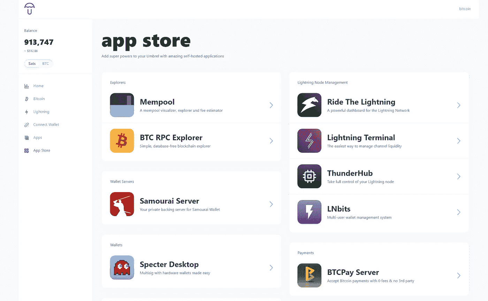******

******Umbrel app store running on your node******

******几个突出的功能包括 Tor 默认配置的所有服务，这通常是一个主要的头痛设置正确，本地网络和洋葱链接访问自动启动时可用。Umbrel 还附带了一个应用商店，里面有许多方便的比特币和闪电应用，这些应用真正扩展了普通用户所需的功能。不言而喻，您可以完全保管钱包，并且可以在线验证 Umbrel 操作系统软件。******

# ******在 Pi 4 上运行 Umbrel OS******

******设置非常简单，没有理由不开始使用和支持网络。******

*   ******参观乌姆贝尔网站:[**https://getumbrel.com/**](https://getumbrel.com/)******
*   ****向下滚动到“在 Raspberry Pi 4 上安装”部分，然后单击“如何安装”按钮。这将弹出一个简单的 10 步开始到结束指南，即使是 10 岁的孩子也可以遵循。****

****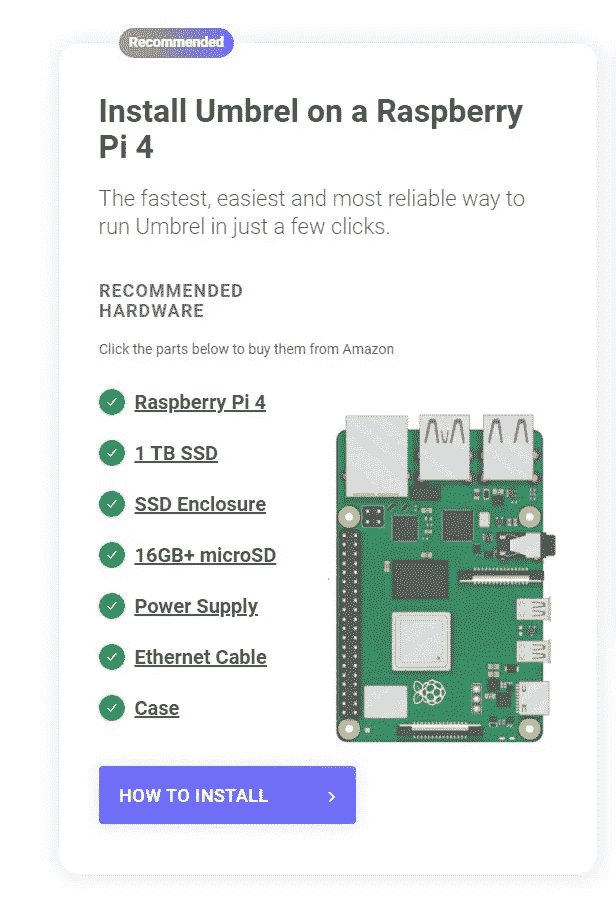****

****Install Umbrel on a Raspberry Pi 4****

******不过有几件事需要注意:******

*   ****肯定至少得到 4GB 的 Raspberry Pi 4，不确定 8GB 版本是否真的对普通用户有影响，但在负载下小于 4GB 可能不够。****
*   ****正如 Umbrel 建议获得官方的 Pi 4 电源，否则你可能会有问题。****
*   ****您还需要一个 microSD USB 读卡器来将 Umbrel 闪存到 SD 卡上，或者如果您的计算机上有 SD 端口，还需要一个 microSD 转 SD 适配器。****
*   ****在插入 SSD 之前，不要在 SSD 上进行分区或创建空卷，因为 Umbrel 会将这一切整理出来，只需将它直接放入 SSD 外壳，并通过 USB 3.0 端口插入 Pi。****
*   ****确保得到一个合理的情况下，或至少某种被动或主动冷却，因为 Pi 可能会节流，并在没有它的初始同步上花费永远。Umbrel guide 中的 Flirc 外壳或 Argon Neo 将温度保持在 60C 以下，不会产生任何噪音。****
*   ****Umbrel 操作系统是基于 Raspberry Pi 操作系统构建的，因此如果您想要检查 Pi 的温度，您可以使用内置的 [vcgencmd](https://www.raspberrypi.org/documentation/raspbian/applications/vcgencmd.md) 实用程序来完成。只需使用命令“ssh umbrel@umbrel.local”进入您的 Pi，然后输入您的 umbrel 密码。对于 windows 用户，您可以通过 [Powershell](https://www.howtogeek.com/336775/how-to-enable-and-use-windows-10s-built-in-ssh-commands/) 访问 SSH。****
*   ****完整的 Umbrel 故障排除指南了解更多提示:[https://umbrelinfo.gitlab.io/troubleshooting.html](https://umbrelinfo.gitlab.io/troubleshooting.html)****

****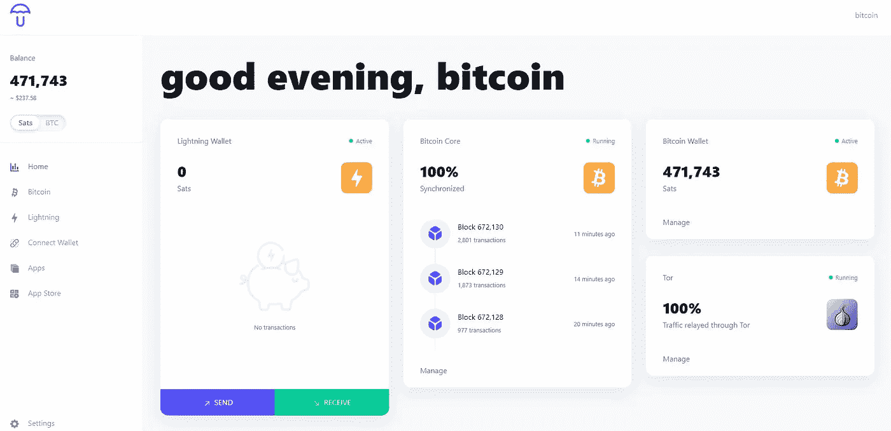****

****Once booted you’ll be able to access the Umbrel dashboard on your local network through http://umbrel.local****

****比特币区块链的初始同步需要 3-7 天，这取决于你的互联网连接，一切都要通过 Tor，所以这需要一些时间。这种同步只有一次，一旦完成，你将在主链和闪电上拥有比特币的完全隐私和安全，此外，你还将帮助保持网络的安全和分散。****

# ****后续步骤****

****发送一些比特币到钱包，从你的 Umbrel 仪表板访问应用程序商店，不要担心所有的应用程序都是免费的！我建议从安装 Mempool 开始，这是比特币主链的一个很好的可视化工具，它可以很容易地看到拥塞和当前的费率，以防止你为交易支付过多的费用。对于 lightning，我推荐安装 Ride The Lightning 和 ThunderHub，两者有重叠的功能，但也有一些彼此独特的功能，因此值得安装两者并四处看看。****

****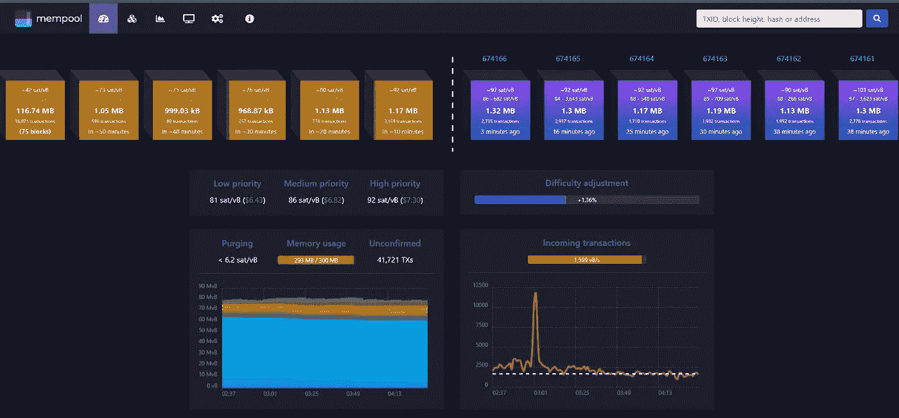****

****Host your own Mempool using Umbrel to keep track of main chain transactions****

# ****找好节点打开渠道****

****在您使用 lightning 进行支付之前，您需要打开一个到另一个节点的通道，以便您的支付可以通过网络路由。有两种类型的信道公共的和私人的，它们本质上操作相同，但是公共信道对网络上的每个人都是公开可见的。如果你打开一个公共频道，Umbrel 将通过 Tor onion 地址隐藏你的 IP 地址，所以不必担心你的家庭 IP 地址被暴露。对于大多数用户来说，他们只是想偶尔使用 lightning 买东西，或者时不时地从朋友或家人那里收到付款，你最好坚持使用私人渠道，因为这是保护隐私的最佳方式。****

****如果你是临时用户，我建议只向一两个连接良好、高容量和低费用的节点开放一个通道，因为这应该足以让你的支付路由到网络上的绝大多数商家。您也可以直接连接到您最想与之交互的节点，无论它是公共商户还是您的朋友节点。要找到好的公共节点，你需要浏览[**【1ML.com】**](https://1ml.com/)**，**在那里你可以通过顶级频道数、网络范围和容量进行搜索。虽然不是完全必要的，但是通过洋葱地址连接到一个节点，可以保护更多的隐私。以下是通过带有洋葱地址的顶级网络范围搜索公共节点:[**https://1ml.com/node?order=nodeconnectednodecount&iponionservice = true**](https://1ml.com/node?order=nodeconnectednodecount&iponionservice=true)****

****虽然您可以连接到任何连接良好的节点并完成它，但要记住的重要一点是，每个节点可以设置自己的每个通道的费用，有些费用会比其他费用高得多。虽然与比特币主链交易相比，费用通常非常低，但随着时间的推移，费用会逐渐增加，所以你会希望选择一个连接良好、费用尽可能低的节点。快速查看的方法是通过每个节点页面上的 1ML 统计选项卡，它将显示中间费用率和中间基本费用，以便快速比较节点之间的差异。****

****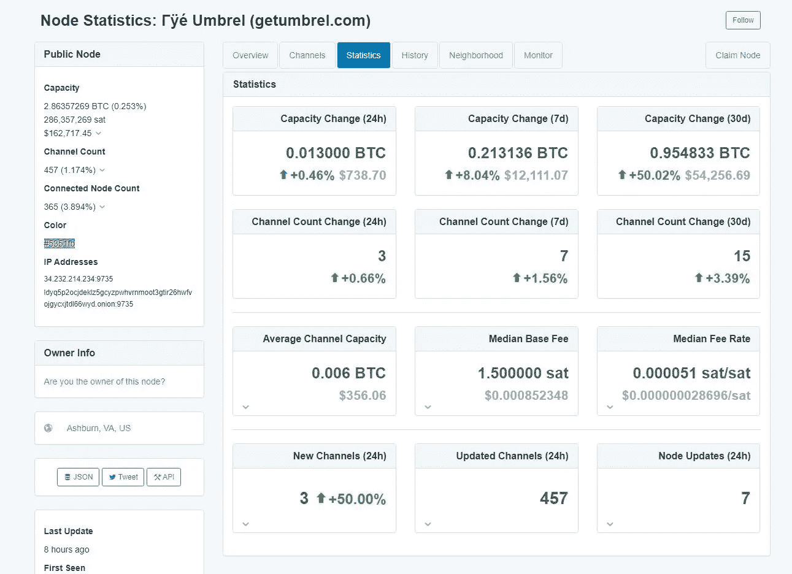****

****getumbrel.com’s 1ML node page statistics****

****尽管这只是一个平均值，但更准确的查看费率的方式是通过渠道选项卡，在每个节点页面上按最大容量排序。在那里，您将能够看到您最有可能通过的渠道的实际费率，这也是查看该节点是否与您最常用的商家或服务有直接联系的好方法。****

****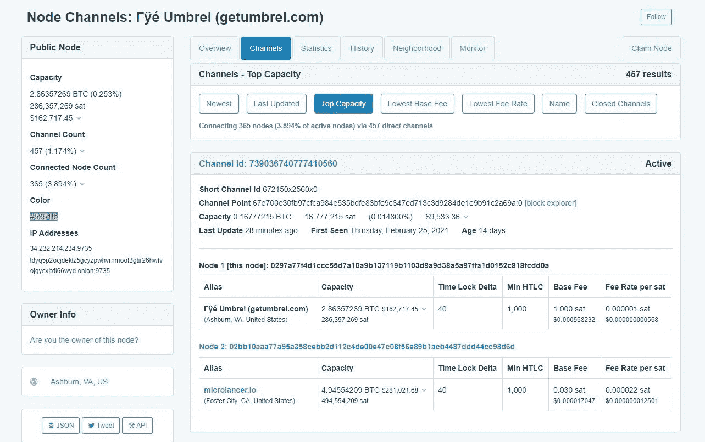****

****getumbrel.com’s 1ML node channels by top capacity showing each channel to and from the node as well as its details****

****另一个找到可靠且连接良好的节点的好资源是通过 BOS 分数排名:[https://lightningwiki.net/bos/](https://lightningwiki.net/bos/)。请记住，虽然一些高调的公共节点不包括在这些排名中。****

# ****连接到节点和渠道流动性****

****一旦你找到了至少一个可以连接的好节点，以决定你想要分配给该渠道多少比特币，这将取决于你打算购买什么和多久购买一次。确保至少 100，000 sat 的合理数量，否则你将过于频繁地补充渠道，这需要连锁交易。我应该在这里提到，你不能增加或改变你的渠道一旦打开的金额。要更改其容量，您需要关闭通道，然后用您想要的新容量重新打开，这需要两次比特币主链交易。****

****打开一个通道非常容易，你只需要节点的公钥和它的 IP 或洋葱地址，然后是端口号，所有这些都可以在 1ML 节点页面的 overview 选项卡上找到。****

****比如这里是 getumbrel.com 完整的闪电地址:0297 a 77 f 4 D1 CCC 55d 7 a 10 a 9 b 137119 b 1103d 9 a 9d 38 a 97 FFA 1d 0152 c 818 fcdd 0 a @ ldyq 5 p 2 ocjdeklz 5 gcyzpwhvrnmoot 3 gtir 26 hwfvojgycxjtdl 66 wyd . onion:9735****

****您可以通过侧边菜单上的 lightning 选项卡从您的 Umbrel 仪表板打开到任何节点的通道，尽管目前这似乎只能打开公共通道。要打开一个私人频道，你需要打开 ThunderHub，点击频道侧菜单选项，然后点击右上角的齿轮图标，选择底部的手动。****

****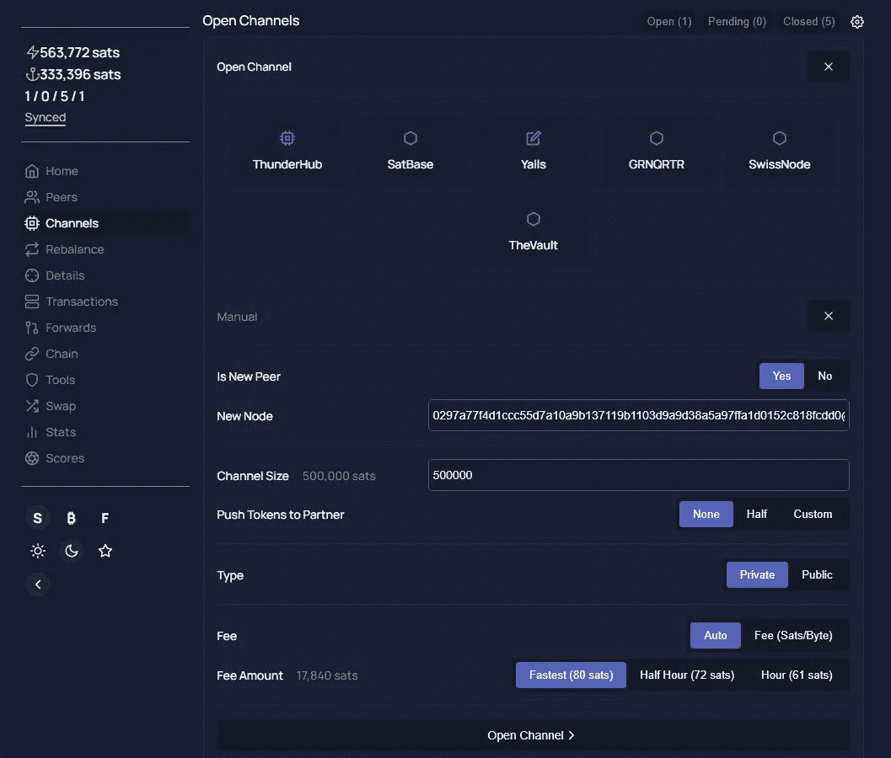****

****Open a new private channel manually using the ThunderHub dashboard****

****上面的屏幕就是你将会看到的。除非您的节点已经作为对等节点连接到您希望连接的节点(这不太可能),否则您需要为“是新对等节点”选择“是”,然后将节点的完整 lightning 地址(包括公钥@onion address:port)粘贴到新节点框中。然后添加您想要分配给通道的 sat 数量，并将节点类型选择为私有。点击“打开渠道”将启动一个在线交易，并开始打开流程。开始和结束渠道交易在最终确定前需要 3 次连锁确认。****

****要发送付款，您需要收款人生成一份支付的 lightning 发票(在商家结账时自动发生)，然后将其复制并粘贴到您的 lightning 钱包中进行发送。您可以通过 Umbrel 仪表板来完成此操作，或者您也可以将您的节点连接到一些桌面和移动钱包，以便您也可以扫描 QR 发票，我们稍后将介绍此设置。****

****一旦您在您的渠道中花费了全部金额，如果不补充渠道，您将无法再花费。有几种方法可以做到这一点，1)您可以关闭这个渠道，然后打开另一个渠道，这需要两个链上交易，2)您或其他人可以从另一个钱包向您的 lightning 节点付款，这在技术上需要一个链上交易才能进入 lightning，或者 3)您可以使用服务中的循环，这也需要一个链上交易。可以从“乘坐闪电”或“闪电终端”应用程序访问“回路”服务，该服务需要付费，并且至少需要 250k sats 信道容量才能使用。当你有很多渠道需要补充流动性时，服务循环是很方便的。****

****如果你只有一个或两个渠道，我个人的做法是通过我控制的另一个钱包手动“循环”。我通过将比特币链发送到一个单独的钱包(我在移动设备上使用 [Muun](https://muun.com/) ，它简单易用，比特币和 lightning 之间无缝连接)来做到这一点，然后我通过 lightning 将比特币发送回我的 Umbrel 节点，简单又便宜。****

# ****接收付款****

****通过闪电收款需要“流入流动性”。最简单的方法就是使用你设置的频道通过 lighting 付款。你可以向商家付款买东西，或者你只需向你控制的另一个钱包发送一些 sat。您作为付款发送的金额现在可以作为入站流动资金从其他人处发送给您。****

****在 Ride The Lightning 和 Lightning Terminal 应用程序中也有一个“Loop Out”服务，可以为你做到这一点，然后将比特币发送回你的主钱包，尽管这需要额外的费用，而且它最适合拥有众多渠道的人或商人。另一种获得入站的方法是让另一个连接良好的节点向您打开一个通道，也有这方面的服务，Lightning Terminal 有一个促进这一点的市场，我将在稍后简要讨论。****

****接收付款需要您首先生成一张发票，这相当容易做到，您只需选择您想要接收的金额，还可以提供发票的可选描述，这可以通过 Umbrel 仪表板或 lightning 应用程序来完成。如果你的渠道是私人的，你还需要在你的发票上添加“私人发送提示”,否则付款将无法发送给你。这目前无法通过 Umbrel 仪表板实现，但在创建发票时，通过点击路线提示滑块，可以通过乘坐闪电应用程序轻松实现。****

****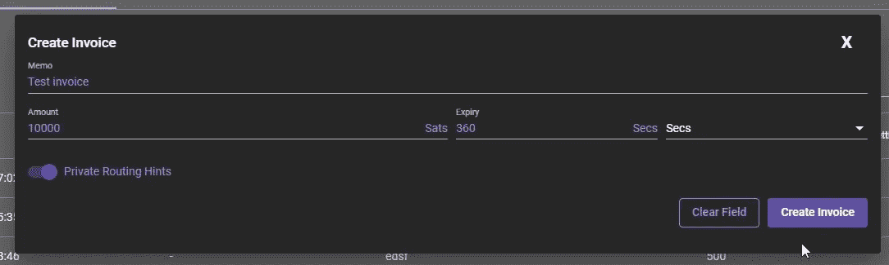****

****Be sure to switch on Private Routing Hints when creating an invoice to your private node. Ride The Lightning app.****

# ******在手机和其他钱包上使用您的节点******

****或许 Umbrel 最好的功能之一就是可以很容易地将你的节点连接到其他移动和桌面钱包，这样你就可以在任何地方使用 lightning 和比特币，同时保持完全的控制权。Umbrel 仪表板中的“连接钱包”选项卡为多个钱包提供商提供了简单的设置指南，包括 Electrum、Phoenix、Zap 和 Zeus。您也可以通过提供的 lndconnect url 手动连接到几乎任何其他钱包。****

****一些钱包确实有连接 Tor 的问题，所以它并不总是无缝的，但是我在 Android 上连接我的 Umbrel 节点与 [**Zap**](https://zaphq.io/) 或 [**Zeus**](https://zeusln.app/) 没有问题。Android 上的 Zap 目前缺乏功能，所以我会推荐 Zeus，因为它几乎拥有你需要的一切。你可以发送和接收闪电和比特币，也可以在 app 中管理你的频道。如果您需要在离开节点时管理更多内容，您可以使用 Tor 浏览器从其洋葱地址访问您的 Umbrel 仪表板。****

****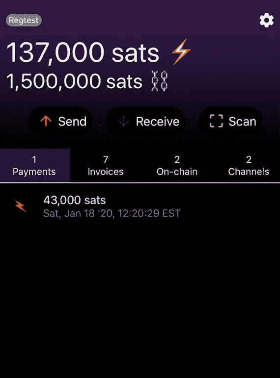****

****Connect to your Umbrel node using [https://zeusln.app/](https://zeusln.app/) to send and receive payments on the go****

# ******在哪里使用闪电******

****越来越多的商家参与到闪电网络中，一旦他们意识到接受支付是多么快速和容易，几乎不收任何费用，并且不像信用卡或借记卡那样最终完成，这种情况只会继续下去。现在有相当多的主要服务可以让你使用 lightning 在网上购买几乎任何你想要的东西，下面是其中的几个:****

## ****[**月亮**](https://paywithmoon.com/)****

****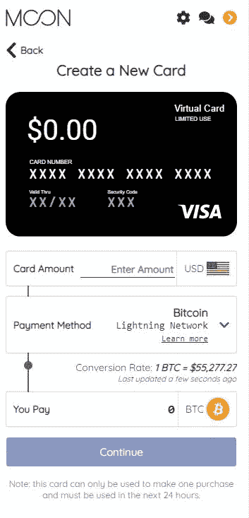****

****[https://paywithmoon.com/](https://paywithmoon.com/)****

****Moon 几天前刚刚发布了他们的浏览器插件，但是这个概念很棒。它允许您创建虚拟的 Visa 借记卡，用于一次性在线购买，并通过 lightning 为该卡提供资金。尽管目前虚拟 Visa 卡只在美国的在线零售商处接受。****

## ****[比特笔芯](https://www.bitrefill.com/)****

****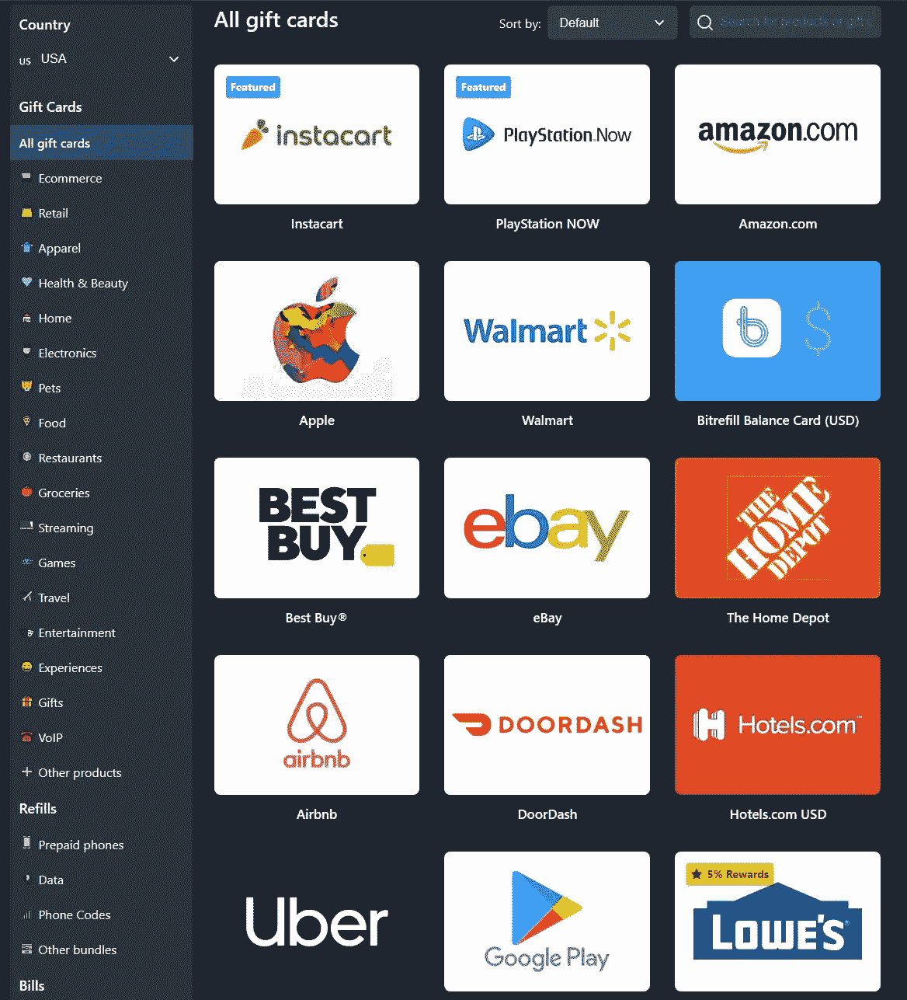****

****[https://www.bitrefill.com/](https://www.bitrefill.com/)****

****使用 Bitrefill，您可以毫不费力地通过 lightning 为全球多家零售商购买礼品卡。他们也有奖励，给你的大部分礼品卡返回 sat。****

## ****[折叠](https://foldapp.com/)****

****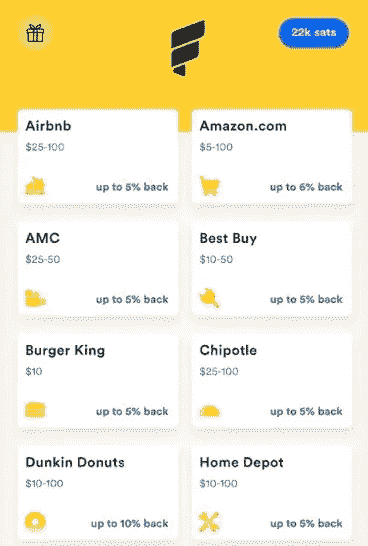****

****[https://foldapp.com/](https://foldapp.com/)****

****Fold 主要是一个移动应用程序，但也有一个 web 应用程序部分，它类似于 Bitrefill，因为你可以为许多主要零售商购买礼品卡，尽管其中大多数只在美国。他们也有每次购买的奖励，使用 lightning 的折扣，目前正在推出 Visa 比特币奖励卡。****

## ****[斯彭德尔](https://getspendl.com/)****

****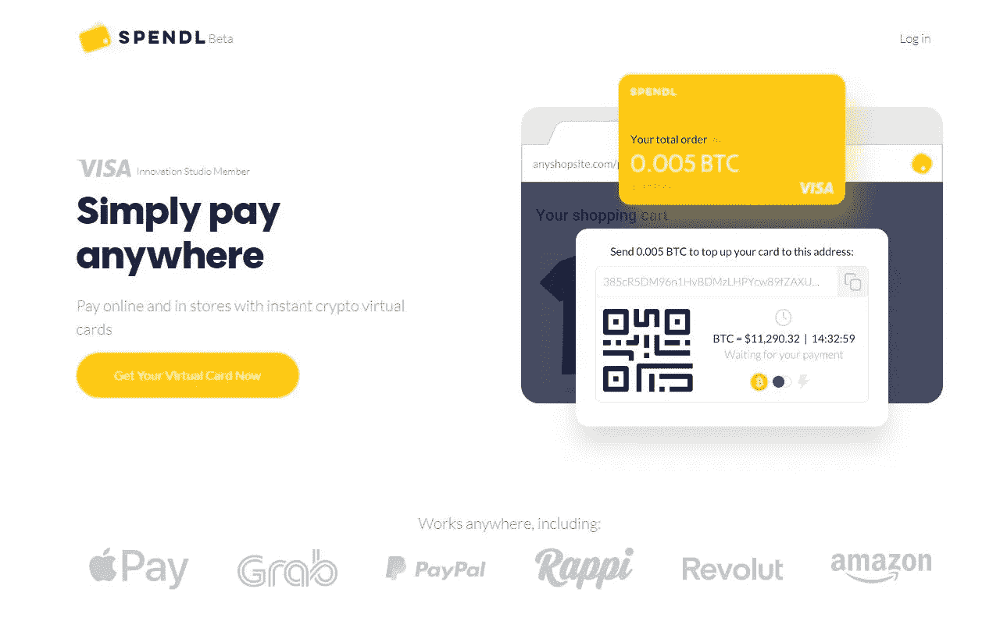****

****[https://getspendl.com/](https://getspendl.com/)****

****Spendl 是一种类似于 Moon 的 Visa 虚拟卡服务，但是可以在世界各地接受 Visa 的在线商家使用。他们要求你在使用这项服务之前提交完整的 KYC。****

## ****[聪的客厅](https://www.livingroomofsatoshi.com/)****

****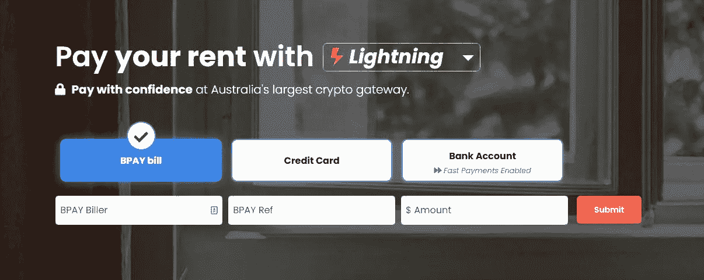****

****[https://www.livingroomofsatoshi.com/](https://www.livingroomofsatoshi.com/)****

****LROS 是澳大利亚的一项服务，允许你使用闪电支付账单并获得回报，但在使用这项服务之前，他们需要完全 KYC。其他国家也有类似的账单支付服务。****

****更多 lightning 应用和服务可以在这里找到:****

*   ****[https://lightningnetworkstores.com/](https://lightningnetworkstores.com/)****
*   ****[https://www.lapps.co/](https://www.lapps.co/)****

# ****路由节点****

****路由节点通过网络为其他人路由支付，以换取少量费用，尽管您可以将其设置为免费路由支付。我建议，只有当你有合理数量的资金可以部署> 0.5Btc，良好的互联网> 100Mbits，并且有稳定的电源和 UPS 作为备份时，才这样做。如果你对它很认真，你可能还想在比 Pi 4 更坚固的硬件上运行节点，并舒适地使用 lncli 或类似的，尽管 ThunderHub 和 Ride The Lightning 确实提供了你作为一个路由节点操作员所需的大部分功能和一个漂亮的 GUI。尽管如此，随着闪电网络在未来几年继续发展，越来越多的商家上线，路由节点可能会成为一项业务，尽早开始总是一个优势。****

# ****其他闪电应用****

****Umbrel 目前在其商店中还包括另外两个闪电节点管理应用程序，Lightning Terminal 和 LNbits。虽然对普通用户来说不是必需的，但它们都值得安装和试用，以探索 lightning 的功能，因为它们有一些很酷的功能。****

****例如，LNbits 允许您使用您的 Umbrel 节点创建多个 lightning 钱包，以便根据您的需要，例如在家人和朋友或项目之间，分离支付和余额。他们还提供了其他一些简洁的工具，如 lightning 的共享销售终端，为内容创建付费墙的能力，以及自动销售子域和活动门票的能力。您还可以创建支付链接来销售自动更新的商品和服务，这样您就不必为每个订单都生成发票。另一个包含的功能是生成提款链接或优惠券，为自动赠品、订阅服务和从您的应用程序中提款开辟了可能性。****

****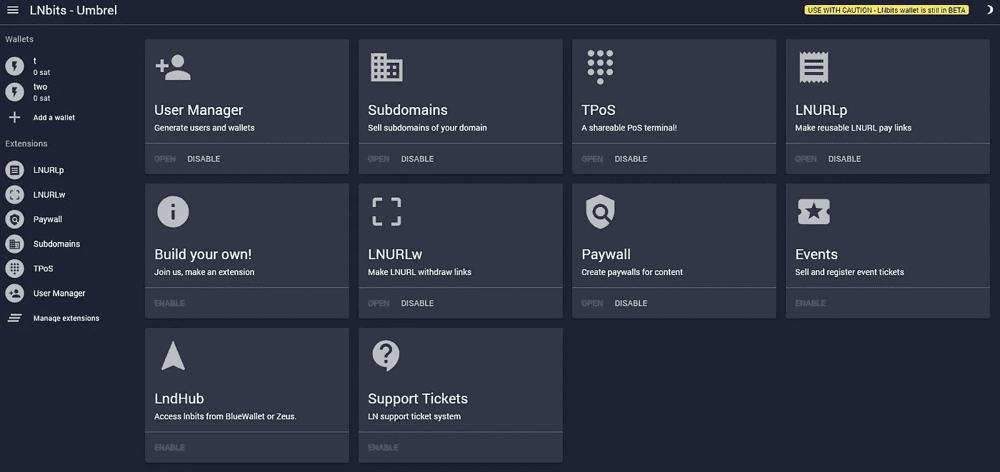****

****LNbits extensions dashboard hosted on your Umbrel node****

****虽然不是为不是路由节点或商家的初学者设计的，但 Lightning Terminal 应用程序有一个有趣的新概念，叫做 Lightning Pool。在这里，您可以出价购买一段时间内(目前为 2 周)您的节点的入站流动性，以换取溢价。你也可以向市场中的其他节点提供外向流动性，自己赚取溢价。****

****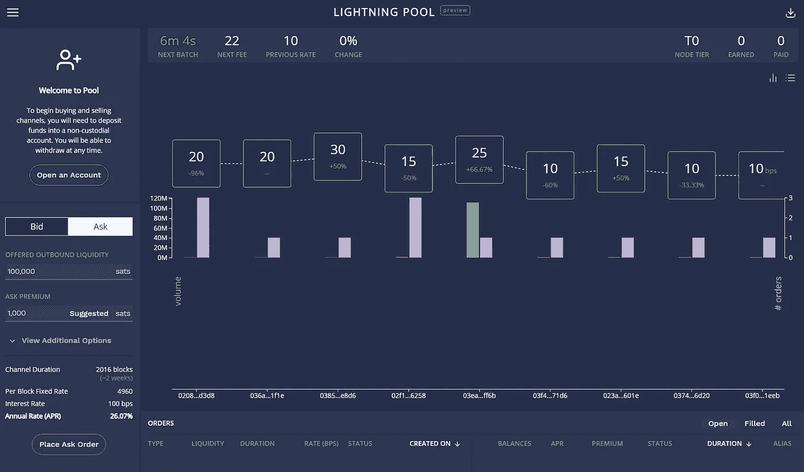****

****Lightning Pool marketplace in the Lightning Terminal app****

# ****告诫的话****

****最后，请记住，闪电网络仍然是实验软件，而不是比特币本身，虽然开发继续帮助消除已知的漏洞**，但可能还有其他未知的我们尚未遇到。一如既往地谨慎，就像任何事情一样，但不要让这阻止你体验闪电般的速度比特币。******

# ******了解更多关于闪电的信息******

******要了解更多关于 lightning 网络的技术细节以及它在幕后是如何工作的，这里有一些好的阅读材料:******

*   ******【T4**https://academy . binance . com/en/articles/what-is-lightning-network********
*   ****[**https://www.lopp.net/lightning-information.html**](https://www.lopp.net/lightning-information.html)****
*   ****[https://dev . lightning . community/overview/index . html # lightning-network](https://dev.lightning.community/overview/index.html#lightning-network)****
*   ****[**https://medium.com/@The1Brand7/lightning-faq-67bd2b957d70**](/@The1Brand7/lightning-faq-67bd2b957d70)****

****感谢你的阅读，我希望它能帮助你和闪电一起前进。关注我 [**中**](https://lukabankovic.medium.com/) 和 [**推特**](https://twitter.com/bitcoinluka) 了解更多比特币相关的东西！****

> ****加入 coin monks[Telegram group](https://t.me/joinchat/EPmjKpNYwRMsBI4p)并了解加密交易和投资****

## ****另外，阅读****

*   ****最好的[密码交易机器人](/coinmonks/crypto-trading-bot-c2ffce8acb2a) | [网格交易](https://blog.coincodecap.com/grid-trading)****
*   ****[3 商业评论](/coinmonks/3commas-review-an-excellent-crypto-trading-bot-2020-1313a58bec92) | [Pionex 评论](/coinmonks/pionex-review-exchange-with-crypto-trading-bot-1e459d0191ea) | [Coinrule 评论](/coinmonks/coinrule-review-2021-a-beginner-friendly-crypto-trading-bot-daf0504848ba)****
*   ****[AAX 交易所评论](/coinmonks/aax-exchange-review-2021-67c5ea09330c) | [德里比特评论](/coinmonks/deribit-review-options-fees-apis-and-testnet-2ca16c4bbdb2) | [FTX 交易所评论](/coinmonks/ftx-crypto-exchange-review-53664ac1198f)****
*   ****[n 零审核](/coinmonks/ngrave-zero-review-c465cf8307fc) | [Phemex 审核](/coinmonks/phemex-review-4cfba0b49e28) | [PrimeXBT 审核](/coinmonks/primexbt-review-88e0815be858)****
*   ****[Bybit Exchange 审查](/coinmonks/bybit-exchange-review-dbd570019b71) | [Bityard 审查](/coinmonks/bityard-review-7d104239be35) | [CoinSpot 审查](https://blog.coincodecap.com/coinspot-review)****
*   ****[3 commas vs crypto hopper](/coinmonks/3commas-vs-pionex-vs-cryptohopper-best-crypto-bot-6a98d2baa203)|[赚取加密利息](/coinmonks/earn-crypto-interest-b10b810fdda3)****
*   ****最好的比特币[硬件钱包](/coinmonks/the-best-cryptocurrency-hardware-wallets-of-2020-e28b1c124069?source=friends_link&sk=324dd9ff8556ab578d71e7ad7658ad7c) | [BitBox02 回顾](/coinmonks/bitbox02-review-your-swiss-bitcoin-hardware-wallet-c36c88fff29)****
*   ****[莱杰 vs n ave](/coinmonks/ledger-vs-ngrave-zero-7e40f0c1d694)|[莱杰 nano s vs x](/coinmonks/ledger-nano-s-vs-x-battery-hardware-price-storage-59a6663fe3b0)****
*   ****[密码本交易平台](/coinmonks/top-10-crypto-copy-trading-platforms-for-beginners-d0c37c7d698c)****
*   ****[Vauld Review](/coinmonks/vauld-review-2021-lend-trade-and-buy-bitcoin-in-india-e37a96374961)|[you hodler Review](/coinmonks/youhodler-4-easy-ways-to-make-money-98969b9689f2)|[BlockFi Review](/coinmonks/blockfi-review-53096053c097)****
*   ****最好的[加密税务软件](/coinmonks/best-crypto-tax-tool-for-my-money-72d4b430816b) | [硬币追踪评论](/coinmonks/cointracking-review-a-reliable-cryptocurrency-tax-software-5114e3eb5737)****
*   ****最佳[加密借贷平台](/coinmonks/top-5-crypto-lending-platforms-in-2020-that-you-need-to-know-a1b675cec3fa) | [杠杆代币](/coinmonks/leveraged-token-3f5257808b22)****
*   ****[block fi vs Celsius](/coinmonks/blockfi-vs-celsius-vs-hodlnaut-8a1cc8c26630)|[Hodlnaut 评论](/coinmonks/hodlnaut-review-best-way-to-hodl-is-to-earn-interest-on-your-bitcoin-6658a8c19edf)****
*   ****[Bitsgap 审查](/coinmonks/bitsgap-review-a-crypto-trading-bot-that-makes-easy-money-a5d88a336df2) | [Quadency 审查](/coinmonks/quadency-review-a-crypto-trading-automation-platform-3068eaa374e1) | [Bitbns 审查](/coinmonks/bitbns-review-38256a07e161)****
*   ****[埃利帕尔泰坦评论](/coinmonks/ellipal-titan-review-85e9071dd029) | [赛克斯斯通评论](/coinmonks/secux-stone-hardware-wallet-review-15-discount-coupon-2020-7577032faa6e)****
*   ****[本地比特币评论](/coinmonks/localbitcoins-review-6cc001c6ed56)****
*   ****最佳[区块链分析](https://bitquery.io/blog/best-blockchain-analysis-tools-and-software)工具| [赚比特币](/coinmonks/earn-bitcoin-6e8bd3c592d9)****
*   ****[加密套利](/coinmonks/crypto-arbitrage-guide-how-to-make-money-as-a-beginner-62bfe5c868f6)指南| [如何做空比特币](/coinmonks/how-to-short-bitcoin-568a2d0b4ae5)****
*   ****最佳[加密制图工具](/coinmonks/what-are-the-best-charting-platforms-for-cryptocurrency-trading-85aade584d80) | [最佳加密交易所](/coinmonks/crypto-exchange-dd2f9d6f3769)****
*   ****[如何在印度购买比特币？](/coinmonks/buy-bitcoin-in-india-feb50ddfef94) | [WazirX 审核](/coinmonks/wazirx-review-5c811b074f5b)****
*   ****[印度比特币交易所](/coinmonks/bitcoin-exchange-in-india-7f1fe79715c9) | [比特币储蓄账户](/coinmonks/bitcoin-savings-account-e65b13f92451)****
*   ****[CoinDCX 审查](/coinmonks/coindcx-review-8444db3621a2)****

> ****[直接在您的收件箱中获得最佳软件交易](/coinmonks/newsletters/coinmonks)****

********