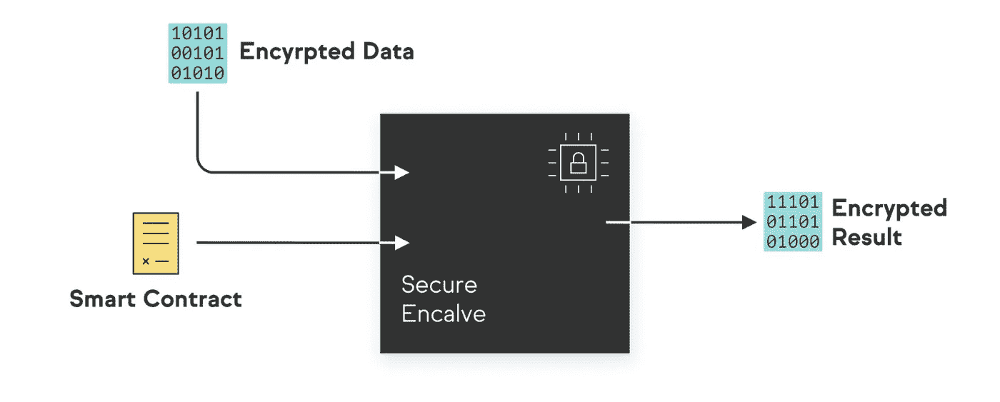

# 绿洲网络—隐私第一

> 原文：<https://medium.com/coinmonks/oasis-network-privacy-first-167f18ee9cf8?source=collection_archive---------0----------------------->

数据是我们生活中非常重要的一部分。我们是谁，我们做什么从数据进化而来并围绕着数据，这总是意味着数据以不同的形式和类型存在，用于不同的目的。自从互联网出现以来，数据共享已经发展，每秒钟都有数吨数据从一个地方传输到另一个地方。随着数据传输变得越来越无缝，隐私数据漏洞已经成为一个令人烦恼的大问题，因为对您的隐私数据的未授权访问可能会使您面临身份盗窃、欺诈、隐私侵犯等风险。一些大型社交媒体公司收集用户的私人数据，并出于不同目的将其出售给其他公司，这已经不是什么新闻了。基本上，互联网并不像我们认为的那样安全，因为一次又一次，一些我们信任的拥有我们私人数据的在线平台利用它来反对我们。数据盗窃是一个问题，可以通过集成称为区块链的分散分布式账本技术来缓解，有趣的是，Oasis Network 正在使用这项技术来使互联网成为我们和我们的私人数据更安全的地方。

> **绿洲网络**

隐私窃取是一个大问题，Oasis Network 旨在提供不同的解决方案来帮助人们保护他们的私人数据安全，即使他们享受着互联网的好处。Oasis 网络由多个组件组成，这些组件协同工作以确保减少对私有数据的未授权访问，这些组件包括:

**第一层**

这是一个去中心化的区块链网络，具有去中心化、多功能性、可伸缩性和隐私优先等独特特性。这个区块链网络进一步分为两个主要结构:

*   **副时间层**

这个名字是由两个词组合而成的；“并行”和“运行时”。这一层并行托管多个运行时，每个运行时都扮演着复制共享但机密的计算生态系统的角色。

*   **共识层**

对于许多基于区块链的系统来说，可扩展性一直是一个大问题，但是通过这个项目，consensus system 提供了一个利益证明(PoS)协议，其功能依赖于非集中式的验证器网络节点的组合。这为系统提供了高吞吐量，并增强了其可扩展性。

Oasis Network 之所以是一个独特的系统，其中一个主要原因在于它在执行流程时检测差异的方式，并且它已被证明比一些流行的网络系统更加高效和有效。它维护了一个高度安全的系统，具有较少的复制因素。

> **解决方案**

如上所述，数据隐私非常重要，原因有几个，数据泄露和盗窃会导致不同的问题，但它不会永远如此。Oasis Network 有一些可行的解决方案来提高私有数据的安全性，这些解决方案包括:

*   **隐私优先级**

解决方案是确保用户数据在任何时候都保持隐私，Oasis Network 设计了一个系统，该系统涉及可信执行环境(TEE)的实施、数字数据的安全性增强以及 ParaTime 层和智能合同的功能。对于网络来说，隐私是第一位的，使用区块链作为底层技术可以增强保密性，这总是可以在 Oasis 网络的不同应用程序上安全、私密地使用私有数据，而不用担心数据被盗。在不久的将来，该项目打算支持更多增强的数据安全和隐私框架。

*   **可扩展性**

这是 Oasis 提供的另一个令人印象深刻的解决方案。许多网络都存在吞吐量低、交易速度慢的问题，而 Oasis 项目通过将共识和计算过程分离到上述层(并行和共识)中纠正了这些缺陷。随着这种分离，并行运行时能够更快地处理更多的事务。网络不必遭受副链和分片的缺点，因为它的系统更有效和高效。

*   **多才多艺**

技术是动态的，它总是在发展。Oasis 项目是一个革命性的解决方案提供商，其设计考虑了较新的基于区块链的应用。拥有一个通用的系统为 Oasis 网络打开了一个门户，在不偏离其分散的核心和共识系统的情况下集成到不同的用例中。

机密计算也是绿洲网络运营的一部分，该网络使用开源的 ETH/WASI 系统。这确保了即使在操作过程中，用户的数据仍然是保密和安全的。

> **DeFi 用例**

在十年内，加密社区见证了不同的区块链应用程序的创建，目前，分散式金融应用程序似乎抢尽了风头，因为 DeFi 比传统金融有更大的潜力。请记住，这一想法是为了确保用户享有数据隐私，因此创建了 Oasis Network，以允许使用智能合同来保证数据交换和传输的机密性。吞吐量低、交易费用高、抵押不足等。是 DeFi 面临的挑战，但有了 Oasis 网络，考虑到可扩展性、数据隐私和安全性、数据令牌化、分散化和多功能性可以集成到 DeFi 应用程序中，以及使用 ParaTime 和 Consensus 层来提高吞吐量、交易速度和交易费用，这些挑战可以成为过去。

我们的私人数据很重要，应该尽可能保密，因此我们需要尽一切努力确保它尽可能安全。Oasis Network 拥有完美的框架来帮助保护人们在互联网上的数据。该项目旨在规划一个可能被视为隐私优先的分散式数字网络的发展。这是一个网络，它将超越密码社区，发展成为一个更具包容性的远见卓识和革命性创新的系统。互联网是虚拟世界中一个强大的工具和有趣的平台，但我们的私人数据不应该使我们容易受到潜伏在互联网黑暗角落的坏演员的攻击。

> 有用的链接:

[网站](https://oasisprotocol.org/) — [入门](https://docs.oasis.dev/oasis-network-primer/) — [节点教程](https://oasisprotocol.org/node-operators) — [博客](https://medium.com/oasis-protocol-project) — [推特](https://twitter.com/oasisprotocol) — [电报](https://t.me/oasisprotocolfoundation) — [懈怠](https://oasiscommunity.slack.com/join/shared_invite/enQtNjQ5MTA3NTgyOTkzLWIxNTg1ZWZmOTIwNmQ2MTg1YmU0MzgyMzk3OWM2ZWQ4NTQ0ZDJkNTBmMTdlM2JhODllYjg5YmJkODc2NzgwNTg#/)

[创造玫瑰花园](https://coinlist.co/oasis)

## 另外，阅读

*   [最佳加密交易机器人](/coinmonks/whats-the-best-crypto-trading-bot-in-2020-top-8-bitcoin-trading-bot-c16adeb13317)
*   [Deribit 审查](/coinmonks/deribit-review-options-fees-apis-and-testnet-2ca16c4bbdb2) |选项、费用、API 和 Testnet
*   [FTX 密码交易所评论](/coinmonks/ftx-crypto-exchange-review-53664ac1198f)
*   最好的比特币[硬件钱包](/coinmonks/the-best-cryptocurrency-hardware-wallets-of-2020-e28b1c124069?source=friends_link&sk=324dd9ff8556ab578d71e7ad7658ad7c)
*   [密码本交易平台](/coinmonks/top-10-crypto-copy-trading-platforms-for-beginners-d0c37c7d698c)
*   最好的[加密税务软件](/coinmonks/best-crypto-tax-tool-for-my-money-72d4b430816b)
*   [最佳加密交易平台](/coinmonks/the-best-crypto-trading-platforms-in-2020-the-definitive-guide-updated-c72f8b874555)
*   最佳[加密借贷平台](/coinmonks/top-5-crypto-lending-platforms-in-2020-that-you-need-to-know-a1b675cec3fa)
*   [block fi vs Celsius](/coinmonks/blockfi-vs-celsius-vs-hodlnaut-8a1cc8c26630)vs Hodlnaut
*   [莱杰 vs 特雷佐](/coinmonks/ledger-vs-trezor-best-hardware-wallet-to-secure-cryptocurrency-22c7a3fd391e)
*   [bits gap review](/coinmonks/bitsgap-review-a-crypto-trading-bot-that-makes-easy-money-a5d88a336df2)——一个轻松赚钱的加密交易机器人
*   为专业人士设计的加密交易机器人
*   [3 商业评论](https://blog.coincodecap.com/3commas-review-an-excellent-crypto-trading-bot) |一款优秀的密码交易机器人
*   [PrimeXBT 审查](/coinmonks/primexbt-review-88e0815be858) |杠杆交易、费用和交易
*   Bitmex 上的[保证金交易的白痴指南](/coinmonks/the-idiots-guide-to-margin-trading-on-bitmex-dbbd7742c6fc?source=friends_link&sk=7bfa99d2a181142510c8442c8ddb0786)
*   加密摇摆交易的权威指南
*   [Bitmex 高级保证金交易指南](/coinmonks/bitmex-advanced-margin-trading-guide-2270c195ce25?source=friends_link&sk=1d986cca731f5084b9a2db4a4bc4a7ad)
*   [面向开发人员的最佳加密 API](/coinmonks/best-crypto-apis-for-developers-5efe3a597a9f)
*   [加密套利](/coinmonks/crypto-arbitrage-guide-how-to-make-money-as-a-beginner-62bfe5c868f6)指南:新手如何赚钱
*   顶级[比特币节点](https://blog.coincodecap.com/bitcoin-node-solutions)提供商
*   最佳[加密制图工具](/coinmonks/what-are-the-best-charting-platforms-for-cryptocurrency-trading-85aade584d80)
*   了解比特币的[最佳书籍有哪些？](/coinmonks/what-are-the-best-books-to-learn-bitcoin-409aeb9aff4b)

> [在您的收件箱中直接获得最佳软件交易](https://coincodecap.com?utm_source=coinmonks)

