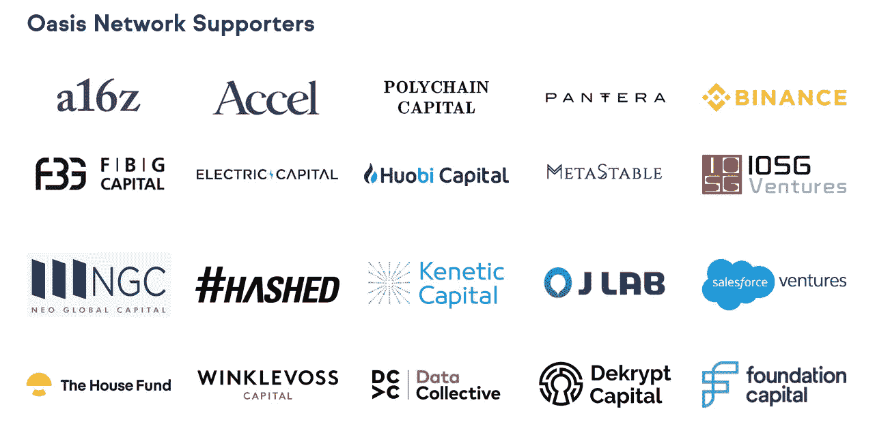
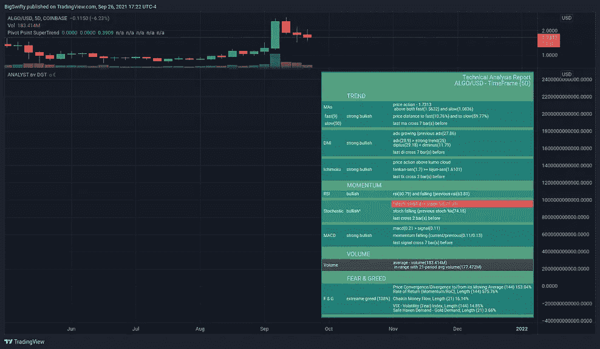
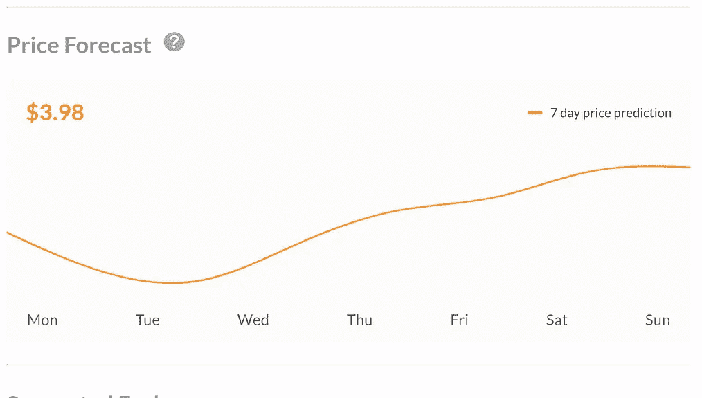
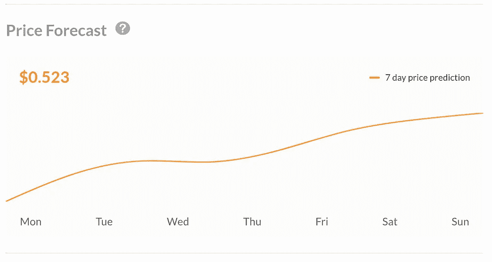
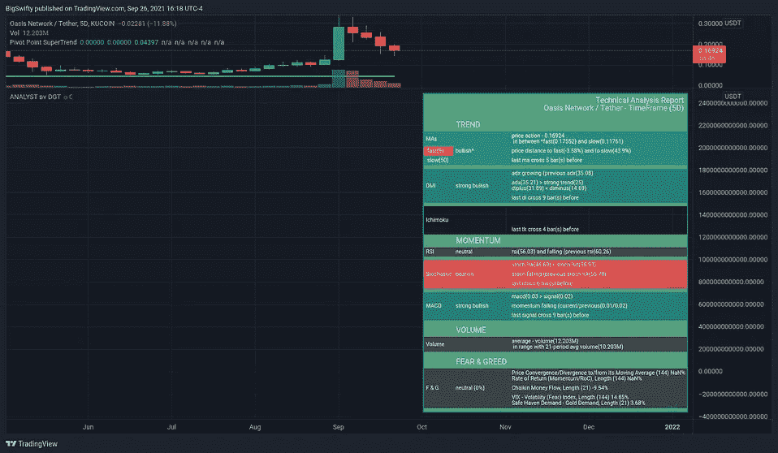
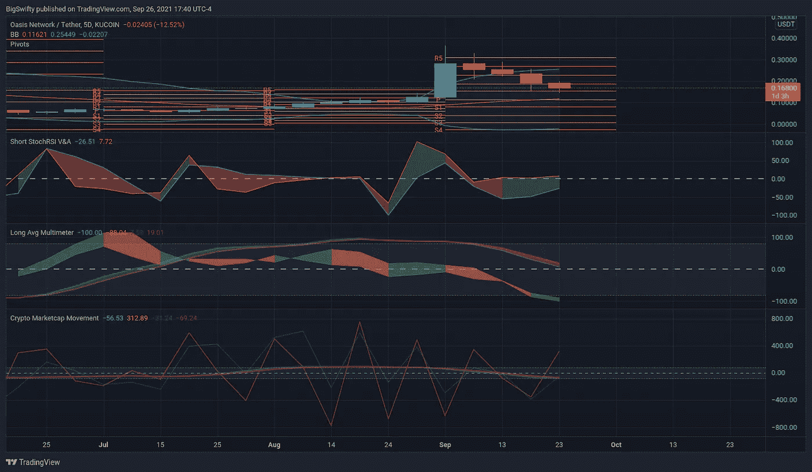
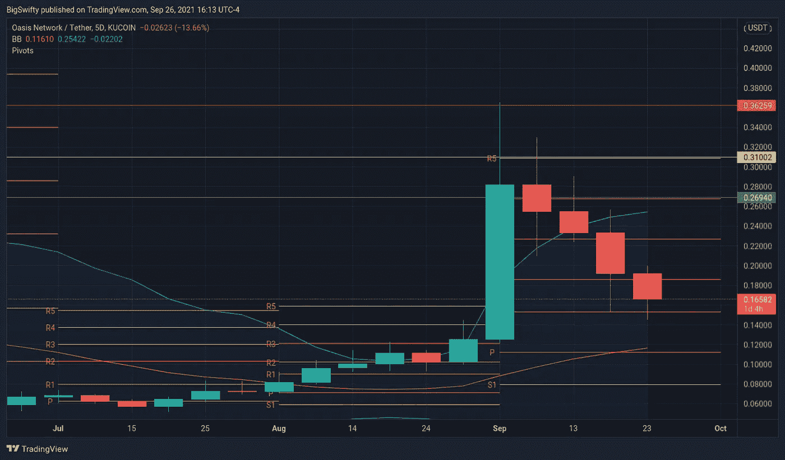
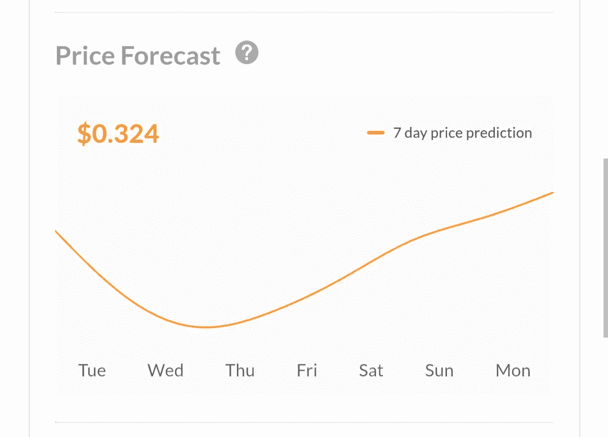

# 绿洲网络的玫瑰是我的迷墙

> 原文：<https://medium.com/coinmonks/oasis-networks-rose-is-my-wonderwall-18735caeddd2?source=collection_archive---------5----------------------->

It’s the time that you spent on your rose that makes your rose so important…
– Antoine de Saint-Exupéry

ROSE 治理令牌本周似乎有所动作。

> —玫瑰的价格可能会翻倍。年底前，玫瑰有真正增长的潜力。
> ——共识方法是赌注的证明，所以如果你认为这是一个很好的选择，那就去下注吧！

[Oasis Network](https://oasisprotocol.org/) 将自己宣传为“开放金融和负责任的数据经济的区块链隐私平台”负责维护绿洲网络的基金会列举了以下使他们的平台不同于[绿洲基金会网站](https://docs.oasis.dev/oasis-network-primer/#why-the-oasis-network)的地方:

> **第一个支持隐私的区块链:**绿洲网络是世界上第一个可扩展、支持隐私的区块链。Oasis 网络上的 ParaTimes 可以利用 secure enclaves 等保密计算技术来保证数据的机密性，从而为区块链带来新的使用案例和应用。
> 
> **可扩展的私有 DeFi:**Oasis Network 的隐私优先设计可以将 DeFi 扩展到交易者和早期采用者之外，从而打开一个新的主流市场。此外，其创新的可扩展性设计为 DeFi 交易带来了快速和高吞吐量。
> 
> **率先实现数据令牌化:**Oasis 网络可以**对数据进行令牌化**，为区块链开启改变游戏规则的使用案例，以及网络上全新的应用和项目生态系统——为下一代隐私优先应用提供动力。
> 
> **快速成长的社区:**Oasis Network 拥有一个蓬勃发展的社区，包括近一千个节点运营商、开发商、企业合作伙伴、大使以及近一万名参与全球社交渠道的社区成员。
> 
> **顶级团队:**Oasis 团队由来自世界各地的顶尖人才组成，他们拥有苹果、谷歌、亚马逊、高盛、加州大学伯克利分校、卡内基梅隆大学、斯坦福大学、哈佛大学等背景，都致力于发展和扩大 Oasis 网络的影响力。

该项目的支持者也很重要，看看这个名单上的一些名字:

OASIS NETWORK (ROSE) SUPPORTERS

网站上有大量的文档，你应该看看，特别是在他们的'[论文](https://oasisprotocol.org/papers)页面上。现在谈谈技术问题。

# 技术术语

我最近的做法是看一看对 2D、5D 和本周的综合技术分析，看看什么看起来像是一个良好的增长机会。四个最好看的硬币/代币是:XCAD，LYXE，ALGO 和玫瑰。在梳理了我的赢家之后，我会查看我的指标和价格预测，看看哪一个看起来最有希望。

第一阿尔格兰德。在撰写本文时，ALGO 是 1.76 美元，没有深入到本质的细节，这里是什么样的基本技术看起来像:

Technical analysis and Price Forecast

纳入这种价格预测机制是新的，但我相信这条曲线至少是相当不错的预测。这一预测是基于“人工智能和机器学习”，所以撇开流行词汇不谈，我相信机器比我学得快。我期待着看到 ALGO 周二是否下跌，并在打折时买入。

*现在罗斯。* Oasis Network 一直在稳步增长，但预计它将在本周突破顶峰。以下是乐观的预测:

Technicals for Oasis Network

先不要考虑天文数字的价格预测，我们来看看价格上涨 3 倍的可能性有多大。详细的技术非常乐观，STOCH RSI 是唯一的问题。我的策略大致是基于随机相对强弱指标，所以我的大多数指标都有随机相对强弱指标。看下一张图，它显示了一个混合的包，但表明技术和预测不言自明:

Oasis RSI indicators on 5 day

第二个窗格指标表明未来会有增长，尽管前四个框架一直在节节败退。这并不奇怪，像第五帧背面看到的那样(大约一个月前)有了巨大的增长。我已经调整了长 Avg 万用表，以采取当前和以前的 5 帧(共 6 帧)。第三个窗格显示了下跌的随机 RSI(超过 6 帧)，但是增长指标是绿色的，显示了 Stoch 可能正在反转的迹象。我认为它将从 50 反弹，回到严重超卖的区域。鉴于价格预测如此之高，即使在大幅上涨后，我也将继续看涨。还要注意更广泛的加密市场的加速线的 50 度斜率，这表明市场将是看涨的，并且具有看涨预测的较小的硬币可以乘潮流进入 ATH 领域。

我在下图中勾勒了一个“红绿灯”的方法。在撰写本文时，罗斯的交易价格约为 0.17 美元；跃升至 0.52 美元将是价值的 3 倍增长。一开始我持怀疑态度，但看看枢轴:

Oasis Network pivots on the 5 day

绿色是一个合理的增长预期，整整 0.10 美元的温和 58%的涨幅。黄色警戒线是 0.31 美元，涨幅为 82%。看看蜡烛线，这些是 5 日柱线，这意味着 10 天内罗斯的高点在 0.33 美元到 0.36 美元之间。如果玫瑰实际上落在 0.34 美元，这是一个多星期的价值翻倍。结合技术指标和 civRat 指标来看这些支点，超级看涨的预测看起来并不完全疯狂。

这是有希望的:300%可能过于雄心勃勃，但这些数字确实表明价值可能翻倍。我的预测是在 0.10 美元到 0.25 美元之间，甚至有可能更高。

编辑:自从写了这篇文章后，对罗斯的价格预测就变了。“机器学习人工智能”算法/无论什么调整了预期价格 0.324 美元。我想我能比机器学得更快。干杯！

> 到现在为止，你应该已经以某种方式意识到你该做什么…
> -绿洲

> *这不是投资建议。这纯粹是信息性的。我与本文中提到的任何证券、硬币或其他金融工具无关，也不认可它们。这些文章是一种记录变化和保存预测密码市场成功或失败的公开证据的手段。我不对损失负责。声明:我在我概述的资产中持有少量股份，因为我相信它们有增长潜力。我不是霍德勒，我是一个没有证书的业余交易者，我也不是一个财务顾问。不要相信我说的话，做你自己的研究。*
> 
> 加入 Coinmonks [电报频道](https://t.me/coincodecap)和 [Youtube 频道](https://www.youtube.com/c/coinmonks/videos)了解加密交易和投资

## 另外，阅读

*   [什么是保证金交易](https://blog.coincodecap.com/margin-trading) | [美元成本平均法](https://blog.coincodecap.com/dca)
*   [BigONE 交易所评论](/coinmonks/bigone-exchange-review-64705d85a1d4) | [电网交易机器人](https://blog.coincodecap.com/grid-trading)
*   [新加坡十大最佳加密交易所](https://blog.coincodecap.com/crypto-exchange-in-singapore) | [购买 AXS](https://blog.coincodecap.com/buy-axs-token)
*   [投资印度的最佳加密软件](https://blog.coincodecap.com/best-crypto-to-invest-in-india-in-2021) | [WazirX P2P](https://blog.coincodecap.com/wazirx-p2p)
*   [7 个最佳零费用加密交易平台](https://blog.coincodecap.com/zero-fee-crypto-exchanges)
*   [分散交易所](https://blog.coincodecap.com/what-are-decentralized-exchanges) | [比特 FIP](https://blog.coincodecap.com/bitbns-fip)
*   [用信用卡购买密码的 10 个最佳地点](https://blog.coincodecap.com/buy-crypto-with-credit-card)
*   [加拿大最佳加密交易机器人](https://blog.coincodecap.com/5-best-crypto-trading-bots-in-canada) | [Bybit vs 币安](https://blog.coincodecap.com/bybit-binance-moonxbt)
*   [用于 Huobi 的加密交易信号](https://blog.coincodecap.com/huobi-crypto-trading-signals) | [Swapzone 审查](/coinmonks/swapzone-review-crypto-exchange-data-aggregator-e0ad78e55ed7)
*   最佳[密码交易机器人](https://blog.coincodecap.com/best-crypto-trading-bots) | [购买索拉纳](https://blog.coincodecap.com/buy-solana) | [矩阵导出评论](https://blog.coincodecap.com/matrixport-review)
*   [Coldcard 评论](https://blog.coincodecap.com/coldcard-review) | [BOXtradEX 评论](https://blog.coincodecap.com/boxtradex-review)|[uni swap 指南](https://blog.coincodecap.com/uniswap)
*   [阿联酋五大最佳加密交易所](https://blog.coincodecap.com/best-crypto-exchanges-in-uae) | [SimpleSwap 评论](https://blog.coincodecap.com/simpleswap-review)
*   购买 Dogecoin 的 7 种最佳方式
*   [最佳期货交易信号](https://blog.coincodecap.com/futures-trading-signals) | [流动性交易所评论](https://blog.coincodecap.com/liquid-exchange-review)
*   [3 commas Review](/coinmonks/3commas-review-an-excellent-crypto-trading-bot-2020-1313a58bec92)|[Pionex Review](/coinmonks/pionex-review-exchange-with-crypto-trading-bot-1e459d0191ea)|[coin rule Review](/coinmonks/coinrule-review-2021-a-beginner-friendly-crypto-trading-bot-daf0504848ba)
*   [莱杰 vs Ngrave](/coinmonks/ledger-vs-ngrave-zero-7e40f0c1d694) | [莱杰 nano s vs x](/coinmonks/ledger-nano-s-vs-x-battery-hardware-price-storage-59a6663fe3b0) | [币安评论](/coinmonks/binance-review-ee10d3bf3b6e)
*   [Bybit Exchange 审查](/coinmonks/bybit-exchange-review-dbd570019b71) | [Bityard 审查](https://blog.coincodecap.com/bityard-reivew) | [CoinSpot 审查](https://blog.coincodecap.com/coinspot-review)
*   [3 commas vs crypto hopper](/coinmonks/3commas-vs-pionex-vs-cryptohopper-best-crypto-bot-6a98d2baa203)|[赚取加密利息](/coinmonks/earn-crypto-interest-b10b810fdda3)
*   最好的比特币[硬件钱包](/coinmonks/hardware-wallets-dfa1211730c6) | [BitBox02 回顾](/coinmonks/bitbox02-review-your-swiss-bitcoin-hardware-wallet-c36c88fff29)
*   [BlockFi vs 摄氏](/coinmonks/blockfi-vs-celsius-vs-hodlnaut-8a1cc8c26630) | [Hodlnaut 点评](/coinmonks/hodlnaut-review-best-way-to-hodl-is-to-earn-interest-on-your-bitcoin-6658a8c19edf) | [KuCoin 点评](https://blog.coincodecap.com/kucoin-review)
*   [Bitsgap 审查](/coinmonks/bitsgap-review-a-crypto-trading-bot-that-makes-easy-money-a5d88a336df2) | [Quadency 审查](/coinmonks/quadency-review-a-crypto-trading-automation-platform-3068eaa374e1) | [Bitbns 审查](/coinmonks/bitbns-review-38256a07e161)